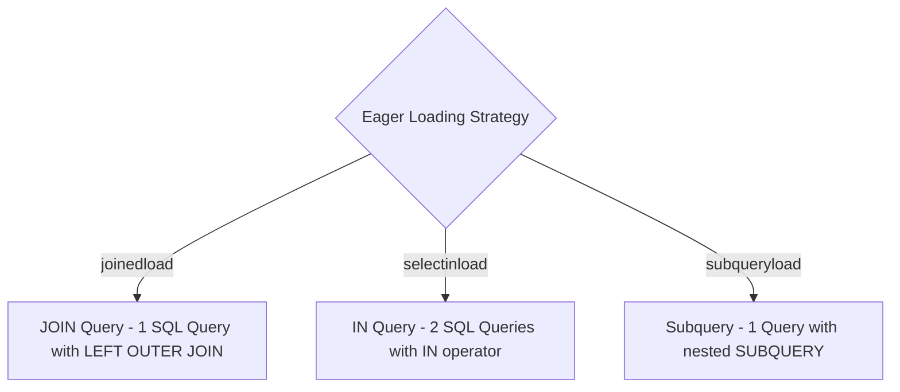

## Loading Strategies — Lazy, Joined, Selectin

SQLAlchemy তে Relationship ডেটা কীভাবে এবং কখন লোড হবে — তা অ্যাপ্লিকেশনের পারফরম্যান্সের জন্য সবচেয়ে গুরুত্বপূর্ণ সিদ্ধান্ত।

সঠিক Loading Strategy নির্বাচন না করলে **N+1 Query Problem** তৈরি হতে পারে যা ডেটাবেজ সার্ভার ডাউন করে দেওয়ার অন্যতম প্রধান কারণ!

---

## 💥 N+1 Query Problem কী?

ধরে নাও তোমার ১০০ জন ইউজার আছে এবং প্রতি ইউজারের সব Post প্রিন্ট করতে চাও:

```python
# ❌ DANGEROUS CODE (Default Lazy Loading)
users = session.scalars(select(User)).all() # 1 Query to get 100 users

for user in users:
    for post in user.posts: # Triggers 1 new SQL query PER user! (100 extra queries!)
        print(post.title)
```
মোট কতটি কোয়েরি চললো? **১টি (Users) + ১০০টি (Posts) = ১০১টি কোয়েরি!** এটিকে বলা হয় **N+1 Problem**।

---

## Loading Strategies এর সমাধানসমূহ

SQLAlchemy ৩টি প্রধান Eager Loading স্ট্রেটেজি অফার করে:



---

## 1. `selectinload` (১-টু-মেনি সম্পর্কের জন্য সেরা 👍)

`selectinload` প্রতিটি রিলেশনের জন্য একটি অতিরিক্ত `IN (...)` কোয়েরি এক্সিকিউট করে।

```python
from sqlalchemy.orm import selectinload

with Session(engine) as session:
    # ⚡ Runs exactly 2 SQL Queries regardless of user count!
    stmt = select(User).options(selectinload(User.posts))
    users = session.scalars(stmt).all()

    for u in users:
        print(u.username, len(u.posts))
```

### পেছনে যে SQL জেনারেট হয়:
1. `SELECT * FROM users;`
2. `SELECT * FROM posts WHERE posts.user_id IN (1, 2, 3, ...);`

---

## 2. `joinedload` (মেনি-টু-ওয়ান সম্পর্কের জন্য সেরা 👍)

`joinedload` SQL `LEFT OUTER JOIN` ব্যবহার করে একটিমাত্র কোয়েরিতে সব রিলেশন নিয়ে আসে।

```python
from sqlalchemy.orm import joinedload

with Session(engine) as session:
    # Fetch Post and its Author in 1 single JOIN Query
    stmt = select(Post).options(joinedload(Post.author))
    posts = session.scalars(stmt).all()
```

---

## 3. SQLAlchemy 2.0+ Write-Only Collections (Async Safe)

Async SQLAlchemy তে Implicit I/O (Lazy Load) অনুমোদিত নয়। তাই বিশাল সংগ্রহের জন্য ২০২৬ সালের স্ট্যান্ডার্ড হলো **Write-Only Relationship**:

```python
from sqlalchemy.orm import WriteOnlyMapped

class User(Base):
    __tablename__ = "users"
    id: Mapped[int] = mapped_column(primary_key=True)

    # WriteOnlyMapped prevents automatic memory loading!
    posts: WriteOnlyMapped["Post"] = relationship(back_populates="author")

# Accessing Write-Only Relationship via explicit query:
with Session(engine) as session:
    user = session.get(User, 1)
    
    # Requires explicit select statement on user.posts
    user_posts_stmt = user.posts.select().where(Post.title.like("%Python%"))
    posts = session.scalars(user_posts_stmt).all()
```

---

## Summary Cheat Sheet

| Strategy | SQL Approach | Best Used For | Async Safe? |
| :--- | :--- | :--- | :--- |
| **`lazy='select'`** (Default) | On-demand Query | Simple Sync Scripts | ❌ No (Raises Error) |
| **`selectinload`** | `WHERE id IN (...)` | One-to-Many (`User.posts`) | ✅ Yes (Recommended) |
| **`joinedload`** | `LEFT OUTER JOIN` | Many-to-One (`Post.author`) | ✅ Yes |
| **`WriteOnlyMapped`** | Explicit Query | Huge collections (10k+ rows) | ✅ Yes (Best Practice) |
