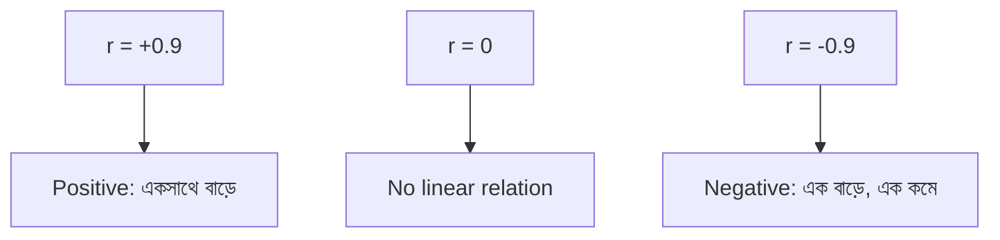

## Correlation vs Causation

Statistics এর সবচেয়ে গুরুত্বপূর্ণ নিয়ম: **correlation does not imply causation**।

দুটো জিনিস একসাথে বদলায় (correlation) — এর মানে এই নয় যে একটা অন্যটাকে cause করছে (causation)। হয়তো তৃতীয় একটা factor দুটোকেই influence করছে, বা এটা নিছক coincidence।

**বিখ্যাত উদাহরণ**: Ice cream sale আর drowning accident — দুটোই গরমে বাড়ে। Ice cream কি drowning ঘটায়? না! গরম আবহাওয়াই দুটোরই কারণ (confounding variable)।


## Pearson Correlation

দুটো variable এর **linear relationship** এর strength আর direction মাপে।

`r = Σ((xᵢ-x̄)(yᵢ-ȳ)) / √(Σ(xᵢ-x̄)² × Σ(yᵢ-ȳ)²)`

মান `-1` থেকে `+1`:

- `+1`: Perfect positive linear (একটা বাড়লে অন্যটাও বাড়ে)
- `0`: কোনো linear relationship নেই
- `-1`: Perfect negative linear (একটা বাড়লে অন্যটা কমে)

| r মান | Interpretation |
|--------|---------------|
| 0.9 থেকে 1.0 | খুব শক্তিশালী |
| 0.7 থেকে 0.9 | শক্তিশালী |
| 0.5 থেকে 0.7 | মাঝারি |
| 0.3 থেকে 0.5 | দুর্বল |
| 0 থেকে 0.3 | নগণ্য |

## Spearman Rank Correlation

Linear না, **monotonic** relationship মাপে। যেমন: x বাড়লে y সবসময় বাড়ে, কিন্তু linear না হতে পারে। Outlier এর প্রতি less sensitive। Ordinal data এর জন্য ভালো।

## Kendall's Tau

Spearman এর মতোই, কিন্তু rank pair এর concordance/discordance এর উপর ভিত্তি করে। ছোট sample এ আরো reliable।

```python
import numpy as np
import pandas as pd

# Generate correlated data
np.random.seed(42)
x = np.random.randn(100)
y_linear = 2 * x + np.random.randn(100) * 0.5     # strong linear
y_nonlinear = x ** 2 + np.random.randn(100) * 0.3 # non-linear
y_random = np.random.randn(100)                    # no relation

# Pearson vs Spearman
from scipy.stats import pearsonr, spearmanr

print("Linear relationship:")
print(f"  Pearson:  {pearsonr(x, y_linear)[0]:.3f}")
print(f"  Spearman: {spearmanr(x, y_linear)[0]:.3f}")

print("\nNon-linear (x²) relationship:")
print(f"  Pearson:  {pearsonr(x, y_nonlinear)[0]:.3f}")   # Low — misses it
print(f"  Spearman: {spearmanr(x, y_nonlinear)[0]:.3f}")  # Also low

print("\nNo relationship:")
print(f"  Pearson:  {pearsonr(x, y_random)[0]:.3f}")      # ~0
```

## Correlation Matrix ও Heatmap

Multiple variable এর pairwise correlation এক নজরে দেখায়। ML এ feature selection এর জন্য essential।

```python
import pandas as pd
import seaborn as sns
import matplotlib.pyplot as plt

# Sample dataset
df = pd.DataFrame({
    'height': np.random.normal(170, 8, 100),
    'weight': np.random.normal(65, 10, 100),
    'age': np.random.randint(20, 60, 100),
    'salary': np.random.normal(50000, 15000, 100),
})

# Correlation matrix
corr_matrix = df.corr()
print(corr_matrix)

# Heatmap visualization
plt.figure(figsize=(8, 6))
sns.heatmap(corr_matrix, annot=True, cmap='coolwarm', center=0, 
            vmin=-1, vmax=1, fmt='.2f')
plt.title('Correlation Heatmap')
plt.tight_layout()
plt.savefig('correlation_heatmap.png', dpi=100)
plt.show()
```



## Simple Linear Regression

Correlation বলে relationship আছে কি না। Regression বলে relationship টা **কী** — একটা equation দেয়:

`y = β₀ + β₁x + ε`

এখানে:
- `β₀`: Intercept (y-intercept)
- `β₁`: Slope (x এক unit বাড়লে y কতটা বাড়ে)
- `ε`: Error term

### Least Squares Method

ভুল (residual) এর square এর যোগফল minimize করে optimal β₀ আর β₁ বের করা।

`minimize Σ(yᵢ - ŷᵢ)²`

## R² (Coefficient of Determination)

R² বলে দেয় model y এর variability এর কত শতাংশ explain করতে পারে।

- `R² = 1`: Perfect fit (সব variance explain করছে)
- `R² = 0`: Model কিছুই explain করছে না
- `R² = 0.85`: ৮৫% variance explain করছে

### Adjusted R²

Multiple regression এ feature যোগ করলে R² সবসময় বাড়ে — এমনকি useless feature যোগ করলেও। Adjusted R² unnecessary feature কে penalty দেয়।

`Adjusted R² = 1 - [(1-R²)(n-1)/(n-k-1)]`

যেখানে k = feature সংখ্যা, n = sample size।

## Residual Analysis

Regression model এর assumption check করার জন্য residual (actual - predicted) analyze করা হয়।

- **Residual vs Fitted plot**: Pattern না থাকা উচিত (random scatter)
- **Normal Q-Q plot**: Residual normal হওয়া উচিত
- **Homoscedasticity**: Residual এর spread সব জায়গায় সমান হওয়া উচিত

```python
from sklearn.linear_model import LinearRegression
from sklearn.metrics import r2_score
import numpy as np

X = np.array([[1], [2], [3], [4], [5], [6], [7], [8], [9], [10]])
y = np.array([2.1, 3.9, 6.2, 7.8, 10.5, 11.8, 14.1, 16.2, 17.9, 20.3])

model = LinearRegression()
model.fit(X, y)

print(f"Slope (β₁):     {model.coef_[0]:.3f}")
print(f"Intercept (β₀): {model.intercept_:.3f}")
print(f"R²:             {model.score(X, y):.4f}")

predictions = model.predict(X)
residuals = y - predictions
print(f"\nResiduals: {np.round(residuals, 2)}")
```

> [!danger] Correlation ≠ Causation
# "Ice cream sale আর drowning একসাথে বাড়ে" — এই correlation দেখে কেউ বলছে ice cream drowning ঘটায়? হাস্যকর! কিন্তু ML এ আমরা প্রায়ই এই ভুল করি। Feature আর target এর correlation দেখে "এটাই cause" বলে দেওয়া ভুল। হয়তো একটা confounding variable দুটোকেই drive করছে। Causal inference establish করতে হলে randomized experiment বা causal methods (do-calculus, instrumental variables) দরকার।

> [!tip] Plot Before You Compute
# সব correlation coefficient হিসাব করার আগে scatter plot আঁকো। Anscombe's Quartet আবার মনে করাই — চারটা ডেটাসেট এর correlation একই (0.816), কিন্তু pattern সম্পূর্ণ আলাদা। একটা dataset এ outlier, একটাযে non-linear, একটায় vertical line। শুধু number না দেখে visualize করলে ভুল এড়ানো যায়।

## Summary

Correlation দুটো variable এর relationship মাপে, কিন্তু causation প্রমাণ করে না — "ice cream ↔ drowning" প্রমাণ করে কেন। Pearson (linear), Spearman (monotonic), Kendall (rank pair) — তিন ধরনের correlation। Correlation matrix আর heatmap feature selection এ কাজে লাগে। Linear regression relationship এর equation দেয় (y = β₀ + β₁x)। R² বলে কত variance explain হচ্ছে, Adjusted R² unnecessary feature কে penalty দেয়। Residual analysis assumption check করার জন্য জরুরি। সবসময় ডেটা plot করো আর causation আর correlation গুলিয়ে ফেলবে না।