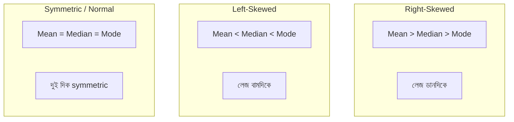

## Measures of Central Tendency

ডেটার "মাঝখানে" কোথায় — সেটা বোঝাই central tendency। তিনটি measure: **mean**, **median**, **mode**।

### Mean (গড়)

সব value যোগ করে count দিয়ে ভাগ। সবচেয়ে common measure। কিন্তু **outlier এর প্রতি সংবেদনশীল**।

`Mean = (Σxᵢ) / n`

### Median (মধ্যমা)

ডেটা sort করে মাঝের value। যদি count জোড় হয়, মাঝের দুটোর গড়। Outlier থাকলেও median stable থাকে।

### Mode (প্রচুরতা)

যে value সবচেয়ে বেশি বার আছে। Categorical data এর জন্য সবচেয়ে useful।

```python
import numpy as np
import pandas as pd

salary = np.array([30000, 35000, 40000, 42000, 38000, 500000])

print(f"Mean:   {salary.mean():,.0f}")    # 114,167 — distorted by outlier!
print(f"Median: {np.median(salary):,.0f}")  # 39,000 — robust
print(f"Mode: not applicable for continuous data")

# With outlier, median is more representative
# Mean is pulled toward the 500000 outlier
```

> [!note] Outlier আর Mean
# উপরের উদাহরণে একজনের salary ৫ লক্ষ টাকা, বাকি সবার ৩০–৪২ হাজার। Mean দেখাচ্ছে ১.১৪ লক্ষ — যা কারো আসল salary না। Median (৩৯ হাজার) অনেক বেশি realistic। Outlier থাকলে সবসময় median ব্যবহার করো।

| Situation | Best Measure |
|-----------|-------------|
| Symmetric data, no outlier | Mean |
| Skewed data / outlier আছে | Median |
| Categorical data | Mode |
| Income, house price | Median |
| Temperature, height | Mean |

## Measures of Spread

শুধু center জানলেই হবে না — ডেটা কতটা ছড়িয়ে আছে সেটাও জানতে হবে।

### Range

`Maximum - Minimum`। সবচেয়ে simple, কিন্তু outlier এ পুরোপুরি influenced।

### Variance

প্রতিটা value mean থেকে কতদূরে — তার square এর গড়।

**Population variance:** `σ² = Σ(xᵢ - μ)² / N`

**Sample variance:** `s² = Σ(xᵢ - x̄)² / (n - 1)`

কেন `n-1` (Bessel's correction)? কারণ sample থেকে population variance অনুমান করলে সামান্য underestimate হয়। `n-1` দিয়ে ভাগ করলে সেটা correct হয়।

### Standard Deviation

`σ = √(variance)`

Variance এর square root কেন? কারণ variance এর unit হয় ডেটার unit এর square (যেমন টাকা²)। Square root করলে আবার মূল unit এ ফিরে আসে (টাকা)। তাই std dev সহজে interpret করা যায়।

### IQR (Interquartile Range)

`Q3 - Q1`। মাঝের ৫০% ডেটার range। Outlier প্রতিরোধে দারুণ — box plot এ এটাই ব্যবহৃত হয়।

```python
import numpy as np

data = np.array([10, 12, 14, 15, 18, 19, 22, 25, 28, 95])  # 95 is outlier

print(f"Range:     {data.max() - data.min()}")    # 85 — distorted!
print(f"Variance:  {np.var(data, ddof=1):.2f}")    # sample variance (n-1)
print(f"Std dev:   {np.std(data, ddof=1):.2f}")    # sample std dev
print(f"IQR:       {np.percentile(data, 75) - np.percentile(data, 25):.1f}")

# Percentiles / quartiles
print(f"\nQ1 (25th): {np.percentile(data, 25):.1f}")
print(f"Q2 (50th): {np.percentile(data, 50):.1f}")
print(f"Q3 (75th): {np.percentile(data, 75):.1f}")
```

## Five-Number Summary

এই পাঁচটি সংখ্যা ডেটার যথেষ্ট ধারণা দেয়:

1. **Minimum**
2. **Q1** (25th percentile)
3. **Median** (Q2 / 50th percentile)
4. **Q3** (75th percentile)
5. **Maximum**

## Skewness ও Kurtosis

**Skewness** বলে দেয় ডেটা কোনদিকে ঝুঁকে আছে:

- **Right-skewed (positive)**: লেজ ডানে, mean > median (income data)
- **Left-skewed (negative)**: লেজ বামে, mean < median
- **Symmetric**: mean ≈ median ≈ mode (normal distribution)

**Kurtosis** বলে দেয় distribution এর tail কতটা ভারী (extreme value এর পরিমাণ)।



## Visualization: Box Plot

Box plot এই সব summary এক নজরে দেখায়:

- Box: Q1 থেকে Q3
- Box এর ভেতরের line: Median
- Whiskers: স্বাভাবিক range
- বিন্দু (dots): Outlier গুলো

```python
import matplotlib.pyplot as plt
import numpy as np

# Compare two groups with boxplot
group_a = np.random.normal(70, 10, 100)   # mean=70, std=10
group_b = np.random.normal(75, 15, 100)   # mean=75, std=15

fig, ax = plt.subplots()
ax.boxplot([group_a, group_b], labels=['Group A', 'Group B'])
ax.set_ylabel('Score')
ax.set_title('Box Plot Comparison')
plt.savefig('boxplot.png', dpi=100)
plt.show()
```

```python
import pandas as pd

# pandas describe() gives most of these stats
df = pd.DataFrame({'values': group_a})
print(df.describe())
# Includes: count, mean, std, min, Q1, median, Q3, max
```

## Visualization: Histogram

Histogram ডেটার distribution এর shape দেখায়। X-axis এ value range, Y-axis এ frequency।

| Visualization | কী দেখায় | কখন ব্যবহার |
|--------------|----------|------------|
| **Histogram** | Distribution shape | সব ডেটার জন্য প্রথম step |
| **Box plot** | Outlier, quartiles | Group comparison |
| **Density curve** | Smooth distribution | Distribution shape |

> [!tip] Anscombe's Quartet — Summary Stats এর ভয়
# Anscombe এর চারটা dataset এর **mean, variance, correlation, regression line — সব একই**! কিন্তু plot করলে দেখা যায় চারটা সম্পূর্ণ আলাদা pattern। **শিক্ষা**: শুধু summary statistics বিশ্বাস করো না, সবসময় ডেটা visualize করো। Anscombe's Quartet এই কথা প্রমাণ করে।

## Summary

Descriptive statistics ডেটা বর্ণনা করে — central tendency (mean/median/mode) আর spread (variance/std/IQR)। Outlier থাকলে median আর IQR robust, mean আর std sensitive। Skewness বলে ডেটা কোন দিকে ঝুঁকে। Five-number summary আর box plot ডেটা বোঝার সবচেয়ে কার্যকর tool। কিন্তু সবসময় **visualize করো** — সংখ্যা একা বিভ্রান্তিকর হতে পারে।