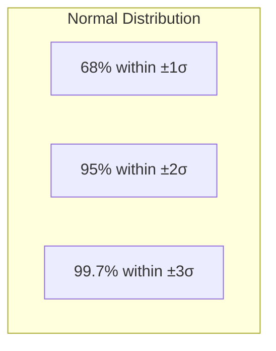

## Probability Distribution কী

**Probability Distribution** হলো একটা random variable এর সব সম্ভাব্য value আর তাদের probability এর বর্ণনা। ভাবো এটা একটা recipe — কোন value কতবার আসতে পারে সেটার map।

দুই ধরনের distribution:

- **Discrete**: countable values — যেমন dice (1–6), coin (H/T)
- **Continuous**: যেকোনো value নিতে পারে — যেমন height, temperature

## Discrete Distributions

### Bernoulli Distribution

সবচেয়ে simple — শুধু দুটো outcome (success/failure)। একটা parameter `p` (success এর probability)। Coin flip হলো একটা Bernoulli trial।

`Mean = p, Variance = p(1-p)`

### Binomial Distribution

`n` টা independent Bernoulli trial — কতবার success হলো। দুটো parameter: `n` (trial সংখ্যা), `p` (success probability)।

`P(X=k) = C(n,k) × pᵏ × (1-p)ⁿ⁻ᵏ`

উদাহরণ: ১০ বার coin flip এ ৬ বার head আসার সম্ভাবনা।

```python
from scipy.stats import binom
import numpy as np

# P(exactly 6 heads in 10 flips)
prob = binom.pmf(6, n=10, p=0.5)
print(f"P(6 heads in 10 flips) = {prob:.4f}")

# Simulate 10000 binomial experiments
samples = binom.rvs(n=10, p=0.5, size=10000)
print(f"Mean: {samples.mean():.1f}")  # ~5.0
```

### Poisson Distribution

নির্দিষ্ট সময়/স্থানে কোনো **rare event** কতবার ঘটে। একটা parameter `λ` (average rate)।

উদাহরণ: একটা website এ প্রতি মিনিটে কতজন visitor আসে। Call center এ প্রতি ঘণ্টায় কতগুলো call।

`Mean = λ, Variance = λ`

### Geometric Distribution

প্রথম success পেতে কতবার trial করতে হয়। Parameter `p` (success probability)।

## Continuous Distributions

### Uniform Distribution

নির্দিষ্ট range এ সব value এর probability সমান। যেমন `[0, 1]` এ random number।

### Normal Distribution (Gaussian)

সবচেয়ে গুরুত্বপূর্ণ distribution! Bell curve আকৃতির। দুটো parameter: `μ` (mean) আর `σ` (standard deviation)।

প্রকৃতিতে সবকিছুই normal — height, IQ, measurement error। এর কারণ Central Limit Theorem (পরের chapter এ)।

### Exponential Distribution

Events এর মধ্যে সময়ের ব্যবধান — যেমন দুটো earthquake এর মধ্যে সময়, customer এর আগমনের সময়।

## Normal Distribution Deep Dive

### 68-95-99.7 Rule

Normal distribution এ:

- **±1σ**: প্রায় ৬৮% ডেটা
- **±2σ**: প্রায় ৯৫% ডেটা
- **±3σ**: প্রায় ৯৯.৭% ডেটা



### Z-Score

যেকোনো value কে standard normal (μ=0, σ=1) এ রূপান্তর করা:

`z = (x - μ) / σ`

Z-score বলে দেয় একটা value mean থেকে কতটা দূরে — standard deviation এর এককে।

```python
import numpy as np
from scipy.stats import norm

# Given: mean=100, std=15 (like IQ score)
mu, sigma = 100, 15

# What percentile is IQ=130?
z = (130 - mu) / sigma  # z-score
percentile = norm.cdf(z)
print(f"IQ 130 is at {percentile:.1%} percentile")

# What IQ is top 5%?
top5 = norm.ppf(0.95, loc=mu, scale=sigma)
print(f"Top 5% IQ threshold: {top5:.1f}")
```

### Standardization

যেকোনো normal distribution কে standard normal এ রূপান্তর করা — z-score ব্যবহার করে। এটাই ML এ StandardScaler এর ভিত্তি।

## Distributions Summary Table

| Distribution | Type | Parameters | Use Case |
|-------------|------|-----------|----------|
| **Bernoulli** | Discrete | p | Single yes/no event |
| **Binomial** | Discrete | n, p | X successes in n trials |
| **Poisson** | Discrete | λ | Rare events count |
| **Geometric** | Discrete | p | Trials until first success |
| **Uniform** | Continuous | a, b | Equal probability range |
| **Normal** | Continuous | μ, σ | Natural phenomena |
| **Exponential** | Continuous | λ | Time between events |

## Python: Sampling ও Visualization

```python
import numpy as np
import matplotlib.pyplot as plt
from scipy import stats

# Sample from different distributions
np.random.seed(42)

normal_data = np.random.normal(loc=0, scale=1, size=10000)
uniform_data = np.random.uniform(low=-3, high=3, size=10000)
binom_data = np.random.binomial(n=10, p=0.5, size=10000)
poisson_data = np.random.poisson(lam=3, size=10000)

# Plot histograms
fig, axes = plt.subplots(2, 2, figsize=(10, 8))
axes[0, 0].hist(normal_data, bins=50, density=True)
axes[0, 0].set_title('Normal Distribution')

axes[0, 1].hist(uniform_data, bins=50, density=True)
axes[0, 1].set_title('Uniform Distribution')

axes[1, 0].hist(binom_data, bins=11, density=True)
axes[1, 0].set_title('Binomial Distribution')

axes[1, 1].hist(poisson_data, bins=15, density=True)
axes[1, 1].set_title('Poisson Distribution')

plt.tight_layout()
plt.savefig('distributions.png', dpi=100)
plt.show()

# Check distribution parameters
print(f"Normal:   mean={normal_data.mean():.2f}, std={normal_data.std():.2f}")
print(f"Binomial: mean={binom_data.mean():.2f} (expected: {10*0.5})")
print(f"Poisson:  mean={poisson_data.mean():.2f}, var={poisson_data.var():.2f}")
```

> [!tip] Algorithm বাছাই করার আগে Distribution দেখো
# অনেক ML algorithm distribution এর shape এর উপর নির্ভর করে। Naive Bayes normal distribution ধরে নেয়। Linear regression এর residual normal হওয়া উচিত। Data দেখার প্রথম step ই হলো distribution check করা — histogram আর density plot আঁকো। এতে algorithm choose করা সহজ হয়।

> [!note] Real Data Rarely Perfectly Normal
# বাস্তবে ডেটা খুব কমই perfectly normal distribution follow করে। Income data right-skewed, exam score left-skewed হতে পারে। Normality assumption না মিললে transformation (log, Box-Cox) ব্যবহার করা যায়। কিন্তু Central Limit Theorem এর কারণে sample mean সবসময় normal এর কাছাকাছি হয় (পরের chapter এ বিস্তারিত)।

## Summary

Probability distribution একটা random variable এর সব value আর probability বর্ণনা করে। Discrete distribution: Bernoulli (হ্যাঁ/না), Binomial (n trial এ success), Poisson (rare event)। Continuous: Uniform (সমান), Normal (bell curve), Exponential (সময় ব্যবধান)। Normal distribution এ 68-95-99.7 rule আর z-score অত্যন্ত গুরুত্বপূর্ণ। ML algorithm choose করার আগে distribution shape check করো — histogram আঁকো। বাস্তব data সবসময় perfectly normal হবে না, transformation দরকার হতে পারে।