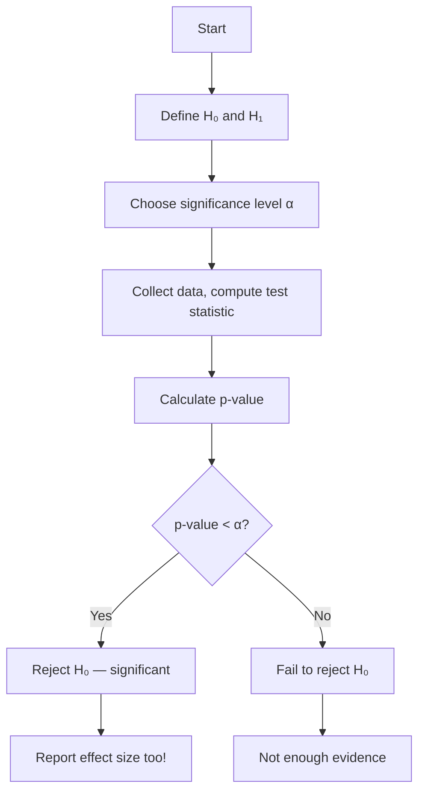

## Hypothesis Testing কী

**Hypothesis Testing** হলো data দিয়ে সিদ্ধান্ত নেওয়ার একটা structured method। একটা claim বা assumption কি সত্যি নাকি — ডেটা দিয়ে যাচাই করা।

ভাবো তুমি বললে "এই নতুন medicine পুরোনোটার চেয়ে ভালো"। এটা কি সত্যি? শুধু মুখে বললে হবে না — data দিয়ে প্রমাণ করতে হবে। Hypothesis testing সেই structured framework দেয়।

## Null vs Alternative Hypothesis

- **Null Hypothesis (H₀)**: "কোনো পার্থক্য নেই" — default assumption। যেমন: "new medicine আর old medicine একই"
- **Alternative Hypothesis (H₁)**: "পার্থক্য আছে" — যা প্রমাণ করতে চাও। যেমন: "new medicine ভালো"

আমরা সবসময় H₀ কে assume করি সত্যি, তারপর data দেখে সিদ্ধান্ত নিই — H₀ কে reject করবো নাকি রাখবো।

## p-value: এটা আসলে কী

p-value হলো:

> H₀ সত্যি হলে এই ডেটা (বা এর চেয়ে extreme) দেখার সম্ভাবনা কত।

ছোট p-value = H₀ এর বিরুদ্ধে প্রমাণ শক্ত। বড় p-value = পর্যাপ্ত প্রমাণ নেই।

> [!danger] p-value Misconception
# p-value হলো **P(data | H₀)** — অর্থাৎ H₀ সত্যি হলে এই data আসার সম্ভাবনা। এটা **P(H₀ | data)** না — অর্থাৎ H₀ সত্যি হওয়ার সম্ভাবনা না। এই দুটো এক না! অনেকেই এই confusion এ পড়ে। p-value ছোট হলে শুধু বলা যায় "এই data H₀ এর সাথে মানানসই না" — কিন্তু "H₀ সম্ভাবনা X%" বলা যায় না।

## Significance Level (α)

আগে থেকে একটা threshold ঠিক করা হয় — সাধারণত `α = 0.05` বা `0.01`।

- p-value < α → **H₀ reject** (statistically significant)
- p-value ≥ α → **H₀ fail to reject** (not enough evidence)

| α | কঠোরতা | Error Risk |
|---|--------|-----------|
| 0.05 | Standard | বেশি false positive risk |
| 0.01 | কঠোর | কম false positive, বেশি false negative risk |

## Type I ও Type II Error

| | H₀ সত্যি | H₀ মিথ্যা |
|--|---------|----------|
| **H₀ Reject** | Type I Error (α) | ✓ Correct (Power) |
| **H₀ Don't Reject** | ✓ Correct | Type II Error (β) |

- **Type I Error (False Positive)**: পার্থক্য নেই কিন্তু আছে বলে সিদ্ধান্ত — যেমন সুস্থ রোগীকে অসুস্থ বলা
- **Type II Error (False Negative)**: পার্থক্য আছে কিন্তু ধরা পড়লো না — যেমন অসুস্থ রোগীকে সুস্থ বলা
- **Statistical Power (1-β)**: সত্যি পার্থক্য থাকলে সেটা detect করার ক্ষমতা



## Common Tests

### t-test

Mean তুলনা করার জন্য। তিন ধরন:

- **One-sample**: Sample mean আর known value তুলনা
- **Two-sample (independent)**: দুটো group এর mean তুলনা
- **Paired**: একই group এর before/after তুলনা

### Chi-Square Test

Categorical data এর association check। যেমন: gender আর department এর মধ্যে সম্পর্ক আছে কি না।

### ANOVA

তিন বা ততোধিক group এর mean তুলনা। Multiple t-test এর চেয়ে ভালো — error rate control করে।

```python
from scipy import stats
import numpy as np

# Two-sample t-test: Are two groups different?
np.random.seed(42)
group_A = np.random.normal(70, 10, 50)   # mean=70
group_B = np.random.normal(75, 10, 50)   # mean=75

t_stat, p_value = stats.ttest_ind(group_A, group_B)
print(f"t-statistic: {t_stat:.4f}")
print(f"p-value: {p_value:.4f}")

if p_value < 0.05:
    print("Significant difference between groups!")
else:
    print("No significant difference.")

# Chi-square test: categorical independence
from scipy.stats import chi2_contingency
import numpy as np

observed = np.array([[30, 20], [15, 35]])  # [[male_yes, male_no], [female_yes, female_no]]
chi2, p, dof, expected = chi2_contingency(observed)
print(f"\nChi-square: {chi2:.4f}, p-value: {p:.4f}")
```

| Test | Use Case | Data Type |
|------|----------|-----------|
| **One-sample t-test** | Sample vs known mean | Numerical |
| **Two-sample t-test** | Two group means | Numerical |
| **Paired t-test** | Before/after | Numerical |
| **Chi-square** | Category association | Categorical |
| **ANOVA** | 3+ group means | Numerical |

## A/B Testing

Industry এ সবচেয়ে common application। দুটো version (A আর B) এর মধ্যে কোনটা ভালো — hypothesis testing দিয়ে সিদ্ধান্ত। যেমন: website এ দুটো button color — কোনটায় বেশি click।

```python
# A/B test example
import numpy as np
from scipy.stats import norm

# Version A: 1000 visitors, 120 conversions
# Version B: 1000 visitors, 150 conversions
conv_A = 120 / 1000  # 12%
conv_B = 150 / 1000  # 15%

p_pool = (120 + 150) / 2000
se = np.sqrt(p_pool * (1 - p_pool) * (1/1000 + 1/1000))
z_score = (conv_B - conv_A) / se
p_value = norm.sf(abs(z_score)) * 2  # two-tailed

print(f"Conversion A: {conv_A:.1%}")
print(f"Conversion B: {conv_B:.1%}")
print(f"p-value: {p_value:.4f}")
if p_value < 0.05:
    print("Version B is significantly better!")
```

## Multiple Testing Problem

একসাথে অনেক hypothesis test করলে false positive বাড়ে। ২০টা test এ কমপক্ষে একটা false positive আসার সম্ভাবনা ~৬৪%!

**Bonferroni Correction**: α কে test সংখ্যা দিয়ে ভাগ করো। যেমন ২০টা test এ α = 0.05/20 = 0.0025।

> [!danger] P-Hacking
# বারবার test করে যতক্ষণ না p < 0.05 আসছে — এটাকে **p-hacking** বা data dredging বলে। এটা অত্যন্ত ক্ষতিকর এবং unethical। যেকোনো random data তে যথেষ্ট test করলে কিছু না কিছু "significant" বের হবেই। Hypothesis আগে থেকে define করো, তারপর test করো।

> [!tip] Practical vs Statistical Significance
# p < 0.05 মানেই বাস্তবে গুরুত্বপূর্ণ না। বড় sample এ খুটি নাটি পার্থক্যও statistically significant হয়ে যায়। সবসময় **effect size** দেখো — পার্থক্যটা কতটা বড়। "মাথাপিছু আয় ০.০১% বেশি, p < 0.001" — পরিসংখ্যানে significant, বাস্তবে তেমন গুরুত্ব নেই। Domain knowledge দিয়ে practical significance বিচার করো।

## Summary

Hypothesis testing data দিয়ে structured সিদ্ধান্ত নেওয়ার method। H₀ = "পার্থক্য নেই", H₁ = "পার্থক্য আছে"। p-value বলে H₀ সত্যি হলে এই data আসার সম্ভাবনা — কিন্তু এটা H₀ এর probability না। p < α হলে H₀ reject। Type I error = false positive, Type II = false negative। t-test (mean), chi-square (category), ANOVA (3+ group) common test। A/B testing industry এর main application। P-hacking থেকে সাবধান, আর practical significance আর statistical significance এক না।