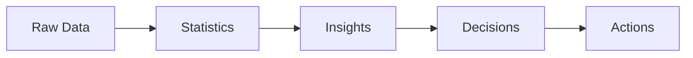
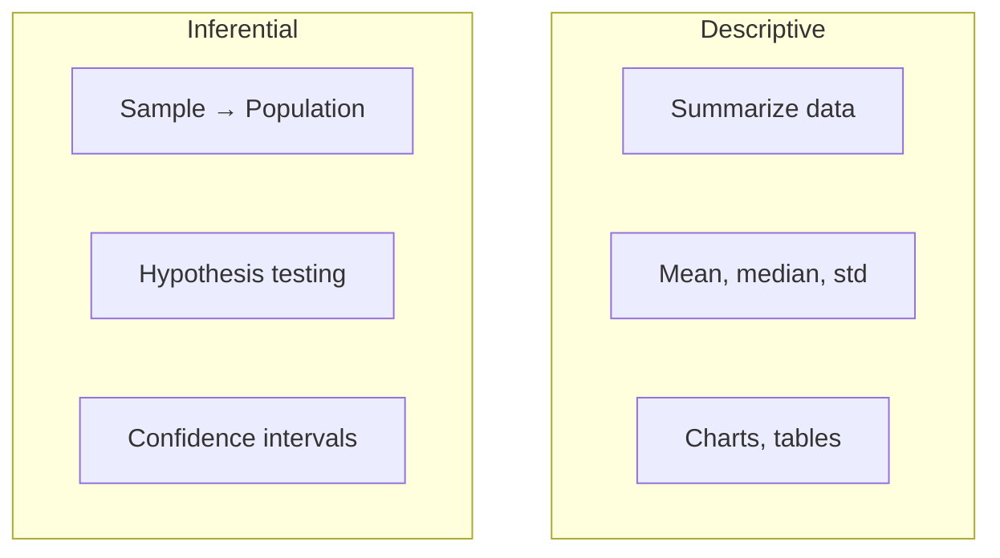
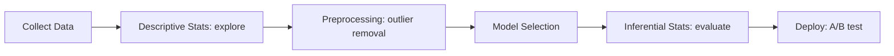

## Statistics কী

**Statistics** হলো ডেটা থেকে তথ্য বের করার বিজ্ঞান। অগোছালো সংখ্যার ভিড় থেকে meaningful insight বের করাই statistics এর কাজ।

ভাবো তোমার কাছে ১০ হাজার student এর exam score আছে। এক নজরে কিছুই বোঝা যাচ্ছে না। Statistics বলে দেবে — average কত, কারা top এ, score গুলো কীভাবে ছড়িয়ে আছে। এটাই data কে তথ্যে রূপান্তর করা।



## Descriptive vs Inferential Statistics

Statistics এর দুটো প্রধান শাখা:

- **Descriptive Statistics**: হাতে থাকা ডেটা বর্ণনা করে — mean, median, chart ইত্যাদি
- **Inferential Statistics**: ডেটার একটা অংশ (sample) থেকে পুরো ডেটা (population) সম্পর্কে অনুমান করে



| দিক | Descriptive | Inferential |
|-----|------------|------------|
| উদ্দেশ্য | ডেটা describe | অনুমান করা |
| Scope | হাতে যা আছে | Population |
| Tool | Mean, chart | t-test, CI |
| Uncertainty | নেই | আছে |

## Population vs Sample

- **Population**: যাদের সম্পর্কে জানতে চাও — যেমন বাংলাদেশের সব মানুষ
- **Sample**: Population থেকে নেওয়া একটা অংশ — যেমন ১০০০ জনের survey

কেন sample? কারণ পুরো population measure করা প্রায় অসম্ভব — সময়, টাকা, সুবিধা সব দিক থেকে। কিন্তু sample যদি ভালোভাবে নেওয়া হয়, সেটা population সম্পর্কে বেশ নির্ভুল ধারণা দেয়।

## AI Engineer হিসেবে কেন দরকার

| Task | Statistics এর ভূমিকা |
|------|---------------------|
| **Data understanding** | ডেটার distribution, pattern বোঝা |
| **Model evaluation** | Accuracy, precision — সবই statistical concept |
| **A/B testing** | দুটো version এর মধ্যে কোনটা ভালো — hypothesis testing |
| **Feature engineering** | Outlier detection, correlation analysis |
| **Sampling** | Training/test split সঠিকভাবে করা |

## Types of Data

ডেটা মূল দুই ধরনের:

1. **Numerical (সংখ্যাসূচক)**: সংখ্যা দিয়ে প্রকাশ করা যায় — age, salary, temperature
2. **Categorical (শ্রেণিসূচক)**: category বা group — gender, color, city

আরও ভাগ করা যায়:

- **Numerical → Continuous** (temperature, height) আর **Discrete** (number of children)
- **Categorical → Nominal** (কোনো order নেই: red, blue, green) আর **Ordinal** (order আছে: low, medium, high)

## Levels of Measurement

| Level | বর্ণনা | উদাহরণ | Operations |
|-------|--------|--------|-----------|
| **Nominal** | শুধু category | Blood group, gender | `=`, `≠` |
| **Ordinal** | Order আছে | Rating (1–5 stars) | `=`, `≠`, `<`, `>` |
| **Interval** | সমান ব্যবধান, true zero নেই | Temperature (°C) | `+`, `-` |
| **Ratio** | True zero আছে | Height, weight, age | `×`, `÷` |

## Statistics in ML Pipeline

ML pipeline এর প্রতিটা ধাপে statistics কাজ করে:



## Python: Basic Stats

```python
import pandas as pd
import numpy as np

# Sample dataset
data = pd.DataFrame({
    'age': [25, 30, 35, 40, 28, 32, 50, 45, 29, 33],
    'salary': [50000, 60000, 75000, 90000, 55000, 65000, 120000, 100000, 58000, 70000],
    'department': ['IT', 'HR', 'IT', 'Finance', 'HR', 'IT', 'Finance', 'IT', 'HR', 'Finance']
})

# describe() gives summary statistics
print(data.describe())

# Categorical data summary
print(data['department'].value_counts())

# Basic stats manually
print(f"\nMean age: {data['age'].mean():.1f}")
print(f"Median salary: {data['salary'].median():,.0f}")
print(f"Std deviation age: {data['age'].std():.1f}")
```

## Common Terms

- **Parameter**: Population এর value (যেমন সব বাংলাদেশির গড় আয়) — সাধারণত অজানা
- **Statistic**: Sample এর value (যেমন ১০০০ জনের গড় আয়) — হিসাব করা যায়
- **Variable**: যে বৈশিষ্ট্য measure করা হয় — age, salary ইত্যাদি

> [!tip] Statistics = ML এর ভিত্তি
# Machine Learning কে এক কথায় বললে — **applied statistics**। Model evaluation, sampling, feature selection — সবই statistics এর concept। Statistics ভালো না বুঝলে ML শুধু surface level এ শেখা হবে। পরের chapter গুলোতে descriptive stats, probability, hypothesis testing একটা একটা করে cover করবো।

## Summary

Statistics হলো ডেটা থেকে তথ্য বের করার বিজ্ঞান — descriptive (বর্ণনা) আর inferential (অনুমান) দুই শাখায় ভাগ। Population vs sample বোঝা essential। ডেটা চার ধরনের: nominal, ordinal, interval, ratio। AI engineer হিসেবে data exploration, model evaluation, A/B testing — সবখানে statistics দরকার। `pandas.describe()` আর NumPy stats দিয়ে ডেটা explore করা শুরু করো।