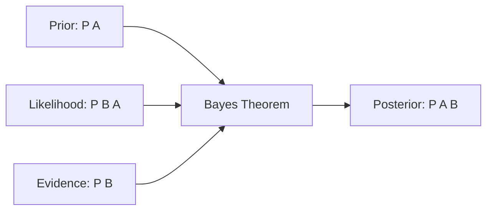

## Probability কী

**Probability (সম্ভাবনা)** বলে দেয় কোনো event ঘটার সম্ভাবনা কত। মান সবসময় **০ থেকে ১** এর মধ্যে। ০ মানে কখনো ঘটবে না, ১ মানে অবশ্যই ঘটবে।

দুই ধরনের interpretation আছে:

- **Frequentist**: অনেকবার চেষ্টা করলে কতবার ঘটে — যেমন coin ১০০০ বার ছুঁড়লে ~৫০০ বার head
- **Bayesian**: prior knowledge থেকে degree of belief — নতুন evidence এ update হয়

## Sample Space ও Events

- **Sample Space (S)**: সব সম্ভাব্য outcome — একটা dice এর জন্য `{1, 2, 3, 4, 5, 6}`
- **Event (A)**: Sample space এর একটা subset — যেমন "জোড় সংখ্যা" = `{2, 4, 6}`
- **Outcome**: একটি single ফলাফল — যেমন `3`

`P(A) = (A এর favorable outcome সংখ্যা) / (মোট outcome সংখ্যা)`

## Basic Rules

| Rule | Formula | অর্থ |
|------|---------|-----|
| **Complement** | `P(A') = 1 - P(A)` | A না ঘটার সম্ভাবনা |
| **Union** | `P(A∪B) = P(A) + P(B) - P(A∩B)` | অন্তত একটা ঘটার সম্ভাবনা |
| **Intersection (independent)** | `P(A∩B) = P(A) × P(B)` | দুটোই ঘটার সম্ভাবনা |
| **Intersection (dependent)** | `P(A∩B) = P(A) × P(B\|A)` | A ঘটলে তারপর B |

## Conditional Probability

`P(A|B)` = B ঘটেছে জেনে A ঘটার সম্ভাবনা।

`P(A|B) = P(A∩B) / P(B)`

এটা অত্যন্ত গুরুত্বপূর্ণ — কারণ বাস্তবে অনেক event পরস্পর নির্ভরশীল। যেমন: বৃষ্টি হলে (B) traffic jam (A) হওয়ার সম্ভাবনা বেশি।

```python
import numpy as np
from scipy import stats

# Coin flip simulation
flips = np.random.choice(['H', 'T'], size=10000, p=[0.5, 0.5])
p_head = np.mean(flips == 'H')
print(f"P(Head) ≈ {p_head:.3f}")  # ~0.5

# Dice: probability of even number
dice_outcomes = np.arange(1, 7)
p_even = np.mean(dice_outcomes % 2 == 0)
print(f"P(Even) = {p_even:.3f}")  # 0.5

# Two dice: probability of sum = 7
count = 0
for d1 in range(1, 7):
    for d2 in range(1, 7):
        if d1 + d2 == 7:
            count += 1
print(f"P(Sum=7) = {count/36:.3f}")  # ~0.167
```

## Independent vs Dependent Events

**Independent**: একটার ফল অপরটাকে প্রভাবিত করে না। যেমন দুটো coin flip।

**Dependent**: একটার ফল অপরটাকে প্রভাবিত করে। যেমন: একটা deck থেকে পরপর দুটি card টানা (first card না ফেরত দিলে)।

## Bayes Theorem

Statistics এর সবচেয়ে গুরুত্বপূর্ণ theorem গুলোর একটি:

`P(A|B) = [P(B|A) × P(A)] / P(B)`

সহজ কথায়: B ঘটেছে এই evidence দেখে A এর সম্ভাবনা কত — সেটা update করো।

### Medical Testing Example

ধরো একটা disease এর prevalence ১%। Test টি ৯৯% accurate (sensitivity আর specificity দুটোই)। তোমার test positive এসেছে। তোমার disease হওয়ার সম্ভাবনা কত?

```python
# Bayes theorem: medical test
p_disease = 0.01           # P(D) — prior
p_no_disease = 0.99        # P(D') 
p_pos_given_disease = 0.99 # P(+|D) — sensitivity
p_pos_given_no = 0.01      # P(+|D') — false positive rate

# P(D|+) = P(+|D) * P(D) / P(+)
p_positive = (p_pos_given_disease * p_disease) + (p_pos_given_no * p_no_disease)
p_disease_given_pos = (p_pos_given_disease * p_disease) / p_positive

print(f"P(Disease | Positive test) = {p_disease_given_pos:.3f}")
# Only 50%! Counterintuitive!
```



### Bayesian Terminology

| Term | অর্থ |
|------|-----|
| **Prior** | আগের বিশ্বাস — `P(A)` |
| **Likelihood** | Evidence এর সম্ভাবনা — `P(B|A)` |
| **Evidence** | মোট probability — `P(B)` |
| **Posterior** | Update করা বিশ্বাস — `P(A|B)` |

## Naive Bayes Classifier

Bayes theorem এর একটা practical application। "Naive" কারণ এটা সব feature কে independent ধরে নেয় — যা বাস্তবে খুব কমই সত্যি। তবুও text classification এ (spam detection, sentiment analysis) দারুণ কাজ করে।

```python
from sklearn.naive_bayes import GaussianNB
from sklearn.model_selection import train_test_split
import numpy as np

# Simple classification example
X = np.random.randn(200, 4)
y = np.random.randint(0, 2, 200)

X_train, X_test, y_train, y_test = train_test_split(X, y, test_size=0.2)
model = GaussianNB()
model.fit(X_train, y_train)
print(f"Accuracy: {model.score(X_test, y_test):.2%}")
```

> [!example] Base Rate Fallacy
# উপরের medical test এর উদাহরণে মানুষের ধারণা হয় ৯৯% disease হওয়ার সম্ভাবনা। কিন্তু আসলে মাত্র ৫০%। কারণ disease এর base rate (১%) খুব কম। এটাকে **base rate fallacy** বলে। মানুষ prior probability ignore করে শুধু test result দেখে সিদ্ধান্ত নেয় — যা ভুল।

> [!danger] P(A|B) ≠ P(B|A)
# এই দুটো ভিন্ন জিনিস! "Disease হলে test positive আসার সম্ভাবনা" (৯৯%) আর "Test positive হলে disease হওয়ার সম্ভাবনা" (৫০%) — এক না। অনেকেই এই confusion এ পড়ে। Prosecutor's fallacy এই ভুল এর আরেকটা রূপ — evidence এর probability আর guilt এর probability গুলিয়ে ফেলা।

## Summary

Probability (০–১) বলে দেয় event ঘটার সম্ভাবনা। Basic rules: complement, union, intersection। Conditional probability `P(A|B)` অত্যন্ত গুরুত্বপূর্ণ। Bayes theorem নতুন evidence দেখে prior কে update করে। `P(A|B)` আর `P(B|A)` এক না — এই confusion এ পড়বে না। Naive Bayes একটি practical classifier যা text classification এ খুব ভালো কাজ করে। Base rate fallacy সম্পর্কে সচেতন থাকো।