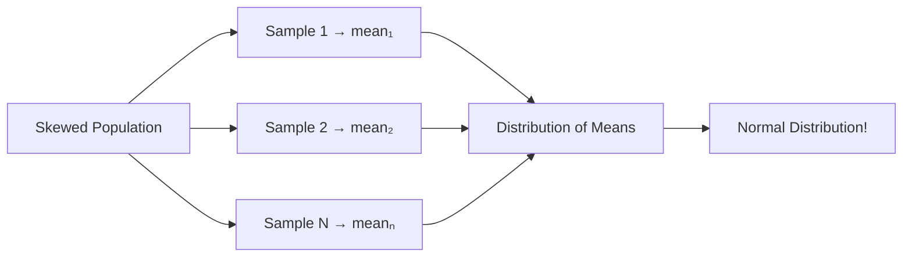

## Sampling কেন দরকার

প্রতিটা মানুষের height measure করা কি সম্ভব? প্রতিটা product test করা? না। Population অনেক বড়, সময় আর টাকা সীমিত। তাই population থেকে একটা **sample** নিয়ে সেটা থেকে population সম্পর্কে অনুমান করা হয়।

কিন্তু sample ভালো না হলে অনুমান ভুল হবে। তাই sampling এর method অত্যন্ত গুরুত্বপূর্ণ।

## Sampling Methods

### Simple Random Sampling

প্রতিটা member এর সমান সুযোগ। যেমন: lottery system। Fair, কিন্তু বড় population এ বাস্তবায়ন কঠিন।

### Stratified Sampling

Population কে subgroup (strata) এ ভাগ করো, প্রতিটা strata থেকে proportionate sample নাও। যেমন: class এ boy/girl ratio ঠিক রাখা। সব strata represent হয়।

### Systematic Sampling

নির্দিষ্ট interval এ একটা করে নেওয়া। যেমন: প্রতি ১০ নম্বর member। সহজ, কিন্তু pattern থাকলে bias হতে পারে।

### Cluster Sampling

Population কে cluster এ ভাগ করো, কিছু cluster এলোমেলো বেছে নাও, সেগুলোর সব member নাও। সুবিধাজনক যখন population ভৌগোলিকভাবে ছড়িয়ে আছে।

| Method | কীভাবে | সুবিধা | অসুবিধা |
|--------|--------|--------|---------|
| **Random** | এলোমেলো বাছাই | সবচেয়ে unbiased | বড় population এ কঠিন |
| **Stratified** | Strata থেকে | সব group represent | Strata জানতে হবে |
| **Systematic** | Fixed interval | সহজ, দ্রুত | Pattern bias |
| **Cluster** | Cluster বাছাই | সস্তা, practical | Cluster ভেদে bias |

## Sampling Bias

সবচেয়ে বড় বিপদ। Sample যদি population কে represent না করে, সব অনুমান ভুল হবে।

- **Selection Bias**: কিছু group বাদ পড়ে যায় — online survey তে শুধু internet user আসে
- **Survivorship Bias**: শুধু টিকে থাকা গুলো দেখা হয় — WWII এ ফিরে আসা plane গুলো থেকে armor কোথায় লাগাবে সেটা ঠিক করা (ফিরে না আসা plane গুলো দেখা যাচ্ছে না!)

> [!warn] Sampling Bias > Small Sample
# ছোট sample থেকে ভালোভাবে নেওয়া অনুমান, বড় কিন্তু biased sample থেকে ভালো। একটা biased dataset কখনো ভালো ফল দেবে না, size যাই হোক। ভালো polling এ ১০০০ জন যথেষ্ট, খারাপ polling এ ১০ লাখও কাজে আসবে না।

## Sample Size: কতটুকু?

নির্ভর করে:

- Population এর variability (বেশি spread = বেশি sample দরকার)
- কতটা precision দরকার
- Confidence level

সাধারণ rule: বেশি sample = বেশি accurate, কিন্তু diminishing returns। ১০০০ থেকে ২০০০ এ accuracy অনেক বাড়ে, কিন্তু ১০০০০ থেকে ১১০০০ এ তেমন বাড়ে না।

## Central Limit Theorem (CLT)

Statistics এর সবচেয়ে গুরুত্বপূর্ণ theorem:

> Population যেমনই distributed হোক না কেন, sample mean গুলোর distribution **normal distribution** এর কাছাকাছি হবে — যদি sample size যথেষ্ট বড় হয় (সাধারণ n ≥ 30)।

এর অর্থ অনেক বড়:

- Population এর distribution জানা না থাকলেও sample mean দিয়ে কাজ করা যায়
- Hypothesis testing আর confidence interval তৈরি করা যায়
- এটাই সব statistical inference এর ভিত্তি



### Python: CLT Demonstration

```python
import numpy as np
import matplotlib.pyplot as plt

# Start with a non-normal (exponential) population
np.random.seed(42)
population = np.random.exponential(scale=2.0, size=100000)

# Take many samples of different sizes, compute means
sample_means_5 = [np.mean(np.random.choice(population, 5)) for _ in range(1000)]
sample_means_30 = [np.mean(np.random.choice(population, 30)) for _ in range(1000)]
sample_means_100 = [np.mean(np.random.choice(population, 100)) for _ in range(1000)]

fig, axes = plt.subplots(1, 4, figsize=(16, 4))

# Original population (skewed!)
axes[0].hist(population, bins=50, density=True)
axes[0].set_title('Population (Skewed)')

# Sample means with n=5 (somewhat normal)
axes[1].hist(sample_means_5, bins=30, density=True)
axes[1].set_title('Sample Means (n=5)')

# Sample means with n=30 (more normal)
axes[2].hist(sample_means_30, bins=30, density=True)
axes[2].set_title('Sample Means (n=30)')

# Sample means with n=100 (very normal!)
axes[3].hist(sample_means_100, bins=30, density=True)
axes[3].set_title('Sample Means (n=100)')

plt.tight_layout()
plt.savefig('clt_demo.png', dpi=100)
plt.show()

# Verify: means converge, variance shrinks
print(f"Population mean: {population.mean():.3f}")
print(f"Sample mean (n=100): {np.mean(sample_means_100):.3f}")
```

## Standard Error

Sample mean এর variability কত — সেটা Standard Error (SE) বলে দেয়:

`SE = σ / √n`

n বাড়ালে SE কমে — অর্থাৎ বেশি data = বেশি precise অনুমান। কিন্তু √n তে কমে, তাই ৪x data দিলে SE শুধু ২x কমে।

## Confidence Intervals

Population parameter এর একটা range অনুমান। ৯৫% CI এর অর্থ:

> যদি আমরা বারবার sample নিই আর CI হিসাব করি, সেই CI গুলোর ৯৫% population parameter কে contain করবে।

**গুরুত্বপূর্ণ**: ৯৫% CI মানে "এই interval এ ৯৫% probability আছে parameter এর" — এই কথা সঠিক না। Parameter fixed, interval variable।

`95% CI = x̄ ± 1.96 × SE`

```python
import numpy as np
from scipy import stats

# 95% Confidence Interval for mean
sample = np.random.normal(50, 10, 100)
mean = sample.mean()
se = sample.std() / np.sqrt(len(sample))
ci_lower = mean - 1.96 * se
ci_upper = mean + 1.96 * se

print(f"Sample mean: {mean:.2f}")
print(f"95% CI: ({ci_lower:.2f}, {ci_upper:.2f})")

# Using scipy
ci = stats.norm.interval(0.95, loc=mean, scale=se)
print(f"Scipy CI: ({ci[0]:.2f}, {ci[1]:.2f})")
```

### Margin of Error

`ME = z × SE`

যেমন polling এ বলা হয় "৫০% ± ৩%"। এই ±৩% হলো margin of error। ছোট হলে অনুমান বেশি precise।

> [!tip] CLT এর জাদু
# CLT এর কারণেই mean আর median robust estimator। Population যেমনই হোক, sample mean দিয়ে population mean অনুমান করা যায়। এটাই সব hypothesis testing আর confidence interval এর ভিত্তি। CLT না থাকলে পুরো statistics এর inferential branch collapse করে যেত।

## Summary

Sampling population থেকে represent করে এমন একটা অংশ নেওয়া। Methods: random, stratified, systematic, cluster। Sampling bias সবচেয়ে বড় বিপদ — ছোট ভালো sample, বড় খারাপ sample এর চেয়ে ভালো। Central Limit Theorem বলে — population যেমনই distributed হোক, sample mean normal এ converge করে। Standard Error `σ/√n` বলে বেশি data লে কম error। Confidence Interval parameter এর range দেয়। CLT-ই সব statistical inference এর ভিত্তি।