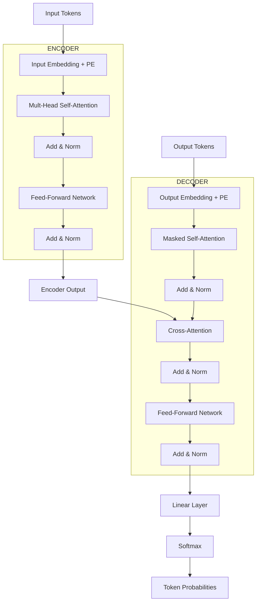

# Complete Transformer Architecture

In the last two chapters, we looked at self-attention and positional encoding. Now we'll put all the pieces together — the complete Transformer architecture.

In 2017, Google's team published a paper called "Attention Is All You Need." The architecture given in that paper is the foundation of all modern LLMs — GPT, BERT, T5, Claude. Today we'll crack it open and look inside.

## The Big Picture First

Transformer is an **encoder-decoder** architecture. The Encoder's job is to understand the input, the Decoder's job is to produce the output. For example, in translation: the encoder understands the English sentence, the decoder produces the Bengali translation.

```
  ┌─────────────────────────────────────────────────────┐
  │                                                     │
  │   "I love coding"  ──→  [ENCODER]  ──→  context    │
  │                                                     │
  │       "আমি কোডিং ভালোবাসি"  ←──  [DECODER]  ←──┘  │
  │                                                     │
  └─────────────────────────────────────────────────────┘
```

> [!note] Not Just Encoder-Decoder
> The original paper had encoder-decoder. But modern models often use only encoder (BERT) or only decoder (GPT). We'll see why later.

## Complete Architecture: ASCII Art

Let's see the entire architecture at a glance. Don't worry — we'll explain each part separately below.

```
          ┌─────────────────────────────────────────────┐
          │              OUTPUT EMBEDDING               │
          │           (shifted right + PE)              │
          └────────────────────┬────────────────────────┘
                               │
          ┌────────────────────▼────────────────────────┐
          │     MASKED MULTI-HEAD                       │
          │     SELF-ATTENTION                          │
          │     (causal — can't see the future)         │
          └────────────────────┬────────────────────────┘
                               │
                      ┌────────▼────────┐
          ┌───────────│   Add & Norm    │◄── residual
          │           └────────┬────────┘
          │                    │
          │           ┌────────▼────────┐     ┌──────────────┐
          │           │  CROSS-ATTENTION│◄────│   ENCODER    │
          │           │  (Q from decoder│     │   OUTPUT     │
          │           │   K,V from enc) │     └──────────────┘
          │           └────────┬────────┘
          │                    │
          │           ┌────────▼────────┐
          ├───────────│   Add & Norm    │◄── residual
          │           └────────┬────────┘
          │                    │
          │           ┌────────▼────────┐
          │           │  FEED-FORWARD   │
          │           │  NETWORK (FFN)  │
          │           └────────┬────────┘
          │                    │
          │           ┌────────▼────────┐
          └───────────│   Add & Norm    │◄── residual
                      └────────┬────────┘
                               │
                      ┌────────▼────────┐
                      │     LINEAR      │──→ vocabulary size
                      └────────┬────────┘
                               │
                      ┌────────▼────────┐
                      │    SOFTMAX      │──→ probabilities
                      └─────────────────┘

  ════════════════════════════════════════════════
  The entire block above is stacked ×N times
  ════════════════════════════════════════════════
```

## Mermaid: Full Data Flow



## Encoder: Step by Step

The Encoder's job is to understand the input. It consists of N=6 identical layers stacked together. Each layer has two sub-layers.

### Layer 1: Input Embedding + Positional Encoding

First, input tokens are converted to embeddings, then positional encoding is added.

```python
# input: integer token ids → dense vectors
word_embeddings = embedding_layer(input_tokens)      # (batch, seq, d_model)
embeddings = word_embeddings + positional_encoding    # add position info
```

When these two are added, each token gets a complete representation — both word meaning and position together. This representation then goes to the attention layer.

### Layer 2: Multi-Head Self-Attention

The Encoder's attention is **bidirectional** — each word can look at all words in the sentence, both before and after.

```
  Bidirectional attention (encoder):

  "The cat sat on the mat"
       ↓     ↓    ↓    ↓    ↓    ↓
       └─────┴────┴────┴────┴────┘
       All words look at all words
```

> [!important] Bidirectional vs Unidirectional
> Encoder is bidirectional — sees all directions. Because its job is to understand the entire input, it needs all information. Decoder is unidirectional — only sees previous words, because it's making predictions.

### Layer 3: Add & Norm (Residual + LayerNorm)

The attention output is added to the original input (residual connection), then LayerNorm is applied.

```
  ┌────────────────────────────────────────────┐
  │                                            │
  │   input ──────┬──────→ Add ──→ LayerNorm ──→ output
  │       │       │            ↑               │
  │       │       │            │               │
  │       └───────┴──[ Attention ]──┘           │
  │                                            │
  └────────────────────────────────────────────┘

  output = LayerNorm(input + Sublayer(input))
```

**Why residual connection?**

> [!important] Gradient Flow
> In deep networks, gradients become very small during backpropagation — this is called **vanishing gradient**. Residual connection creates a direct "shortcut" that allows gradients to flow back easily. Just like a flyover helps traffic bypass congestion, this lets gradients pass through smoothly.

**Why LayerNorm?**

> [!note] Layer Normalization
> Each sample's features are normalized to a specific mean (0) and variance (1). This stabilizes training and speeds up convergence. Unlike BatchNorm — LayerNorm doesn't work with the batch dimension, only the feature dimension.

### Layer 4: Feed-Forward Network (FFN)

After attention comes a feed-forward network. It consists of two linear layers with ReLU activation in between.

```
  FFN structure:

  input (d_model=512)
      │
      ▼
  Linear: 512 → 2048     ← expand 4x
      │
      ▼
  ReLU activation
      │
      ▼
  Linear: 2048 → 512     ← compress back
```

> [!important] Bottleneck Design
> Notice — FFN first expands from d_model to 4x larger dimension, then compresses back. This is called a **bottleneck**. Why? Because attention only captures relationships, but the actual "thinking" or transformation happens in this FFN. The larger dimension lets the model represent more complex patterns.

```python
class FeedForward(nn.Module):
    def __init__(self, d_model=512, d_ff=2048):
        super().__init__()
        self.linear1 = nn.Linear(d_model, d_ff)
        self.relu = nn.ReLU()
        self.linear2 = nn.Linear(d_ff, d_model)

    def forward(self, x):
        return self.linear2(self.relu(self.linear1(x)))
```

In this code, the first linear layer expands dimensions from 512 to 2048 — in this large space, non-linear transformation happens through ReLU. Then the second layer brings it back to 512. This expand-compress pattern gives each token a richer representation after attention.

### Layer 5: Add & Norm Again

After FFN, again residual connection and LayerNorm.

This entire block (attention + add&norm + FFN + add&norm) is **stacked N=6 times**.

## Decoder: Step by Step

The Decoder's job is to generate tokens one at a time. It's also stacked with N=6 layers, but a bit more complex than the encoder — it has 3 sub-layers.

### Sub-layer 1: Masked Multi-Head Self-Attention

The Decoder's self-attention is **causal** — each position can only see positions before itself, it can't look ahead into the future. To ensure this, a **mask** is used.

```
  Causal mask (lower triangular):

           pos1  pos2  pos3  pos4
  pos1  [  ✓      ✗      ✗      ✗   ]   ← pos1 only sees itself
  pos2  [  ✓      ✓      ✗      ✗   ]   ← pos2 sees pos1, pos2
  pos3  [  ✓      ✓      ✓      ✗   ]
  pos4  [  ✓      ✓      ✓      ✓   ]

  ✗ cells have their score set to -∞
  softmax(-∞) = 0
  So future positions have no contribution
```

> [!warn] Why Is Masking Needed?
> The Decoder generates tokens. If position 3 could see position 4, it could "cheat" and use the next token. But during inference, the next token hasn't been generated yet! So we must prevent looking at the future during training too.

```python
# Creating a causal mask
def create_causal_mask(seq_len):
    # Fill upper triangular with -inf
    mask = torch.triu(torch.ones(seq_len, seq_len), diagonal=1).bool()
    # True values are "to be masked" (future)
    return mask

# Using in attention
scores = scores.masked_fill(mask, float('-inf'))
```

In this code, `torch.triu` creates an upper triangular matrix — this marks the future positions. `masked_fill` sets those cells' scores to -∞, so after softmax their weight becomes zero. Without this mask, the decoder would create a mismatch between training and inference.

### Sub-layer 2: Add & Norm

Same as before — residual connection and LayerNorm.

### Sub-layer 3: Cross-Attention

This is the most interesting part of the Decoder. Here, the Decoder's Queries attend to the **Encoder's Keys and Values**.

```
  Cross-Attention:

  Query  ← from Decoder (what I want)
  Key    ← from Encoder (look at this info)
  Value  ← from Encoder (get this info)

  Decoder: "I'm translating 'cat' — which input words are useful?"
  Encoder: "Here, the context for the word 'cat'."
```

> [!important] Importance of Cross-Attention
> This is the bridge that connects the encoder and decoder. Here, information from two sources is matched — the decoder's "prediction context" and the encoder's "input understanding."

### Sub-layers 4 & 5: FFN and Add & Norm

Same feed-forward network as the encoder, followed by residual and LayerNorm.

## Final: Output Generation

The Decoder's output is projected to vocabulary size, then softmax is applied to get a probability distribution.

```python
# Output projection
logits = linear_projection(decoder_output)  # (batch, seq, vocab_size)
probabilities = softmax(logits, dim=-1)      # probability for each token
next_token = argmax(probabilities)           # most likely token
```

For each position, the probability of every token in the vocabulary is computed. The token with the highest probability is generated. This entire process creates tokens one at a time until an end-of-sequence token appears.

## Encoder vs Decoder: Comparison

| Feature | Encoder | Decoder |
|---------|---------|---------|
| **Sub-layers** | 2 | 3 |
| **Attention type** | Bidirectional self-attention | Masked self-attention + Cross-attention |
| **Future visibility** | ✅ Sees everything | ❌ Only sees the past |
| **Cross-attention** | No | ✅ Yes |
| **Job** | Understanding input | Generating output |
| **Use case** | BERT, classification | GPT, text generation |
| **Mask** | No | Causal mask |

> [!note] Encoder-only or Decoder-only?
> BERT uses only an encoder stack — because its job is just understanding, not generating. GPT uses only a decoder stack — because its job is generating. T5 and the original Transformer use both.

## Typical Hyperparameters

The configuration used in the 2017 paper:

```
  ┌──────────────────────────────────────────┐
  │  base model:                             │
  │                                          │
  │  d_model  = 512    (embedding size)      │
  │  h        = 8      (attention heads)     │
  │  d_k      = 64     (per head dim)        │
  │  d_ff     = 2048   (FFN hidden size)     │
  │  N        = 6      (encoder/decoder layers) │
  │  dropout  = 0.1                         │
  │                                          │
  │  big model:                              │
  │                                          │
  │  d_model  = 1024                         │
  │  h        = 16                           │
  │  d_k      = 64                           │
  │  d_ff     = 4096                         │
  │  N        = 6                            │
  └──────────────────────────────────────────┘
```

Notice two big changes — d_model and d_ff roughly doubled. Even though the number of heads increases, each head's dimension stays the same (64). This is interesting — a bigger model means more heads, more capacity, but head dimension is kept the same because d_k = 64 is a sweet spot.

## Complete Encoder Block Code

Below is a complete encoder layer — all components from previous chapters in one place.

```python
import torch
import torch.nn as nn
import torch.nn.functional as F
import math

class EncoderLayer(nn.Module):
    def __init__(self, d_model=512, num_heads=8, d_ff=2048, dropout=0.1):
        super().__init__()

        # Multi-Head Self-Attention
        self.self_attention = MultiHeadAttention(d_model, num_heads)

        # Feed-Forward Network
        self.ffn = nn.Sequential(
            nn.Linear(d_model, d_ff),
            nn.ReLU(),
            nn.Linear(d_ff, d_model),
        )

        # LayerNorm (two — separate for attention and FFN)
        self.norm1 = nn.LayerNorm(d_model)
        self.norm2 = nn.LayerNorm(d_model)

        # Dropout
        self.dropout = nn.Dropout(dropout)

    def forward(self, x):
        # Sub-layer 1: Self-Attention + Residual + Norm
        attn_output = self.self_attention(x)
        x = self.norm1(x + self.dropout(attn_output))

        # Sub-layer 2: FFN + Residual + Norm
        ffn_output = self.ffn(x)
        x = self.norm2(x + self.dropout(ffn_output))

        return x
```

In this code, two sub-layers work one after another — first attention, then FFN. After each, a residual connection (adding input) and LayerNorm are applied. `dropout` is used for regularization during training. The entire encoder is this layer stacked 6 times.

```python
class TransformerEncoder(nn.Module):
    def __init__(self, vocab_size=10000, d_model=512, num_heads=8,
                 d_ff=2048, num_layers=6, max_len=512):
        super().__init__()
        self.embedding = nn.Embedding(vocab_size, d_model)
        self.pos_encoding = SinusoidalPositionalEncoding(d_model, max_len)
        self.layers = nn.ModuleList([
            EncoderLayer(d_model, num_heads, d_ff)
            for _ in range(num_layers)
        ])
        self.norm = nn.LayerNorm(d_model)

    def forward(self, input_ids):
        x = self.embedding(input_ids)
        x = self.pos_encoding(x)
        for layer in self.layers:
            x = layer(x)
        return self.norm(x)
```

Here `nn.ModuleList` stores six encoder layers in a list, and in forward, data passes through each one. Each layer's output becomes the next layer's input. This sequential processing means each layer adds a more refined understanding on top of the previous layer.

## In Conclusion

Today we looked at the complete Transformer architecture. Key points:

- **Encoder** understands input with bidirectional self-attention.
- **Decoder** generates output with masked self-attention and cross-attention.
- **Residual connections** keep gradient flow alive.
- **LayerNorm** stabilizes training.
- **FFN** increases capacity with a bottleneck design.
- **Typical config**: d_model=512, h=8, N=6.

This architecture is the heart of all modern LLMs. GPT takes only the decoder, BERT takes only the encoder — but the foundation is the same. Reading this chapter multiple times will make it clearer — digesting everything at once is hard, so take it slow.