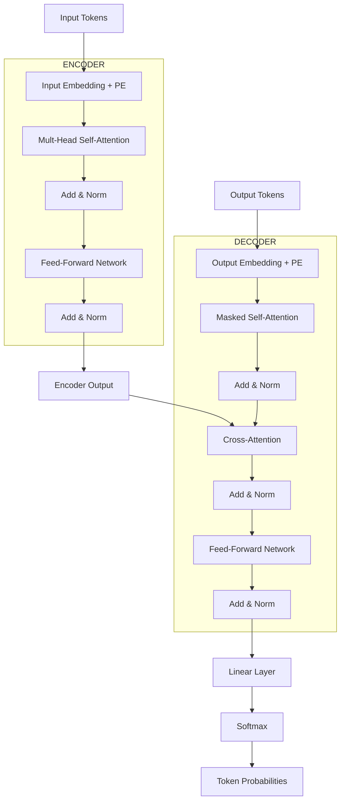

# Complete Transformer Architecture

গত দুই chapter এ আমরা self-attention আর positional encoding দেখলাম। এবার সমস্ত টুকরো এক জায়গায় বসাবো — সম্পূর্ণ Transformer architecture।

2017 সালে Google এর team "Attention Is All You Need" নামের একটা paper প্রকাশ করে। সেই paper এ যে architecture দেওয়া হয়েছিল সেটাই আজকের সমস্ত LLM — GPT, BERT, T5, Claude — সবার ভিত্তি। আজ আমরা সেই architecture কে একদম খুলে দেখবো।

## বড় ছবি আগে

Transformer হলো একটা **encoder-decoder** architecture। Encoder এর কাজ input বোঝা, decoder এর কাজ output তৈরি করা। যেমন translation এ: ইংরেজি বাক্য কে encoder বুঝবে, decoder বাংলা অনুবাদ বানাবে।

```
  ┌─────────────────────────────────────────────────────┐
  │                                                     │
  │   "I love coding"  ──→  [ENCODER]  ──→  context    │
  │                                                     │
  │       "আমি কোডিং ভালোবাসি"  ←──  [DECODER]  ←──┘  │
  │                                                     │
  └─────────────────────────────────────────────────────┘
```

> [!note] শুধু encoder-decoder না
> Original paper এ encoder-decoder ছিল। কিন্তু modern model গুলো অনেকসময় শুধু encoder (BERT) বা শুধু decoder (GPT) ব্যবহার করে। পরে দেখবো কেন।

## সম্পূর্ণ Architecture: ASCII Art

পুরো architecture টা এক নজরে দেখি। ভয় পেও না — নিচে প্রতিটা অংশ আলাদা করে ব্যাখ্যা করবো।

```
          ┌─────────────────────────────────────────────┐
          │              OUTPUT EMBEDDING               │
          │           (shifted right + PE)              │
          └────────────────────┬────────────────────────┘
                               │
          ┌────────────────────▼────────────────────────┐
          │     MASKED MULTI-HEAD                       │
          │     SELF-ATTENTION                          │
          │     (causal — future দেখতে পারে না)          │
          └────────────────────┬────────────────────────┘
                               │
                      ┌────────▼────────┐
          ┌───────────│   Add & Norm    │◄── residual
          │           └────────┬────────┘
          │                    │
          │           ┌────────▼────────┐     ┌──────────────┐
          │           │  CROSS-ATTENTION│◄────│   ENCODER    │
          │           │  (Q from decoder│     │   OUTPUT     │
          │           │   K,V from enc) │     └──────────────┘
          │           └────────┬────────┘
          │                    │
          │           ┌────────▼────────┐
          ├───────────│   Add & Norm    │◄── residual
          │           └────────┬────────┘
          │                    │
          │           ┌────────▼────────┐
          │           │  FEED-FORWARD   │
          │           │  NETWORK (FFN)  │
          │           └────────┬────────┘
          │                    │
          │           ┌────────▼────────┐
          └───────────│   Add & Norm    │◄── residual
                      └────────┬────────┘
                               │
                      ┌────────▼────────┐
                      │     LINEAR      │──→ vocabulary size
                      └────────┬────────┘
                               │
                      ┌────────▼────────┐
                      │    SOFTMAX      │──→ probabilities
                      └─────────────────┘

  ════════════════════════════════════════════════
  উপরের পুরো block টাকে ×N বার stack করা হয়
  ════════════════════════════════════════════════
```

## Mermaid: Full Data Flow



## Encoder: ধাপে ধাপে

Encoder এর কাজ হলো input বোঝা। এটি N=6 টা identical layer stack করা থাকে। প্রতিটা layer এ দুটো sub-layer থাকে।

### Layer 1: Input Embedding + Positional Encoding

প্রথমে input tokens কে embedding এ রূপান্তর করা হয়, তারপর positional encoding যোগ করা হয়।

```python
# input: integer token ids → dense vectors
word_embeddings = embedding_layer(input_tokens)      # (batch, seq, d_model)
embeddings = word_embeddings + positional_encoding    # position info যোগ
```

এই দুটো যোগ হলে প্রতিটা token এর জন্য একটা সম্পূর্ণ representation তৈরি হয় — শব্দের অর্থ আর position দুটোই একসাথে। এই representation পরে attention layer এ যাবে।

### Layer 2: Multi-Head Self-Attention

Encoder এর attention হলো **bidirectional** — প্রতিটা শব্দ বাক্যের সব শব্দের দিকে তাকাতে পারে, আগের আর পরের দুটো দিকেই।

```
  Bidirectional attention (encoder):

  "The cat sat on the mat"
       ↓     ↓    ↓    ↓    ↓    ↓
       └─────┴────┴────┴────┴────┘
       সব শব্দ সব শব্দের দিকে তাকায়
```

> [!important] Bidirectional vs Unidirectional
> Encoder bidirectional — সব direction দেখে। কারণ এর কাজ হলো পুরো input বোঝা, তাই সব তথ্য প্রয়োজন। Decoder unidirectional — শুধু আগের শব্দ দেখে, কারণ সে prediction করছে।

### Layer 3: Add & Norm (Residual + LayerNorm)

Attention output এর সাথে মূল input কে যোগ করা হয় (residual connection), তারপর LayerNorm প্রয়োগ করা হয়।

```
  ┌────────────────────────────────────────────┐
  │                                            │
  │   input ──────┬──────→ Add ──→ LayerNorm ──→ output
  │       │       │            ↑               │
  │       │       │            │               │
  │       └───────┴──[ Attention ]──┘           │
  │                                            │
  └────────────────────────────────────────────┘

  output = LayerNorm(input + Sublayer(input))
```

**কেন residual connection?**

> [!important] Gradient Flow
> গভীর network এ gradient backpropagation এর সময় অনেক ছোট হয়ে যায় — এটাকে বলে **vanishing gradient**। Residual connection একটা সরাসরি "shortcut" তৈরি করে, যার ফলে gradient সহজে পেছনে যেতে পারে। ছবিতে যেমন flyover করে ট্রাফিক এড়ানো যায়, এটাও তেমনি gradient কে সহজে পার হতে দেয়।

**কেন LayerNorm?**

> [!note] Layer Normalization
> প্রতিটা sample এর feature গুলোকে একটা নির্দিষ্ট mean (0) আর variance (1) এ normalize করা হয়। এতে training stable হয় আর faster converge হয়। BatchNorm এর মতো না — LayerNorm batch dimension নিয়ে কাজ করে না, শুধু feature dimension নিয়ে।

### Layer 4: Feed-Forward Network (FFN)

Attention এর পরে একটা feed-forward network থাকে। এটা দুটো linear layer আর মাঝে ReLU activation।

```
  FFN structure:

  input (d_model=512)
      │
      ▼
  Linear: 512 → 2048     ← expand 4x
      │
      ▼
  ReLU activation
      │
      ▼
  Linear: 2048 → 512     ← compress back
```

> [!important] Bottleneck Design
> খেয়াল করো — FFN প্রথমে d_model থেকে 4 গুণ বড় dimension এ expand করে, তারপর আবার ছোট করে। এটাকে বলে **bottleneck**। কেন? কারণ attention শুধু relationship ধরে, কিন্তু আসল "thinking" বা transformation এই FFN এ হয়। বড় dimension দিয়ে model বেশি complex pattern represent করতে পারে।

```python
class FeedForward(nn.Module):
    def __init__(self, d_model=512, d_ff=2048):
        super().__init__()
        self.linear1 = nn.Linear(d_model, d_ff)
        self.relu = nn.ReLU()
        self.linear2 = nn.Linear(d_ff, d_model)

    def forward(self, x):
        return self.linear2(self.relu(self.linear1(x)))
```

এই কোডে প্রথম linear layer dimension কে 512 থেকে 2048 এ বাড়ায় — এই বড় space এ ReLU এর মাধ্যমে non-linear transformation হয়। তারপর দ্বিতীয় layer আবার 512 এ ফিরিয়ে আনে। এই expand-compress pattern টাই attention এর পরে প্রতিটা token কে আরও সমৃদ্ধ representation দেয়।

### Layer 5: Add & Norm আবার

FFN এর পরে আবার residual connection আর LayerNorm।

এই পুরো block (attention + add&norm + FFN + add&norm) কে **N=6 বার** stack করা হয়।

## Decoder: ধাপে ধাপে

Decoder এর কাজ হলো একটা একটা করে token generate করা। এটাও N=6 layer stack করা, কিন্তু encoder এর চেয়ে একটু জটিল — ৩ টা sub-layer থাকে।

### Sub-layer 1: Masked Multi-Head Self-Attention

Decoder এর self-attention হলো **causal** — প্রতিটা position শুধু নিজের আগের position গুলো দেখতে পারে, ভবিষ্যতের দিকে তাকাতে পারে না। এটা নিশ্চিত করার জন্য একটা **mask** ব্যবহার্র করা হয়।

```
  Causal mask (lower triangular):

           pos1  pos2  pos3  pos4
  pos1  [  ✓      ✗      ✗      ✗   ]   ← pos1 শুধু নিজে দেখে
  pos2  [  ✓      ✓      ✗      ✗   ]   ← pos2 দেখে pos1, pos2
  pos3  [  ✓      ✓      ✓      ✗   ]
  pos4  [  ✓      ✓      ✓      ✓   ]

  ✗ গুলোর score কে -∞ সেট করা হয়
  softmax(-∞) = 0
  তাই future position গুলোর কোনো contribution থাকে না
```

> [!warn] কেন masking দরকার?
> Decoder টোকেন generate করে। যদি position 3 তার পরের position 4 দেখতে পারতো, তাহলে সে "cheat" করে পরের token ব্যবহার করতে পারতো। কিন্তু inference এর সময় পরের token তো এখনও generate হয়নি! তাই training এও future দেখা বন্ধ করতে হবে।

```python
# causal mask বানানো
def create_causal_mask(seq_len):
    # upper triangular কে -inf দিয়ে ভরো
    mask = torch.triu(torch.ones(seq_len, seq_len), diagonal=1).bool()
    # True গুলো হলো "mask করতে হবে" (future)
    return mask

# attention এ ব্যবহার
scores = scores.masked_fill(mask, float('-inf'))
```

এই কোডে `torch.triu` দিয়ে upper triangular matrix বানানো হয়েছে — এটাই future position গুলো চিহ্নিত করে। `masked_fill` দিয়ে সেই cell গুলোর score কে -∞ সেট করা হয়, যাতে softmax এর পরে সেগুলোর weight শূন্য হয়ে যায়। এই mask ছাড়া decoder training আর inference এর মধ্যে mismatch তৈরি করতো।

### Sub-layer 2: Add & Norm

আগের মতোই residual connection আর LayerNorm।

### Sub-layer 3: Cross-Attention

এটা Decoder এর সবচেয়ে ইন্টারেস্টিং অংশ। এখানে decoder এর Query গুলো **encoder এর Key আর Value** এর সাথে attend করে।

```
  Cross-Attention:

  Query  ← from Decoder (এটা আমি কী চাই)
  Key    ← from Encoder (এই তথ্য দেখো)
  Value  ← from Encoder (এই তথ্য পাও)

  Decoder: "আমি 'cat' অনুবাদ করছি — input এ কোন শব্দ দরকারী?"
  Encoder: "এই দাও, 'cat' শব্দের context।"
```

> [!important] Cross-Attention এর গুরুত্ব
> এটাই সেই সেতু যা encoder আর decoder কে যুক্ত করে। এখানে দুই source এর তথ্য মেলানো হয় — decoder এর "prediction context" আর encoder এর "input understanding"।

### Sub-layer 4 & 5: FFN আর Add & Norm

Encoder এর মতোই feed-forward network, তারপর residual আর LayerNorm।

## Final: Output Generation

Decoder এর output কে vocabulary size এ project করা হয়, তারপর softmax প্রয়োগ করে probability distribution পাওয়া যায়।

```python
# output projection
logits = linear_projection(decoder_output)  # (batch, seq, vocab_size)
probabilities = softmax(logits, dim=-1)      # প্রতিটা token এর probability
next_token = argmax(probabilities)           # সবচেয়ে সম্ভাব্য token
```

প্রতিটা position এর জন্য vocabulary এর প্রতিটা token এর probability বের হয়। সবচেয়ে বেশি probability যে token এর, সেটাই generate হয়। এই পুরো প্রক্রিয়া একটা একটা করে token তৈরি করে যতক্ষণ না end-of-sequence token আসে।

## Encoder vs Decoder: Comparison

| বৈশিষ্ট্য | Encoder | Decoder |
|----------|---------|---------|
| **Sub-layers** | 2 টা | 3 টা |
| **Attention type** | Bidirectional self-attention | Masked self-attention + Cross-attention |
| **Future visibility** | ✅ সব দেখে | ❌ শুধু আগের দেখে |
| **Cross-attention** | না | ✅ হ্যাঁ |
| **কাজ** | Input বোঝা | Output generate করা |
| **Use case** | BERT, classification | GPT, text generation |
| **Mask** | না | Causal mask |

> [!note] শুধু encoder বা শুধু decoder?
> BERT শুধু encoder stack ব্যবহার করে — কারণ তার কাজ শুধু বোঝা, generate করা না। GPT শুধু decoder stack ব্যবহার করে — কারণ তার কাজ generate করা। T5 আর original Transformer দুটোই ব্যবহার করে।

## Typical Hyperparameters

2017 paper এ যে configuration ব্যবহার করা হয়েছিল:

```
  ┌──────────────────────────────────────────┐
  │  base model:                             │
  │                                          │
  │  d_model  = 512    (embedding size)      │
  │  h        = 8      (attention heads)     │
  │  d_k      = 64     (per head dim)        │
  │  d_ff     = 2048   (FFN hidden size)     │
  │  N        = 6      (encoder/decoder layers) │
  │  dropout  = 0.1                         │
  │                                          │
  │  big model:                              │
  │                                          │
  │  d_model  = 1024                         │
  │  h        = 16                           │
  │  d_k      = 64                           │
  │  d_ff     = 4096                         │
  │  N        = 6                            │
  └──────────────────────────────────────────┘
```

খেয়াল করো দুটো বড় পরিবর্তন — d_model আর d_ff প্রায় দ্বিগুণ। Head সংখ্যা বাড়লেও প্রতিটা head এর dimension একই থাকে (64)। এটা মজার ব্যাপার — বড় model মানে বেশি head, বেশি capacity, কিন্তু head dimension একই রাখা হয় কারণ d_k = 64 একটা sweet spot।

## সম্পূর্ণ Encoder Block Code

নিচে একটা সম্পূর্ণ encoder layer দেখি — আগের chapter গুলোর সব component এক জায়গায়।

```python
import torch
import torch.nn as nn
import torch.nn.functional as F
import math

class EncoderLayer(nn.Module):
    def __init__(self, d_model=512, num_heads=8, d_ff=2048, dropout=0.1):
        super().__init__()

        # Multi-Head Self-Attention
        self.self_attention = MultiHeadAttention(d_model, num_heads)

        # Feed-Forward Network
        self.ffn = nn.Sequential(
            nn.Linear(d_model, d_ff),
            nn.ReLU(),
            nn.Linear(d_ff, d_model),
        )

        # LayerNorm (দুটা — attention আর FFN এর জন্য আলাদা)
        self.norm1 = nn.LayerNorm(d_model)
        self.norm2 = nn.LayerNorm(d_model)

        # Dropout
        self.dropout = nn.Dropout(dropout)

    def forward(self, x):
        # Sub-layer 1: Self-Attention + Residual + Norm
        attn_output = self.self_attention(x)
        x = self.norm1(x + self.dropout(attn_output))

        # Sub-layer 2: FFN + Residual + Norm
        ffn_output = self.ffn(x)
        x = self.norm2(x + self.dropout(ffn_output))

        return x
```

এই কোডে দুটো sub-layer একে একে কাজ করছে — প্রথমে attention, তারপর FFN। প্রতিটার পরে residual connection (input কে যোগ করা) আর LayerNorm হচ্ছে। `dropout` training এ regularization এর জন্য ব্যবহৃত হয়। পুরো encoder হলো এই layer টাকে ৬ বার stack করা।

```python
class TransformerEncoder(nn.Module):
    def __init__(self, vocab_size=10000, d_model=512, num_heads=8,
                 d_ff=2048, num_layers=6, max_len=512):
        super().__init__()
        self.embedding = nn.Embedding(vocab_size, d_model)
        self.pos_encoding = SinusoidalPositionalEncoding(d_model, max_len)
        self.layers = nn.ModuleList([
            EncoderLayer(d_model, num_heads, d_ff)
            for _ in range(num_layers)
        ])
        self.norm = nn.LayerNorm(d_model)

    def forward(self, input_ids):
        x = self.embedding(input_ids)
        x = self.pos_encoding(x)
        for layer in self.layers:
            x = layer(x)
        return self.norm(x)
```

এখানে `nn.ModuleList` দিয়ে ছয়টা encoder layer কে list এ রাখা হয়েছে, আর forward এ একটা একটা করে সবার ভেতর দিয়ে data পাঠানো হয়েছে। প্রতিটা layer output পরের layer এর input হয়। এই ধারাবাহিক processing এর ফলে প্রতিটা layer আগের layer এর উপর আরও সূক্ষ্ম understanding যোগ করে।

## পরিশেষে

আজ আমরা সম্পূর্ণ Transformer architecture দেখলাম। মূল বিষয়গুলো:

- **Encoder** bidirectional self-attention দিয়ে input বোঝে।
- **Decoder** masked self-attention আর cross-attention দিয়ে output generate করে।
- **Residual connection** gradient flow সচল রাখে।
- **LayerNorm** training stable করে।
- **FFN** একটা bottleneck ডিজাইনে capacity বাড়ায়।
- **Typical config**: d_model=512, h=8, N=6।

এই architecture টাই সমস্ত modern LLM এর হৃদপিণ্ড। GPT শুধু decoder নেয়, BERT শুধু encoder নেয় — কিন্তু ভিত্তি একই। এই chapter টা একাধিকবার পড়লে আরও পরিষ্কার হবে — একবারে সব হজম করা কঠিন, তাই ধীরে ধীরে যাও।