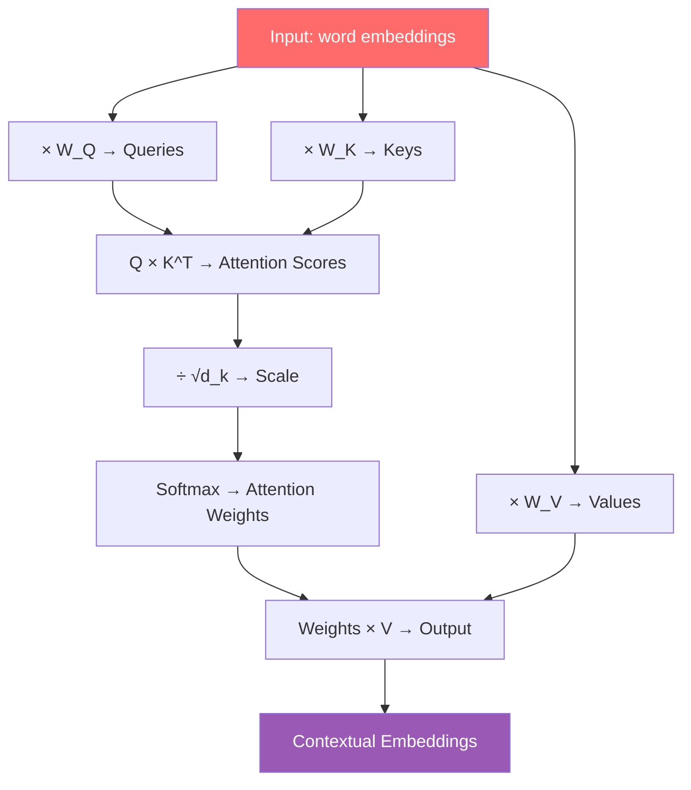

# Intuition of Attention Mechanism

Let's start with a simple question. Read these two sentences:

> 1. "I sat by the **river bank** and watched the water flow."
> 2. "I went to the **bank** to deposit some money."

Both sentences contain the word **"bank."** But in the first sentence it means **river bank**, and in the second it means a **financial institution**. How did you figure out which meaning was being used?

From **context**! Seeing "river" and "water," you understood the first one means a river bank. Seeing "deposit" and "money," you understood the second one means a financial institution.

This — exactly this — is what attention mechanism does. It figures out the correct meaning of a word by looking at the surrounding words. In this chapter, we'll understand this deeply — 3Blue1Brown style, starting from intuition.

---

## The Problem: Word2Vec Gives One Word a Single Vector

We previously learned about **word2vec** or **GloVe** — each word can be represented by a fixed vector. For example:

```
"bank" → [0.2, -0.5, 0.8, ...]  # just one vector

"river" → [0.9, 0.1, -0.3, ...]
"money" → [-0.2, 0.7, 0.5, ...]
```

The problem is — there's only **one** vector for "bank." But we know, the meaning of "bank" depends on context!

```
PROBLEM:

  "river bank"     →  bank = [0.2, -0.5, 0.8]  ──┐
                                                  │  Same vector!
  "bank account"   →  bank = [0.2, -0.5, 0.8]  ──┘
                                                  But different meaning!
```

This is wrong! When "bank" is next to "river," its vector should contain "water/nature" meaning. When it's next to "money," it should contain "finance" meaning.

> [!important] This Is Attention's Job
> Attention mechanism **updates** each word's vector according to its context. "bank"'s vector will be one way after seeing "river," another way after seeing "money." This is called **contextual embedding**.

---

## Solution: Contextualize with Attention

The idea is simple — each word looks at all the surrounding words, and updates its own vector accordingly.

```
SENTENCE: "The cat sat on the mat"

WITHOUT ATTENTION (static embedding):
  The  → [0.1, 0.3, ...]   # fixed
  cat  → [0.5, -0.2, ...]  # fixed
  sat  → [0.0, 0.8, ...]   # fixed

WITH ATTENTION (contextual embedding):
  The  → [0.1, 0.3, ...] ←── updated after seeing "cat" and "mat"
  cat  → [0.6, -0.1, ...] ←── updated after seeing "sat" and "mat"
  sat  → [0.2, 0.7, ...] ←── updated after seeing "cat"
```

But how? Which words should it "look at" and how much? This is where **Query, Key, Value** comes in.

---

## Library Analogy — Query, Key, Value

Imagine you go to a library. What do you do?

```
You:      "I'm looking for Bengali poetry books"     ← This is your QUERY
           (tell what you want)

Library:  Each book has a label on its spine          ← These are KEYS
           "Science", "Poetry", "History"
           (what each book has to offer)

Match:    Your query "Poetry" and
           "Poetry" labeled books match               ← ATTENTION SCORE

Result:   The actual content inside those books        ← VALUE
           (what you'll actually read)
```

Similarly, in Transformer, each word creates three things:

```
For each WORD:

┌──────────────────────────────────────────────┐
│  "cat"                                       │
│                                              │
│  QUERY:  "I'm looking for something that sits"│
│  KEY:    "I'm an animal, four-legged"        │
│  VALUE:  "My core meaning is a small animal" │
└──────────────────────────────────────────────┘
```

---

## Concrete Example: "The cat sat on it because it was tired"

This sentence will make everything clear.

```
The   cat   sat   on   it   because   it   was   tired
 0     1     2     3    4       5       6     7      8
```

There are two "it"s here — position 4 and position 6. The question is:
- Position 4's "it" refers to what? — **cat**
- Position 6's "it" refers to what? — **cat** (tired has to be an animal, not "on")

Attention mechanism figures this out! Let's see how.

### Attention Heatmap

```
                    ──── KEY WORDS ────
              The    cat   sat   on    it    because  it    was   tired
           ┌──────┬──────┬─────┬─────┬─────┬───────┬─────┬─────┬──────┐
  Q cat    │ 0.05 │  ─   │ 0.3 │0.05 │ 0.1 │  0.05 │ 0.1 │0.05 │ 0.3  │
  Q sat    │ 0.02 │ 0.6  │  ─  │0.1  │ 0.05│  0.03 │0.05 │0.05 │ 0.1  │
Q it(4)    │ 0.02 │ 0.8  │0.05 │0.03 │  ─  │  0.02 │0.03 │0.02 │ 0.03 │  ◄── "it" gives cat 80%!
Q it(6)    │ 0.01 │ 0.7  │0.02 │0.02 │0.05 │  0.02 │  ─  │0.05 │ 0.13 │  ◄── "it" again cat + tired!
           └──────┴──────┴─────┴─────┴─────┴───────┴─────┴─────┴──────┘

  Darker = higher attention score
```

Notice — position 4's "it" is giving **80%** attention to "cat" (position 1)! Small amounts elsewhere. This means the model understood — "it" means cat.

> [!note] This Is Attention!
> This heatmap is attention. How much each word looks at every other word — that's the attention weight. Higher weight means more related.

---

## Query, Key, Value — Step by Step

Now let's see the entire process step by step. This is the heart of attention.

### Step 1: Create Query for Each Word

Each word multiplies its embedding by a weight matrix to create a Query. Query means — "what am I looking for?"

```
word embedding × W_query = Query

  "cat"  [0.5, -0.2]   [W_q]   =  [0.3, 0.8]  "I'm looking for something"
  "sat"  [0.0, 0.8]   × [W_q]  =  [0.1, 0.6]  "I'm looking for something"
  "it"   [0.3, 0.1]     [W_q]   =  [0.7, 0.2]  "I'm looking for something"
```

### Step 2: Create Key for Each Word

Similarly, another weight matrix creates Keys. Key means — "what I have."

```
word embedding × W_key = Key

  "cat"  [0.5, -0.2]   [W_k]   =  [0.4, 0.1]  "I'm an animal"
  "sat"  [0.0, 0.8]   × [W_k]  =  [0.9, 0.3]  "I'm an action"
  "it"   [0.3, 0.1]     [W_k]   =  [0.2, 0.5]  "I'm a pronoun"
```

### Step 3: Create Value for Each Word

Another weight matrix creates Values. Value means — "my actual meaning."

```
word embedding × W_value = Value

  "cat"  [0.5, -0.2]   [W_v]   =  [0.6, 0.3]  "small furry animal"
  "sat"  [0.0, 0.8]   × [W_v]  =  [0.1, 0.7]  "sitting action"
  "it"   [0.3, 0.1]     [W_v]   =  [0.3, 0.2]  "pronoun meaning"
```

> [!important] W_query, W_key, W_value
> These three weight matrices are the model's **learnable parameters**. During training, the model learns how to make good queries, keys, and values. This is the source of attention's magic.

### Step 4: Match Query and Key — Attention Score

Now the main task. Each word's Query is dot-producted with all Keys. Higher score = more related.

```
               "cat" Key   "sat" Key   "it" Key
              [0.4, 0.1]   [0.9, 0.3]  [0.2, 0.5]

"cat" Query   0.3×0.4+    0.3×0.9+    0.3×0.2+
[0.3, 0.8]    0.8×0.1      0.8×0.3     0.8×0.5
              = 0.20       = 0.51      = 0.46

"sat" Query   0.1×0.4+    0.1×0.9+    0.1×0.2+
[0.1, 0.6]    0.6×0.1      0.6×0.3     0.6×0.5
              = 0.10       = 0.27      = 0.32

"it" Query    0.7×0.4+    0.7×0.9+    0.7×0.2+
[0.7, 0.2]    0.2×0.1      0.2×0.3     0.2×0.5
              = 0.30       = 0.69      = 0.24

         Score Matrix:
              cat    sat    it
         cat [ 0.20   0.51   0.46 ]
         sat [ 0.10   0.27   0.32 ]
         it  [ 0.30   0.69   0.24 ]
```

### Step 5: Softmax — Scores to Probabilities

Raw scores are softmaxed into a probability distribution. Each row sums to 1.

```
         Score Matrix:           Softmax (per row):

         cat    sat    it         cat    sat    it
  cat [ 0.20   0.51   0.46 ] → [ 0.27   0.37   0.36 ]
  sat [ 0.10   0.27   0.32 ] → [ 0.27   0.35   0.38 ]
  it  [ 0.30   0.69   0.24 ] → [ 0.28   0.42   0.30 ]

  Each row sums to 1.00
  Higher score → higher probability
```

### Step 6: Weighted Sum of Values → Contextual Output

The final step — use attention weights to compute a weighted sum of Values. This is the contextual representation.

```
  "cat"'s new representation:
  = 0.27 × Value(cat) + 0.37 × Value(sat) + 0.36 × Value(it)
  = 0.27 × [0.6,0.3] + 0.37 × [0.1,0.7] + 0.36 × [0.3,0.2]
  = [0.162,0.081] + [0.037,0.259] + [0.108,0.072]
  = [0.307, 0.412]

  ← This is "cat"'s contextual embedding!
    The meanings of "sat" and "it" are blended into this vector
```

> [!important] All Together
> These 6 steps are attention. This entire process happens for each word — all at once (in parallel). At the end, each word gets a contextual representation where the surrounding words' meanings are mixed in.

---

## The Entire Process at a Glance



| Step | What It Does | Formula |
|------|-------------|---------|
| 1. Query | "What am I looking for" | Q = X × W_Q |
| 2. Key | "What do I have" | K = X × W_K |
| 3. Value | "My actual meaning" | V = X × W_V |
| 4. Score | Query-Key match | S = Q × K^T |
| 5. Scale | Stable training | S = S / √d_k |
| 6. Softmax | Probability | A = softmax(S) |
| 7. Output | Weighted Value | Out = A × V |

---

## Code: Complete Attention Implementation

This code is a complete (simplified) attention implementation. Match each step.

In the code below, we implement the entire attention process for a sentence. We'll see each of the above steps one by one in code.

```python
import torch
import torch.nn.functional as F
import math

def attention(x, W_Q, W_K, W_V):
    """
    x:      (seq_len, d_model)   — input embeddings
    W_Q:    (d_model, d_k)       — Query weight matrix
    W_K:    (d_model, d_k)       — Key weight matrix
    W_V:    (d_model, d_v)       — Value weight matrix
    """
    # Step 1-3: Create Query, Key, Value
    Q = x @ W_Q   # (seq_len, d_k) — each word's query
    K = x @ W_K   # (seq_len, d_k) — each word's key
    V = x @ W_V   # (seq_len, d_v) — each word's value

    # Step 4: Dot product of Query and Key → attention scores
    scores = Q @ K.transpose(0, 1)  # (seq_len, seq_len)

    # Step 5: Scale (to keep gradients stable)
    d_k = K.shape[1]
    scores = scores / math.sqrt(d_k)

    # Step 6: Softmax → attention weights (probability)
    weights = F.softmax(scores, dim=-1)  # (seq_len, seq_len)

    # Step 7: Weighted sum of Values → contextual output
    output = weights @ V  # (seq_len, d_v)

    return output, weights

# --- Let's test it ---
torch.manual_seed(42)

seq_len = 4       # 4 words
d_model = 8       # embedding dimension
d_k = 4           # query/key dimension
d_v = 4           # value dimension

# Imagine sentence: "The cat sat on mat" (treating as 4 words)
x = torch.randn(seq_len, d_model)

# Weight matrices (actually learned during training)
W_Q = torch.randn(d_model, d_k)
W_K = torch.randn(d_model, d_k)
W_V = torch.randn(d_model, d_v)

# Run attention
output, weights = attention(x, W_Q, W_K, W_V)

print(f"Input shape:        {x.shape}")
print(f"Output shape:       {output.shape}")
print(f"Attention weights:  {weights.shape}")
print(f"\nAttention weight matrix (row=query, col=key):")
print(weights.round(decimals=2))
```

Code explanation:
- `Q = x @ W_Q` — each word's embedding is multiplied by W_Q to create queries
- `scores = Q @ K.transpose(0, 1)` — each query is dot-producted with each key
- `scores / math.sqrt(d_k)` — scaling to keep training stable
- `F.softmax(scores, dim=-1)` — raw scores are turned into probabilities
- `weights @ V` — weighted sum of values using attention probabilities
- Result — a new contextual representation for each word!

> [!note] Why Is Scaling Needed?
> In high dimensions, dot products can become very large. Softmax then pushes to extreme values — one gets 1, rest get 0. This makes gradients tiny and training stops. Scaling fixes this.

---

## Multi-Head Attention — Many Perspectives at Once

Let's go a bit further. In the actual Transformer, there isn't just one attention — many attentions run simultaneously. This is called **Multi-Head Attention**.

Think about it — a sentence can have many types of relationships:

```
"The cat sat on the mat because it was soft"

Head 1 (grammar):     "sat" → "cat" (subject-verb)
Head 2 (reference):   "it"  → "mat" (pronoun reference)
Head 3 (property):    "soft"→ "mat" (attribute)
Head 4 (cause):       "because" → "sat" (causality)
```

Each head learns different W_Q, W_K, W_V — understands different types of relationships. All heads' outputs are concatenated to form the final output.

```
                    ┌── Head 1: "grammar" attention
                    ├── Head 2: "reference" attention
Input ──────────────┼── Head 3: "property" attention
                    └── Head 4: "causality" attention
                              │
                    ┌─────────┴─────────┐
                    │  Concat + Linear  │
                    └─────────┬─────────┘
                              │
                              ▼
                       Final Output
```

> [!important] This Is the Heart of GPT and BERT
> GPT-4 has 96 attention heads per layer! BERT has 12. Each head learns a different pattern. Together, they create an incredible ability to understand language.

---

## Summary

What we learned in this chapter:

1. **The Problem** — word2vec gives each word a single fixed vector, but a word's meaning depends on context
2. **The Solution** — attention updates each word according to its context — contextual embedding
3. **Library analogy** — Query (what I want), Key (what I have), Value (actual meaning)
4. **6 Steps**:
   - Each word creates Query, Key, Value
   - Query and Key match → attention score
   - Scale
   - Softmax → probability
   - Weighted sum of Values → contextual output
5. **Multi-Head Attention** — many heads simultaneously, each learning different relationships
6. **This is the foundation of all LLMs** — GPT, BERT, Gemini, Claude — all have the same attention mechanism inside

> [!important] Remember
> What you learned in this chapter is 90% of Transformers. Encoder, Decoder, positional encoding, layer norm — these are all extra structure built on top of attention. The real magic is in attention.

> [!note] Other Chapters in This Series
> - [What Is a Transformer and Why It's a Revolution](./intro.en.md) — best to start from the beginning
> - [Pre-Transformer: Seq2Seq and RNN Limitations](./seq2seq-evolution.en.md) — bottleneck problem and the birth of attention
> - More chapters coming — Transformer architecture, training, and deeper dives!