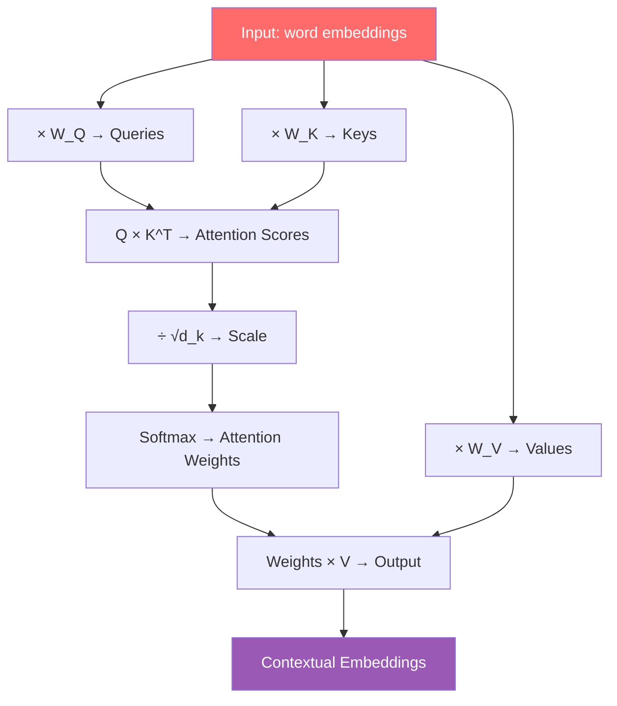

# Attention Mechanism এর ইনটুইশন

চলো একটা সহজ প্রশ্ন দিয়ে শুরু করি। নিচের বাক্য দুটো পড়ো:

> ১. "I sat by the **river bank** and watched the water flow."
> ২. "I went to the **bank** to deposit some money."

দুটো বাক্যেই **"bank"** শব্দটা আছে। কিন্তু প্রথম বাক্যে মানে **নদীর পাড়**, দ্বিতীয় বাক্যে মানে **আর্থিক প্রতিষ্ঠান**। তুমি কীভাবে বুঝলে কোনটা কোন অর্থে ব্যবহৃত হয়েছে?

**Context** থেকে! "river" আর "water" দেখেই তুমি বুঝেছো প্রথমটা নদীর পাড়। "deposit" আর "money" দেখে বুঝেছো দ্বিতীয়টা আর্থিক প্রতিষ্ঠান।

এই — ঠিক এই কাজটাই attention mechanism করে। একটা word এর চারপাশের word গুলো দেখে তার সঠিক অর্থ বের করে। এই chapter এ আমরা এটাই গভীরভাবে বুঝবো — 3Blue1Brown এর মতো, intuition থেকে।

---

## সমস্যা: Word2Vec একটা Word কে একটাই Vector দেয়

**word2vec** বা **GloVe** এর আগে আমরা শিখেছিলাম — প্রতিটা word কে একটা fixed vector দিয়ে represent করা যায়। যেমন:

```
"bank" → [0.2, -0.5, 0.8, ...]  # একটাই vector

"river" → [0.9, 0.1, -0.3, ...]
"money" → [-0.2, 0.7, 0.5, ...]
```

সমস্যা হলো — "bank" এর জন্য **একটাই** vector। কিন্তু আমরা জানি, "bank" এর অর্থ context এর উপর নির্ভর করে!

```
PROBLEM:

  "river bank"     →  bank = [0.2, -0.5, 0.8]  ──┐
                                                  │  একই vector!
  "bank account"   →  bank = [0.2, -0.5, 0.8]  ──┘
                                                  কিন্তু অর্থ আলাদা!
```

এটা ভুল! "bank" word টা যখন "river" এর পাশে আছে, তখন তার vector তে "water/nature" এর অর্থ থাকা উচিত। আর যখন "money" এর পাশে আছে, তখন "finance" এর অর্থ থাকা উচিত।

> [!important] এটাই Attention এর কাজ
> Attention mechanism প্রতিটা word এর vector কে তার context অনুযায়ী **update** করে। "bank" এর vector, "river" দেখে একরকম হবে, "money" দেখে আরেক রকম। একে **contextual embedding** বলে।

---

## Solution: Contextualize করো Attention দিয়ে

আইডিয়াটা সহজ — প্রতিটা word তার চারপাশের সব word এর দিকে তাকাবে, আর নিজের vector কে সেই অনুযায়ী update করবে।

```
SENTENCE: "The cat sat on the mat"

WITHOUT ATTENTION (static embedding):
  The  → [0.1, 0.3, ...]   # fixed
  cat  → [0.5, -0.2, ...]  # fixed
  sat  → [0.0, 0.8, ...]   # fixed

WITH ATTENTION (contextual embedding):
  The  → [0.1, 0.3, ...] ←── "cat" আর "mat" দেখে update হয়েছে
  cat  → [0.6, -0.1, ...] ←── "sat" আর "mat" দেখে update হয়েছে
  sat  → [0.2, 0.7, ...] ←── "cat" দেখে update হয়েছে
```

কিন্তু কীভাবে? কোন word গুলোর দিকে কতটা "তাকাবে"? এখানেই আসে **Query, Key, Value**।

---

## Library Analogy — Query, Key, Value

ধরো তুমি library তে গেলে। কী করো?

```
তুমি:    "আমি বাংলা কবিতার বই খুঁজছি"     ← এটা তোমার QUERY
           (কী চাই সেটা জানাও)

library: প্রতিটা বইয়ের গায়ে label আছে      ← এগুলো KEY
           "বিজ্ঞান", "কবিতা", "ইতিহাস"
           (প্রতিটা বইয়ের সাথে কী আছে)

match:   তোমার query "কবিতা" আর
           "কবিতা" label এর বই match করে     ← ATTENTION SCORE

result:  সেই বইয়ের ভেতরের content          ← VALUE
           (আসল যেটা পড়বে)
```

একইভাবে, Transformer এ প্রতিটা word তিনটা জিনিস বানায়:

```
প্রতিটা WORD এর জন্য:

┌──────────────────────────────────────────────┐
│  "cat"                                       │
│                                              │
│  QUERY:  "আমি এমন কিছু খুঁজছি যেটা বসতে পারে" │
│  KEY:    "আমি একটা প্রাণী, চার পায়ের"       │
│  VALUE:  "আমার মূল অর্থ হলো একটা ছোট প্রাণী"  │
└──────────────────────────────────────────────┘
```

---

## Concrete Example: "The cat sat on it because it was tired"

এই বাক্যটা দিয়ে সব পরিষ্কার হয়ে যাবে।

```
The   cat   sat   on   it   because   it   was   tired
 0     1     2     3    4       5       6     7      8
```

এখানে দুটো "it" আছে — position 4 আর position 6। প্রশ্ন হলো:
- Position 4 এর "it" কাকে নির্দেশ করছে? — **cat**
- Position 6 এর "it" কাকে নির্দেশ করছে? — **cat** (tired তো প্রাণী হবে, on না)

attention mechanism এটাই বের করে! চলো দেখি কীভাবে।

### Attention Heatmap

```
                    ──── KEY WORDS ────
              The    cat   sat   on    it    because  it    was   tired
           ┌──────┬──────┬─────┬─────┬─────┬───────┬─────┬─────┬──────┐
  Q cat    │ 0.05 │  ─   │ 0.3 │0.05 │ 0.1 │  0.05 │ 0.1 │0.05 │ 0.3  │
  Q sat    │ 0.02 │ 0.6  │  ─  │0.1  │ 0.05│  0.03 │0.05 │0.05 │ 0.1  │
Q it(4)    │ 0.02 │ 0.8  │0.05 │0.03 │  ─  │  0.02 │0.03 │0.02 │ 0.03 │  ◄── "it" cat এর দিকে 80%!
Q it(6)    │ 0.01 │ 0.7  │0.02 │0.02 │0.05 │  0.02 │  ─  │0.05 │ 0.13 │  ◄── "it" আবার cat + tired!
           └──────┴──────┴─────┴─────┴─────┴───────┴─────┴─────┴──────┘

  বেশি গাঢ় = বেশি attention score
```

খেয়াল করো — position 4 এর "it", "cat" (position 1) এর দিকে **৮০%** attention দিচ্ছে! বাকিগুলোতে অল্প অল্প। এর মানে model বুঝেছে — "it" মানে cat।

> [!note] এটাই Attention!
> এই heatmap টাই attention। প্রতিটা word, প্রতিটা অন্য word এর দিকে কতটা তাকাবে — সেটাই attention weight। বেশি weight মানে বেশি related।

---

## Query, Key, Value — Step by Step

এবার চলো পুরো process টা step by step দেখি। এটাই attention এর হৃদপিণ্ড।

### Step 1: প্রতিটা word এর Query বানাও

প্রতিটা word তার embedding কে একটা weight matrix দিয়ে গুণ করে Query বানায়। Query হলো — "আমি কী খুঁজছি?"

```
word embedding × W_query = Query

  "cat"  [0.5, -0.2]   [W_q]   =  [0.3, 0.8]  "আমি কিছু খুঁজছি"
  "sat"  [0.0, 0.8]   × [W_q]  =  [0.1, 0.6]  "আমি কিছু খুঁজছি"
  "it"   [0.3, 0.1]     [W_q]   =  [0.7, 0.2]  "আমি কিছু খুঁজছি"
```

### Step 2: প্রতিটা word এর Key বানাও

একইভাবে, আরেকটা weight matrix দিয়ে Key বানায়। Key হলো — "আমার কাছে কী আছে।"

```
word embedding × W_key = Key

  "cat"  [0.5, -0.2]   [W_k]   =  [0.4, 0.1]  "আমি একটা প্রাণী"
  "sat"  [0.0, 0.8]   × [W_k]  =  [0.9, 0.3]  "আমি একটা action"
  "it"   [0.3, 0.1]     [W_k]   =  [0.2, 0.5]  "আমি একটা pronoun"
```

### Step 3: প্রতিটা word এর Value বানাও

আরেকটা weight matrix দিয়ে Value বানায়। Value হলো — "আমার আসল অর্থ।"

```
word embedding × W_value = Value

  "cat"  [0.5, -0.2]   [W_v]   =  [0.6, 0.3]  "ছোট লোমশ প্রাণী"
  "sat"  [0.0, 0.8]   × [W_v]  =  [0.1, 0.7]  "বসার action"
  "it"   [0.3, 0.1]     [W_v]   =  [0.3, 0.2]  "pronoun অর্থ"
```

> [!important] W_query, W_key, W_value
> এই তিনটা weight matrix ই হলো model এর **learnable parameters**। Training এর সময় model এগুলো শেখে — কীভাবে ভালো query, key, value বানাতে হয়। এটাই attention এর জাদুর উৎস।

### Step 4: Query আর Key match করো — Attention Score

এবার মূল কাজ। প্রতিটা word এর Query, সব word এর Key এর সাথে dot product করো। বেশি score = বেশি related।

```
               "cat" Key   "sat" Key   "it" Key
              [0.4, 0.1]   [0.9, 0.3]  [0.2, 0.5]

"cat" Query   0.3×0.4+    0.3×0.9+    0.3×0.2+
[0.3, 0.8]    0.8×0.1      0.8×0.3     0.8×0.5
              = 0.20       = 0.51      = 0.46

"sat" Query   0.1×0.4+    0.1×0.9+    0.1×0.2+
[0.1, 0.6]    0.6×0.1      0.6×0.3     0.6×0.5
              = 0.10       = 0.27      = 0.32

"it" Query    0.7×0.4+    0.7×0.9+    0.7×0.2+
[0.7, 0.2]    0.2×0.1      0.2×0.3     0.2×0.5
              = 0.30       = 0.69      = 0.24

         Score Matrix:
              cat    sat    it
         cat [ 0.20   0.51   0.46 ]
         sat [ 0.10   0.27   0.32 ]
         it  [ 0.30   0.69   0.24 ]
```

### Step 5: Softmax — Score গুলো Probability তে

Raw score গুলো কে softmax করে probability distribution বানাও। প্রতিটা row এর sum হবে 1।

```
         Score Matrix:           Softmax (প্রতি row):

         cat    sat    it         cat    sat    it
  cat [ 0.20   0.51   0.46 ] → [ 0.27   0.37   0.36 ]
  sat [ 0.10   0.27   0.32 ] → [ 0.27   0.35   0.38 ]
  it  [ 0.30   0.69   0.24 ] → [ 0.28   0.42   0.30 ]

  প্রতিটা row এর sum = 1.00
  বেশি score → বেশি probability
```

### Step 6: Value গুলোর Weighted Sum → Contextual Output

শেষ ধাপ — attention weight গুলো দিয়ে Value গুলোর weighted sum করো। এটাই contextual representation।

```
  "cat" এর নতুন representation:
  = 0.27 × Value(cat) + 0.37 × Value(sat) + 0.36 × Value(it)
  = 0.27 × [0.6,0.3] + 0.37 × [0.1,0.7] + 0.36 × [0.3,0.2]
  = [0.162,0.081] + [0.037,0.259] + [0.108,0.072]
  = [0.307, 0.412]

  ← এটাই "cat" এর contextual embedding!
    "sat" আর "it" এর অর্থ মিশে গেছে এই vector এ
```

> [!important] সব মিলিয়ে
> এই ৬ টা step ই হলো attention। প্রতিটা word এর জন্য এই পুরো process টা হয় — সব একসাথে (parallel)। শেষে প্রতিটা word এর একটা contextual representation পাওয়া যায় যেখানে চারপাশের word গুলোর অর্থ মিশে আছে।

---

## পুরো Process এক ছকে



| Step | কী করে | Formula |
|------|---------|---------|
| 1. Query | "আমি কী খুঁজছি" | Q = X × W_Q |
| 2. Key | "আমার কাছে কী আছে" | K = X × W_K |
| 3. Value | "আমার আসল অর্থ" | V = X × W_V |
| 4. Score | Query-Key match | S = Q × K^T |
| 5. Scale | Stable training | S = S / √d_k |
| 6. Softmax | Probability | A = softmax(S) |
| 7. Output | Weighted Value | Out = A × V |

---

## Code: Attention এর পুরো Implementation

এই কোডটা একটা complete (simplified) attention implementation। প্রতিটা step মিলিয়ে দেখো।

নিচের কোডে আমরা একটা sentence এর জন্য পুরো attention process implement করবো। উপরের step গুলো এক এক করে কোডে দেখবো।

```python
import torch
import torch.nn.functional as F
import math

def attention(x, W_Q, W_K, W_V):
    """
    x:      (seq_len, d_model)   — input embeddings
    W_Q:    (d_model, d_k)       — Query weight matrix
    W_K:    (d_model, d_k)       — Key weight matrix
    W_V:    (d_model, d_v)       — Value weight matrix
    """
    # Step 1-3: Query, Key, Value বানাও
    Q = x @ W_Q   # (seq_len, d_k) — প্রতিটা word এর query
    K = x @ W_K   # (seq_len, d_k) — প্রতিটা word এর key
    V = x @ W_V   # (seq_len, d_v) — প্রতিটা word এর value

    # Step 4: Query আর Key এর dot product → attention scores
    scores = Q @ K.transpose(0, 1)  # (seq_len, seq_len)

    # Step 5: scale করো (gradient stable রাখার জন্য)
    d_k = K.shape[1]
    scores = scores / math.sqrt(d_k)

    # Step 6: softmax → attention weights (probability)
    weights = F.softmax(scores, dim=-1)  # (seq_len, seq_len)

    # Step 7: Value গুলোর weighted sum → contextual output
    output = weights @ V  # (seq_len, d_v)

    return output, weights

# --- চলো টেস্ট করি ---
torch.manual_seed(42)

seq_len = 4       # ৪ টা word
d_model = 8       # embedding dimension
d_k = 4           # query/key dimension
d_v = 4           # value dimension

# ভাবো বাক্য: "The cat sat on mat" (4 words ধরলাম)
x = torch.randn(seq_len, d_model)

# Weight matrix গুলো (আসলে training এ শেখে)
W_Q = torch.randn(d_model, d_k)
W_K = torch.randn(d_model, d_k)
W_V = torch.randn(d_model, d_v)

# Attention চালাও
output, weights = attention(x, W_Q, W_K, W_V)

print(f"Input shape:        {x.shape}")
print(f"Output shape:       {output.shape}")
print(f"Attention weights:  {weights.shape}")
print(f"\nAttention weight matrix (row=query, col=key):")
print(weights.round(decimals=2))
```

কোডের ব্যাখ্যা:
- `Q = x @ W_Q` — প্রতিটা word এর embedding কে W_Q দিয়ে গুণ করে query বানানো হলো
- `scores = Q @ K.transpose(0, 1)` — প্রতিটা query প্রতিটা key এর সাথে dot product করলো
- `scores / math.sqrt(d_k)` — scaling করা হলো যাতে training stable থাকে
- `F.softmax(scores, dim=-1)` — raw score গুলো probability তে পরিণত হলো
- `weights @ V` — attention probability গুলো দিয়ে value গুলোর weighted sum হলো
- ফলাফল — প্রতিটা word এর নতুন contextual representation!

> [!note] Scale কেন দরকার?
> বড় dimension এ dot product অনেক বড় হয়ে যেতে পারে। Softmax তখন extreme value তে চলে যায় — একটাই 1, বাকি সব 0। এতে gradient ছোট হয়ে যায়, training থেমে যায়। Scale করলে এটা ঠিক থাকে।

---

## Multi-Head Attention — এক সাথে অনেক perspective

একটু এগিয়ে যাই। আসল Transformer এ একটা attention না — একসাথে অনেকগুলো attention চলে। একে **Multi-Head Attention** বলে।

ভাবো — একটা sentence তে অনেক ধরনের relationship থাকতে পারে:

```
"The cat sat on the mat because it was soft"

Head 1 (grammar):   "sat" → "cat" (subject-verb)
Head 2 (reference): "it"  → "mat" (pronoun reference)
Head 3 (property):  "soft"→ "mat" (attribute)
Head 4 (cause):     "because" → "sat" (causality)
```

প্রতিটা head আলাদা W_Q, W_K, W_V শেখে — আলাদা ধরনের relationship বোঝে। সব head এর output জোড়া লাগিয়ে final output বানানো হয়।

```
                    ┌── Head 1: "grammar" attention
                    ├── Head 2: "reference" attention
Input ──────────────┼── Head 3: "property" attention
                    └── Head 4: "causality" attention
                              │
                    ┌─────────┴─────────┐
                    │  Concat + Linear  │
                    └─────────┬─────────┘
                              │
                              ▼
                       Final Output
```

> [!important] এটাই GPT আর BERT এর হৃদপিণ্ড
> GPT-4 তে ৯৬ টা attention head আছে প্রতিটা layer এ! BERT তে ১২ টা। প্রতিটা head আলাদা pattern শেখে। সব মিলে ভাষা বোঝার এক অবিশ্বাস্য ক্ষমতা তৈরি হয়।

---

## সারসংক্ষেপ

এই chapter এ আমরা যা শিখলাম:

1. **সমস্যা** — word2vec একটা word কে একটাই fixed vector দেয়, কিন্তু word এর অর্থ context এর উপর নির্ভর করে
2. **সমাধান** — attention প্রতিটা word কে তার context অনুযায়ী update করে — contextual embedding
3. **Library analogy** — Query (কী চাই), Key (কী আছে), Value (আসল অর্থ)
4. **৬ টা step**:
   - প্রতিটা word Query, Key, Value বানায়
   - Query আর Key match → attention score
   - Scale করো
   - Softmax → probability
   - Value গুলোর weighted sum → contextual output
5. **Multi-Head Attention** — একসাথে অনেক head, প্রতিটা আলাদা relationship শেখে
6. **এটাই সব LLM এর ভিত্তি** — GPT, BERT, Gemini, Claude — সবার ভেতরে একই attention mechanism

> [!important] মনে রাখো
> এই chapter এ যা শিখলে সেটাই transformer এর ৯০%। Encoder, Decoder, positional encoding, layer norm — এগুলো সব attention এর উপর বানানো extra structure। আসল জাদু attention এ।

> [!note] এই series এর অন্যান্য chapter
> - [Transformer কী ও কেন বিপ্লব](./intro.md) — শুরু থেকে পড়লে ভালো হবে
> - [Pre-Transformer: Seq2Seq ও RNN এর সীমাবদ্ধতা](./seq2seq-evolution.md) — bottleneck problem আর attention এর জন্ম
> - আরও chapter আসছে — Transformer architecture, training, আর আরও গভীরভাবে!