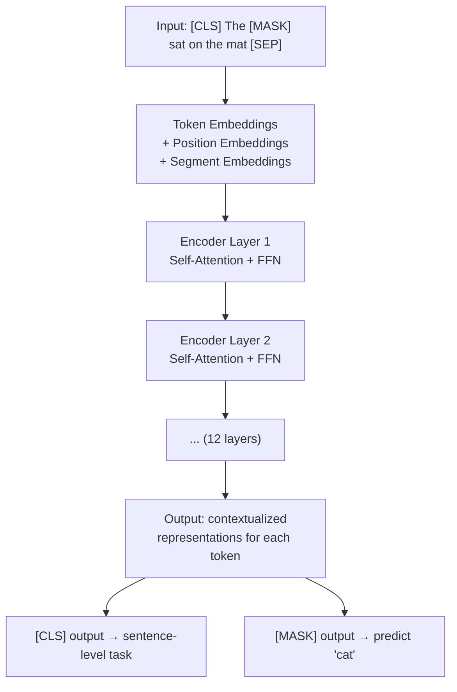
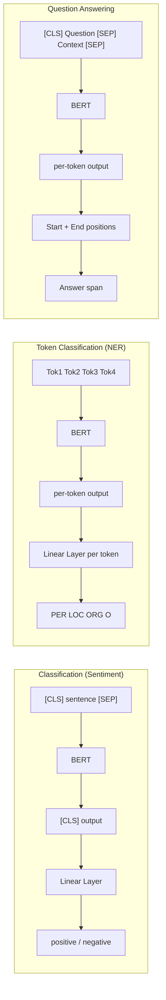
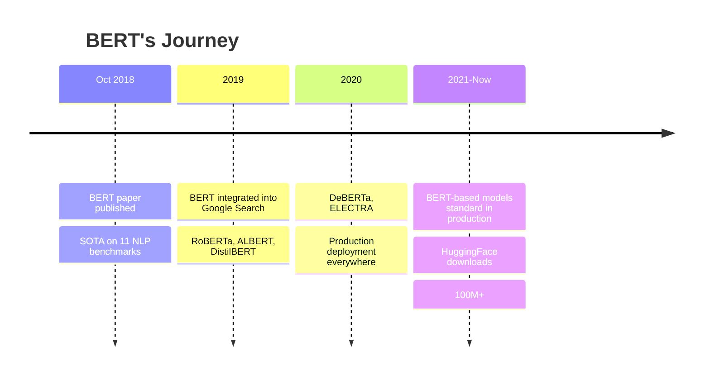

# BERT and Encoder-only Models

Have you ever wondered — how does Google Search understand your query so perfectly? Or how does Gmail detect spam emails? A huge contribution behind this is **BERT**. Google released BERT in 2018 — and the world of NLP (Natural Language Processing) changed forever.

In this chapter we'll understand — what BERT actually is, how it works, and why it's so important. Let's get started!

## What Is BERT?

BERT = **Bidirectional Encoder Representations from Transformers**. The name is a bit long, but the idea is simple.

The original Transformer architecture had two parts — **Encoder** and **Decoder**. The Encoder's job is to understand language, the Decoder's job is to generate language. BERT works only with the **Encoder** part. That's why it's called an **encoder-only** model.

```
┌───────────────────────────────────────────────┐
│           Original Transformer                 │
│                                                │
│   ┌─────────┐         ┌─────────┐              │
│   │ Encoder │ ──────→ │ Decoder │ ──→ Output   │
│   │(understand)│       │(generate)│              │
│   └─────────┘         └─────────┘              │
│                                                │
│        BERT = only the Encoder part            │
│        GPT  = only the Decoder part            │
└───────────────────────────────────────────────┘
```

> [!note] What does "Bidirectional" mean?
> Earlier models (like GPT) only read from left to right — to understand a word, they only looked at the words before it. But BERT reads from **both directions** — to understand a word, it looks at all the words before and after it. That's "Bidirectional."

## Key Insight: Understanding Language Deeply

Let's understand with an example. Take this sentence:

> "I went to the **bank** to deposit money."

The word "bank" can mean two things — a river bank or a money bank. But seeing "deposit money" we understand — it's a money bank.

Now how does BERT understand this? Because when BERT tries to understand the word "bank," it also looks at the words to its **right** — "to deposit money." On the other hand, GPT (decoder-only) only looks at the words to the left — "I went to the" — so it gets less context.

```
Sentence: "I went to the [MASK] to deposit money"

              GPT (left-to-right only):
              I → went → to → the → [MASK]
              ←←←←←←←←←←←←←←←←←←←
              only gets left context

              BERT (bidirectional):
              I → went → to → the → [MASK] → to → deposit → money
              ←←←←←←←←←←←←←←←←←←←→→→→→→→→→→→
              gets context from both directions! ✅
```

> [!important] The Power of Bidirectional
> For understanding language, context is the most important thing. The word "bank" alone doesn't mean much — only when paired with "deposit money" or "river side" does its meaning become clear. BERT sees context from both directions at once — that's why it's extraordinary at understanding language.

## Two Pre-training Tasks

How was BERT taught? Google trained BERT with two tasks — let's understand both.

### Task 1: Masked Language Modeling (MLM)

This is a fun game! Some words are hidden from a sentence — and BERT is told to predict those words. Just like fill-in-the-blanks!

```
┌─────────────────────────────────────────────────────────┐
│                  Masked Language Modeling                 │
│                                                          │
│  Original: "The cat sat on the mat because it was warm"  │
│                                                          │
│  Masked:   "The [MASK] sat on the [MASK] because it      │
│             was warm"                                    │
│                                                          │
│  Tell BERT: What was in the [MASK] positions?            │
│                                                          │
│  BERT:     [MASK] → "cat"  (confidence: 0.92)            │
│            [MASK] → "mat"  (confidence: 0.87)            │
│                                                          │
│  ✅ Correct! Because BERT sees context from both sides   │
└─────────────────────────────────────────────────────────┘
```

Only 15% of tokens are masked. Why 15%? Because masking too many ruins the sentence structure, and masking too few means the model learns nothing.

> [!note] The inner workings of 15% masking
> Within that 15%:
> - **80%** are replaced with `[MASK]`
> - **10%** are replaced with random words
> - **10%** are kept unchanged
>
> This mixture makes the model more robust — it's forced to learn good representations for all tokens, not just the `[MASK]` token.

### Task 2: Next Sentence Prediction (NSP)

This task is — two sentences are given, BERT has to tell whether they come consecutively or are random.

```
Sentence A: "The cat sat on the mat."
Sentence B: "It was very comfortable."

→ ✅ IsNext (they follow each other)

Sentence A: "The cat sat on the mat."
Sentence B: "The stock market crashed today."

→ ❌ NotNext (they don't follow)
```

This task helps BERT understand sentence-level relationships — useful in tasks like QA or natural language inference.

> [!note] RoBERTa and NSP
> Later researchers found that the NSP task wasn't actually that useful. RoBERTa (Facebook's improved version) dropped NSP and trained only with MLM — and performance was even better!

## Special Tokens

BERT uses some special tokens that have specific jobs:

```
┌──────────┬──────────────────────────────────────────────┐
│  Token   │  Job                                          │
├──────────┼──────────────────────────────────────────────┤
│ [CLS]    │ At the start of sentence — for classification │
│ [SEP]    │ Separator between two sentences               │
│ [MASK]   │ For hidden words in MLM                       │
│ [PAD]    │ For padding short sentences                   │
│ [UNK]    │ For unknown words not in vocabulary           │
└──────────┴──────────────────────────────────────────────┘
```

When a sentence is given as input to BERT, it looks like this:

```
Input:  [CLS] The cat sat on the mat [SEP] It was warm [SEP]
         ↓     ↓   ↓   ↓   ↓  ↓   ↓   ↓    ↓   ↓   ↓    ↓
         ↑     └──────── sentence 1 ───────┘  └─ sentence 2 ─┘
         │
    [CLS] token's output is used for classification
```

> [!important] Why Is [CLS] Needed?
> All of BERT's outputs are per-token. But many tasks need one output for the entire sentence (like sentiment analysis). The `[CLS]` token sits at the beginning of the sentence — and through self-attention, information from the entire sentence aggregates there. That's why the `[CLS]` token's output is used for classification tasks.

## Visual: How BERT Works

Let's see what happens inside BERT when a sentence is given:



In BERT, three types of embeddings are added for each token:

```
   Token Embedding     Position Embedding     Segment Embedding
   ┌───────────┐        ┌───────────┐          ┌───────────┐
   │ [CLS] → E1│        │ pos 0 → P1│          │ sent A → S1│
   │ The  → E2 │   +    │ pos 1 → P2│    +     │ sent A → S1│
   │ [MASK]→E3 │        │ pos 2 → P3│          │ sent A → S1│
   │ ...       │        │ ...       │          │ ...       │
   └───────────┘        └───────────┘          └───────────┘
                                    ↓
                        Final Input Embeddings
                        (adding all three)
```

> [!note] Why Segment Embedding?
> In the NSP task there are two sentences. BERT needs to know which token belongs to which sentence — that's what Segment Embedding is for. All tokens of Sentence A get one segment ID, Sentence B gets another.

## BERT Variants — The Whole Family

After BERT, many tried to improve it. Let's meet everyone:

| Model | Year | Organization | Key Difference | Params |
|-------|------|---------------|------------|--------|
| **BERT-base** | 2018 | Google | Original BERT | 110M |
| **BERT-large** | 2018 | Google | Bigger version | 340M |
| **RoBERTa** | 2019 | Facebook | No NSP, more data, dynamic masking | 355M |
| **ALBERT** | 2019 | Google | Parameter sharing, smaller model | 12M |
| **DeBERTa** | 2020 | Microsoft | Disentangled attention, better encoding | 400M |
| **DistilBERT** | 2019 | HuggingFace | Knowledge distillation, 60% smaller | 66M |

> [!important] Which one to use?
> - **General purpose**: RoBERTa or DeBERTa are the best
> - **Fast inference**: DistilBERT (60% smaller, 95% performance)
> - **Limited resource**: ALBERT (very small but powerful)
> - **Production**: DeBERTa (best accuracy, but large)

## Fine-tuning: Putting BERT to Work for Your Task

BERT was pre-trained on the entire Wikipedia + BookCorpus data. Now it understands language. But for your specific task (like sentiment analysis) it needs to be taught a bit more — this is **fine-tuning**.

```
┌──────────────────────────────────────────────────────┐
│                  Fine-tuning Process                   │
│                                                       │
│  Pre-trained BERT        +    Task-specific Head       │
│  (understands language)          ↓                     │
│                          Fine-tune                     │
│                               ↓                        │
│                     ┌─────────────────┐                │
│                     │ Classification  │                │
│                     │ NER             │                │
│                     │ QA              │                │
│                     └─────────────────┘                │
└──────────────────────────────────────────────────────┘
```

### Common Tasks and How They're Solved



| Task | What It Does | Output | How |
|------|--------|--------|--------|
| **Classification** | Sentiment, spam, topic detection | Sentence-level label | `[CLS]` output → Linear |
| **Token Classification** | NER, POS tagging | Per-token label | Each token output → Linear |
| **QA** | Question answering | Start + End position | Two linear layers |
| **Span Selection** | Extract answer from text | Text span | Start + End logits |

## Code: Fine-tuning BERT with HuggingFace

Now let's see some practical code. We'll fine-tune BERT for sentiment analysis using the HuggingFace Transformers library. Note — we'll use the `bert-base-uncased` model. "uncased" means all lowercase letters.

```python
from transformers import (
    AutoTokenizer,
    AutoModelForSequenceClassification,
    TrainingArguments,
    Trainer,
)
from datasets import load_dataset

# Step 1: Load tokenizer and model
model_name = "bert-base-uncased"
tokenizer = AutoTokenizer.from_pretrained(model_name)

# num_labels=2 because we're doing binary classification
# (positive / negative sentiment)
model = AutoModelForSequenceClassification.from_pretrained(
    model_name, num_labels=2
)

# Step 2: Prepare data (IMDB dataset as example)
dataset = load_dataset("imdb")

def tokenize_function(examples):
    return tokenizer(
        examples["text"],
        padding="max_length",
        truncation=True,
        max_length=256,
    )

tokenized_datasets = dataset.map(tokenize_function, batched=True)

# Step 3: Define training arguments
training_args = TrainingArguments(
    output_dir="./bert-sentiment",
    eval_strategy="epoch",
    learning_rate=2e-5,         # very small LR for BERT fine-tuning
    per_device_train_batch_size=16,
    per_device_eval_batch_size=64,
    num_train_epochs=3,         # usually 2-5 epochs is enough
    weight_decay=0.01,
    warmup_ratio=0.1,
)

# Step 4: Create Trainer and train
trainer = Trainer(
    model=model,
    args=training_args,
    train_dataset=tokenized_datasets["train"],
    eval_dataset=tokenized_datasets["test"],
)

trainer.train()
```

The code above shows BERT fine-tuning using HuggingFace's high-level API. Notice — `learning_rate=2e-5` is very small. Because BERT is already pre-trained — too high a learning rate will destroy everything it learned (catastrophic forgetting). With just 3 epochs, sentiment classification reaches 90%+ accuracy!

Now let's see how to do inference:

```python
import torch

# Predict a new sentence
text = "This movie was absolutely brilliant!"
inputs = tokenizer(text, return_tensors="pt", truncation=True, padding=True)

with torch.no_grad():
    logits = model(**inputs).logits

predicted_class = torch.argmax(logits, dim=1).item()
labels = ["negative", "positive"]
print(f"Sentiment: {labels[predicted_class]}")
# Output: Sentiment: positive
```

Here `torch.no_grad()` is used because during inference there's no need to calculate gradients — this saves both memory and time. `torch.argmax` finds the class with the highest probability.

> [!tip] Practical Tips
> 1. **batch_size**: Start with 16 or 32. If GPU memory is low, use gradient accumulation.
> 2. **max_length**: Start with 128 or 256. Using the full 512 takes a lot of memory.
> 3. **learning_rate**: Keep in the `2e-5` to `5e-5` range.
> 4. **epochs**: 2-5 epochs is usually enough for BERT fine-tuning. More can lead to overfitting.

## BERT's Impact

After BERT arrived in October 2018, a revolution happened in the NLP world:



> [!important] Why Is BERT Such a Big Deal?
> Before BERT, different NLP tasks needed different architectures — one for QA, another for NER. BERT made it possible to solve all tasks with one pre-trained model — just change the task-specific head. This "pre-train once, fine-tune for everything" paradigm was truly revolutionary.

## Encoder vs Decoder — When to Use Which?

| Feature | BERT (Encoder) | GPT (Decoder) |
|---------|---------------|---------------|
| **Direction** | Bidirectional | Left-to-right |
| **Best at** | Understanding | Generation |
| **Tasks** | Classification, QA, NER | Text generation, chat |
| **Masking** | Bidirectional attention | Causal (lower-triangular) |
| **Output** | Contextual embeddings | Next-token probabilities |
| **Inference** | One forward pass | Autoregressive (slow) |

> [!warn] Don't Use BERT for Text Generation
> BERT cannot generate — because it's bidirectional. For generation you need to go left to right. For that you need GPT or a decoder-only model. But for understanding language, BERT is the best!

So that's the full story of BERT! Remember the key things — **Encoder-only** (understands language), **MLM** (predict masked words), **Bidirectional** (context from both sides), and **Fine-tuning** (adapt to any task). BERT isn't just a model — it was a whole paradigm shift in NLP! 🚀