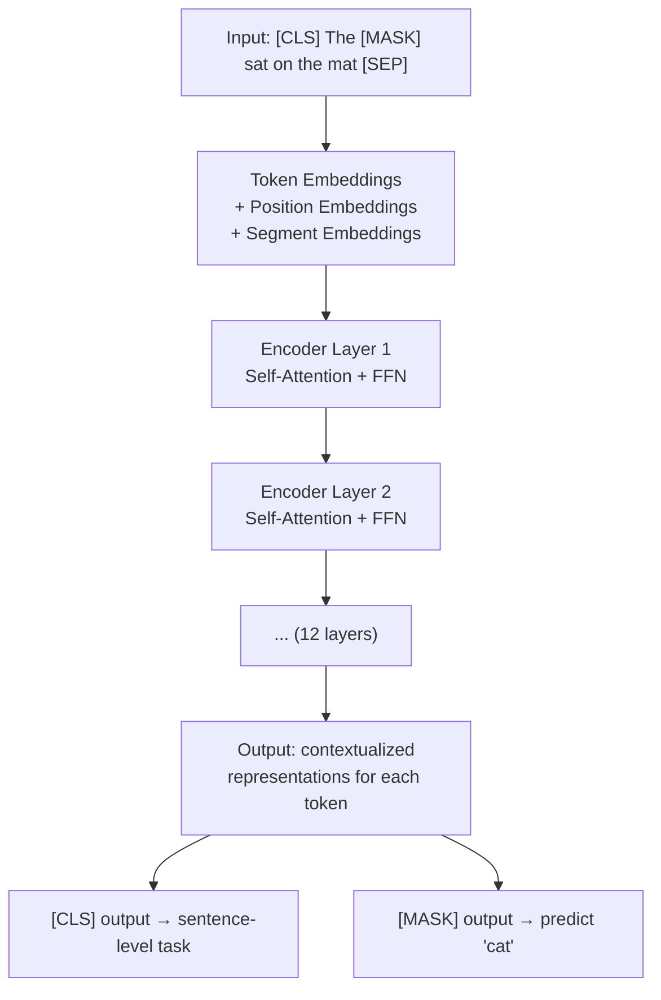
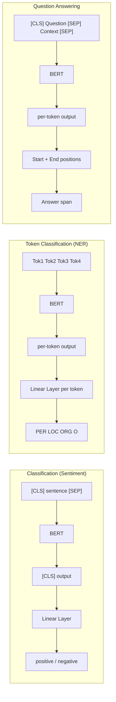
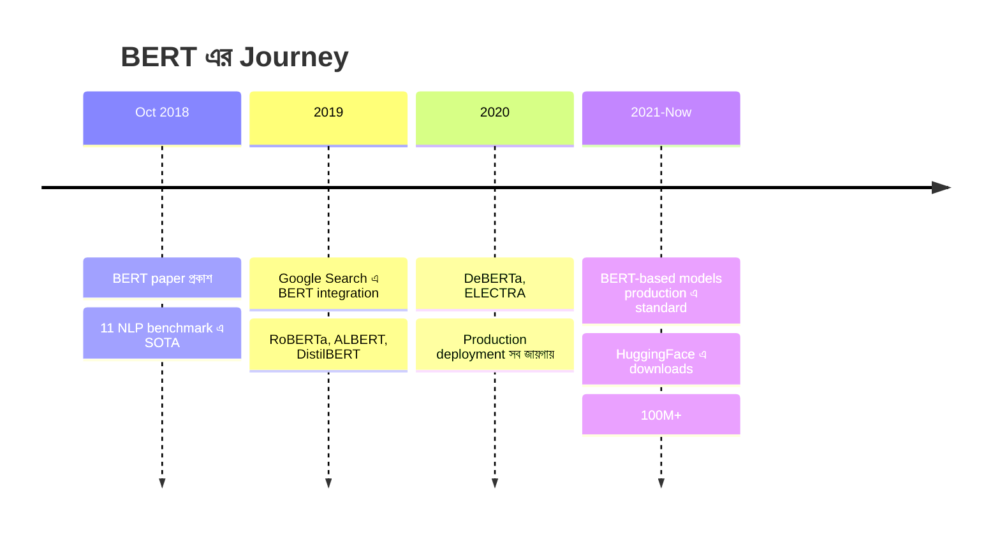

# BERT ও Encoder-only Models

তুমি কি কখনো ভেবেছ — Google Search কীভাবে তোমার প্রশ্ন এত নিখুঁত বোঝে? বা Gmail কীভাবে spam মেইল চিনে ফেলে? এর পেছনে একটা বিশাল অবদান হলো **BERT** এর। Google ২০১৮ সালে BERT প্রকাশ করে — আর NLP (Natural Language Processing) জগত পাল্টে যায়।

এই chapter এ আমরা বুঝবো — BERT আসলে কী, এটা কীভাবে কাজ করে, আর কেন এটা এত গুরুত্বপূর্ণ। চলো শুরু করি!

## BERT কী?

BERT = **Bidirectional Encoder Representations from Transformers**। নামটা একটু বড়, কিন্তু idea টা সহজ।

মূল Transformer architecture এ দুটা অংশ ছিল — **Encoder** আর **Decoder**। Encoder এর কাজ হলো ভাষা বোঝা, Decoder এর কাজ হলো ভাষা generate করা। BERT শুধু **Encoder** অংশটা নিয়ে কাজ করে। তাই একে **encoder-only** model বলা হয়।

```
┌───────────────────────────────────────────────┐
│           Original Transformer                 │
│                                                │
│   ┌─────────┐         ┌─────────┐              │
│   │ Encoder │ ──────→ │ Decoder │ ──→ Output   │
│   │ (বোঝা)   │         │ (লেখা)   │              │
│   └─────────┘         └─────────┘              │
│                                                │
│        BERT = শুধু Encoder অংশ                  │
│        GPT  = শুধু Decoder অংশ                  │
└───────────────────────────────────────────────┘
```

> [!note] Bidirectional কথাটার মানে কী?
> আগের মডেলগুলো (যেমন GPT) শুধু বাঁদিক থেকে ডানদিকে পড়ত — একটা word বুঝতে শুধু তার আগের word গুলো দেখত। কিন্তু BERT **দুইদিক থেকেই** পড়ে — একটা word কে বোঝার জন্য তার আগের আর পরের সব word দেখে। এটাই "Bidirectional"।

## Key Insight: ভাষা গভীরভাবে বোঝা

চলো একটা উদাহরণ দিয়ে বুঝি। ধরো এই sentence টা:

> "I went to the **bank** to deposit money."

"bank" কথাটার দুটো মানে হতে পারে — নদীর পাড় বা টাকার ব্যাংক। কিন্তু "deposit money" দেখে আমরা বুঝতে পারি — এটা টাকার ব্যাংক।

এখন BERT কীভাবে এটা বোঝে? কারণ BERT "bank" word টাকে বোঝার সময় **তার ডানদিকের** word গুলোও দেখে — "to deposit money"। অন্যদিকে GPT (decoder-only) শুধু বাঁদিকের word গুলো দেখে — "I went to the" — তাই context কম পায়।

```
Sentence: "I went to the [MASK] to deposit money"

              GPT (left-to-right only):
              I → went → to → the → [MASK]
              ←←←←←←←←←←←←←←←←←←←
              শুধু বাঁদিকের context পায়

              BERT (bidirectional):
              I → went → to → the → [MASK] → to → deposit → money
              ←←←←←←←←←←←←←←←←←←←→→→→→→→→→→→
              দুইদিকের context ই পায়! ✅
```

> [!important] Bidirectional এর শক্তি
> ভাষা বোঝার জন্য context সবচেয়ে গুরুত্বপূর্ণ। "bank" word টা নিজে তে কিছু বলে না — "deposit money" বা "river side" এর সাথে থাকলে তবেই মানে স্পষ্ট হয়। BERT এই দুইদিকের context ই একসাথে দেখে — তাই ভাষা বোঝায় অসাধারণ।

## দুটো Pre-training Task

BERT কে কীভাবে শেখানো হয়েছিল? Google BERT কে দুটো task দিয়ে train করেছিল — চলো দুটোই বুঝি।

### Task 1: Masked Language Modeling (MLM)

এটা একটা মজার game! একটা sentence থেকে কিছু word লুকিয়ে দেওয়া হয় — আর BERT কে বলা হয় সেই word গুলো predict করতে। ঠিক যেমন fill-in-the-blanks!

```
┌─────────────────────────────────────────────────────────┐
│                  Masked Language Modeling                 │
│                                                          │
│  Original: "The cat sat on the mat because it was warm"  │
│                                                          │
│  Masked:   "The [MASK] sat on the [MASK] because it      │
│             was warm"                                    │
│                                                          │
│  BERT কে বলো: [MASK] জায়গায় কী ছিল?                       │
│                                                          │
│  BERT:     [MASK] → "cat"  (confidence: 0.92)            │
│            [MASK] → "mat"  (confidence: 0.87)            │
│                                                          │
│  ✅ সঠিক! কারণ BERT দুইদিকের context দেখে                  │
└─────────────────────────────────────────────────────────┘
```

শুধু ১৫% token mask করা হয়। কেন ১৫%? কারণ খুব বেশি mask করলে sentence এর structure নষ্ট হয়ে যায়, আর খুব কম করলে মডেল কিছুই শেখে না।

> [!note] ১৫% mask করার ভেতরের হিসাব
> ওই ১৫% এর মধ্যে আবার:
> - **৮০%** কে `[MASK]` করা হয়
> - **১০%** কে random word দিয়ে replace করা হয়
> - **১০%** কে unchanged রাখা হয়
>
> এই মিশ্রণ মডেলকে আরো robust করে — শুধু `[MASK]` token এর জন্যই না, সব token এর জন্য good representation শিখতে বাধ্য করে।

### Task 2: Next Sentence Prediction (NSP)

এই task টা হলো — দুটো sentence দেওয়া হবে, BERT কে বলতে হবে এরা কি পরপর আছে না random?

```
Sentence A: "The cat sat on the mat."
Sentence B: "It was very comfortable."

→ ✅ IsNext (পরপর আছে)

Sentence A: "The cat sat on the mat."
Sentence B: "The stock market crashed today."

→ ❌ NotNext (পরপর নেই)
```

এই task BERT কে sentence-level relationship বুঝতে সাহায্য করে — যেমন QA, বা natural language inference তে দরকার হয়।

> [!note] RoBERTa আর NSP
> পরে গবেষকরা দেখলেন NSP task আসলে ততটা useful না। RoBERTa (Facebook এর improved version) NSP বাদ দিয়ে শুধু MLM দিয়ে train করল — আর performance আরো ভালো হলো!

## Special Tokens

BERT কিছু special token ব্যবহার করে যেগুলোর নির্দিষ্ট কাজ আছে:

```
┌──────────┬──────────────────────────────────────────────┐
│  Token   │  কাজ                                          │
├──────────┼──────────────────────────────────────────────┤
│ [CLS]    │ Sentence এর শুরুতে — classification এর জন্য    │
│ [SEP]    │ দুটো sentence এর মাঝে separator                │
│ [MASK]   │ MLM তে hidden word এর জন্য                     │
│ [PAD]    │ ছোট sentence কে বড় করার জন্য (padding)         │
│ [UNK]    │ vocabulary তে না থাকা unknown word এর জন্য      │
└──────────┴──────────────────────────────────────────────┘
```

একটা sentence BERT এ যখন input দেওয়া হয়, তখন এরকম দেখায়:

```
Input:  [CLS] The cat sat on the mat [SEP] It was warm [SEP]
         ↓     ↓   ↓   ↓   ↓  ↓   ↓   ↓    ↓   ↓   ↓    ↓
         ↑     └──────── sentence 1 ───────┘  └─ sentence 2 ─┘
         │
    [CLS] token এর output দিয়ে classification করা হয়
```

> [!important] [CLS] কেন দরকার?
> BERT এর সব output গুলো per-token। কিন্তু অনেক task এ পুরো sentence এর জন্য একটা output দরকার (যেমন sentiment analysis)। `[CLS]` token টা sentence এর শুরুতে থাকে — আর self-attention এর মাধ্যমে পুরো sentence এর information সেখানে aggregate হয়। তাই classification task এ `[CLS]` এর output ব্যবহার করা হয়।

## ভিজ্যুয়াল: BERT কীভাবে কাজ করে

চলো দেখি BERT এর ভেতরে কী হয় যখন একটা sentence দেওয়া হয়:



BERT এ প্রতিটা token এর তিন ধরনের embedding যোগ করা হয়:

```
   Token Embedding     Position Embedding     Segment Embedding
   ┌───────────┐        ┌───────────┐          ┌───────────┐
   │ [CLS] → E1│        │ pos 0 → P1│          │ sent A → S1│
   │ The  → E2 │   +    │ pos 1 → P2│    +     │ sent A → S1│
   │ [MASK]→E3 │        │ pos 2 → P3│          │ sent A → S1│
   │ ...       │        │ ...       │          │ ...       │
   └───────────┘        └───────────┘          └───────────┘
                                    ↓
                        Final Input Embeddings
                        (তিনটা যোগ করে)
```

> [!note] Segment Embedding কেন?
> NSP task এ দুটো sentence থাকে। BERT কে বোঝাতে হবে কোন token কোন sentence এর — সেজন্য Segment Embedding। Sentence A এর সব token একটা segment ID পায়, Sentence B আরেকটা।

## BERT Variants — পরিবারের সবাই

BERT এর পর অনেকেই এটাকে improve করার চেষ্টা করেছে। চলো পরিচিত হই সবার সাথে:

| Model | Year | কোন প্রতিষ্ঠান | মূল পার্থক্য | Params |
|-------|------|---------------|------------|--------|
| **BERT-base** | 2018 | Google | মূল BERT | 110M |
| **BERT-large** | 2018 | Google | বড় version | 340M |
| **RoBERTa** | 2019 | Facebook | NSP বাদ, বেশি data, dynamic masking | 355M |
| **ALBERT** | 2019 | Google | Parameter sharing, ছোট model | 12M |
| **DeBERTa** | 2020 | Microsoft | Disentangled attention, better encoding | 400M |
| **DistilBERT** | 2019 | HuggingFace | Knowledge distillation, ৬০% ছোট | 66M |

> [!important] কোনটা ব্যবহার করব?
> - **General purpose**: RoBERTa বা DeBERTa সবচেয়ে ভালো
> - **Fast inference**: DistilBERT (৬০% ছোট, ৯৫% performance)
> - **Limited resource**: ALBERT (খুব ছোট কিন্তু powerful)
> - **Production**: DeBERTa (best accuracy, তবে বড়)

## Fine-tuning: BERT কে তোমার কাজে লাগানো

BERT কে Wikipedia + BookCorpus এর পুরো ডেটায় pre-train করা হয়েছে। এখন সে ভাষা বোঝে। কিন্তু তোমার specific task (যেমন sentiment analysis) এর জন্য তাকে আরেকটু শেখাতে হবে — এটাই **fine-tuning**।

```
┌──────────────────────────────────────────────────────┐
│                  Fine-tuning Process                   │
│                                                       │
│  Pre-trained BERT        +    Task-specific Head       │
│  (ভাষা বোঝে)                    ↓                     │
│                          Fine-tune                     │
│                               ↓                        │
│                     ┌─────────────────┐                │
│                     │ Classification  │                │
│                     │ NER             │                │
│                     │ QA              │                │
│                     └─────────────────┘                │
└──────────────────────────────────────────────────────┘
```

### Common Tasks আর কীভাবে Solve হয়



| Task | কী করে | Output | কীভাবে |
|------|--------|--------|--------|
| **Classification** | Sentiment, spam, topic detection | Sentence-level label | `[CLS]` output → Linear |
| **Token Classification** | NER, POS tagging | Per-token label | Each token output → Linear |
| **QA** | Question answering | Start + End position | Two linear layers |
| **Span Selection** | Extract answer from text | Text span | Start + End logits |

## Code: HuggingFace দিয়ে BERT Fine-tune

এবার চলো একটা practical code দেখি। HuggingFace Transformers library ব্যবহার করে BERT কে sentiment analysis এর জন্য fine-tune করব। কোডের আগে বলে রাখি — আমরা `bert-base-uncased` model নিয়ে কাজ করব। "uncased" মানে সব ছোট হাতের অক্ষর।

```python
from transformers import (
    AutoTokenizer,
    AutoModelForSequenceClassification,
    TrainingArguments,
    Trainer,
)
from datasets import load_dataset

# Step 1: Tokenizer আর model load করো
model_name = "bert-base-uncased"
tokenizer = AutoTokenizer.from_pretrained(model_name)

# num_labels=2 কারণ আমরা binary classification করছি
# (positive / negative sentiment)
model = AutoModelForSequenceClassification.from_pretrained(
    model_name, num_labels=2
)

# Step 2: Data prepare করো (IMDB dataset উদাহরণ হিসেবে)
dataset = load_dataset("imdb")

def tokenize_function(examples):
    return tokenizer(
        examples["text"],
        padding="max_length",
        truncation=True,
        max_length=256,
    )

tokenized_datasets = dataset.map(tokenize_function, batched=True)

# Step 3: Training arguments define করো
training_args = TrainingArguments(
    output_dir="./bert-sentiment",
    eval_strategy="epoch",
    learning_rate=2e-5,         # BERT fine-tuning এ খুব ছোট LR
    per_device_train_batch_size=16,
    per_device_eval_batch_size=64,
    num_train_epochs=3,         # সাধারণত 2-5 epoch enough
    weight_decay=0.01,
    warmup_ratio=0.1,
)

# Step 4: Trainer বানাও আর train করো
trainer = Trainer(
    model=model,
    args=training_args,
    train_dataset=tokenized_datasets["train"],
    eval_dataset=tokenized_datasets["test"],
)

trainer.train()
```

উপরের কোডে HuggingFace এর high-level API ব্যবহার করে BERT fine-tuning দেখানো হয়েছে। খেয়াল করো — `learning_rate=2e-5` খুবই ছোট। কারণ BERT আগে থেকেই pre-trained — খুব বেশি LR দিলে সব শেখা জিনিস নষ্ট হয়ে যাবে (catastrophic forgetting)। মাত্র ৩টা epoch এ sentiment classification এ ৯০%+ accuracy আসে!

এবার দেখি inference কীভাবে করবে:

```python
import torch

# নতুন sentence predict করা
text = "This movie was absolutely brilliant!"
inputs = tokenizer(text, return_tensors="pt", truncation=True, padding=True)

with torch.no_grad():
    logits = model(**inputs).logits

predicted_class = torch.argmax(logits, dim=1).item()
labels = ["negative", "positive"]
print(f"Sentiment: {labels[predicted_class]}")
# Output: Sentiment: positive
```

এখানে `torch.no_grad()` ব্যবহার করা হয়েছে কারণ inference এর সময় gradient calculate করার দরকার নেই — এতে memory আর time দুটোই বাঁচে। `torch.argmax` দিয়ে সবচেয়ে বেশি probability এর class বের করা হয়।

> [!tip] Practical Tips
> 1. **batch_size**: ১৬ বা ৩২ দিয়ে শুরু করো। GPU memory কম হলে gradient accumulation ব্যবহার করো।
> 2. **max_length**: ১২৮ বা ২৫৬ দিয়ে শুরু করো। পুরো ৫১২ দিলে অনেক বেশি memory লাগে।
> 3. **learning_rate**: `2e-5` থেকে `5e-5` range এ রাখো।
> 4. **epochs**: BERT fine-tuning এ ২-৫ epoch সাধারণত enough। বেশি হলে overfitting।

## BERT এর Impact

BERT ২০১৮ এর অক্টোবরে আসার পর NLP জগতে একটা revolution হয়েছিল:



> [!important] কেন BERT এত বড় ব্যাপার?
> BERT এর আগে NLP task গুলোর জন্য আলাদা architecture লাগত — QA এর জন্য একটা, NER এর জন্য আরেকটা। BERT একটাই pre-trained model দিয়ে সব task solve করা গেল — শুধু task-specific head বদলালেই হলো। এই "pre-train once, fine-tune for everything" paradigm আসলেই revolutionary ছিল।

## Encoder vs Decoder — কখন কোনটা?

| Feature | BERT (Encoder) | GPT (Decoder) |
|---------|---------------|---------------|
| **Direction** | Bidirectional | Left-to-right |
| **Best at** | Understanding | Generation |
| **Tasks** | Classification, QA, NER | Text generation, chat |
| **Masking** | Bidirectional attention | Causal (lower-triangular) |
| **Output** | Contextual embeddings | Next-token probabilities |
| **Inference** | One forward pass | Autoregressive (slow) |

> [!warn] BERT কে text generate করতে দেবে না
> BERT generate করতে পারে না — কারণ এটা bidirectional। Generation এর জন্য তোমাকে বাঁদিক থেকে ডানদিকে যেতে হবে। সেটার জন্য GPT বা decoder-only model দরকার। কিন্তু ভাষা বোঝার কাজে BERT সেরা!

তো এটাই BERT এর পুরো story! মূল জিনিসগুলো মনে রাখো — **Encoder-only** (ভাষা বোঝে), **MLM** (masked word predict), **Bidirectional** (দুইদিক থেকে context), আর **Fine-tuning** (যেকোনো task এ adapt)। BERT শুধু একটা model না — এটা একটা whole paradigm shift ছিল NLP তে! 🚀