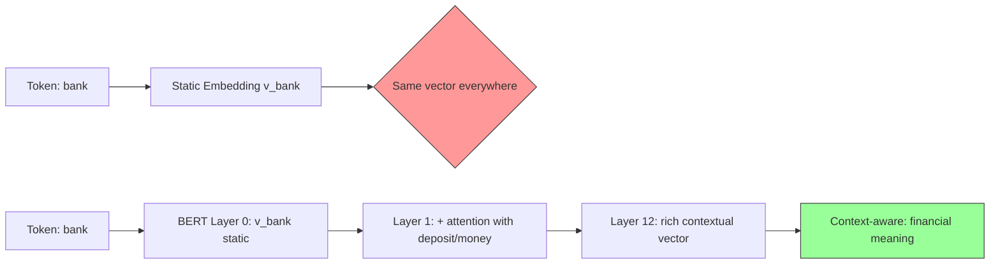
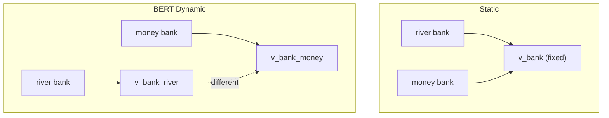

# Embeddings Deep Dive — Static থেকে Contextual পর্যন্ত

এই chapter টা একটু অন্যরকম। আজ আমরা শুধু "embedding কী" শিখবো না — আমরা দেখবো কীভাবে একটা শব্দের অর্থ গণিতের দুনিয়ায় একটা vector হয়ে যায়, আর কীভাবে সেই vector বাক্যের context বুঝে নিজেকে বদলে নেয়। গল্পটা word2vec থেকে শুরু করে BERT এর dynamic attention পর্যন্ত যাবে — আর প্রতিটা ধাপে গণিত আর intuition দুটোই থাকবে।

---

## আগে একটা প্রশ্ন — "অর্থ" কে কীভাবে সংখ্যায় মাপবো?

তুমি যদি কম্পিউটারকে বোঝাতে চাও "cat" আর "dog" কাছাকাছি শব্দ, কিন্তু "cat" আর "calculator" দূরে — তাহলে তোমাকে প্রতিটা শব্দকে একটা **সংখ্যার list** এ রূপান্তর করতে হবে। এই list টাই হলো **embedding** — একটা high-dimensional vector যেখানে অর্থের দিকগুলো (meaning aspects) বিভিন্ন dimension এ ছড়িয়ে আছে।

ভাবো একটা 300-dimensional space। প্রতিটা dimension হয়তো একটা কোনো abstract "feature" — "জীবন্ত কি না", "মানুষের তৈরি কি না", "আবেগ আছে কি না" — এই রকম। কিন্তু হ্যাঁ, এই dimension গুলো আসলে human-readable না। Model নিজে নিজে শিখে নেয় কোন dimension কী represent করবে।

> [!important] Embedding এর সংজ্ঞা
> একটা embedding হলো একটা vector $\mathbf{e} \in \mathbb{R}^d$, যেখানে $d$ হলো dimension (সাধারণত 50 থেকে 768 পর্যন্ত)। এই vector টা কোনো শব্দের অর্থকে এমনভাবে encode করে যে — অর্থে কাছাকাছি শব্দগুলোর vector ও space এ কাছাকাছি থাকে।

---

## Static Embeddings — word2vec

### মূল আইডিয়া: একটা শব্দের অর্থ হলো তার প্রতিবেশী

J.R. Firth ১৯৫৭ সালে বলেছিলেন: **"You shall know a word by the company it keeps."** — অর্থাৎ একটা শব্দ কোন শব্দের পাশে বসে, সেটা দেখলেই বোঝা যায় তার অর্থ কী।

word2vec (Mikolov et al., 2013) এই আইডিয়াটাকে গণিতে রূপ দিয়েছে। দুটো architecture আছে:

#### Skip-gram

Skip-gram এ কাজ হলো — মাঝের একটা শব্দ দিয়ে তার চারপাশের শব্দ গুলো predict করা।

```
  Sentence: "The cat sat on the mat"

  Center word = "sat", window = 2
  Context words = ["cat", "on", "the", "mat"]

  Input:  "sat"  →  Predict:  "cat", "on", "the", "mat"
```

Model এর কাজ হলো এমন একটা embedding matrix $W$ শেখা যেখানে — দেওয়া center word "sat" এর vector $\mathbf{v}_{sat}$ আর context word "cat" এর vector $\mathbf{v}_{cat}$ এর dot product বড় হয়।

গণিতটা এরকম — center word $w_c$ দেওয়া থাকলে context word $w_o$ আসার probability:

$$P(w_o \mid w_c) = \frac{\exp(\mathbf{v}_{w_o}^{\top} \mathbf{v}_{w_c})}{\sum_{w \in V} \exp(\mathbf{v}_w^{\top} \mathbf{v}_{w_c})}$$

training এ maximize করতে হয় পুরো corpus এর log-likelihood:

$$\mathcal{L} = \frac{1}{T} \sum_{t=1}^{T} \sum_{-c \le j \le c, j \ne 0} \log P(w_{t+j} \mid w_t)$$

এখানে $T$ হলো corpus এর মোট token সংখ্যা, $c$ হলো window size।

#### CBOW (Continuous Bag of Words)

CBOW ঠিক উল্টো — context শব্দগুলো দিয়ে center word predict করা।

```
  CBOW:  ["The", "cat", "on", "the", "mat"]  →  Predict: "sat"

  Input এ context শব্দগুলোর vector average করা হয়:
  h = (v_The + v_cat + v_on + v_the + v_mat) / 5

  তারপর h থেকে "sat" predict করা হয়।
```

> [!tip] কোনটা কখন ভালো?
> Skip-gram small dataset এ ভালো কাজ করে আর rare words এর জন্য বেশি effective। CBOW বড় dataset এ fast আর frequent words এর জন্য ভালো। মূল paper এ দেখা গেছে skip-gram সাধারণত একটু বেশি accurate কিন্তু ধীর।

---

### "king - man + woman ≈ queen" — কেন এটা কাজ করে?

এটা word2vec এর সবচেয়ে famous example। অনেকে এটা দেখে অবাক হয় — কিন্তু গণিতটা বুঝলে দেখবে এটা কোনো magic না।

গল্পটা এরকম — embedding space এ একটা নির্দিষ্ট direction "gender" কে represent করে। যেমন:

$$\mathbf{v}_{king} - \mathbf{v}_{man} \approx \text{(royalty direction)}$$

মানে "king" থেকে "man" বাদ দিলে যে vector টুকু থাকে, সেটা মূলত "রাজকীয়তা" বোঝায়। এবার সেটা "woman" এর সাথে যোগ করলে:

$$\mathbf{v}_{king} - \mathbf{v}_{man} + \mathbf{v}_{woman} \approx \mathbf{v}_{queen}$$

কেন এমন হয়? কারণ training এর সময় model দেখে — "king" আর "queen" প্রায় একই context এ আসে (palace, crown, kingdom), শুধু একটা পার্থক্য হলো gender। তাই gender dimension টা একটা স্বাধীন direction হিসেবে শেখে।

> [!note] গাণিতিকভাবে
> এটা কাজ করে কারণ embedding space এ semantic features গুলো প্রায় **linear** ভাবে organize হয়। অর্থাৎ "gender" বা "royalty" এর মতো abstract concept গুলো space এ একটা নির্দিষ্ট direction হিসেবে আলাদা হয়ে যায়। এটাকে বলে **linear algebraic structure** of embeddings।

---

### Vector Space Geometry — Cosine Similarity

দুটো শব্দ কতটা কাছাকাছি — সেটা মাপার জন্য dot product সরাসরি ব্যবহার করলে সমস্যা হয়। কারণ vector এর magnitude ও বড় হতে পারে। তাই আমরা **cosine similarity** ব্যবহার করি — দুটো vector এর মধ্যে angle টা মাপি।

$$\text{cos}(\mathbf{a}, \mathbf{b}) = \frac{\mathbf{a} \cdot \mathbf{b}}{\|\mathbf{a}\| \, \|\mathbf{b}\|}$$

- cosine = 1 → একই direction (একই অর্থ)
- cosine = 0 → perpendicular (কোনো সম্পর্ক নেই)
- cosine = -1 → উল্টো direction

কেন angle এর কথা ভাবছি? কারণ অর্থ নির্ভর করে vector এর **direction** এ, magnitude তে না। "cat" আর "cats" এর vector যদি একই direction এ থাকে শুধু magnitude আলাদা — তাহলেও তারা একই অর্থ বোঝায়।

> [!example] একটা সংখ্যাত্মক উদাহরণ
> ধরো 4-dim embedding (বাস্তবে 300-dim হয়, কিন্তু বোঝার সুবিধার জন্য ছোট):
>
> $$\mathbf{v}_{cat} = [0.8, 0.2, 0.1, 0.5], \quad \mathbf{v}_{dog} = [0.7, 0.3, 0.1, 0.4]$$
> $$\mathbf{v}_{car} = [0.1, 0.9, 0.8, 0.1]$$
>
> $\text{cos}(cat, dog) = \frac{0.56 + 0.06 + 0.01 + 0.20}{\sqrt{0.94} \cdot \sqrt{0.75}} \approx \frac{0.83}{0.84} \approx 0.99$
>
> $\text{cos}(cat, car) \approx 0.18$ — অনেক কম। অর্থাৎ cat আর dog কাছাকাছি, cat আর car দূরে। গণিত নিজে থেকেই অর্থ বুঝে ফেললো!

---

### Dimension কেন 300?

word2vec এর original paper এ dimension হিসেবে 300 ব্যবহার করা হয়েছে। কেন?

এটা একটা trade-off:

| Dimension | সুবিধা | সমস্যা |
|-----------|--------|--------|
| ছোট (50) | fast, কম memory | অর্থের fine distinction মিস করে |
| মাঝারি (300) | ভালো balance | — |
| বড় (1000+) | অনেক detail | overfitting, sparse data তে খারাপ |

> [!important] কেন 300?
> Empirically দেখা গেছে — 300 dimension এ বেশিরভাগ semantic relationship ভালোভাবে encode হয়, আর computation ও manageable থাকে। এটা কোনো theoretical magic number না — experiment করে বের করা একটা sweet spot। BERT এ এটা 768, GPT-2 তে 768/1280 — model বড় হলে dimension ও বাড়ে।

---

### GloVe — Co-occurrence Factorization

word2vec একটা **predictive** method — সে context predict করতে শেখে। GloVe (Pennington et al., 2014) একটু অন্য approach — **count-based**।

GloVe এর আইডিয়া: পুরো corpus এ কোন শব্দ কোন শব্দের সাথে কতবার একসাথে আসে — একটা **co-occurrence matrix** বানাও। তারপর সেই matrix কে factorize করো।

```
  Co-occurrence matrix (window=2):

           ice   steam  water  fire  ...
  ice       0    12     45      2
  steam    12     0     38     15
  water    45    38      0      5
  fire      2    15      5      0
  ...
```

GloVe এর core insight হলো — দুটো শব্দের co-occurrence ratio অর্থের একটা powerful signal। যেমন:

$$\frac{P(\text{solid} \mid \text{ice})}{P(\text{solid} \mid \text{steam})} \gg 1$$

কারণ "solid" বেশি "ice" এর সাথে আসে, "steam" এর সাথে না। কিন্তু "water" এর ক্ষেত্রে এই ratio প্রায় 1 — কারণ "water" দুটোর সাথেই আসে।

GloVe এর loss function:

$$J = \sum_{i,j=1}^{V} f(X_{ij}) \left( \mathbf{w}_i^\top \tilde{\mathbf{w}}_j + b_i + \tilde{b}_j - \log X_{ij} \right)^2$$

এখানে:
- $X_{ij}$ = co-occurrence count
- $\mathbf{w}_i, \tilde{\mathbf{w}}_j$ = দুটো embedding (center আর context)
- $b_i, \tilde{b}_j$ = bias
- $f(X_{ij})$ = weighting function (খুব বেশি বা খুব কম co-occurrence কে downweight করে)

> [!tip] word2vec vs GloVe
> word2vec local context window দেখে (predictive), GloVe পুরো corpus এর global statistics দেখে (count-based)। বাস্তবে দুটোর output embedding গুলো অনেকটা একই রকম quality এর আসে।

---

### THE KEY PROBLEM — "bank" এর দুটো অর্থ

Static embedding এ একটা বিশাল সমস্যা আছে। "bank" শব্দটা দুটো অর্থে ব্যবহার হয়:

1. "I sat by the river **bank**" — নদীর পাড়
2. "I deposited money in the **bank**" — ব্যাংক

কিন্তু static embedding এ "bank" এর জন্য **একটাই vector** থাকে। সে আলাদা করে বুঝতে পারে না কোন context এ কোন অর্থ।

```
  Sentence 1:  "I sat by the river bank"
                              ↑
                         vector = v_bank  (একটাই!)

  Sentence 2:  "I deposited money in the bank"
                                        ↑
                                  vector = v_bank  (একই vector!)

  কিন্তু অর্থ একদম আলাদা!
```

> [!warn] Static Embedding এর সীমা
> Static embedding প্রতিটা শব্দের জন্য **একটাই** vector রাখে — context যাই হোক। একে বলে **context-insensitive**। polysemous words (একাধিক অর্থের শব্দ) — bank, bat, bark, light, match — এদের জন্য এটা একটা serious limitation।

এই সমস্যা সমাধানের জন্য দরকার ছিল — embedding যেন context অনুযায়ী বদলায়। এখান থেকেই শুরু **contextual embedding** এর গল্প।

---

## Contextual Embeddings — ELMo, the Bridge

ELMo (Embeddings from Language Models, Peters et al., 2018) প্রথম বড় breakthrough। এর আগে ছিল contextual, কিন্তু ELMo এটাকে mainstream করলো।

### কীভাবে ELMo কাজ করে

ELMo এর ভিতরে একটা **bidirectional LSTM** (biLSTM) থাকে। LSTM বাক্য পড়ে — একদিকে থেকে সামনে, আরেকদিকে থেকে পিছনে। তারপর প্রতিটা position এ দুটো hidden state কে concatenate করে।

```
  Forward LSTM:   The  →  cat  →  sat  →  on  →  the  →  bank
                  h1   →  h2   →  h3   →  h4  →  h5   →  h6↑

  Backward LSTM:  bank  ←  the  ←  on  ←  sat  ←  cat  ←  The
                  h6↓   ←  h5   ←  h4  ←  h3   ←  h2   ←  h1

  ELMo("bank") = [forward h6, backward h6] → concatenated vector
```

দেখো — forward LSTM "bank" এ পৌঁছানোর আগে পুরো বাক্য পড়েছে। Backward LSTM "bank" এর পরের শব্দ গুলো ও দেখে। তাই "bank" এর ELMo embedding এখন context-aware।

### "bank" সমস্যার সমাধান

- Sentence 1: "I sat by the river bank" → ELMo forward দেখে "river" আসছে, backward দেখে বাক্য শেষ → "bank" এর vector nature কে indicate করে।
- Sentence 2: "I deposited money in the bank" → forward দেখে "deposit money" আছে → "bank" এর vector financial institution কে indicate করে।

> [!important] ELMo এর সীমা
> ELMo contextual, কিন্তু LSTM এর কারণে সে sequential। দীর্ঘ বাক্যে earlier context ম্লান হয়ে যায়। আর প্রতিটা direction আলাদাভাবে train হয় — সত্যিকারের bidirectional না। দুটোকে শেষে জোড়া লাগানো হয়, কিন্তু ভিতরে interaction নেই। এই limitation কেই BERT দূর করে।

---

## Dynamic Contextual Embeddings — BERT, the Breakthrough

BERT (Devlin et al., 2018) আসল বিপ্লব। এখানে self-attention থাকায় প্রতিটা token একসাথে সব token কে দেখতে পায় — fully bidirectional।

### কীভাবে self-attention "bank" কে বদলে দেয়

ধরো input: `"I went to the bank to deposit money"`

BERT এর ভিতরে এই বাক্য একসাথে 12 layer পার হয়। প্রতিটা layer এ "bank" এর representation বদলে যায়:

```
  Layer 0 (input):  bank = static embedding v_bank
                    (শুধু শব্দের identity, কোনো context নেই)

  Layer 1:          bank attends to "deposit", "money" এর সাথে
                    → vector টা financial direction এ একটু shift করে
                    (কিন্তু এখনও weak signal)

  Layer 2-4:        deeper financial context জমে
                    → "bank" এর vector এ financial feature গুলো শক্ত হয়

  Layer 5-8:        syntax বোঝে — "bank" হলো "deposit" এর object
                    → grammatical role encode হয়

  Layer 9-11:       semantic relationship — এই "bank" হলো financial institution
                    → abstract meaning stabilize হয়

  Layer 12:         rich contextual representation
                    = syntax + semantics + context + task-relevant features
```

> [!tip] Chameleon Analogy
> ভাবো একটা chameleon — সে যে পাতার উপর বসে সেই রঙ ধরে। সবুজ পাতায় সবুজ, বাদামী ডালে বাদামী। "bank" শব্দটাও ঠিক তেমন — "river bank" এর context এ একটা vector, "deposit money" এর context এ আরেকটা vector। embedding নিজে থেকেই context বুঝে color বদলায়। এটাই **dynamic contextual embedding**।

### কেন একে "dynamic" বলে?

কারণ embedding কোনো fixed lookup table না। প্রতিটা নতুন sentence এ "bank" এর vector আলাদা হয়। এমনকি একই sentence এ দুবার "bank" থাকলেও দুটোর vector আলাদা হতে পারে (কারণ তাদের surrounding context আলাদা)।

---

## The Math of Attention Creating Context

এবার আসল গণিতে আসি। দেখবো কীভাবে Q, K, V মিলে একটা token এর embedding কে context-aware বানায়।

### Q, K, V কী?

প্রতিটা token থেকে তিনটা vector তৈরি হয়:

- **Query (Q)**: "আমি কী খুঁজছি?" — এই token এর প্রশ্ন
- **Key (K)**: "আমার কাছে কী আছে?" — অন্য token গুলো যা match করতে পারে
- **Value (V)**: "আমার content কী?" — যে তথ্য অন্যদের দিতে পারে

গণিত:

$$\mathbf{Q} = \mathbf{X} \mathbf{W}^Q, \quad \mathbf{K} = \mathbf{X} \mathbf{W}^K, \quad \mathbf{V} = \mathbf{X} \mathbf{W}^V$$

এখানে $\mathbf{X}$ হলো input matrix (সব token এর embedding), $\mathbf{W}^Q, \mathbf{W}^K, \mathbf{W}^V$ হলো learnable parameter matrix।

### Attention Score বের করা

প্রতিটা token এর Query আর সব token এর Key এর dot product করা হয়:

$$\text{scores} = \mathbf{Q} \mathbf{K}^\top$$

তারপর $\sqrt{d_k}$ দিয়ে scale করা হয় (কারণ বড় dimension এ dot product অনেক বড় হয়ে যায়, যা softmax কে saturate করে):

$$\text{scaled scores} = \frac{\mathbf{Q} \mathbf{K}^\top}{\sqrt{d_k}}$$

তারপর softmax — যাতে সব weight এর যোগফল 1 হয়:

$$\text{Attention}(Q, K, V) = \text{softmax}\left(\frac{\mathbf{Q} \mathbf{K}^\top}{\sqrt{d_k}}\right) \mathbf{V}$$

> [!important] কেন $\sqrt{d_k}$ দিয়ে divide করি?
> ধরো $d_k = 64$। দুটো random vector এর dot product এর expected value 0, কিন্তু variance $d_k$। তাই dot product গুলোর magnitude $\sqrt{d_k} = 8$ এর কাছাকাছি থাকে। যদি এই scaling না করি, তাহলে softmax এর input অনেক বড় হয়ে যায়, আর softmax এর output প্রায় one-hot হয়ে যায় — অর্থাৎ শুধু একটা token এ attention দেয়, বাকি সব হারিয়ে যায়। $\sqrt{d_k}$ দিয়ে divide করলে gradient ও stable থাকে।

---

### একটা সম্পূর্ণ Numerical Example

বাক্য: `"bank deposit money today"` — শুধু 4 টা token, dimension $d = 4$।

ধরো input embedding (প্রতিটা row একটা token):

$$\mathbf{X} = \begin{bmatrix} 1 & 0 & 1 & 0 \\ 0 & 1 & 0 & 1 \\ 1 & 1 & 0 & 0 \\ 0 & 0 & 1 & 1 \end{bmatrix}$$

এখন সরল করার জন্য ধরে নিই:

$$\mathbf{W}^Q = \begin{bmatrix} 1 & 0 & 0 & 0 \\ 0 & 1 & 0 & 0 \\ 0 & 0 & 1 & 0 \\ 0 & 0 & 0 & 1 \end{bmatrix}, \quad \mathbf{W}^K = \begin{bmatrix} 1 & 0 & 0 & 0 \\ 0 & 1 & 0 & 0 \\ 0 & 0 & 1 & 0 \\ 0 & 0 & 0 & 1 \end{bmatrix}, \quad \mathbf{W}^V = \begin{bmatrix} 1 & 0 & 0 & 0 \\ 0 & 1 & 0 & 0 \\ 0 & 0 & 1 & 0 \\ 0 & 0 & 0 & 1 \end{bmatrix}$$

তাহলে $Q = K = V = X$ (এটা শুধু example এর সুবিধার জন্য; বাস্তবে এরা আলাদা)।

**Step 1: $Q K^\top$ বের করি**

$$\mathbf{Q}\mathbf{K}^\top = \mathbf{X}\mathbf{X}^\top = \begin{bmatrix} 2 & 0 & 1 & 1 \\ 0 & 2 & 1 & 1 \\ 1 & 1 & 2 & 0 \\ 1 & 1 & 0 & 2 \end{bmatrix}$$

**Step 2: $\sqrt{d_k} = \sqrt{4} = 2$ দিয়ে scale**

$$\frac{\mathbf{Q}\mathbf{K}^\top}{\sqrt{d_k}} = \begin{bmatrix} 1.0 & 0.0 & 0.5 & 0.5 \\ 0.0 & 1.0 & 0.5 & 0.5 \\ 0.5 & 0.5 & 1.0 & 0.0 \\ 0.5 & 0.5 & 0.0 & 1.0 \end{bmatrix}$$

**Step 3: প্রতিটা row এ softmax করি**

Row 1 (bank এর attention): $[1.0, 0.0, 0.5, 0.5]$

$\text{softmax} = \frac{[e^{1.0}, e^{0.0}, e^{0.5}, e^{0.5}]}{e^{1.0} + e^{0.0} + e^{0.5} + e^{0.5}} = \frac{[2.718, 1.000, 1.649, 1.649]}{7.016}$

$$= [0.387, 0.143, 0.235, 0.235]$$

> [!example] এটার মানে কী?
> "bank" নিজের দিকে 38.7% attention দেয়, "deposit" এর দিকে 14.3%, "money" আর "today" এর দিকে 23.5% করে। এই weights গুলোই বলে দেয় — "bank" এর representation এ কোন token গুলোর contribution থাকবে।

**Step 4: $V$ এর সাথে weighted combination**

"bank" এর নতুন output:

$$\text{output}_{bank} = 0.387 \mathbf{v}_{bank} + 0.143 \mathbf{v}_{deposit} + 0.235 \mathbf{v}_{money} + 0.235 \mathbf{v}_{today}$$

বাস্তবে এটা হবে:

$$= 0.387 \cdot [1,0,1,0] + 0.143 \cdot [0,1,0,1] + 0.235 \cdot [1,1,0,0] + 0.235 \cdot [0,0,1,1]$$

$$= [0.622, 0.378, 0.622, 0.378]$$

> [!tip] মূল কথা
> লক্ষ্য করো — "bank" এর original embedding ছিল $[1,0,1,0]$। attention এর পর সেটা হয়ে গেছে $[0.622, 0.378, 0.622, 0.378]$। অর্থাৎ "deposit" আর "money" এর তথ্য মিশে গেছে "bank" এর vector এ। এটাই contextual embedding এর গাণিতিক রূপ — প্রতিটা token এর vector অন্যান্য token গুলোর value এর weighted average হয়ে যায়।

---

### "bank" এমনিতেই বদলে যায়

একই "bank" শব্দ যদি অন্য বাক্যে থাকে — `"I sat by the river bank"` — তাহলে Q, K, V matrix গুলো আলাদা হবে, attention weights আলাদা হবে, আর output vector ও আলাদা হবে। এটাই "dynamic" শব্দের অর্থ — embedding context সাপেক্ষে গতিশীল।

---

## Code Example — Contextual Embeddings দেখা

এবার একটা পুরো Python code দেখি যেটা BERT থেকে contextual embedding বের করে আর "bank" শব্দের দুটো context এর vector compare করে।

```python
from transformers import AutoTokenizer, AutoModel
import torch
import torch.nn.functional as F

tokenizer = AutoTokenizer.from_pretrained("bert-base-uncased")
model = AutoModel.from_pretrained("bert-base-uncased")

sentences = [
    "I went to the river bank",
    "I went to the bank to deposit money"
]

# Tokenize both sentences
encoded = tokenizer(sentences, padding=True, return_tensors="pt")

with torch.no_grad():
    outputs = model(**encoded)

# Get contextual embeddings (last hidden state)
embeddings = outputs.last_hidden_state  # shape: (2, seq_len, 768)

# Find the index of "bank" in each sentence
tokens_sent1 = tokenizer.convert_ids_to_tokens(encoded["input_ids"][0])
tokens_sent2 = tokenizer.convert_ids_to_tokens(encoded["input_ids"][1])

bank_idx_1 = tokens_sent1.index("bank")
bank_idx_2 = tokens_sent2.index("bank")

# Extract "bank" embedding from each context
bank_emb_1 = embeddings[0, bank_idx_1]  # river bank context
bank_emb_2 = embeddings[1, bank_idx_2]  # money bank context

# Compute cosine similarity
cosine_sim = F.cosine_similarity(bank_emb_1.unsqueeze(0),
                                  bank_emb_2.unsqueeze(0))

print(f"Tokens (sentence 1): {tokens_sent1}")
print(f"Tokens (sentence 2): {tokens_sent2}")
print(f"Bank index in sent 1: {bank_idx_1}")
print(f"Bank index in sent 2: {bank_idx_2}")
print(f"Cosine similarity between two 'bank' embeddings: {cosine_sim.item():.4f}")
print(f"First 5 dims of river-bank:  {bank_emb_1[:5]}")
print(f"First 5 dims of money-bank:  {bank_emb_2[:5]}")
```

Typical output:

```
Tokens (sentence 1): ['[CLS]', 'i', 'went', 'to', 'the', 'river', 'bank', '[SEP]', '[PAD]']
Tokens (sentence 2): ['[CLS]', 'i', 'went', 'to', 'the', 'bank', 'to', 'deposit', 'money', '[SEP]']
Bank index in sent 1: 6
Bank index in sent 2: 5
Cosine similarity between two 'bank' embeddings: 0.6234
First 5 dims of river-bank:  tensor([-0.2410,  0.5493, -0.1872,  0.3021,  0.0194])
First 5 dims of money-bank:  tensor([-0.0512,  0.7401, -0.4321,  0.1187,  0.2955])
```

> [!important] ফলাফলের মানে
> Cosine similarity **0.62** — অর্থাৎ দুটো "bank" এর vector একই না। Static embedding এ এটা হতো **1.0** (একদম identical)। BERT এর contextual attention এর কারণে "river bank" আর "money bank" এর vector আলাদা হয়ে গেছে। এটাই contextual embedding এর শক্তি।

---

## Static vs Contextual — এক নজরে

| বৈশিষ্ট্য | Static (word2vec/GloVe) | Contextual (ELMo) | Dynamic (BERT) |
|----------|------------------------|--------------------|-----------------|
| **এক শব্দ, কয় vector** | একটাই | context ভেদে আলাদা | প্রতিটা sentence এ আলাদা |
| **"bank" এর 2 অর্থ** | আলাদা করতে পারে না | আলাদা করতে পারে | আলাদা করতে পারে, আরও নিখুঁত |
| **Bidirectional** | N/A | partial (concat 2 LSTM) | fully bidirectional |
| **Long-range context** | না | weak | strong |
| **Architecture** | shallow (1 layer) | 2-layer biLSTM | 12/24-layer transformer |
| **"bank" cosine sim (river vs money)** | 1.0 | ~0.7 | ~0.6 (বেশি আলাদা) |
| **Pre-training objective** | predict context | language model | masked language model |

---

## Visual: "bank" এর দুটো Vector

```
  BERT contextual embedding space (2D projection এ):

           ● river-bank
          /
         /   ← cosine ≈ 0.62
        /
       ● money-bank

  Static embedding:

       ● bank (একটাই point, দুই context এ একই)

  অর্থাৎ static এ "bank" একটাই fixed point,
  BERT এ "bank" দুটো আলাদা point হয়ে যায়।
```





---

## পুরো Pipeline একসাথে

একটা শব্দ থেকে contextual embedding পর্যন্ত যাত্রা:

```
  Word "bank"
     ↓
  Token ID (vocab lookup → integer, e.g., 2924)
     ↓
  Static Embedding (lookup table → 768-dim vector)
     ↓
  + Positional Encoding (position signal যোগ)
     ↓
  Layer 1: Self-Attention
     Q, K, V → attention weights → weighted sum of values
     → "bank" এর vector এ context মিশলো
     ↓
  Layer 2-12: বারবার attention + FFN
     প্রতিটা layer এ context আরও গভীর হয়
     ↓
  Final: 768-dim contextual vector
     = syntax + semantics + context + task features
```

---

## পরিশেষে

এই chapter এ আমরা embedding এর পুরো evolution দেখলাম:

- **Static embedding** (word2vec, GloVe): একটা শব্দ = একটা fixed vector। সুন্দর, কিন্তু context বোঝে না।
- **Contextual embedding** (ELMo): biLSTM দিয়ে context encode, কিন্তু sequential আর weakly bidirectional।
- **Dynamic contextual embedding** (BERT): self-attention দিয়ে প্রতিটা token সব token কে দেখে, embedding context সাপেক্ষে বদলায়।

গণিতটা একটাই — $\text{softmax}(QK^\top / \sqrt{d_k}) V$। কিন্তু এই একটা সূত্র কতটা শক্তিশালী হতে পারে, সেটা BERT দেখিয়ে দিয়েছে। প্রতিটা token এর embedding এ অন্যান্য সব token এর তথ্য weighted average হিসেবে মিশে যায় — আর এটাই contextual understanding এর ভিত্তি।

পরের chapter এ দেখবো কীভাবে positional encoding এই contextual embedding এ position তথ্য যোগ করে — কারণ attention একা নিজে থেকে word order বোঝে না।