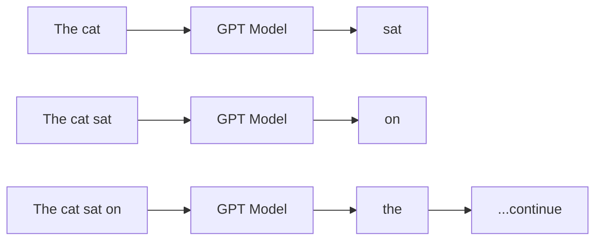
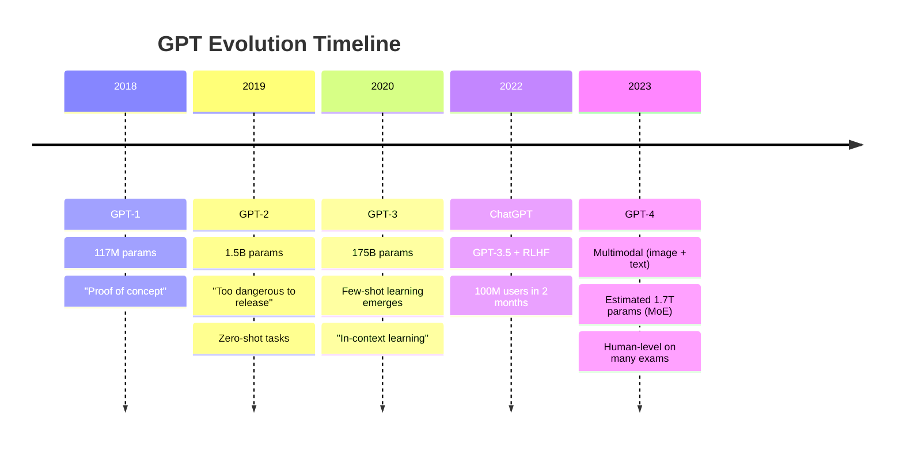
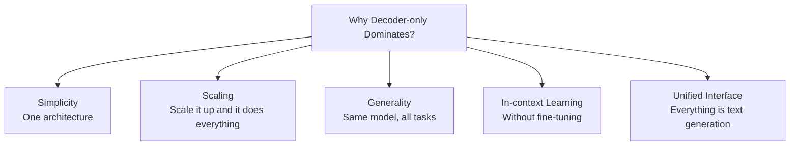
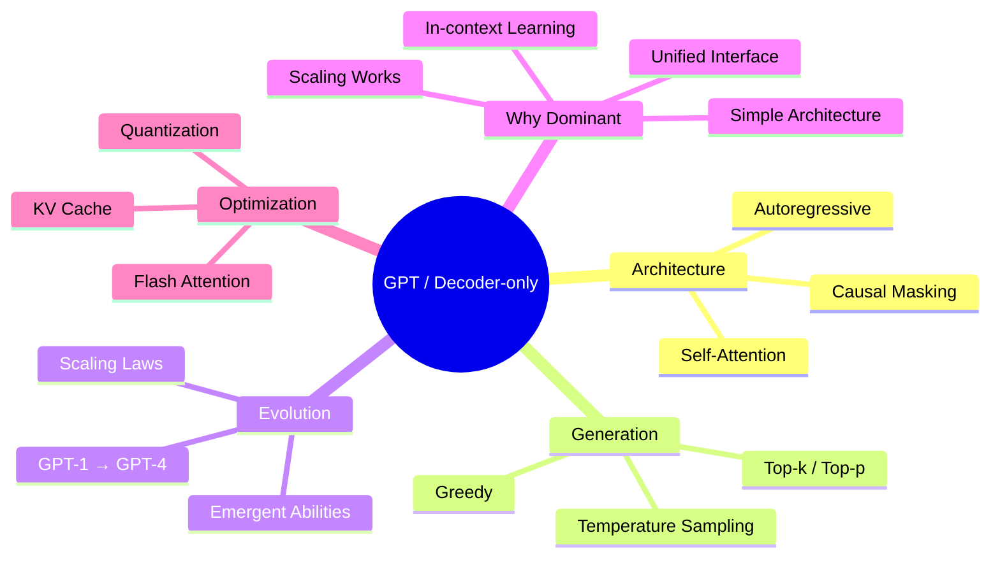

# GPT and Decoder-only Models

When you type something in ChatGPT, how does it respond so beautifully? How does it write one word after another? Behind this is **GPT** — Generative Pre-trained Transformer. Every LLM you see today — ChatGPT, Llama, Mistral, Gemma — they're all from the same family: **Decoder-only models**.

In this chapter we'll go deep — how GPT generates text, what causal masking is, and why the entire AI world is racing toward decoder-only.

## What Is GPT?

GPT = **Generative Pre-trained Transformer**. OpenAI first published GPT in 2018. It's built using the **Decoder** part of the original Transformer — that's why it's called a **decoder-only** model.

```
┌─────────────────────────────────────────────────────┐
│              Decoder-only Architecture               │
│                                                      │
│   Input → [Decoder Blocks] → Next Token Prediction  │
│                                                      │
│   ┌───┐ ┌───┐ ┌───┐ ┌───┐ ┌───┐                     │
│   │ T │ │ h │ │ e │ │   │ │ c │   → predict "a"     │
│   └───┘ └───┘ └───┘ └───┘ └───┘                     │
│     ↓     ↓     ↓     ↓     ↓                       │
│   ╔═══════════════════════════╗                      │
│   ║   Causal Self-Attention   ║  ← only looks left   │
│   ╚═══════════════════════════╝                      │
│     ↓     ↓     ↓     ↓     ↓                       │
│   ┌───┐ ┌───┐ ┌───┐ ┌───┐ ┌───┐                     │
│   │ ★ │ │ ★ │ │ ★ │ │ ★ │ │ ★ │   → representations │
│   └───┘ └───┘ └───┘ └───┘ └───┘                     │
│             ↓                                        │
│        Next Token: "a" (prob 0.85)                   │
└─────────────────────────────────────────────────────┘
```

> [!note] What does "Pre-trained" mean?
> "Pre-trained" means — the model was already trained on a huge amount of text (Wikipedia, books, web pages). It has learned the patterns of language. After that it's fine-tuned for specific tasks (chat, code, translation).

## Key Insight: Generating Text

BERT (encoder-only) understands language — but can't generate. GPT (decoder-only) is the opposite — it **generates** language. And the way to generate is **autoregressive** — predict one token, add it to the input, predict the next token again.

```
┌─────────────────────────────────────────────────────┐
│            Autoregressive Generation                │
│                                                      │
│  Step 1: "The cat"          → predict "sat"          │
│  Step 2: "The cat sat"      → predict "on"           │
│  Step 3: "The cat sat on"   → predict "the"          │
│  Step 4: "The cat sat on the" → predict "mat"        │
│  Step 5: "The cat sat on the mat" → predict "."      │
│                                                      │
│  Tokens are generated one by one like this           │
└─────────────────────────────────────────────────────┘
```



## Causal Masking — Can't See the Future

The most important feature of GPT is **Causal Masking**. It means — each position can only see tokens **before** it, not the ones after.

Why? Because when generating text, the future tokens haven't been created yet! So the model seeing the future would be cheating.

Let's look at an attention matrix. 1 = can attend, 0 = masked (cannot):

```
              Tokens:  The   cat   sat   on   the
              
              The  ┌  1      0     0     0    0   ┐
                   │                                    │
         cat       │  1      1     0     0    0   │
                   │                                    │
         sat       │  1      1     1     0    0   │
                   │                                    │
          on       │  1      1     1     1    0   │
                   │                                    │
         the       │  1      1     1     1    1   ┘
                   └                                    
                      The   cat   sat   on   the

  ↑ The lower-triangular part is where attention is allowed
  The rest = -∞ (masked, becomes 0 after softmax)
```

> [!important] Why Is Causal Mask Needed?
> Think about it — if you're writing a story, you don't know the next sentence! Similarly GPT doesn't know the next token. Causal mask ensures the model never "peeks" at future tokens to make predictions.
>
> But there's a tradeoff: because each position only sees the past, GPT's context understanding is slightly weaker than BERT's. BERT sees both directions!

The code below shows how a causal mask is created. It's a lower-triangular matrix — the upper part has `-inf`, the lower part and diagonal have `0`.

```python
import torch

# causal mask for seq_len = 5
seq_len = 5

# first, fill everything with 0
mask = torch.zeros(seq_len, seq_len)

# upper triangular part gets -inf (becomes 0 after softmax)
mask = mask.masked_fill(
    torch.triu(torch.ones(seq_len, seq_len), diagonal=1).bool(),
    float('-inf')
)

print(mask)
```

In the code above, `torch.triu` creates an upper triangular matrix, then those positions are filled with `-inf`. During softmax, the `-inf` values become 0 — meaning attention to those tokens is 0. Only the lower triangle (the past) gets attention. This is causal masking!

## Autoregressive Generation — Step by Step

Let's see how GPT generates a sentence — from the inside:

```
┌──────────────────────────────────────────────────────┐
│              Generation: Step by Step                 │
│                                                       │
│  Prompt: "Once upon a"                               │
│                                                       │
│  ┌─ Step 1 ──────────────────────────────────────┐   │
│  │ Input:  [Once] [upon] [a]                     │   │
│  │         ↓       ↓      ↓                      │   │
│  │      [CAUSAL SELF-ATTENTION]                   │   │
│  │         ↓                                     │   │
│  │ Output probabilities:                          │   │
│  │   "time" → 0.42                               │   │
│  │   "cat"  → 0.15                               │   │
│  │   "bird" → 0.08                               │   │
│  │ Selected: "time" ← greedy pick                │   │
│  └───────────────────────────────────────────────┘   │
│                                                       │
│  ┌─ Step 2 ──────────────────────────────────────┐   │
│  │ Input:  [Once] [upon] [a] [time]              │   │
│  │         ↓       ↓      ↓     ↓                │   │
│  │      [CAUSAL SELF-ATTENTION]                   │   │
│  │         ↓                                     │   │
│  │ Output probabilities:                          │   │
│  │   "there" → 0.30                              │   │
│  │   "in"   → 0.25                               │   │
│  │   ","    → 0.18                               │   │
│  │ Selected: "there"                             │   │
│  └───────────────────────────────────────────────┘   │
│                                                       │
│  ... and so it continues ...                          │
│                                                       │
│  Final: "Once upon a time there lived a wise king"   │
└──────────────────────────────────────────────────────┘
```

> [!warn] Why Is Generation Slow?
> Have you noticed — at each step the entire input has to be processed again? To generate the 100th token, all previous 99 tokens need attention again. That's why generation is slow. To solve this problem, **KV Cache** is used — the key-value of previous tokens are stored to avoid recomputation.

## Temperature and Sampling — Controlling Randomness

When GPT predicts the next token, it gives a probability distribution. Now how do we pick a token from that distribution? There are several strategies:

### Greedy (Temperature = 0)

Always pick the highest probability token. Deterministic — same input always gives same output.

### Temperature

"Flatten" or "sharpen" the probability distribution. The lower the temperature, the sharper (more confident) the distribution.

```
   High Temperature (T=2.0):          Low Temperature (T=0.5):
   
   "time" ██████████ 0.25             "time" ████████████████ 0.70
   "cat"  ████████   0.20             "cat"  ████ 0.12
   "bird" ██████     0.15             "bird" ██   0.06
   "man"  █████      0.12             "man"  ██   0.05
   other  ████ ...   0.28             other  ████ 0.07
   
   All tokens have similar probability       Few tokens dominate
   → more random, creative                   → less random, predictable

   T=0 → completely deterministic (always best)
   T=1 → original distribution
   T>1 → more random
```

### Top-k Sampling

Only randomly choose from the top `k` tokens. For example `k=50` means — randomly pick from the top 50 probable tokens.

```
Top-k = 3:
  "time" → 0.42  ┐
  "cat"  → 0.15  ├── random pick from these 3
  "bird" → 0.08  ┘
  "man"  → 0.04  ← excluded
  ...     ...    ← excluded
```

### Top-p (Nucleus) Sampling

Take tokens until the cumulative probability doesn't exceed `p`. For example `p=0.9`:

```
Top-p = 0.9:
  "time" → 0.42   cumulative: 0.42  ✓
  "cat"  → 0.15   cumulative: 0.57  ✓
  "bird" → 0.08   cumulative: 0.65  ✓
  "man"  → 0.04   cumulative: 0.69  ✓
  "day"  → 0.03   cumulative: 0.72  ✓
  ...
  "walk" → 0.02   cumulative: 0.90  ✓ ← stop here
  "run"  → 0.01   ← excluded (cumulative > 0.9)
```

> [!note] When to use which?
> - **Greedy (T=0)**: Code generation, factual answers, translation — where accuracy matters
> - **Temperature + Top-p**: Creative writing, chat, storytelling — where variety matters
> - **Top-k**: Middle ground — works for everything

| Method | Determinism | Creativity | When to Use |
|--------|------------|------------|-----------------|
| **Greedy** | 100% | 0% | Code, math, translation |
| **T=0.7, top-p=0.9** | Medium | Medium | Chat, general |
| **T=1.0, top-p=0.95** | Low | High | Creative writing |
| **T=1.5+** | Very low | Very high | Brainstorming |

## GPT Evolution — A Massive Journey

OpenAI has been building one powerful model after another since 2018. Let's see the timeline:



| Version | Year | Params | Key Innovation | Impact |
|---------|------|--------|---------------|--------|
| **GPT-1** | 2018 | 117M | Decoder-only pre-training | Concept proof |
| **GPT-2** | 2019 | 1.5B | Zero-shot learning | "Dangerous" text gen |
| **GPT-3** | 2020 | 175B | Few-shot, in-context learning | API launched |
| **ChatGPT** | 2022 | ~175B | RLHF fine-tuning | 100M users in 2 months |
| **GPT-4** | 2023 | ~1.7T (MoE) | Multimodal, reasoning | Human-level benchmarks |

> [!important] The Story of Growing Parameters
> From GPT-1 to GPT-4, parameters grew ~14,000 times! 117M → 1.7T. But the interesting thing — performance improved proportionally too. This is called the **scaling law**.

## Scaling Laws — Bigger Means Better

An important discovery by OpenAI: increase model size, data amount, and compute, and performance improves predictably. This is called the **Scaling Law**.

```
   Loss (lower = better)
    │
    │  ╲
    │   ╲  Small model
    │    ╲
    │     ╲ ─ ─ ─ ─ ─ ─ ─ ─
    │      ╲
    │       ╲ Medium model
    │        ╲
    │     ─ ─ ┴ ─ ─ ─ ─ ─ ─ ─ ─
    │          ╲ Large model
    │           ╲
    │            ╲
    │     ─ ─ ─ ─┴─ ─ ─ ─ ─ ─ ─ ─
    │              ╲ GPT-3 scale
    │               ╲___
    │                    ╲___
    │                         ╲___
    └── ── ── ── ── ── ── ── ── ──→
        Compute (FLOPs)

   More compute → lower loss → better model
   And this improvement is predictable (power law).
```

> [!note] Scaling Law Formula
> According to the original paper: `Loss ≈ A / N^α + B / D^β + C`
> Where N = parameter count, D = dataset size. This means — both parameters and data need to increase, one can't replace the other.

## Emergent Abilities — Unexpected Capabilities

The most surprising thing — when a model reaches a certain size, suddenly a **new ability** appears! This is called **emergent abilities**.

```
Model Size →         1B      10B     100B    500B+    
                     │       │       │       │
                     ▼       ▼       ▼       ▼

Arithmetic:          ❌      ❌      ✅      ✅✅
Code writing:        ❌      ❌      ✅      ✅✅
Logic reasoning:     ❌      ❌      ❌      ✅
Translation:         ❌      ✅      ✅✅    ✅✅✅
Few-shot learning:   ❌      ❌      ✅✅    ✅✅✅
Instruction follow:  ❌      ❌      ✅      ✅✅

❌ = can't do it    ✅ = can do it    ✅✅ = good at it

Notice — arithmetic or logic reasoning suddenly "emerge" at 100B scale.
Smaller models don't have them at all!
```

> [!warn] The Debate About Emergent Abilities
> Some researchers believe — emergent abilities aren't actually "phase transitions," but rather an artifact of the evaluation metric. We're seeing continuous improvement as "emergent." But this debate is ongoing.

## Why Does Decoder-only Dominate Today?

All major LLMs today are decoder-only:

| Model | Organization | Architecture |
|-------|---------------|--------------|
| GPT-4 | OpenAI | Decoder-only (MoE) |
| Llama 3 | Meta | Decoder-only |
| Mistral | Mistral AI | Decoder-only |
| Gemma | Google | Decoder-only |
| Claude | Anthropic | Decoder-only |
| Qwen | Alibaba | Decoder-only |

Why is everyone going decoder-only? A few reasons:



> [!important] The Big Insight
> Researchers discovered — if you make the model big enough, decoder-only architecture can solve **all NLP tasks**. Classification? Do it as text generation. Translation? Give source text, generate target text. QA? Give a question, generate an answer. Everything can be done through "next token prediction."
>
> This "one model to rule them all" paradigm is truly powerful.

## Code: Text Generation with a Small GPT

Now let's see some practical code. We'll load a small GPT model with HuggingFace and generate text. The code below uses the `gpt2` model — it's only 124M parameters, easy to run.

```python
from transformers import AutoTokenizer, AutoModelForCausalLM
import torch

# Load small GPT-2 model
model_name = "gpt2"
tokenizer = AutoTokenizer.from_pretrained(model_name)
model = AutoModelForCausalLM.from_pretrained(model_name)
model.eval()

# Give a prompt
prompt = "The future of artificial intelligence is"
input_ids = tokenizer.encode(prompt, return_tensors="pt")

print(f"Prompt: {prompt}\n")

# --- Greedy Decoding ---
print("=== Greedy (temperature=0) ===")
with torch.no_grad():
    greedy_output = model.generate(
        input_ids,
        max_new_tokens=30,
        do_sample=False,          # greedy
        pad_token_id=tokenizer.eos_token_id,
    )
print(tokenizer.decode(greedy_output[0], skip_special_tokens=True))
print()

# --- Sampling (temperature + top-p) ---
print("=== Sampling (temperature=0.8, top_p=0.9) ===")
with torch.no_grad():
    sample_output = model.generate(
        input_ids,
        max_new_tokens=30,
        do_sample=True,           # sampling on
        temperature=0.8,          # moderate randomness
        top_p=0.9,                # nucleus sampling
        pad_token_id=tokenizer.eos_token_id,
    )
print(tokenizer.decode(sample_output[0], skip_special_tokens=True))
```

The code above shows two generation strategies. First **greedy decoding** — with `do_sample=False`, always picking the highest probability token. This is deterministic. Then **sampling** — with `temperature=0.8` and `top_p=0.9`. This gives slightly different output each time, but more natural and creative.

`model.eval()` and `torch.no_grad()` are used because we're only doing inference, not training. This optimizes both memory and speed.

> [!tip] For Running on Your Own Computer
> - `gpt2` (124M): Runs on any computer
> - `gpt2-medium` (355M): 4GB+ RAM
> - `gpt2-large` (774M): 8GB+ RAM
> - `gpt2-xl` (1.5B): 16GB+ RAM
> - For larger models try `Llama-3.2-1B` or `gemma-2-2b`

## KV Cache — Making Generation Faster

I said earlier that generation is slow because each step processes the entire input. To solve this, **KV Cache** is used.

```
  Without KV Cache:                    With KV Cache:

  Step N: recompute ALL tokens         Step N: only compute NEW token
                                     
  [Tok1][Tok2][Tok3]...[TokN]          [Tok1][Tok2][Tok3]...[TokN-1]  [TokN]
     ↓     ↓     ↓        ↓               ↓     ↓     ↓        ↓        ↓
  [K,V] [K,V] [K,V]   [K,V]           [cached][cached][cached] [cached] [K,V]
     ↓     ↓     ↓        ↓                                        ↓
  [ATTENTION over ALL]               [ATTENTION: new token queries cache]
  
  O(N²) per step                     O(N) per step (much faster!)
```

> [!note] KV Cache Tradeoff
> KV Cache makes generation much faster but uses more memory. Because every layer has to store the key and value for every token. For large contexts (like 128K tokens) this cache can be very large — several GB!

## Summary: The Power of Decoder-only Architecture



So that's the full story of decoder-only or the GPT family! Remember the key things — **Causal Masking** (only sees the past), **Autoregressive** (one token at a time), **Temperature/Sampling** (controlling randomness), and **Scaling** (bigger = better). Decoder-only architecture has played the biggest role in today's AI revolution — and this journey is still ongoing! 🔥