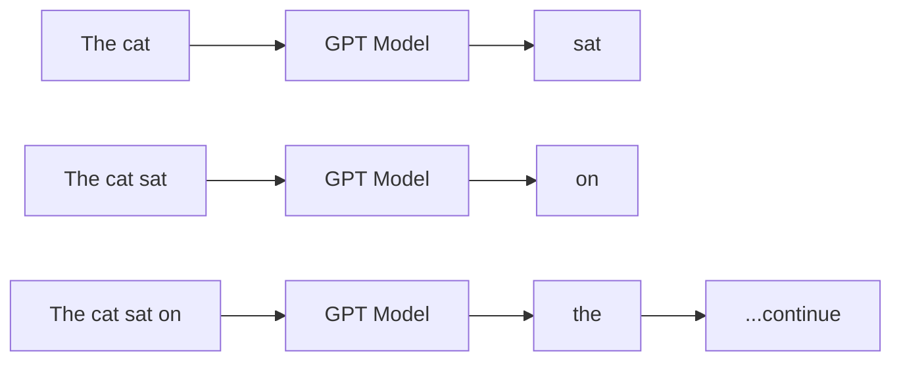
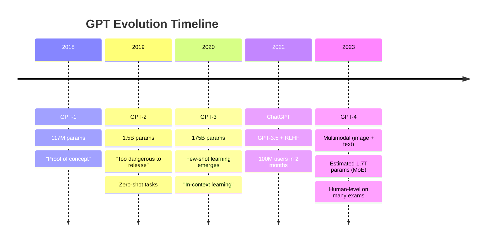
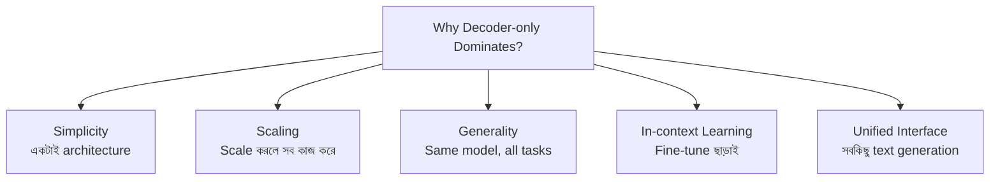
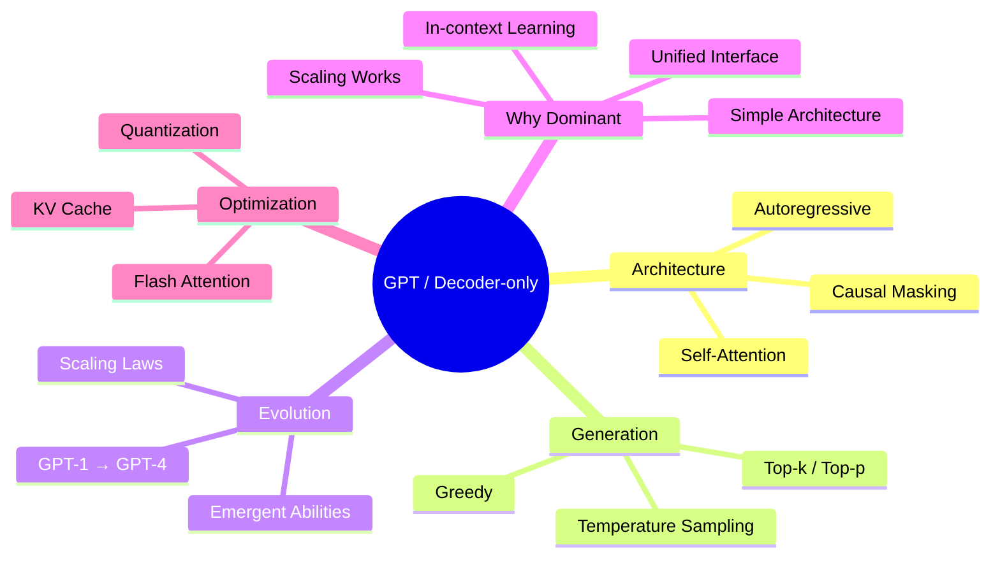

# GPT ও Decoder-only Models

তুমি যখন ChatGPT তে কিছু লেখো, সে কীভাবে এত সুন্দর করে উত্তর দেয়? কীভাবে একটা word এর পর আরেকটা word লেখে? এর পেছনে আছে **GPT** — Generative Pre-trained Transformer। আজকে যত LLM দেখছো — ChatGPT, Llama, Mistral, Gemma — সবাই একই family এর: **Decoder-only models**।

এই chapter এ আমরা গভীরে যাবো — GPT কীভাবে text generate করে, causal masking কী, আর কেন আজকে পুরো AI world decoder-only তে ছুটে যাচ্ছে।

## GPT কী?

GPT = **Generative Pre-trained Transformer**। OpenAI ২০১৮ সালে প্রথম GPT প্রকাশ করে। মূল Transformer এর **Decoder** অংশটা নিয়ে তৈরি — তাই একে **decoder-only** model বলা হয়।

```
┌─────────────────────────────────────────────────────┐
│              Decoder-only Architecture               │
│                                                      │
│   Input → [Decoder Blocks] → Next Token Prediction  │
│                                                      │
│   ┌───┐ ┌───┐ ┌───┐ ┌───┐ ┌───┐                     │
│   │ T │ │ h │ │ e │ │   │ │ c │   → predict "a"     │
│   └───┘ └───┘ └───┘ └───┘ └───┘                     │
│     ↓     ↓     ↓     ↓     ↓                       │
│   ╔═══════════════════════════╗                      │
│   ║   Causal Self-Attention   ║  ← শুধু বাঁদিকে দেখে   │
│   ╚═══════════════════════════╝                      │
│     ↓     ↓     ↓     ↓     ↓                       │
│   ┌───┐ ┌───┐ ┌───┐ ┌───┐ ┌───┐                     │
│   │ ★ │ │ ★ │ │ ★ │ │ ★ │ │ ★ │   → representations │
│   └───┘ └───┘ └───┘ └───┘ └───┘                     │
│             ↓                                        │
│        Next Token: "a" (prob 0.85)                   │
└─────────────────────────────────────────────────────┘
```

> [!note] Pre-trained কথাটার মানে
> "Pre-trained" মানে — model কে আগেই প্রচুর টেক্সট (Wikipedia, books, web pages) দিয়ে train করা হয়েছে। সে ভাষার pattern শিখে ফেলেছে। এরপর তাকে specific task (chat, code, translation) এর জন্য fine-tune করা হয়।

## Key Insight: Text Generate করা

BERT (encoder-only) ভাষা বোঝে — কিন্তু generate করতে পারে না। GPT (decoder-only) উল্টো — সে ভাষা **generate** করে। আর generate করার উপায় হলো **autoregressive** — একটা token predict করো, সেটা input এ যোগ করো, আবার পরের token predict করো।

```
┌─────────────────────────────────────────────────────┐
│            Autoregressive Generation                │
│                                                      │
│  Step 1: "The cat"          → predict "sat"          │
│  Step 2: "The cat sat"      → predict "on"           │
│  Step 3: "The cat sat on"   → predict "the"          │
│  Step 4: "The cat sat on the" → predict "mat"        │
│  Step 5: "The cat sat on the mat" → predict "."      │
│                                                      │
│  এভাবে একটা একটা করে token generate হতে থাকে          │
└─────────────────────────────────────────────────────┘
```



## Causal Masking — ভবিষ্যৎ দেখা যায় না

GPT এর সবচেয়ে গুরুত্বপূর্ণ feature হলো **Causal Masking**। এর মানে হলো — প্রতিটা position শুধু তার **আগের** token গুলো দেখতে পায়, পরের গুলো দেখতে পারে না।

কেন? কারণ text generate করার সময় তো পরের token গুলো এখনও তৈরিই হয়নি! তাই মডেল ভবিষ্যৎ দেখতে পাবে — এটা cheating হবে।

চলো একটা attention matrix দেখি। 1 = attend করতে পারে, 0 = মাস্কড (পারবে না):

```
              Tokens:  The   cat   sat   on   the
              
              The  ┌  1      0     0     0    0   ┐
                   │                                    │
         cat       │  1      1     0     0    0   │
                   │                                    │
         sat       │  1      1     1     0    0   │
                   │                                    │
          on       │  1      1     1     1    0   │
                   │                                    │
         the       │  1      1     1     1    1   ┘
                   └                                    
                      The   cat   sat   on   the

  ↑ উপরের ত্রিভুজাকার (lower-triangular) অংশ ই attention allowed
  বাকি জায়গা = -∞ (masked, softmax এর পরে 0 হয়ে যায়)
```

> [!important] Causal Mask কেন দরকার?
> ভাবো — তুমি যদি একটা story লেখো, তুমি তো পরের sentence জানো না! ঠিক তেমনি GPT ও পরের token জানে না। Causal mask নিশ্চিত করে যে মডেল কখনো ভবিষ্যৎ token "দেখে" predict করবে না।
>
> কিন্তু একটা tradeoff আছে: কারণ প্রতিটা position শুধু অতীত দেখে, GPT এর context understanding BERT এর চেয়ে একটু কমজোরি। BERT দুইদিক দেখে!

নিচের কোডে দেখানো হলো কীভাবে causal mask তৈরি করা হয়। এটা একটা lower-triangular matrix — উপরের অংশে `-inf` থাকে, নিচে আর diagonal এ `0`।

```python
import torch

# seq_len = 5 এর জন্য causal mask
seq_len = 5

# প্রথমে সব জায়গায় 0
mask = torch.zeros(seq_len, seq_len)

# উপরের ত্রিভুজাকার অংশে -inf (softmax এর পরে 0 হয়ে যাবে)
mask = mask.masked_fill(
    torch.triu(torch.ones(seq_len, seq_len), diagonal=1).bool(),
    float('-inf')
)

print(mask)
```

উপরের কোডে `torch.triu` দিয়ে upper triangular matrix বানানো হয়েছে, তারপর সেই জায়গাগুলোতে `-inf` বসানো হয়েছে। Softmax এর সময় `-inf` value গুলো 0 হয়ে যায় — অর্থাৎ সেই token গুলোতে attention 0। শুধু নিচের ত্রিভুজ (অতীত) attention পায়। এটাই causal masking!

## Autoregressive Generation — Step by Step

চলো দেখি GPT কীভাবে একটা sentence generate করে — একদম ভেতর থেকে:

```
┌──────────────────────────────────────────────────────┐
│              Generation: Step by Step                 │
│                                                       │
│  Prompt: "Once upon a"                               │
│                                                       │
│  ┌─ Step 1 ──────────────────────────────────────┐   │
│  │ Input:  [Once] [upon] [a]                     │   │
│  │         ↓       ↓      ↓                      │   │
│  │      [CAUSAL SELF-ATTENTION]                   │   │
│  │         ↓                                     │   │
│  │ Output probabilities:                          │   │
│  │   "time" → 0.42                               │   │
│  │   "cat"  → 0.15                               │   │
│  │   "bird" → 0.08                               │   │
│  │ Selected: "time" ← greedy pick                │   │
│  └───────────────────────────────────────────────┘   │
│                                                       │
│  ┌─ Step 2 ──────────────────────────────────────┐   │
│  │ Input:  [Once] [upon] [a] [time]              │   │
│  │         ↓       ↓      ↓     ↓                │   │
│  │      [CAUSAL SELF-ATTENTION]                   │   │
│  │         ↓                                     │   │
│  │ Output probabilities:                          │   │
│  │   "there" → 0.30                              │   │
│  │   "in"   → 0.25                               │   │
│  │   ","    → 0.18                               │   │
│  │ Selected: "there"                             │   │
│  └───────────────────────────────────────────────┘   │
│                                                       │
│  ... এভাবে চলতেই থাকে ...                              │
│                                                       │
│  Final: "Once upon a time there lived a wise king"   │
└──────────────────────────────────────────────────────┘
```

> [!warn] Generation Slow কেন?
> খেয়াল করেছো কি — প্রতিটা step এ পুরো input আবার process করতে হয়? ১০০তম token generate করার সময় আগের ৯৯টা token সব আবার attention হবে। এজন্য generation ধীর। এই problem সমাধানে **KV Cache** ব্যবহার করা হয় — আগের token গুলোর key-value জমা রেখে পুনরায় compute এড়ানো হয়।

## Temperature আর Sampling — Randomness Control

GPT যখন পরের token predict করে, সে probability distribution দেয়। এখন সেই distribution থেকে কীভাবে token বাছব? এখানে কয়েকটা strategy আছে:

### Greedy (Temperature = 0)

সবসময় highest probability এর token নাও। Deterministic — একই input এ সবসময় একই output।

### Temperature

Probability distribution কে "চ্যাপ্টা" বা "তীক্ষ্ণ" করা। Temperature যত কম, distribution তত তীক্ষ্ণ (confident)।

```
   High Temperature (T=2.0):          Low Temperature (T=0.5):
   
   "time" ██████████ 0.25             "time" ████████████████ 0.70
   "cat"  ████████   0.20             "cat"  ████ 0.12
   "bird" ██████     0.15             "bird" ██   0.06
   "man"  █████      0.12             "man"  ██   0.05
   other  ████ ...   0.28             other  ████ 0.07
   
   সব token এর probability কাছাকাছি           কিছু token এর probability বেশি
   → বেশি random, creative                     → কম random, predictable

   T=0 → একদম deterministic (always best)
   T=1 → original distribution
   T>1 → আরো random
```

### Top-k Sampling

শুধু top `k` টা token থেকে random choose করো। যেমন `k=50` মানে — top ৫০টা probable token এর মধ্যে থেকে র্যান্ডমলি বাছব।

```
Top-k = 3:
  "time" → 0.42  ┐
  "cat"  → 0.15  ├── এই ৩টা থেকে random pick
  "bird" → 0.08  ┘
  "man"  → 0.04  ← বাদ
  ...     ...    ← বাদ
```

### Top-p (Nucleus) Sampling

cumulative probability যেন `p` এর বেশি না হয় — সেই পর্যন্ত token নাও। যেমন `p=0.9`:

```
Top-p = 0.9:
  "time" → 0.42   cumulative: 0.42  ✓
  "cat"  → 0.15   cumulative: 0.57  ✓
  "bird" → 0.08   cumulative: 0.65  ✓
  "man"  → 0.04   cumulative: 0.69  ✓
  "day"  → 0.03   cumulative: 0.72  ✓
  ...
  "walk" → 0.02   cumulative: 0.90  ✓ ← এখানে থামবে
  "run"  → 0.01   ← বাদ (cumulative > 0.9)
```

> [!note] কখন কোনটা?
> - **Greedy (T=0)**: Code generation, factual answer, translation — যেখানে accuracy দরকার
> - **Temperature + Top-p**: Creative writing, chat, storytelling — যেখানে variety দরকার
> - **Top-k**: মাঝারি — সব ক্ষেত্রে ব্যবহার যায়

| Method | Determinism | Creativity | কখন ব্যবহার করব |
|--------|------------|------------|-----------------|
| **Greedy** | 100% | 0% | Code, math, translation |
| **T=0.7, top-p=0.9** | Medium | Medium | Chat, general |
| **T=1.0, top-p=0.95** | Low | High | Creative writing |
| **T=1.5+** | Very low | Very high | Brainstorming |

## GPT Evolution — একটা বিশাল Journey

OpenAI ২০১৮ থেকে একটার পর একটা powerful model বানাচ্ছে। চলো timeline দেখি:



| Version | Year | Params | Key Innovation | Impact |
|---------|------|--------|---------------|--------|
| **GPT-1** | 2018 | 117M | Decoder-only pre-training | Concept proof |
| **GPT-2** | 2019 | 1.5B | Zero-shot learning | "Dangerous" text gen |
| **GPT-3** | 2020 | 175B | Few-shot, in-context learning | API launched |
| **ChatGPT** | 2022 | ~175B | RLHF fine-tuning | 100M users in 2 months |
| **GPT-4** | 2023 | ~1.7T (MoE) | Multimodal, reasoning | Human-level benchmarks |

> [!important] Parameter বাড়ার গল্প
> GPT-1 থেকে GPT-4 এ parameter বেড়েছে ~14,000 গুণ! 117M → 1.7T। কিন্তু interesting ব্যাপার — performance ও সেই অনুপাতে বেড়েছে। একে **scaling law** বলে।

## Scaling Laws — বড় মানে ভালো

OpenAI এর একটা গুরুত্বপূর্ণ আবিষ্কার: model size, data amount, আর compute বাড়ালে performance predictably ভালো হয়। এটাকে **Scaling Law** বলে।

```
   Loss (lower = better)
    │
    │  ╲
    │   ╲  Small model
    │    ╲
    │     ╲ ─ ─ ─ ─ ─ ─ ─ ─
    │      ╲
    │       ╲ Medium model
    │        ╲
    │     ─ ─ ┴ ─ ─ ─ ─ ─ ─ ─ ─
    │          ╲ Large model
    │           ╲
    │            ╲
    │     ─ ─ ─ ─┴─ ─ ─ ─ ─ ─ ─ ─
    │              ╲ GPT-3 scale
    │               ╲___
    │                    ╲___
    │                         ╲___
    └── ── ── ── ── ── ── ── ── ──→
        Compute (FLOPs)

   যত বেশি compute → তত কম loss → তত ভালো model
   আর এই improvement টা predictable (power law)।
```

> [!note] Scaling Law এর formula
> মূল paper অনুযায়ী: `Loss ≈ A / N^α + B / D^β + C`
> যেখানে N = parameter count, D = dataset size। এর মানে — parameter আর data দুটোই বাড়াতে হবে, একটা দিয়ে একটা replace হবে না।

## Emergent Abilities — অপ্রত্যাশিত ক্ষমতা

সবচেয়ে অবাক করা ব্যাপার হলো — model যখন একটা নির্দিষ্ট size এ পৌঁছায়, হঠাৎ করে **নতুন ability** দেখা দেয়! একে **emergent abilities** বলে।

```
Model Size →         1B      10B     100B    500B+    
                     │       │       │       │
                     ▼       ▼       ▼       ▼

Arithmetic:          ❌      ❌      ✅      ✅✅
Code writing:        ❌      ❌      ✅      ✅✅
Logic reasoning:     ❌      ❌      ❌      ✅
Translation:         ❌      ✅      ✅✅    ✅✅✅
Few-shot learning:   ❌      ❌      ✅✅    ✅✅✅
Instruction follow:  ❌      ❌      ✅      ✅✅

❌ = can't do it    ✅ = can do it    ✅✅ = good at it

খেয়াল করো — arithmetic বা logic reasoning হঠাৎ 100B scale এ
"emerge" করে। ছোট model এ একদমই থাকে না!
```

> [!warn] Emergent Abilities এর বিতর্ক
> কিছু গবেষক মনে করেন — emergent abilities আসলে "phase transition" না, বরং evaluation metric এর artifact। Continuous improvement কে আমরা "emergent" দেখছি। তবে এই বিতর্ক চলমান।

## কেন Decoder-only আজকে রাজত্ব করছে?

আজকের সব major LLM decoder-only:

| Model | কোন প্রতিষ্ঠান | Architecture |
|-------|---------------|--------------|
| GPT-4 | OpenAI | Decoder-only (MoE) |
| Llama 3 | Meta | Decoder-only |
| Mistral | Mistral AI | Decoder-only |
| Gemma | Google | Decoder-only |
| Claude | Anthropic | Decoder-only |
| Qwen | Alibaba | Decoder-only |

কেন সবাই decoder-only তে যাচ্ছে? কয়েকটা কারণ:



> [!important] The Big Insight
> গবেষকরা আবিষ্কার করলেন — যদি model কে যথেষ্ট বড় করো, decoder-only architecture দিয়েই **সব NLP task** solve করা যায়। Classification? Text generation এর আকারে করো। Translation? Source text দাও, target text generate করো। QA? Question দাও, answer generate করো। সবই "next token prediction" দিয়ে করা যায়।
>
> এই "one model to rule them all" paradigm আসলেই powerful।

## Code: Text Generation একটা ছোট GPT দিয়ে

এবার চলো practical code দেখি। HuggingFace দিয়ে একটা ছোট GPT model লোড করে text generate করব। নিচের কোডে `gpt2` model ব্যবহার করা হয়েছে — এটা মাত্র ১২৪M parameter, সহজে চালানো যায়।

```python
from transformers import AutoTokenizer, AutoModelForCausalLM
import torch

# ছোট GPT-2 model load করো
model_name = "gpt2"
tokenizer = AutoTokenizer.from_pretrained(model_name)
model = AutoModelForCausalLM.from_pretrained(model_name)
model.eval()

# Prompt দাও
prompt = "The future of artificial intelligence is"
input_ids = tokenizer.encode(prompt, return_tensors="pt")

print(f"Prompt: {prompt}\n")

# --- Greedy Decoding ---
print("=== Greedy (temperature=0) ===")
with torch.no_grad():
    greedy_output = model.generate(
        input_ids,
        max_new_tokens=30,
        do_sample=False,          # greedy
        pad_token_id=tokenizer.eos_token_id,
    )
print(tokenizer.decode(greedy_output[0], skip_special_tokens=True))
print()

# --- Sampling (temperature + top-p) ---
print("=== Sampling (temperature=0.8, top_p=0.9) ===")
with torch.no_grad():
    sample_output = model.generate(
        input_ids,
        max_new_tokens=30,
        do_sample=True,           # sampling on
        temperature=0.8,          # moderate randomness
        top_p=0.9,                # nucleus sampling
        pad_token_id=tokenizer.eos_token_id,
    )
print(tokenizer.decode(sample_output[0], skip_special_tokens=True))
```

উপরের কোডে দুটো generation strategy দেখানো হয়েছে। প্রথমে **greedy decoding** — `do_sample=False` দিয়ে, সবসময় highest probability token নেওয়া হয়। এটা deterministic। তারপর **sampling** — `temperature=0.8` আর `top_p=0.9` দিয়ে। এটা প্রতিবার একটু আলাদা output দেবে, কিন্তু আরো natural আর creative।

`model.eval()` আর `torch.no_grad()` ব্যবহার করা হয়েছে কারণ আমরা শুধু inference করছি, training না। এতে memory আর speed দুটোই অপ্টিমাইজ হয়।

> [!tip] নিজের কম্পিউটারে চালানোর জন্য
> - `gpt2` (124M): যেকোনো কম্পিউটারে চলবে
> - `gpt2-medium` (355M): ৪GB+ RAM
> - `gpt2-large` (774M): ৮GB+ RAM
> - `gpt2-xl` (1.5B): ১৬GB+ RAM
> - আরো বড় model এর জন্য `Llama-3.2-1B` বা `gemma-2-2b` চেষ্টা করো

## KV Cache — Generation দ্রুত করা

আগে বলেছিলাম generation slow কারণ প্রতিটা step এ পুরো input process করতে হয়। এটা solve করার জন্য **KV Cache** ব্যবহার করা হয়।

```
  Without KV Cache:                    With KV Cache:

  Step N: recompute ALL tokens         Step N: only compute NEW token
                                         
  [Tok1][Tok2][Tok3]...[TokN]          [Tok1][Tok2][Tok3]...[TokN-1]  [TokN]
     ↓     ↓     ↓        ↓               ↓     ↓     ↓        ↓        ↓
  [K,V] [K,V] [K,V]   [K,V]           [cached][cached][cached] [cached] [K,V]
     ↓     ↓     ↓        ↓                                        ↓
  [ATTENTION over ALL]               [ATTENTION: new token queries cache]
  
  O(N²) per step                     O(N) per step (much faster!)
```

> [!note] KV Cache এর tradeoff
> KV Cache generation কে অনেক fast করে কিন্তু memory বেশি খায়। কারণ প্রতিটা layer এ প্রতিটা token এর key আর value store করে রাখতে হয়। বড় context (যেমন 128K tokens) এর জন্য এই cache অনেক বড় হতে পারে — কয়েক GB!

## Summary: Decoder-only Architecture এর শক্তি



তো এটাই decoder-only বা GPT family এর পুরো story! মূল জিনিসগুলো মনে রাখো — **Causal Masking** (শুধু অতীত দেখে), **Autoregressive** (একটা করে token), **Temperature/Sampling** (randomness control), আর **Scaling** (বড় = ভালো)। আজকের AI revolution এর পেছনে decoder-only architecture সবচেয়ে বড় ভূমিকা রেখেছে — আর এখনো এই journey চলছে! 🔥