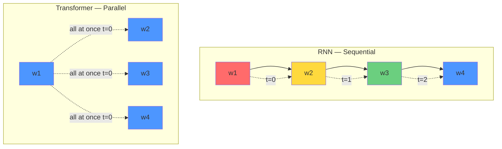
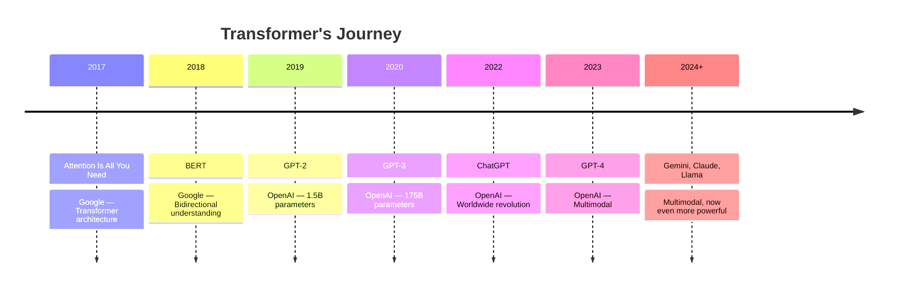
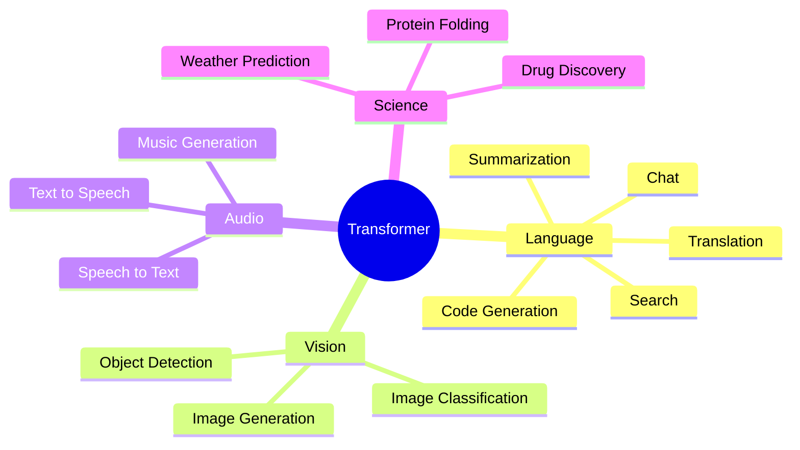

# What Is a Transformer and Why It's a Revolution

Imagine — it's 2017. A team of researchers at Google publishes a paper. The title: **"Attention Is All You Need."** Nobody could have guessed that this single paper would turn the entire AI world upside down. The architecture behind today's ChatGPT, GPT-4, Gemini — its origin story starts right here.

In this chapter, we'll understand — what existed before Transformers, what problems they had, and how Transformers solved everything in one stroke. Let's begin!

---

## What Came Before? RNN and LSTM

Before Transformers arrived, the main tools for understanding language were **RNN (Recurrent Neural Network)** and **LSTM (Long Short-Term Memory)**. The way they work is — they read a sentence one word at a time, exactly the way we read.

```
The  →  cat  →  sat  →  on  →  the  →  mat
 ↓      ↓      ↓      ↓      ↓       ↓
h1  →  h2  →  h3  →  h4  →  h5  →  h6
```

Here h1, h2... are hidden states. Each time RNN reads a word, it carries information from the previous word. It's all sequential — one after another.

> [!important] The Core Problem
> RNN reads the sentence from start to finish **one word at a time**. This means — it can't see all words at once. It passes the "memory" of the previous word to the next one. This sequential nature is the root of all problems.

### Three Big Problems of RNN

| Problem | What Happens | Why It's Bad |
|---------|-------------|--------------|
| **Sequential processing** | One word finishes, then the next | Can't use GPU efficiently |
| **Long-range forgetting** | Forgets early words in long sentences | Problem when early word's meaning is needed later |
| **Vanishing gradient** | Gradient shrinks during training | Early layers learn nothing |

Let's understand each problem one by one.

### Problem 1: Sequential Processing — One by One

RNN reads one word, processes it, then reads the next. This means — if you want to process a 1000-word sentence, RNN has to work 1000 times, one after another. No parallel work.

```
RNN — Sequential (one after another):

  w1 → [h1] → w2 → [h2] → w3 → [h3] → w4 → [h4]
       │           │           │           │
  t=0          t=1          t=2          t=3

  ⏱ Time taken: 4 steps (steps can't happen simultaneously)
```

This is a huge problem — because modern GPUs are incredible at parallel computing. But RNN forces the GPU to work alone, one at a time. The GPU's power is wasted.

### Problem 2: Forgetting Early Words in Long Sentences

Read this sentence:

> "The **movie** that I watched yesterday at the new multiplex with my friends after dinner was really long and boring."

Here there are many words between "movie" and "boring." By the time RNN reaches "boring," the memory of "movie" has faded significantly. It can't figure out what's boring — the movie or the dinner!

### Problem 3: Vanishing Gradient

During training, the gradient (learning signal) gets smaller and smaller as it passes from one layer to another, eventually becoming almost zero. As a result, early layers learn nothing — training stalls.

> [!warn] Did LSTM Solve It?
> LSTM reduced this forgetting problem somewhat — using gate mechanisms. But the sequential nature remained. Long sentences still caused problems. LSTM was a band-aid, not a solution.

---

## The Core Insight of Transformers

Now let's get to the main point. The Transformer paper said one key thing:

> **"Attention is All You Need"** — no recurrence needed. Look at all words at once, and decide which ones are important. That's it!

Let's understand with an example. Read this sentence:

> "The animal didn't cross the street because **it** was too tired."

What does **"it"** refer to — the animal or the street? You'd immediately say — the animal. Because you saw the whole sentence at a glance, and understood from context.

If RNN had to understand this, it would read word by word from start to finish, then search through previous memories after reaching "it." But Transformer sees all words at once, and uses attention to figure out which word "it" is most related to.

```
Transformer — Parallel (all at once):

  The    animal  didn't  cross  the  street  because  it   was  tired
   │       │       │       │      │     │       │      │    │     │
   ▼       ▼       ▼       ▼      ▼     ▼       ▼      ▼    ▼     ▼
  ┌─────────────────────────────────────────────────────────────────┐
  │                    SELF-ATTENTION                              │
  │    All words look at each other simultaneously                 │
  │    "it" → animal (high attention)                              │
  │    "it" → street (low attention)                               │
  └─────────────────────────────────────────────────────────────────┘
                           │
                           ▼
                  Context understood!

  ⏱ Time taken: 1 step (all at once!)
```

> [!note] Real-World Analogy
> Think about how you read a sentence — your eyes don't always go word by word. Your eyes jump to important parts. Similarly, Transformer sees all words at once, and focuses on the ones that matter.

---

## Parallel Processing — Why It's a Game-Changer for GPUs

Let's go a bit deeper. GPU means parallel computing — thousands of cores working simultaneously. But RNN is sequential! One step can't begin until the previous one finishes.

Transformer, however, processes all words simultaneously. The GPU's thousands of cores all work together.



This means — during training, Transformer is many times faster than RNN. Larger models, more data — all became possible because of this parallelism.

> [!important] Why Is This So Important?
> The amount of data and compute needed to train GPT-3 would have been practically impossible with RNNs. Transformer's parallelism made training at this scale possible.

---

## Timeline — From Transformer to Today's AI



| Year | Model | What It Brought | Significance |
|------|-------|----------------|--------------|
| 2017 | **Transformer** | Self-attention architecture | The foundation |
| 2018 | **BERT** | Bidirectional context | Understanding capability |
| 2019 | **GPT-2** | 1.5B parameters | Writing capability |
| 2020 | **GPT-3** | 175B parameters, few-shot | Power of scale |
| 2022 | **ChatGPT** | RLHF, conversation | Arrival to the public |
| 2023 | **GPT-4** | Multimodal, reasoning | Next generation |
| 2024+ | **Gemini, Claude, Llama** | Various improvements | Competition |

---

## What Can Transformers Do?

Transformers don't just work with language. It's a universal architecture — works for any sequential or structured data.

```
┌──────────────────────────────────────────────────────┐
│                 Transformer Use Cases                │
├──────────────┬───────────────────────────────────────┤
│ Translation  │ Like Google Translate                 │
│              │ One language to another               │
├──────────────┼───────────────────────────────────────┤
│ Summarization│ Short summary from long articles      │
├──────────────┼───────────────────────────────────────┤
│ Code Gen     │ GitHub Copilot — writes code          │
├──────────────┼───────────────────────────────────────┤
│ Chat         │ ChatGPT — conversation                │
├──────────────┼───────────────────────────────────────┤
│ Image        │ Vision Transformer (ViT)              │
├──────────────┼───────────────────────────────────────┤
│ Audio        │ Whisper — speech to text              │
├──────────────┼───────────────────────────────────────┤
│ Science      │ AlphaFold — protein structure         │
└──────────────┴───────────────────────────────────────┘
```



> [!note] Fun Fact
> AlphaFold — the tool used to predict protein structures — also uses a Transformer variation. Transformer hasn't just revolutionized language, it's revolutionized biology too!

---

## RNN vs Transformer — Head to Head

| Feature | RNN / LSTM | Transformer |
|---------|-----------|-------------|
| **Processing** | Sequential (one by one) | Parallel (all at once) |
| **GPU Usage** | Poor — many cores sit idle | Great — all cores work |
| **Long-range** | Can't remember well | Sees everything via attention |
| **Training Speed** | Slow | Much faster |
| **Scaling** | Large models are hard | Easy to scale |
| **Complexity** | O(n) sequential | O(n²) but parallel |
| **Context** | Limited window | Full sequence |

> [!warn] A Common Misconception
> Some people think Transformer is better than RNN in every way. Not quite. Transformer has O(n²) complexity — large sequences require a lot of memory. But the benefit of parallelism is so great that this problem is tolerable.

---

## A Simple Code Example

Let's look at a simple PyTorch example. The code below shows a small self-attention block. You don't need to understand everything now — just get a feel for it.

In this code, we'll implement a simple self-attention. We'll cover the details in upcoming chapters.

```python
import torch
import torch.nn.functional as F

# Let's say we have a sentence with 4 words
# Each word is represented by an 8-dimensional vector
# This vector is called an "embedding"

x = torch.randn(4, 8)  # 4 words, 8-dim embedding each

# Three weight matrices for Query, Key, Value
# The model learns these during training
W_query = torch.randn(8, 8)
W_key   = torch.randn(8, 8)
W_value = torch.randn(8, 8)

# Create Query, Key, Value for each word
Q = x @ W_query   # (4, 8) — "what am I looking for?"
K = x @ W_key     # (4, 8) — "what do I have?"
V = x @ W_value   # (4, 8) — "this is my actual meaning"

# Dot product of Query and Key → attention scores
# Higher score = two words are more related
scores = Q @ K.transpose(0, 1)  # (4, 4)

# Scale (to keep training stable)
scores = scores / (8 ** 0.5)

# Softmax → probability (0 to 1, all sum to 1)
attention_weights = F.softmax(scores, dim=-1)  # (4, 4)

# Weighted sum of Values → contextual output
output = attention_weights @ V  # (4, 8)
```

What happened in the code above:
- Each word created three things — Query (what am I looking for), Key (what do I have), Value (actual meaning)
- Query and Key matched to produce attention scores
- Softmax turned scores into probabilities
- Weighted sum of Values produced a new, contextual representation for each word

> [!important] This Is Attention!
> This tiny piece of code is the heart of the attention mechanism. Inside every GPT, every BERT — this is exactly what's happening. We'll learn the details in the **Intuition of Attention Mechanism** chapter.

---

## Summary

What we learned in this chapter:

1. **RNN and LSTM** were the main models before Transformers — they processed sequentially
2. **Sequential processing** meant GPUs couldn't be used well, and early words were forgotten in long sentences
3. **Transformer (2017)** said — use attention to see all words at once, no recurrence needed
4. **Parallel processing** means GPUs are used efficiently, training is fast, and large models can be trained
5. From 2017 to today — BERT, GPT, ChatGPT, GPT-4 — all stand on this architecture

> [!note] Next Chapter
> Now you know why Transformers were needed. In the next chapter, we'll see how Seq2Seq and Encoder-Decoder worked right before Transformers, and what the bottleneck problem was that gave birth to attention. Go to: [Pre-Transformer: Seq2Seq and RNN Limitations](./seq2seq-evolution.en.md)