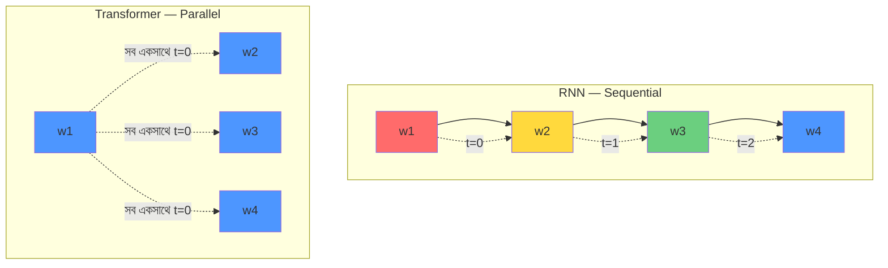
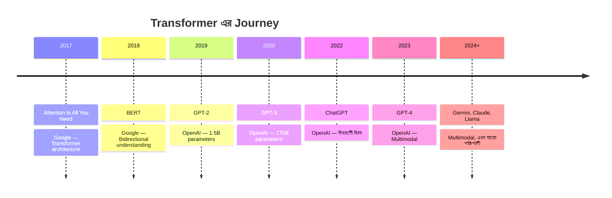
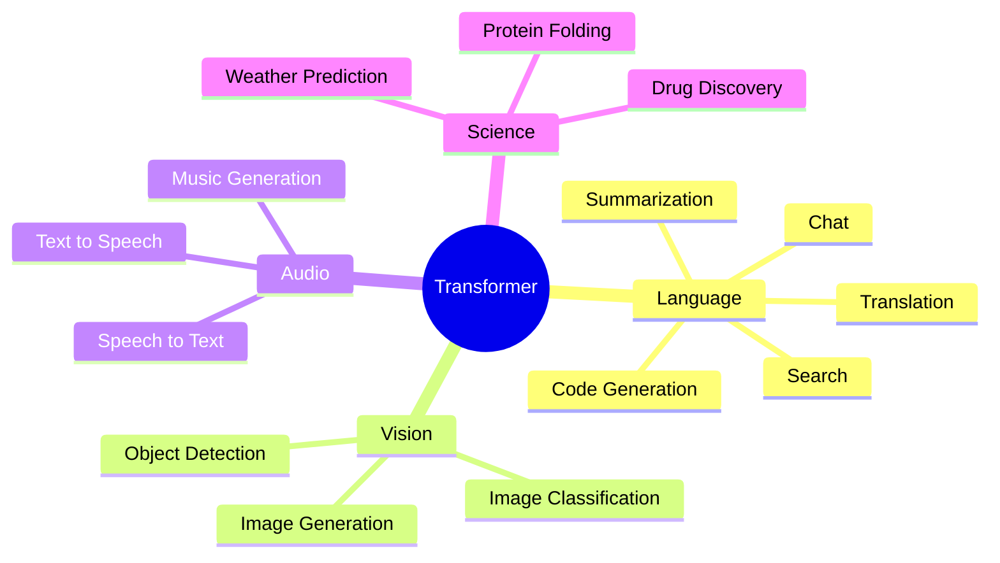

# Transformer কী ও কেন বিপ্লব

ভাবো তো — ২০১৭ সাল। Google এর একদল researcher একটা paper প্রকাশ করলো। নাম: **"Attention Is All You Need"**। কেউ ঘুণাক্ষরেও ভাবেনি এই paper টা AI এর পুরো দুনিয়া উল্টে দেবে। আজ থেকে ChatGPT, GPT-4, Gemini — এর পেছনে যে architecture, সেটার শুরুটা এখানেই।

এই chapter এ আমরা বুঝবো — Transformer আসার আগে কী ছিলো, সেগুলোর সমস্যা কী ছিলো, আর Transformer কীভাবে সব সমস্যা এক ঝটকায় সমাধান করে ফেললো। শুরু করা যাক!

---

## আগে কী ছিলো? RNN আর LSTM

Transformer আসার আগে ভাষা বোঝার কাজে মূলত **RNN (Recurrent Neural Network)** আর **LSTM (Long Short-Term Memory)** ব্যবহার হতো। এগুলোর কাজের কথা হলো — একটা বাক্য একটা একটা করে word পড়বে, ঠিক যেভাবে আমরা পড়ি।

```
The  →  cat  →  sat  →  on  →  the  →  mat
 ↓      ↓      ↓      ↓      ↓       ↓
h1  →  h2  →  h3  →  h4  →  h5  →  h6
```

এখানে h1, h2... হলো hidden states। প্রতিটা word পড়ার সময় RNN আগের word এর information carry করে রাখে। একদম সিকোয়েন্স হিসেবে — একটার পর একটা।

> [!important] মূল সমস্যা
> RNN বাক্যটা শুরু থেকে শেষ পর্যন্ত **একটা একটা করে** word পড়ে। এর মানে — সে একসাথে সব word দেখতে পায় না। আগের word টার "memory" পরের word এ পাঠায়। এই sequential nature টাই সব সমস্যার জন্ম।

### RNN এর তিনটা বড় সমস্যা

| সমস্যা | কী হয় | কেন খারাপ |
|--------|--------|-----------|
| **Sequential processing** | একটা word শেষ হলে পরেরটা | GPU কে ভালোভাবে use করতে পারে না |
| **Long-range forgetting** | বড় বাক্যে শুরুর word ভুলে যায় | প্রথম word এর meaning পরে দরকার হলে সমস্যা |
| **Vanishing gradient** | Training এ gradient ছোট হয়ে যায় | শুরুর layer গুলো কিছুই শেখে না |

চলো একটু প্রতিটা সমস্যা বুঝে নিই।

### সমস্যা ১: Sequential Processing — একটা একটা করে

RNN একটা word পড়ে, process করে, তারপর পরেরটা পড়ে। এর মানে হলো — তুমি যদি ১০০০ টা word এর বাক্য প্রসেস করো, RNN কে ১০০০ বার কাজ করতে হবে, একটার পর একটা। কোনো parallel work নেই।

```
RNN — Sequential (একটার পর একটা):

  w1 → [h1] → w2 → [h2] → w3 → [h3] → w4 → [h4]
       │           │           │           │
  t=0          t=1          t=2          t=3

  ⏱ সময় লাগে: 4 steps (step গুলো একসাথে হতে পারে না)
```

এটা একটা বড় সমস্যা — কারণ আধুনিক GPU গুলো parallel computing এ দারুণ। কিন্তু RNN GPU কে একা একা, একটা একটা করে কাজ করতে বাধ্য করে। GPU এর শক্তি কাজে লাগে না।

### সমস্যা ২: দীর্ঘ বাক্যে শুরুর word ভুলে যাওয়া

এই বাক্যটা পড়ো:

> "The **movie** that I watched yesterday at the new multiplex with my friends after dinner was really long and boring."

এখানে "movie" আর "boring" এর মধ্যে অনেকগুলো word আছে। RNN যখন "boring" এ পৌঁছায়, তখন "movie" এর memory অনেকটাই ফ্যাকাশে হয়ে গেছে। সে বুঝতে পারে না কোনটা boring — movie নাকি dinner!

### সমস্যা ৩: Vanishing Gradient

Training এর সময় gradient (learning signal) এক layer থেকে আরেক layer এ যাওয়ার সময় ছোট হতে ছোট হতে প্রায় শূন্য হয়ে যায়। ফলে শুরুর layer গুলো কিছুই শেখে না — training বসে থাকে।

> [!warn] LSTM কি সমাধান করেছিলো?
> LSTM এই forgetting সমস্যা কিছুটা কমিয়েছিলো — gate মেকানিজম দিয়ে। কিন্তু sequential nature টা থেকেই গেছে। বড় বাক্যে এখনো সমস্যা হতো। LSTM একটা band-aid ছিলো, সমাধান না।

---

## Transformer এর মূল Insight

এবার আসি মূল পয়েন্টে। Transformer এর paper এ যে একটাই জিনিস বলা হলো:

> **"Attention is All You Need"** — recurrence দরকার নেই। একসাথে সব word দেখো, আর decide করো কোন word গুলো important। ব্যস!

চলো একটা উদাহরণ দিয়ে বুঝি। এই বাক্যটা পড়ো:

> "The animal didn't cross the street because **it** was too tired."

এখানে **"it"** কে নির্দেশ করছে — animal কে নাকি street কে? তুমি সাথে সাথে বলবে — animal। কারণ তুমি পুরো বাক্যটা এক ঝলকে দেখেছো, আর context থেকে বুঝেছো।

RNN কে যদি এটা বুঝতে হয়, সে শুরু থেকে শেষ পর্যন্ত একটা একটা করে পড়বে, "it" এ পৌঁছানোর পর আগের memory গুলো খুঁজে বের করবে। কিন্তু Transformer এক ঝলকে সব word দেখে, আর "it" টা কোন word এর সাথে সবচেয়ে বেশি related সেটা attention দিয়ে বের করে।

```
Transformer — Parallel (একসাথে সব):

  The    animal  didn't  cross  the  street  because  it   was  tired
   │       │       │       │      │     │       │      │    │     │
   ▼       ▼       ▼       ▼      ▼     ▼       ▼      ▼    ▼     ▼
  ┌─────────────────────────────────────────────────────────────────┐
  │                    SELF-ATTENTION                              │
  │    সব word একসাথে একে অপরের দিকে তাকায়                          │
  │    "it" → animal (high attention)                              │
  │    "it" → street (low attention)                               │
  └─────────────────────────────────────────────────────────────────┘
                           │
                           ▼
                  Contextual বুঝে গেছে!

  ⏱ সময় লাগে: 1 step (সব একসাথে!)
```

> [!note] বাস্তব উদাহরণ
> যেভাবে তুমি বাক্য পড়ো — চোখ সবসময় word by word যায় না। তোমার চোখ jump করে গুরুত্বপূর্ণ অংশে। একইভাবে Transformer সব word একসাথে দেখে, আর focus করে যেগুলো দরকার।

---

## Parallel Processing — কেন GPU এর জন্য এটা game-changer

এই ব্যাপারটা একটু গভীরে যাই। GPU মানেই parallel computing — হাজার হাজার core একসাথে কাজ করতে পারে। কিন্তু RNN কে বলো কী — সে তো sequential! এক step শেষ না হলে পরের step শুরু করতে পারবে না।

Transformer কিন্তু সব word একসাথে প্রসেস করে। GPU এর হাজার core সব একসাথে কাজ করে।



এর অর্থ হলো — training সময়ে RNN এর তুলনায় Transformer অনেক গুণ দ্রুত। বড় মডেল, বেশি data — সব সম্ভব হলো এই parallelism এর জন্য।

> [!important] কেন এত গুরুত্বপূর্ণ?
> GPT-3 কে train করতে যে পরিমাণ data আর compute লেগেছে, সেটা RNN দিয়ে করা ছিলো বাস্তবে অসম্ভব। Transformer এর parallelism এর জন্যই এই scale এ মডেল train করা সম্ভব হলো।

---

## Timeline — Transformer থেকে আজকের AI



| Year | Model | কী নিয়ে এসেছে | গুরুত্ব |
|------|-------|----------------|---------|
| 2017 | **Transformer** | Self-attention architecture | ভিত্তি |
| 2018 | **BERT** | Bidirectional context | বোঝার ক্ষমতা |
| 2019 | **GPT-2** | 1.5B parameters | লেখার ক্ষমতা |
| 2020 | **GPT-3** | 175B parameters, few-shot | Scale এর শক্তি |
| 2022 | **ChatGPT** | RLHF, conversation | জনসাধারণে আগমন |
| 2023 | **GPT-4** | Multimodal, reasoning | পরবর্তী প্রজন্ম |
| 2024+ | **Gemini, Claude, Llama** | বিভিন্ন উন্নতি | প্রতিযোগিতা |

---

## Transformer দিয়ে কী কী করা যায়?

Transformer শুধু ভাষা নিয়ে কাজ করে না। এটা একটা universal architecture — যেকোনো sequential বা structured data এর জন্য কাজ করে।

```
┌──────────────────────────────────────────────────────┐
│                 Transformer এর Use Cases             │
├──────────────┬───────────────────────────────────────┤
│ Translation  │ Google Translate এর মতো               │
│              │ এক ভাষা থেকে আরেক ভাষা                │
├──────────────┼───────────────────────────────────────┤
│ Summarization│ বড় আর্টিকেল থেকে short summary        │
├──────────────┼───────────────────────────────────────┤
│ Code Gen     │ GitHub Copilot — কোড লেখা দেয়        │
├──────────────┼───────────────────────────────────────┤
│ Chat         │ ChatGPT — conversation                │
├──────────────┼───────────────────────────────────────┤
│ Image        │ Vision Transformer (ViT)              │
├──────────────┼───────────────────────────────────────┤
│ Audio        │ Whisper — speech to text              │
├──────────────┼───────────────────────────────────────┤
│ Science      │ AlphaFold — protein structure         │
└──────────────┴───────────────────────────────────────┘
```



> [!note] মজার ব্যাপার
> AlphaFold — যেটা দিয়ে protein structure predict করা হয় — সেটাও Transformer এর variation ব্যবহার করে। Transformer শুধু ভাষা না, biology তেও বিপ্লব এনেছে!

---

## RNN vs Transformer — Head to Head

| Feature | RNN / LSTM | Transformer |
|---------|-----------|-------------|
| **Processing** | Sequential (একটা একটা) | Parallel (একসাথে) |
| **GPU Usage** | খারাপ — অনেক core বসে থাকে | দারুণ — সব core কাজ করে |
| **Long-range** | মনে রাখতে পারে না ভালো | Attention দিয়ে দেখে সব |
| **Training Speed** | ধীর | অনেক দ্রুত |
| **Scaling** | বড় মডেল কঠিন | সহজে scale করা যায় |
| **Complexity** | O(n) sequential | O(n²) কিন্তু parallel |
| **Context** | Limited window | Full sequence |

> [!warn] একটা ভুল ধারণা
> কেউ কেউ ভাবে Transformer সব দিক থেকে RNN এর চেয়ে ভালো। আসলে না। Transformer এর O(n²) complexity আছে — বড় sequence তে memory অনেক লাগে। কিন্তু parallelism এর সুবিধা এত বড় যে এই সমস্যা সহ্য করা যায়।

---

## একটা সহজ Code উদাহরণ

চলো একটা সহজ PyTorch উদাহরণ দেখি। নিচের কোডটা একটা ছোট self-attention block দেখায়। এখন সব বুঝতে হবে না — শুধু feel টা নাও।

এই কোডে আমরা একটা simple self-attention implement করবো। পরের chapter গুলোতে এটা বিস্তারিত বুঝবো।

```python
import torch
import torch.nn.functional as F

# ধরো আমাদের একটা বাক্য আছে ৪ টা word দিয়ে
# প্রতিটা word কে ৮ ডাইমেনশনের vector দিয়ে represent করছি
# এই vector কে "embedding" বলে

x = torch.randn(4, 8)  # 4 words, 8-dim embedding each

# Query, Key, Value এর জন্য তিনটা weight matrix
# এগুলো শেখে model টা training এর সময়
W_query = torch.randn(8, 8)
W_key   = torch.randn(8, 8)
W_value = torch.randn(8, 8)

# প্রতিটা word এর জন্য Query, Key, Value বানাও
Q = x @ W_query   # (4, 8) — "আমি কী খুঁজছি?"
K = x @ W_key     # (4, 8) — "আমার কাছে কী আছে?"
V = x @ W_value   # (4, 8) — "আমার আসল অর্থ এটাই"

# Query আর Key এর dot product → attention scores
# বেশি score = দুটো word বেশি related
scores = Q @ K.transpose(0, 1)  # (4, 4)

# scale করো (training stable রাখার জন্য)
scores = scores / (8 ** 0.5)

# softmax → probability (0 থেকে 1, সব মিলে 1)
attention_weights = F.softmax(scores, dim=-1)  # (4, 4)

# Value গুলোর weighted sum → contextual output
output = attention_weights @ V  # (4, 8)
```

উপরের কোডে যা হলো:
- প্রতিটা word তিনটা জিনিস বানালো — Query (কী খুঁজছি), Key (কী আছে), Value (আসল অর্থ)
- Query আর Key match করে attention score বের হলো
- Softmax দিয়ে score গুলো probability তে পরিণত হলো
- Value গুলোর weighted sum দিয়ে প্রতিটা word এর নতুন, contextual representation পাওয়া গেলো

> [!important] এটাই হলো Attention!
> উপরের এই ছোট কোডটাই attention mechanism এর মূল। পুরো GPT, পুরো BERT — সবার ভেতরে এটাই ঘটছে। বিস্তারিত আমরা **Attention Mechanism এর ইনটুইশন** chapter এ শিখবো।

---

## সারসংক্ষেপ

এই chapter এ আমরা যা শিখলাম:

1. **RNN আর LSTM** ছিলো Transformer এর আগের main model — sequential processing করতো
2. **Sequential processing** এর কারণে GPU ভালোভাবে use করা যেতো না, আর বড় বাক্যে শুরুর word ভুলে যেতো
3. **Transformer (2017)** বললো — attention দিয়ে সব word একসাথে দেখো, recurrence দরকার নেই
4. **Parallel processing** এর জন্য GPU ভালোভাবে use হয়, training দ্রুত হয়, বড় মডেল train করা যায়
5. ২০১৭ থেকে আজ পর্যন্ত — BERT, GPT, ChatGPT, GPT-4 — সব এই architecture এর উপর দাঁড়িয়ে আছে

> [!note] পরবর্তী Chapter
> এখন তুমি জানো Transformer কেন দরকার ছিলো। পরের chapter এ আমরা দেখবো — Transformer এর ঠিক আগে পর্যন্ত Seq2Seq আর Encoder-Decoder কীভাবে কাজ করতো, আর bottleneck problem টা কী ছিলো যেটা solve করতে গিয়ে attention এর জন্ম হলো। যাও: [Pre-Transformer: Seq2Seq ও RNN এর সীমাবদ্ধতা](./seq2seq-evolution.md)