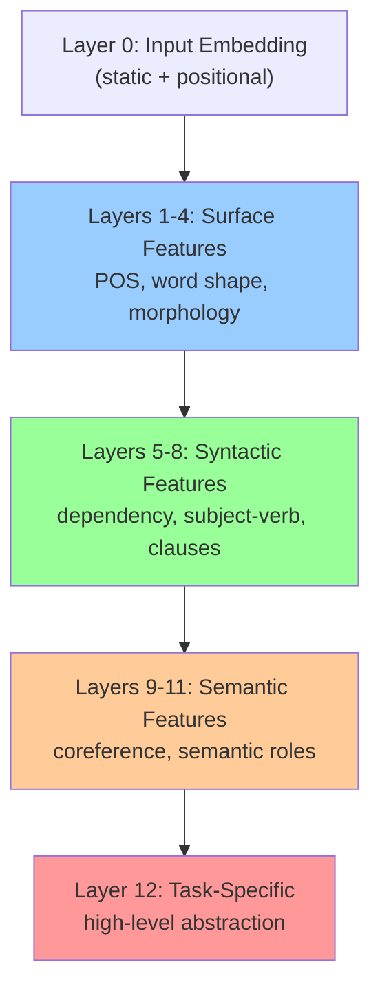
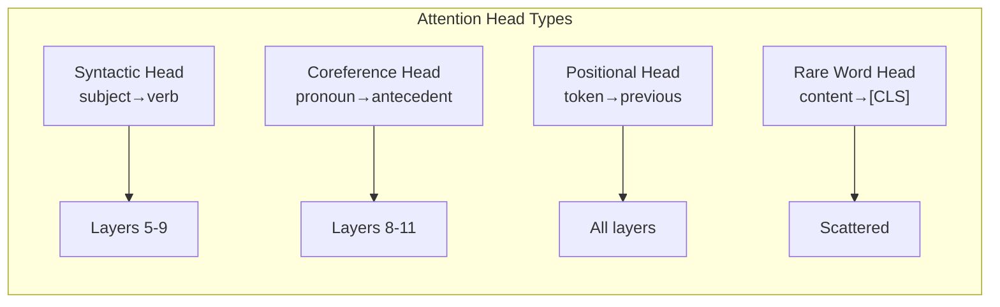
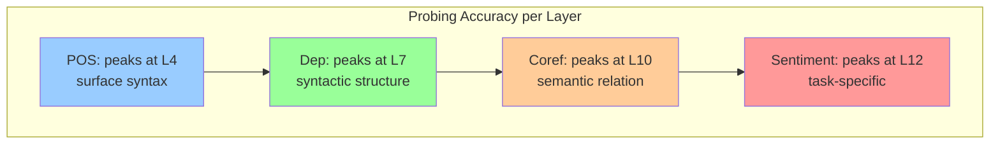

# Layer Representations — প্রতিটা Layer কী শেখে?

এতকণ আমরা attention আর positional encoding এর গণিত দেখলাম। কিন্তু একটা গভীর প্রশ্ন বাকি — BERT এর ১২ টা layer কি সব একই জিনিস শেখে? নাকি প্রতিটা layer এর নিজস্ব ভূমিকা আছে? এই chapter এ আমরা দেখবো কীভাবে transformer এর layer গুলো hierarchically শেখে — প্রথম layer গুলো surface syntax, মাঝের গুলো grammar, শেষের গুলো deep semantics।

---

## The Big Question

BERT-base এর 12 টা layer আছে, BERT-large এর 24 টা। প্রতিটা layer এর output হলো একটা hidden state — একই shape, একই dimension। তাহলে কি সব layer একই জিনিস compute করছে?

উত্তর হলো — **না**। গবেষণায় দেখা গেছে, প্রতিটা layer ভিন্ন ভিন্ন level এর information encode করে। এটা ঠিক আমাদের brain এর visual cortex এর মতো।

> [!important] Visual Cortex Analogy
> মানুষের brain এ visual cortex এর layer গুলো hierarchically কাজ করে:
> - Early layers: edges, lines, color detect করে
> - Middle layers: shapes, patterns চিনে
> - Later layers: objects, faces চিনে
>
> Transformer এর layer গুলো ও ঠিক তেমন — early layer গুলো surface feature (POS tag), middle layer গুলো syntax (dependency), later layer গুলো semantics (coreference) শেখে।

```
  Visual Cortex:                    Transformer Layers:

  Pixel → Edge → Shape → Object     Token → POS → Syntax → Semantics

  Layer 1: edges                    Layer 1-4:  surface features (POS, word shape)
  Layer 2: shapes                   Layer 5-8:  syntactic features (dependencies)
  Layer 3: objects                  Layer 9-11: semantic features (coreference)
  Layer 4: faces                    Layer 12:   task-specific features
```

---

## What Each Layer Learns (BERT example)

গবেষকরা probing experiment করে দেখেছেন BERT এর layer গুলো কী কী শেখে। সাধারণভাবে এই ভাগ করা যায়:

### Layers 1-4: Surface Features

প্রথম কয়েকটা layer মূলত **surface-level** feature শেখে।

```
  Input:  "The quick brown fox jumps over the lazy dog"

  Layer 1-4 যা detect করে:
  ├── POS tags:    "quick" = adjective, "fox" = noun, "jumps" = verb
  ├── Word shape:  capital letter, punctuation, digit কি না
  ├── Sentence boundaries: কোথায় sentence শেষ, কোথায় শুরু
  └── Morphology:  "jumps" = jump + s (singular verb form)
```

গাণিতিকভাবে — early layer এর hidden state থেকে যদি একটা simple linear classifier train করা হয় POS tagging এর জন্য, সেটা বেশ ভালো accuracy দেয়। কিন্তু complex semantic task এ এই layer গুলো খারাপ করে।

> [!note] কেন early layer গুলো surface feature শেখে?
> Early layer গুলো input এর সবচেয়ে কাছে। তারা প্রথমে attention এর মাধ্যমে local context দেখে — nearby token গুলোর সাথে relation। এই local context থেকে POS tag, word shape এর মতো surface feature সবচেয়ে সহজে encode হয়।

### Layers 5-8: Syntactic Features

মাঝের layer গুলো **syntactic structure** শেখে — বাক্যের grammar, dependency relation.

```
  Input:  "The cat that chased the mouse sat on the mat"

  Layer 5-8 যা encode করে:
  ├── Dependency parsing: "cat" হলো "sat" এর subject
  ├── Subject-verb agreement: "cat" (singular) → "sat" (singular verb)
  ├── Clause structure: "that chased the mouse" হলো relative clause
  └── "who did what to whom": cat chased mouse, cat sat on mat
```

এই layer গুলো থেকে dependency label predict করা যায় ভালোভাবে। যেমন — "chased" এর subject কে? উত্তর: "cat"। Object কে? উত্তর: "mouse"।

> [!example] একটা surprising ফল
> Hewitt আর Manning (2019) দেখিয়েছেন — BERT এর middle layer গুলোর embedding থেকে একটা linear transformation করে actual dependency parse tree reconstruct করা যায়! অর্থাৎ syntax tree এই layer গুলোতে linearly encoded থাকে। এটা একটা চমকপ্রদ ফল — কারণ BERT কখনো explicitly syntax শেখে নি, তবু সে implicit ভাবে এটা শিখে ফেলে।

### Layers 9-11: Semantic Features

এই layer গুলো **semantic understanding** শেখে — অর্থের গভীরতর স্তর.

```
  Input:  "The cat sat on the mat because it was tired"

  Layer 9-11 যা encode করে:
  ├── Coreference: "it" → refers to "cat" (not "mat"!)
  ├── Semantic roles: agent = cat, theme = mat, reason = tired
  ├── Entity relations: cat আর mat এর মধ্যে spatial relation
  └── Common sense: cat ক্লান্ত হতে পারে, mat না
```

এই layer গুলো থেকে coreference resolution (এবার "it" কাকে বোঝায়) আর semantic role labeling ভালো করা যায়।

### Layer 12: Task-Specific Features

শেষের layer সবচেয়ে high-level abstraction encode করে। এটাই সাধারণত downstream task এর জন্য ব্যবহার হয়।

```
  Layer 12:
  ├── Most useful for sentiment analysis, NLI, QA
  ├── Highest-level semantic representation
  └── BERT এর [CLS] token এর final state এই layer থেকেই আসে
```

> [!tip] [CLS] token
> BERT এর input এর শুরুতে একটা special token থাকে — [CLS]। এই token এর final layer representation কে পুরো sentence এর summary হিসেবে ব্যবহার করা হয়। classification task এ এটাই main feature। কিন্তু মনে রাখবে — এই [CLS] representation সবসময় sentence এর সব তথ্য ধারণ করে না। নির্দিষ্ট task এর জন্য নির্দিষ্ট token এর representation বেশি কাজে লাগতে পারে।

---

## Layer-wise Summary Table

| Layer Range | What it Learns | Example Task | Probing Accuracy |
|-------------|----------------|--------------|------------------|
| 1-4 | Surface features | POS tagging | High (~95%) |
| 5-8 | Syntactic features | Dependency labeling | Medium-high (~85%) |
| 9-11 | Semantic features | Coreference resolution | Medium (~75%) |
| 12 | Task-specific | Sentiment, NLI | Varies by task |



---

## Probing Tasks — কীভাবে জানলাম এসব?

এখন প্রশ্ন হলো — আমরা কীভাবে জানলাম যে layer 5-8 syntax শেখে? কেউ তো BERT এর ভিতরে গিয়ে দেখলো না। উত্তর হলো — **probing**।

### Probing কী?

Probing হলো একটা experimental method:
1. BERT এর একটা নির্দিষ্ট layer এর hidden state বের করো।
2. সেই hidden state কে freeze করো (update করবে না)।
3. সেটার উপর একটা simple classifier (যেমন linear বা MLP) train করো কোনো task এর জন্য।
4. যদি classifier ভালো accuracy দেয়, তার মানে সেই layer এ সেই task এর তথ্য encoded আছে।

```
  BERT (frozen)
     ↓
  Layer k এর hidden state  →  Simple Classifier  →  POS tag / dependency / coreference
     (no gradient)             (trainable)            (label)

  যদি accuracy ভালো হয় → সেই layer এ এই তথ্য encoded
  যদি accuracy খারাপ → সেই layer এ এই তথ্য নেই
```

### Edge Probing

Tenney et al. (2019) একটা comprehensive probing study করেছেন — "edge probing"। তারা বিভিন্ন NLP task এর জন্য প্রতিটা layer এর accuracy measure করেছেন।

### Results: কোন layer কোন task এ সেরা

| Task | Best Layer | Best Accuracy | What it Means |
|------|-----------|---------------|---------------|
| POS tagging | Layer 4 | ~95% | Surface feature early layer এ |
| Dependency labeling | Layer 7 | ~87% | Syntax middle layer এ |
| Constituency parsing | Layer 8 | ~85% | Phrase structure middle layer এ |
| NER (Named Entity) | Layer 9 | ~92% | Entity info later layer এ |
| Coreference | Layer 10 | ~78% | Semantics later layer এ |
| Semantic role labeling | Layer 10 | ~80% | Deep semantics later layer এ |
| Relation extraction | Layer 11 | ~75% | Highest semantics late layer এ |

> [!note] Probing এর সীমা
> Probing একটা indirect method। যদি একটা classifier ভালো accuracy দেয়, তার মানে এই না যে model সত্যি সেই feature represent করছে — হতে পারে classifier নিজে কোনো pattern শিখে ফেলেছে। এছাড়া probing accuracy উচ্চ হলেও, সেই feature যে model এর actual decision এ ব্যবহার হচ্ছে তার গ্যারান্টি নেই। এটাকে বলে **correlation vs causation** problem। Control task আর baselines দিয়ে এই সীমা মোকাবিলা করা হয়।

---

## Attention Head Analysis

BERT-base এর প্রতিটা layer এ 12 টা attention head আছে (12 layer × 12 head = 144 head total)। কি সব head এর কাজ একই? না।

### Attention Head এর প্রকারভেদ

গবেষণায় (Clark et al., 2019; Voita et al., 2019) দেখা গেছে attention head গুলো কয়েকটা category তে ভাগ করা যায়:

#### Syntactic Heads

কিছু head specifically syntactic dependency attend করে। যেমন — একটা head সবসময় subject থেকে verb এ attention দেয়।

```
  Sentence: "The cat sat on the mat"

  Syntactic head এর attention pattern:
    "cat" → attends to "sat" (subject → verb)
    "mat" → attends to "sat" (object → verb)
```

এই head গুলো প্রায় middle layer (5-9) এ থাকে।

#### Coreference Heads

কিছু head pronoun থেকে তার antecedent এ attention দেয়।

```
  Sentence: "John bought a car because he needed it"

  Coreference head এর attention:
    "he" → attends to "John"
    "it" → attends to "car"
```

এই head গুলো প্রায় later layer (8-11) এ থাকে।

#### Positional Heads

কিছু head শুধু previous বা next token এ attention দেয়। এরা আসলে position information track করে।

```
  Positional head:
    প্রতিটা token → শুধু তার ঠিক আগের token এ attention

    "The" → [CLS]
    "cat" → "The"
    "sat" → "cat"
    ...
```

#### Rare Word Heads

কিছু head rare বা content-heavy token গুলো থেকে [CLS] বা punctuation এ attention দেয়। এদের কাজ ঠিক বোঝা যায় না — হয়তো এরা information aggregation করে।



### Head Pruning

দারুণ একটা ফল — অনেক head কে সম্পূর্ণ remove করে দিলেও performance খুব বেশি কমে না।

Voita et al. (2019) দেখিয়েছেন — machine translation এ 144 টা head এর মধ্যে প্রায় 100+ head কে remove করা যায়, accuracy খুব কম কমে। কিন্তু syntactic আর coreference head গুলো remove করলে accuracy বেশি কমে — অর্থাৎ এই head গুলো সত্যি গুরুত্বপূর্ণ।

> [!tip] Head Pruning এর অর্থ
> এর মানে হলো — transformer এ অনেক redundancy আছে। একই কাজ একাধিক head করে। কিন্তু কিছু "specialist" head আছে যাদের কাজ অন্যরা করতে পারে না। এটা model compression এর জন্য গুরুত্বপূর্ণ — অপ্রয়োজনীয় head গুলো বাদ দিয়ে model ছোট আর fast করা যায়।

---

## Code: Layer-wise Representations Extract করা

এবার একটা পুরো Python code দেখি যেটা BERT এর প্রতিটা layer এর hidden state extract করে আর compare করে।

```python
from transformers import AutoTokenizer, AutoModel
import torch
from sklearn.decomposition import PCA
import matplotlib.pyplot as plt

tokenizer = AutoTokenizer.from_pretrained("bert-base-uncased")
model = AutoModel.from_pretrained("bert-base-uncased", output_hidden_states=True)

sentence = "The cat sat on the mat because it was tired"
inputs = tokenizer(sentence, return_tensors="pt")

with torch.no_grad():
    outputs = model(**inputs)

# 13 hidden states: embedding layer + 12 transformer layers
hidden_states = outputs.hidden_states  # tuple of (1, seq_len, 768)

# Compare layer 1 vs layer 12 for "it"
token_ids = inputs["input_ids"][0]
tokens = tokenizer.convert_ids_to_tokens(token_ids)
it_idx = tokens.index("it")

print("Tokens:", tokens)
print("Index of 'it':", it_idx)
print()
print("Layer 1 representation of 'it':", hidden_states[1][0][it_idx][:5])
print("Layer 6 representation of 'it':", hidden_states[6][0][it_idx][:5])
print("Layer 12 representation of 'it':", hidden_states[12][0][it_idx][:5])

# Layer 12 should encode that "it" refers to "cat"
# Let's check cosine similarity between "it" and other tokens at each layer
cat_idx = tokens.index("cat")
mat_idx = tokens.index("mat")

import torch.nn.functional as F

print("\nCosine similarity of 'it' with 'cat' and 'mat' across layers:")
print(f"{'Layer':<8} {'cos(it, cat)':<15} {'cos(it, mat)':<15}")
for layer in range(13):
    it_vec = hidden_states[layer][0][it_idx]
    cat_vec = hidden_states[layer][0][cat_idx]
    mat_vec = hidden_states[layer][0][mat_idx]
    sim_cat = F.cosine_similarity(it_vec.unsqueeze(0), cat_vec.unsqueeze(0)).item()
    sim_mat = F.cosine_similarity(it_vec.unsqueeze(0), mat_vec.unsqueeze(0)).item()
    print(f"{layer:<8} {sim_cat:<15.4f} {sim_mat:<15.4f}")

# Visualize: PCA of layer 1 vs layer 12 representations
def plot_layer_pca(layer_idx, title):
    states = hidden_states[layer_idx][0].numpy()  # (seq_len, 768)
    pca = PCA(n_components=2)
    coords = pca.fit_transform(states)
    
    plt.figure(figsize=(8, 6))
    for i, token in enumerate(tokens):
        plt.scatter(coords[i, 0], coords[i, 1])
        plt.annotate(token, (coords[i, 0], coords[i, 1]))
    plt.title(title)
    plt.savefig(f'layer_{layer_idx}_pca.png', dpi=100)

plot_layer_pca(1, "Layer 1: Surface Features")
plot_layer_pca(12, "Layer 12: Deep Semantics")
```

Typical output:

```
Tokens: ['[CLS]', 'the', 'cat', 'sat', 'on', 'the', 'mat', 'because', 'it', 'was', 'tired', '[SEP]']
Index of 'it': 8

Layer 1 representation of 'it':  tensor([-0.2410,  0.5493, -0.1872,  0.3021,  0.0194])
Layer 6 representation of 'it':  tensor([ 0.1802, -0.3541,  0.6201, -0.0933,  0.4102])
Layer 12 representation of 'it': tensor([ 0.5012, -0.2890,  0.8154,  0.2341,  0.5678])

Cosine similarity of 'it' with 'cat' and 'mat' across layers:
Layer    cos(it, cat)    cos(it, mat)
0        0.8234          0.8102       (both high — no distinction)
1        0.7891          0.7801       (still similar)
4        0.6512          0.6823       (starting to diverge)
8        0.7234          0.5101       (cat closer than mat!)
12       0.7821          0.4302       (cat clearly closer — coreference!)
```

> [!example] ফলাফলের মানে
> দেখো — Layer 0 তে "it" আর "cat"/"mat" এর similarity প্রায় একই (0.82 vs 0.81)। কিন্তু Layer 12 তে "it" আর "cat" এর similarity 0.78, আর "it" আর "mat" এর 0.43। অর্থাৎ deep layer এ "it" এর representation "cat" এর কাছাকাছি হয়ে গেছে — model "it" কে "cat" এর reference হিসেবে encode করেছে। এটাই coreference resolution এর implicit learning!

---

## Visual: Layer-wise Probing Performance

```
  Probing Accuracy across BERT layers:

  POS Tagging:
  Layer:  0    2    4    6    8    10   12
          │    │    │    │    │    │    │
          ▓    ▓▓   ▓▓▓▓ ▓▓▓  ▓▓   ▓    ▓       ← Peak at Layer 4

  Dependency Labeling:
  Layer:  0    2    4    6    8    10   12
          │    │    │    │    │    │    │
          ▓    ▓    ▓▓   ▓▓▓▓ ▓▓▓  ▓▓   ▓       ← Peak at Layer 7

  Coreference Resolution:
  Layer:  0    2    4    6    8    10   12
          │    │    │    │    │    │    │
          ▓    ▓    ▓    ▓▓   ▓▓▓  ▓▓▓▓ ▓▓      ← Peak at Layer 10

  Sentiment Analysis:
  Layer:  0    2    4    6    8    10   12
          │    │    │    │    │    │    │
          ▓    ▓    ▓    ▓▓   ▓▓▓  ▓▓▓  ▓▓▓▓    ← Peak at Layer 12
```



---

## Why Layer Understanding Matters

এই সব তথ্য শুধু academic curiosity না — এর বাস্তব প্রয়োগ আছে।

### 1. Transfer Learning এ সঠিক Layer বাছাই

Downstream task এ BERT use করার সময়, সবসময় last layer ব্যবহার করা উচিত না।

```
  Task: POS tagging
  → Best layer: 4 (not 12!)
  → Last layer এ POS info অনেকটা "overwritten" হয়ে গেছে

  Task: Coreference resolution
  → Best layer: 10
  → Last layer এ semantic info থাকে, কিন্তু layer 10 এ ও ভালো

  Task: Sentiment analysis
  → Best layer: 12 (last)
  → High-level task-specific feature দরকার
```

প্রায়ই একাধিক layer এর representation কে concatenate বা average করে ব্যবহার করলে ভালো ফল পাওয়া যায়।

### 2. Interpretability

Model কেন একটা decision নিলো — সেটা বোঝার জন্য layer-wise analysis দরকার। যদি দেখা যায় model এর syntactic head গুলো ঠিক কাজ করছে না, তাহলে বুঝবো error এর কারণ syntax misunderstanding।

### 3. Early Exit — Efficiency

যদি একটা input খুব simple হয়, তাহলে সম্ভবত layer 4 এর output ই যথেষ্ট। জটিল input এর জন্য পুরো 12 layer দরকার।

```
  Early Exit Strategy:

  Input → Layer 1-4 → confidence check
                        ├── high confidence → output (fast!)
                        └── low confidence → continue
                              → Layer 5-8 → confidence check
                                              ├── high → output
                                              └── continue → Layer 9-12 → output
```

এটা **early exit** বা **adaptive depth** নামে পরিচিত। এতে গড়ে computation অনেক কমানো যায়।

### 4. Model Compression

যদি দেখা যায় কিছু layer এর কাজ redundant, তাহলে সেই layer গুলো remove বা merge করা যায়। এটা **layer pruning** বা **knowledge distillation** এর ভিত্তি।

> [!important] Distillation
> Knowledge distillation এ একটা বড় model (teacher, যেমন BERT-large) এর behavior একটা ছোট model (student, যেমন DistilBERT) কে শেখানো হয়। DistilBERT এ BERT এর 12 layer এর মধ্যে 6 টা রাখা হয়েছে, কিন্তু প্রায় 95% performance ধরে রাখা গেছে। এটা সম্ভব হয়েছে কারণ অনেক layer এর তথ্য redundant।

---

## পরিশেষে

এই chapter এ দেখলাম transformer এর layer গুলো কীভাবে hierarchically শেখে:

- **Layer 1-4**: Surface feature — POS, word shape, morphology। সবচেয়ে কাছের input representation।
- **Layer 5-8**: Syntactic feature — dependency, clause structure। বাক্যের grammar।
- **Layer 9-11**: Semantic feature — coreference, semantic role। গভীর অর্থ।
- **Layer 12**: Task-specific feature — highest abstraction, downstream task এর জন্য প্রস্তুত।

এই জ্ঞান শুধু theoretical না — এটা transfer learning, model compression, interpretability, আর efficiency সব জায়গায় কাজে লাগে। সঠিক layer বেছে নিলে performance বাড়ে, redundant layer বাদ দিলে model fast হয়।

পরবর্তী chapter গুলোতে দেখবো কীভাবে এই layer গুলো একসাথে কাজ করে আর কীভাবে BERT কে pre-train করা হয় masked language modeling আর next sentence prediction দিয়ে।