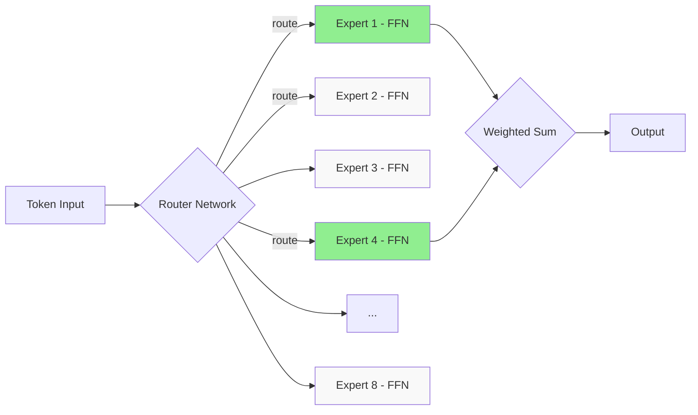

# Modern Improvements — RoPE, Flash Attention, MoE, GQA

So much has changed since the 2020 original Transformer paper! The original architecture is good, but modern LLMs (Llama, Mistral, GPT-4) are far more efficient and powerful. In this chapter we'll see how transformers have been made faster, smaller, and smarter in 2023-2026.

Think of this as an upgrade guide — just like when a new phone version comes out and everything gets smoother, transformers have had many upgrades too.

---

## RoPE (Rotary Position Embedding)

### Problem: How to Represent Position?

The Transformer by itself doesn't understand sequence position — "I am well" and "well am I" would give the same output. So position information needs to be provided separately.

Earlier, absolute positional encoding was used — a fixed vector for position 1, another for position 2. But there's a problem: the model has to learn how relative position works.

### RoPE's Idea: Rotate!

RoPE's core idea — rotate the query and key vectors according to their position. See what happens:

```
  Query at position m:  q_m = R(m) · q
  Key at position n:    k_n = R(n) · k

  Where R(θ) is a rotation matrix

  Attention score:
    q_m · k_n = (R(m)·q) · (R(n)·k)
              = q · R(m-n) · k
                    ^^^^^^^
              Only relative position (m-n) matters!
```

```
    Imagine a 2D vector rotating according to position:

    pos 0      pos 1      pos 2      pos 3
      ↑          ↗          →          ↘
      |         /           |            \
   q₀°=0°   q₁°=90°    q₂°=180°   q₃°=270°

    The dot product of two vectors depends
    only on their angle difference — i.e., relative position!
```

The code below shows a simplified version of RoPE. The core concept is — rotate query and key according to position like complex numbers. In real implementation, dimensions are rotated in pairs.

```python
import torch
import torch.nn as nn
import math

def apply_rope(x, positions):
    """
    x shape: (batch, heads, seq_len, d_head)
    positions shape: (seq_len,)
    Simplified 2D version of RoPE — rotate dimensions in pairs
    """
    d_head = x.shape[-1]
    half = d_head // 2

    # create frequency for each pair
    freqs = 1.0 / (10000 ** (torch.arange(0, half).float() / half))
    # positions × freqs → angle
    angles = positions[:, None] * freqs[None, :]  # (seq_len, half)

    cos = torch.cos(angles)  # (seq_len, half)
    sin = torch.sin(angles)

    # split x into pairs
    x1 = x[..., 0::2]  # even index
    x2 = x[..., 1::2]  # odd index

    # apply rotation: rotate each pair (x1, x2)
    rotated_x1 = x1 * cos - x2 * sin
    rotated_x2 = x1 * sin + x2 * cos

    # interleave back together
    result = torch.stack([rotated_x1, rotated_x2], dim=-1).flatten(-2)
    return result
```

In the code above, the `apply_rope` function takes a query or key tensor and applies frequency-based rotation for each position. The `freqs` part has a different frequency for each dimension pair — slower rotation for lower dimensions, faster for higher. This captures both short-range and long-range relationships.

> [!note] Why Is RoPE Better?
> With absolute encoding, the model had to learn "the difference between position 5 and position 10 is 5." But with RoPE, due to rotation, the attention score naturally depends on relative position. No extra learning needed. And it extrapolates — works on new positions too.

> [!important] Which Models Use RoPE?
> Llama (1/2/3), Mistral, Gemma, Qwen, DeepSeek — almost all modern LLMs use RoPE today. It's now the de facto standard.

---

## Flash Attention (v1/v2)

### The O(n²) Problem

Attention has a big problem — both memory and computation are O(n²). Because every token attends to every other token.

```
  Sequence length n = 4096:

  Attention matrix size = 4096 × 4096 = 16,777,216 entries

  n = 16384 → 268 million entries!
  n = 65536 → 4.3 BILLION entries! 😱

  ┌────────────────────────────┐
  │   Full n × n Attention     │
  │   ████████████████████████ │
  │   ████████████████████████ │
  │   ████████████████████████ │  ← entire matrix must be
  │   ████████████████████████ │     kept in memory (HBM)
  │   ████████████████████████ │
  └────────────────────────────┘
        Memory: O(n²) 😞
```

### Flash Attention: Work in Tiles

Flash Attention's idea is simple but brilliant — instead of keeping the whole matrix in memory, divide it into small tiles and compute in SRAM (GPU's fast cache).

```
  Traditional Attention:
  ┌─────────┐    ┌─────────────────┐    ┌────────┐
  │  Q, K, V │ →  │ Full n×n matrix │ →  │ Output │
  └─────────┘    │  Written to HBM │    └────────┘
                 └─────────────────┘
  HBM read/write: O(n²) — very slow!

  Flash Attention:
  ┌─────────┐    ┌──────┐ ┌──────┐ ┌──────┐    ┌────────┐
  │  Q, K, V │ →  │ Tile │+│ Tile │+│ Tile │ →  │ Output │
  └─────────┘    └──────┘ └──────┘ └──────┘    └────────┘
                 └── Compute in SRAM ──┘
  HBM read/write: Much less! 🚀
```

What does this mean? A GPU has two types of memory — HBM (large but slow) and SRAM (small but fast). Flash Attention reduces HBM read/writes and does more computation in SRAM. And the best part — the mathematical result is exactly the same! No approximation.

```
  GPU Memory Hierarchy:

  ┌───────────────────┐
  │     SRAM          │  ← Very fast (19 TB/s)
  │   (~20 MB)        │     but small
  ├───────────────────┤
  │     HBM           │  ← Slower (~2 TB/s)
  │   (~40-80 GB)     │     but large
  ├───────────────────┤
  │   DRAM / Host     │  ← Much slower
  └───────────────────┘

  Flash Attention: reduces HBM access, uses more SRAM
  = wall clock time much lower!
```

> [!important] Flash Attention Key Points
> - Mathematical result is exactly the same as traditional attention (exact, not approximate)
> - 2-4x speedup is common
> - O(n) memory (down from O(n²))
> - Built into PyTorch 2.0+: `F.scaled_dot_product_attention`
> - Flash Attention v2 has even better parallelism

The code below shows how to use Flash Attention in PyTorch. Notice — it's very easy, just one line.

```python
import torch
import torch.nn.functional as F

# In PyTorch 2.0+, Flash Attention is built-in!
q = torch.randn(1, 8, 4096, 64, device="cuda")  # (batch, heads, seq, d_head)
k = torch.randn(1, 8, 4096, 64, device="cuda")
v = torch.randn(1, 8, 4096, 64, device="cuda")

# This single line automatically uses Flash Attention
output = F.scaled_dot_product_attention(q, k, v)

print(output.shape)  # torch.Size([1, 8, 4096, 64])
# 2-4x faster, much less memory, but same result!
```

In this code, `scaled_dot_product_attention` automatically chooses Flash Attention inside PyTorch. No need to do anything manually — it looks at the GPU and input shape and decides automatically. So you could say, in modern code there's no need to write explicit attention computation.

---

## KV Cache

### Problem: Doing the Same Work Over and Over!

What happens during generation? Suppose after generating "I am well," it generates the next token. Then it recomputes K, V for all tokens from scratch — but the previous tokens' K, V were the same! This is pure waste.

```
  Step 1: "I" → predict "am"
    Compute K,V for: [I]

  Step 2: "I am" → predict "well"
    Compute K,V for: [I, am]  ← K,V for "I" again?! 😠

  Step 3: "I am well" → predict next
    Compute K,V for: [I, am, well]  ← everything again?!
```

### Solution: Cache It!

KV Cache's idea — keep the previous step's K, V in memory. For a new token, only compute that token's K, V, and append to the cache.

```
  Generation with KV Cache:

  Step 1: "I"
    ┌─────────┐
    │ K₁ V₁   │  ← Keep in cache
    └─────────┘
    Compute: only token 1

  Step 2: "I" + "am"
    ┌─────────┬─────────┐
    │ K₁ V₁   │ K₂ V₂   │  ← Only K₂,V₂ is new, rest cached!
    └─────────┴─────────┘
    Compute: only token 2

  Step 3: "I" + "am" + "well"
    ┌─────────┬─────────┬─────────┐
    │ K₁ V₁   │ K₂ V₂   │ K₃ V₃   │  ← Only K₃,V₃ is new!
    └─────────┴─────────┴─────────┘
    Compute: only token 3

  Not O(n) per step, but O(1) computation per step!
```

> [!important] Benefits of KV Cache
> - Each generation step only needs K, V for one token
> - O(n) → O(1) per step — massive speedup
> - Default in all modern inference engines (vLLM, TGI)
> - Trade-off: more memory needed (all K, V must be stored)

> [!warn] KV Cache Problems
> KV Cache can be very large! A 70B model with 32k context can have a KV Cache size of **3.2 GB** per sequence. Handling many users will overflow memory. GQA solves this problem!

---

## Grouped-Query Attention (GQA) / Multi-Query Attention (MQA)

### Problem: KV Cache Is Too Big!

Large models have many attention heads (like 32, 64). Each head has separate K, V. The KV Cache stores all K, V for all heads.

```
  Multi-Head Attention (MHA):
  Q: [Q₁] [Q₂] [Q₃] [Q₄] [Q₅] [Q₆] [Q₇] [Q₈]
  K: [K₁] [K₂] [K₃] [K₄] [K₅] [K₆] [K₇] [K₈]  ← separate for each head!
  V: [V₁] [V₂] [V₃] [V₄] [V₅] [V₆] [V₇] [V₈]

  KV Cache size = O(heads × seq_len × d_head)

  Multi-Query Attention (MQA): All heads share one K, V!
  Q: [Q₁] [Q₂] [Q₃] [Q₄] [Q₅] [Q₆] [Q₇] [Q₈]
  K: [ K_shared ]  ← 1 head for everyone!
  V: [ V_shared ]

  Grouped-Query Attention (GQA): In between!
  Q: [Q₁] [Q₂] [Q₃] [Q₄] [Q₅] [Q₆] [Q₇] [Q₈]
  K: [K_A] [K_B]  ← a few groups, each group shares
  V: [V_A] [V_B]
```

### MHA vs MQA vs GQA Comparison

| Feature | MHA (Classic) | MQA | GQA |
|---------|---------------|-----|-----|
| **K, V heads** | Separate for each Q head | 1 K,V shared by all | Shared in groups |
| **KV Cache size** | Largest | Smallest | Medium |
| **Quality** | Best | Slightly lower | Close to MHA |
| **Speed** | Slow | Fast | Fast |
| **Example** | GPT-2, BERT | PaLM, Falcon | **Llama 2/3, Mistral** |

> [!note] Why Is GQA the "Sweet Spot"?
> With MQA, quality drops a bit because all heads see the same K, V — less diversity. GQA creates a few groups (like 2 K,V heads for 8 query heads), so quality is maintained while saving memory. GQA has been default since Llama 2.

---

## Mixture of Experts (MoE)

### Problem: Big Models Are Good, But Slow

The bigger the model, the better the quality. But big models are slow at inference, because every token has to go through all parameters. If it's a 100B parameter model, each token requires 100B computations!

### Solution: Split into Experts!

MoE's idea — instead of one big FFN, keep many small FFNs (experts). A router decides which token goes to which expert.

```
  Standard FFN:
  ┌─────────┐
  │  Token  │──────►┌──────────┐──────► Output
  └─────────┘       │   FFN    │
                    │ (big)    │
                    └──────────┘
  Each token goes through the entire FFN

  Mixture of Experts:
  ┌─────────┐
  │  Token  │──┬──────►┌──────────┐──┐
  └─────────┘  │       │ Expert 1 │  │
               │       └──────────┘  │
         ┌─────▼─────┐┌──────────┐  │
         │   Router  ││ Expert 2 │  │
         │ top-k=2   │└──────────┘  ├──► Output
         └─────┬─────┘┌──────────┐  │
               │       │ Expert 3 │  │
               └──────►└──────────┘  │
                      ┌──────────┐  │
                      │ Expert 4 │  │
                      └──────────┘  │
                                    
  Only top-k experts process the token — sparse!
```



### Sparse Activation

| Model | Total Params | Active Params per Token | Experts |
|-------|-------------|------------------------|---------|
| **Mixtral 8x7B** | ~47B | ~13B | 8 (top-2) |
| **Mixtral 8x22B** | ~141B | ~39B | 8 (top-2) |
| **DeepSeek-MoE** | ~16B | ~2.8B | 64 (top-6) |
| **GPT-4 (rumored)** | ~1.8T | ~220B | 16 (top-2) |

> [!important] MoE's Core Insight
> Total parameters are much larger, but only a fraction is active per token. Mixtral 8x7B has 47B parameters, but each token only uses 13B. So you get 47B quality at 13B speed!

> [!warn] MoE Challenges
> - Training is tricky — load balancing (if tokens don't go evenly, some experts never learn)
> - Memory still needs all experts stored (total params stay on all GPUs)
> - If routing isn't right, quality drops

---

## Sliding Window Attention

### Problem: Very Large Contexts Make Attention Heavy

If you have 128K context, every token attending to every other token is computationally impossible.

### Solution: Only Look at a Local Window

In Sliding Window Attention, each token only attends to the previous W tokens. For example, Mistral has a window size of 4096.

```
  Sliding Window (W=4):

  Token:  1   2   3   4   5   6   7   8   9
          ─────────────────────────────────
  Att:   [1]  [2]  [3]  [4]  [5]  [6]  [7]  [8]  [9]
  1 sees: 1   2   3   4   -   -   -   -   -
  5 sees: -   -   -   2   3   4   5   -   -
  9 sees: -   -   -   -   -   6   7   8   9
              └───── window ─────┘

  With layer stacking, information "propagates" further!
  Layer 1: W tokens reach
  Layer 2: 2W tokens reach (indirect)
  Layer L: L×W tokens reach
```

> [!note] Sliding Window in Mistral
> Mistral 7B uses Sliding Window Attention (4096) and Flash Attention together. This makes long context efficient, and due to multi-layer stacking, the actual receptive field is even larger.

---

## All Together: Which Models Use Which Techniques

| Model | Position | Attention Variant | KV Sharing | MoE? | SWA? |
|-------|----------|-------------------|------------|------|------|
| **GPT-2** | Absolute | MHA | No | No | No |
| **BERT** | Absolute | MHA | No | No | No |
| **LLaMA 1** | RoPE | MHA | No | No | No |
| **LLaMA 2** | RoPE | **GQA** | Yes | No | No |
| **LLaMA 3** | RoPE | **GQA** | Yes | No | No |
| **Mistral 7B** | RoPE | GQA | Yes | No | **Yes** |
| **Mixtral 8x7B** | RoPE | GQA | Yes | **Yes** | **Yes** |
| **Gemma** | RoPE | MHA/GQA | Mixed | No | No |
| **DeepSeek-V2** | RoPE | MLA (advanced) | Yes | **Yes** | No |
| **Falcon** | RoPE | **MQA** | Yes | No | No |

---

## Summary

In this chapter we saw 6 major improvements in modern transformers:

1. **RoPE** — the best way to encode position, relative position encoded naturally
2. **Flash Attention** — exact same result, but 2-4x faster, less memory — now standard everywhere
3. **KV Cache** — massive speedup in generation, no need to redo previous work
4. **GQA/MQA** — ways to shrink KV Cache, balancing quality and efficiency
5. **MoE** — large capacity, small active compute — the magic of sparse activation
6. **Sliding Window** — way to make long contexts efficient

> [!important] The Main Message
> Modern LLMs aren't just "bigger" — they're "smarter." Without these techniques, training or serving 100B+ parameter models would be impossible. Efficient architecture is the key to modern AI.