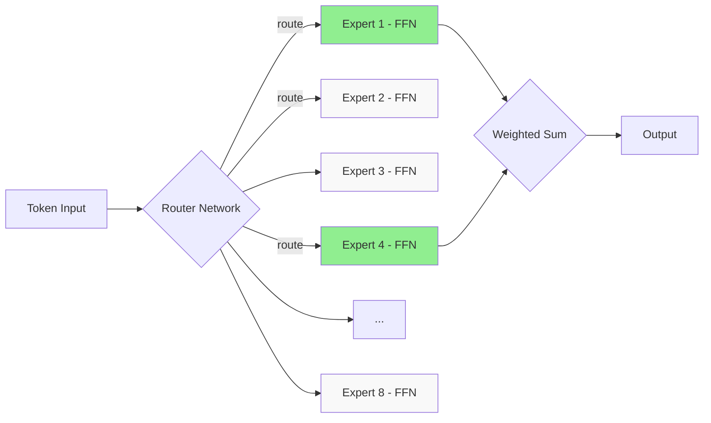

# Modern Improvements — RoPE, Flash Attention, MoE, GQA

2020 সালে original Transformer পেপার এর পর কত কিছু বদলে গেছে! Original architecture টা ভালো, কিন্তু modern LLM গুলো (Llama, Mistral, GPT-4) আরও অনেক বেশি efficient আর powerful। এই chapter এ আমরা দেখবো 2023-2026 সালে transformer কে কীভাবে দ্রুত, ছোট, আর স্মার্ট বানানো হয়েছে।

ভাবো এটা একটা upgrade guide — যেমন ফোনের new version আসে আর সব আরও smooth হয়, ঠিক তেমনি transformer এরও অনেক upgrade হয়েছে।

---

## RoPE (Rotary Position Embedding)

### Problem: Position কীভাবে বোঝাবে?

Transformer নিজে থেকে sequence এর position বোঝে না — "আমি ভালো বাসি" আর "ভালো আমি বাসি" এর জন্য একই output দেবে। তাই position information আলাদা ভাবে দিতে হয়।

আগে absolute positional encoding ব্যবহার করা হতো — position 1 এর জন্য একটা fixed vector, position 2 এর জন্য আরেকটা। কিন্তু এতে একটা সমস্যা: model কে শেখাতে হয় relative position টা কীভাবে কাজ করে।

### RoPE এর আইডিয়া: Rotate করো!

RoPE এর মূল আইডিয়া — query আর key vector কে position অনুযায়ী rotate করে দাও। দেখো কী হয়:

```
  Position m এর query:  q_m = R(m) · q
  Position n এর key:    k_n = R(n) · k

  যেখানে R(θ) একটা rotation matrix

  Attention score:
    q_m · k_n = (R(m)·q) · (R(n)·k)
              = q · R(m-n) · k
                    ^^^^^^^
              শুধু relative position (m-n) matter করে!
```

```
    কল্পনা করো 2D vector কে position অনুযায়ী rotate করছে:

    pos 0      pos 1      pos 2      pos 3
      ↑          ↗          →          ↘
      |         /           |            \
   q₀°=0°   q₁°=90°    q₂°=180°   q₃°=270°

    দুটো vector এর dot product নির্ভর করে
    শুধু তাদের angle এর difference এ — অর্থাৎ relative position এ!
```

নিচের কোডে RoPE এর একটা simplified version দেখানো হলো। মূল কনসেপ্ট হলো — query আর key কে position অনুযায়ী complex number এর মতো rotate করা। বাস্তব implementation এ pair করে dimension গুলো rotate করা হয়।

```python
import torch
import torch.nn as nn
import math

def apply_rope(x, positions):
    """
    x shape: (batch, heads, seq_len, d_head)
    positions shape: (seq_len,)
    RoPE এর simplified 2D version — pair করে dimension rotate করি
    """
    d_head = x.shape[-1]
    half = d_head // 2

    # প্রতি pair এর জন্য frequency তৈরি করি
    freqs = 1.0 / (10000 ** (torch.arange(0, half).float() / half))
    # positions × freqs → angle
    angles = positions[:, None] * freqs[None, :]  # (seq_len, half)

    cos = torch.cos(angles)  # (seq_len, half)
    sin = torch.sin(angles)

    # x কে pair আকারে ভাগ করি
    x1 = x[..., 0::2]  # even index
    x2 = x[..., 1::2]  # odd index

    # rotation apply করি: প্রত্যেক pair (x1, x2) কে rotate
    rotated_x1 = x1 * cos - x2 * sin
    rotated_x2 = x1 * sin + x2 * cos

    # আবার interleave করে একসাথে করি
    result = torch.stack([rotated_x1, rotated_x2], dim=-1).flatten(-2)
    return result
```

উপরের কোডে `apply_rope` function টা query বা key tensor কে নেয়, আর প্রতিটা position এর জন্য frequency ভিত্তিক rotation apply করে। `freqs` অংশে প্রত্যেক dimension pair এর জন্য আলাদা frequency থাকে — কম dimension এর জন্য ধীর rotation, বেশি dimension এর জন্য দ্রুত। এতে করে short range আর long range relationship দুটোই capture হয়।

> [!note] কেন RoPE ভালো?
> Absolute encoding এ model কে শিখতে হতো "position 5 আর position 10 এর মধ্যে difference হলো 5" — এটা। কিন্তু RoPE তে rotation এর কারণে attention score স্বাভাবিকভাবেই relative position এ depend করে। Extra learning এর দরকার নেই। আর এটা extrapolate ও করে — নতুন position এও কাজ করে।

> [!important] কোন মডেল গুলো RoPE ব্যবহার করে?
> Llama (1/2/3), Mistral, Gemma, Qwen, DeepSeek — বর্তমানে প্রায় সব modern LLM RoPE ব্যবহার করে। এটা এখন de facto standard.

---

## Flash Attention (v1/v2)

### The O(n²) Problem

Attention এর একটা বড় সমস্যা — memory আর computation দুটোই O(n²)। কারণ প্রতিটা token প্রতিটা token এর দিকে attend করে।

```
  Sequence length n = 4096:

  Attention matrix size = 4096 × 4096 = 16,777,216 entries

  n = 16384 হলে → 268 million entries!
  n = 65536 হলে → 4.3 BILLION entries! 😱

  ┌────────────────────────────┐
  │   Full n × n Attention     │
  │   ████████████████████████ │
  │   ████████████████████████ │
  │   ████████████████████████ │  ← পুরো matrix memory তে
  │   ████████████████████████ │     রাখতে হয় (HBM)
  │   ████████████████████████ │
  └────────────────────────────┘
        Memory: O(n²) 😞
```

### Flash Attention: Tile করে কাজ করো

Flash Attention এর আইডিয়া সহজ কিন্তু brilliant — পুরো matrix memory তে রাখবে না, ছোট ছোট tile এ ভাগ করে SRAM (GPU এর fast cache) এ compute করবে।

```
  Traditional Attention:
  ┌─────────┐    ┌─────────────────┐    ┌────────┐
  │  Q, K, V │ →  │ Full n×n matrix │ →  │ Output │
  └─────────┘    │  HBM এ লেখা     │    └────────┘
                 └─────────────────┘
  HBM read/write: O(n²) — অনেক ধীর!

  Flash Attention:
  ┌─────────┐    ┌──────┐ ┌──────┐ ┌──────┐    ┌────────┐
  │  Q, K, V │ →  │ Tile │+│ Tile │+│ Tile │ →  │ Output │
  └─────────┘    └──────┘ └──────┘ └──────┘    └────────┘
                 └── SRAM এ compute ──┘
  HBM read/write: কম অনেক! 🚀
```

মানে কী? GPU তে দুই ধরনের memory আছে — HBM (বড় কিন্তু ধীর) আর SRAM (ছোট কিন্তু দ্রুত)। Flash Attention HBM এ read/write কমায়, SRAM এ বেশি compute করে। এবং সবচেয়ে দারুণ ব্যাপার — mathematical result হুবহু একই! কোনো approximation নেই।

```
  GPU Memory Hierarchy:

  ┌───────────────────┐
  │     SRAM          │  ← খুব দ্রুত (19 TB/s)
  │   (~20 MB)        │     কিন্তু ছোট
  ├───────────────────┤
  │     HBM           │  ← ধীর (~2 TB/s)
  │   (~40-80 GB)     │     কিন্তু বড়
  ├───────────────────┤
  │   DRAM / Host     │  ← অনেক ধীর
  └───────────────────┘

  Flash Attention: HBM access কমায়, SRAM বেশি ব্যবহার করে
  = wall clock time অনেক কম!
```

> [!important] Flash Attention এর key points
> - Mathematical result হুবহু traditional attention এর মতো (exact, not approximate)
> - 2-4x speedup সাধারণ ব্যাপার
> - O(n) memory (O(n²) থেকে কমে)
> - PyTorch 2.0+ এ built-in: `F.scaled_dot_product_attention`
> - Flash Attention v2 এর parallelism আরও ভালো

নিচের কোডে দেখানো হলো কীভাবে PyTorch এ Flash Attention ব্যবহার করতে হয়। খেয়াল করো — খুব সহজ, এক line এই হয়ে যায়।

```python
import torch
import torch.nn.functional as F

# PyTorch 2.0+ তে Flash Attention built-in!
q = torch.randn(1, 8, 4096, 64, device="cuda")  # (batch, heads, seq, d_head)
k = torch.randn(1, 8, 4096, 64, device="cuda")
v = torch.randn(1, 8, 4096, 64, device="cuda")

# এই এক line এ Flash Attention automatically use হয়
output = F.scaled_dot_product_attention(q, k, v)

print(output.shape)  # torch.Size([1, 8, 4096, 64])
# ২-৪ গুণ দ্রুত, memory অনেক কম, কিন্তু result একই!
```

এই কোডে `scaled_dot_product_attention` function টা PyTorch এর ভিতরে automatically Flash Attention বেছে নেয়। ম্যানুয়ালি কিছু করার দরকার নেই — GPU আর input shape দেখে সব automatic। তাই বলা যায়, modern code এ আর explicit attention computation লেখার দরকার নেই।

---

## KV Cache

### Problem: বারবার একই কাজ!

Generation এর সময় কী হয়? ধরো "আমি ভালো আছি" generate করার পর next token generate করবে। তখন আবার শুরু থেকে সব token এর K, V বের করে — কিন্তু আগের token গুলোর K, V তো একই ছিলো! এটা pure waste।

```
  Step 1: "আমি" → predict "ভালো"
    Compute K,V for: [আমি]

  Step 2: "আমি ভালো" → predict "আছি"
    Compute K,V for: [আমি, ভালো]  ← "আমি" এর K,V আবার compute?! 😠

  Step 3: "আমি ভালো আছি" → predict next
    Compute K,V for: [আমি, ভালো, আছি]  ← আবার সব?!
```

### Solution: Cache করে রাখো!

KV Cache এর আইডিয়া — আগের step এর K, V গুলো মেমরিতে রেখে দাও। নতুন token এর জন্য শুধু সেই token এর K, V compute করো, আর cache এর সাথে append করো।

```
  KV Cache এর সাথে Generation:

  Step 1: "আমি"
    ┌─────────┐
    │ K₁ V₁   │  ← Cache এ রাখো
    └─────────┘
    Compute: শুধু token 1

  Step 2: "আমি" + "ভালো"
    ┌─────────┬─────────┐
    │ K₁ V₁   │ K₂ V₂   │  ← শুধু K₂,V₂ নতুন, বাকি cached!
    └─────────┴─────────┘
    Compute: শুধু token 2

  Step 3: "আমি" + "ভালো" + "আছি"
    ┌─────────┬─────────┬─────────┐
    │ K₁ V₁   │ K₂ V₂   │ K₃ V₃   │  ← শুধু K₃,V₃ নতুন!
    └─────────┴─────────┴─────────┘
    Compute: শুধু token 3

  প্রতি step এ O(n) না, O(1) computation per step!
```

> [!important] KV Cache এর সুবিধা
> - প্রতি generation step এ শুধু ১টা token এর K, V compute করতে হয়
> - O(n) থেকে O(1) per step — বিশাল speedup
> - সব modern inference engine (vLLM, TGI) এ default
> - Trade-off: memory বেশি লাগে (K, V সব রাখতে হয়)

> [!warn] KV Cache এর সমস্যা
> KV Cache অনেক বড় হতে পারে! একটা 70B model, 32k context এ KV Cache এর size হতে পারে **3.2 GB** per sequence। অনেকগুলো user handle করলে memory ফুড়ে যাবে। এই সমস্যা সমাধানের জন্যই GQA!

---

## Grouped-Query Attention (GQA) / Multi-Query Attention (MQA)

### Problem: KV Cache অনেক বড়!

বড় মডেল গুলোতে অনেকগুলো attention head থাকে (যেমন 32, 64)। প্রতিটা head এর জন্য আলাদা K, V থাকে। KV Cache তে সব head এর সব K, V রাখতে হয়।

```
  Multi-Head Attention (MHA):
  Q: [Q₁] [Q₂] [Q₃] [Q₄] [Q₅] [Q₆] [Q₇] [Q₈]
  K: [K₁] [K₂] [K₃] [K₄] [K₅] [K₆] [K₇] [K₈]  ← সব head এ আলাদা!
  V: [V₁] [V₂] [V₃] [V₄] [V₅] [V₆] [V₇] [V₈]

  KV Cache size = O(heads × seq_len × d_head)

  Multi-Query Attention (MQA): সব head share করে একটা K, V!
  Q: [Q₁] [Q₂] [Q₃] [Q₄] [Q₅] [Q₆] [Q₇] [Q₈]
  K: [ K_shared ]  ← ১ টা head সব এর জন্য!
  V: [ V_shared ]

  Grouped-Query Attention (GQA): মাঝামাঝি!
  Q: [Q₁] [Q₂] [Q₃] [Q₄] [Q₅] [Q₆] [Q₇] [Q₈]
  K: [K_A] [K_B]  ← কয়েকটা group, প্রতিটা group share করে
  V: [V_A] [V_B]
```

### MHA vs MQA vs GQA Comparison

| Feature | MHA (Classic) | MQA | GQA |
|---------|---------------|-----|-----|
| **K, V heads** | প্রতিটা Q head এ আলাদা | ১টা K,V সব share করে | Group এ share করে |
| **KV Cache size** | সবচেয়ে বড় | সবচেয়ে ছোট | মাঝামাঝি |
| **Quality** | সবচেয়ে ভালো | সামান্য কম | MHA এর কাছাকাছি |
| **Speed** | ধীর | দ্রুত | দ্রুত |
| **Example** | GPT-2, BERT | PaLM, Falcon | **Llama 2/3, Mistral** |

> [!note] কেন GQA "sweet spot"?
> MQA তে quality একটু কমে যায় কারণ সব head একই K, V দেখে — diversity কম। GQA তে কয়েকটা group করা হয় (যেমন 8 query head এর জন্য 2 K,V head), তাই quality ঠিক রেখে memory বাঁচানো যায়। Llama 2 থেকে GQA default।

---

## Mixture of Experts (MoE)

### Problem: বড় মডেল ভালো, কিন্তু ধীর

মডেল যত বড়, quality তত ভালো। কিন্তু বড় মডেল inference ধীর, কারণ প্রতিটা token এর জন্য সব parameter এর মধ্য দিয়ে যেতে হয়। যদি 100B parameter এর মডেল হয়, প্রতিটা token এর জন্য 100B computation!

### Solution: Expert দের ভাগ করো!

MoE এর আইডিয়া — একটা বড় FFN এর বদলে অনেকগুলো ছোট FFN (expert) রাখো। একটা router decide করে কোন token কোন expert এ যাবে।

```
  Standard FFN:
  ┌─────────┐
  │  Token  │──────►┌──────────┐──────► Output
  └─────────┘       │   FFN    │
                    │ (বড়)     │
                    └──────────┘
  প্রতিটা token পুরো FFN এর মধ্য দিয়ে যায়

  Mixture of Experts:
  ┌─────────┐
  │  Token  │──┬──────►┌──────────┐──┐
  └─────────┘  │       │ Expert 1 │  │
               │       └──────────┘  │
         ┌─────▼─────┐┌──────────┐  │
         │   Router  ││ Expert 2 │  │
         │ top-k=2   │└──────────┘  ├──► Output
         └─────┬─────┘┌──────────┐  │
               │       │ Expert 3 │  │
               └──────►└──────────┘  │
                      ┌──────────┐  │
                      │ Expert 4 │  │
                      └──────────┘  │
                                    │
  শুধু top-k expert এর মধ্য দিয়ে যায় — sparse!
```



### Sparse Activation

| Model | Total Params | Active Params per Token | Experts |
|-------|-------------|------------------------|---------|
| **Mixtral 8x7B** | ~47B | ~13B | 8 (top-2) |
| **Mixtral 8x22B** | ~141B | ~39B | 8 (top-2) |
| **DeepSeek-MoE** | ~16B | ~2.8B | 64 (top-6) |
| **GPT-4 (rumored)** | ~1.8T | ~220B | 16 (top-2) |

> [!important] MoE এর core insight
> Total parameter অনেক বেশি, কিন্তু প্রতিটা token এর জন্য শুধু একটা অংশ active থাকে। Mixtral 8x7B তে 47B parameter আছে, কিন্তু প্রতিটা token মাত্র 13B parameter ব্যবহার করে। ফলে 47B এর quality, কিন্তু 13B এর speed!

> [!warn] MoE এর চ্যালেঞ্জ
> - Training tricky — load balancing (সব expert এ সমান token না গেলে কিছু expert শেখেই না)
> - Memory এখনও সব expert রাখতে হয় (total param সব GPU তে থাকে)
> - Routing ঠিকমতো না হলে quality কমে

---

## Sliding Window Attention

### Problem: অনেক বড় context এ attention ভারী

যদি 128K context হয়, প্রতিটা token সব token এর দিকে attend করলে computation অসম্ভব।

### Solution: শুধু local window দেখো

Sliding Window Attention এ প্রতিটা token শুধু তার আগের W টা token এর দিকে attend করে। যেমন Mistral এ window size 4096।

```
  Sliding Window (W=4):

  Token:  1   2   3   4   5   6   7   8   9
          ─────────────────────────────────
  Att:   [1]  [2]  [3]  [4]  [5]  [6]  [7]  [8]  [9]
  1 sees: 1   2   3   4   -   -   -   -   -
  5 sees: -   -   -   2   3   4   5   -   -
  9 sees: -   -   -   -   -   6   7   8   9
              └───── window ─────┘

  যদি layer stacking হয়, information "propagate" হয় আরও দূরে!
  Layer 1: W tokens reach
  Layer 2: 2W tokens reach (indirect)
  Layer L: L×W tokens reach
```

> [!note] Mistral এ Sliding Window
> Mistral 7B তে Sliding Window Attention (4096) আর Flash Attention একসাথে ব্যবহার করা হয়। ফলে long context efficient, আর multi-layer stacking এর কারণে actual receptive field আরও বড়।

---

## সব কিছু একসাথে: Model কোন technique ব্যবহার করে

| Model | Position | Attention Variant | KV Sharing | MoE? | SWA? |
|-------|----------|-------------------|------------|------|------|
| **GPT-2** | Absolute | MHA | No | No | No |
| **BERT** | Absolute | MHA | No | No | No |
| **LLaMA 1** | RoPE | MHA | No | No | No |
| **LLaMA 2** | RoPE | **GQA** | Yes | No | No |
| **LLaMA 3** | RoPE | **GQA** | Yes | No | No |
| **Mistral 7B** | RoPE | GQA | Yes | No | **Yes** |
| **Mixtral 8x7B** | RoPE | GQA | Yes | **Yes** | **Yes** |
| **Gemma** | RoPE | MHA/GQA | Mixed | No | No |
| **DeepSeek-V2** | RoPE | MLA (advanced) | Yes | **Yes** | No |
| **Falcon** | RoPE | **MQA** | Yes | No | No |

---

## Summary

এই chapter এ আমরা modern transformer এর ৬টি বড় improvement দেখলাম:

1. **RoPE** — position encoding এর সবচেয়ে ভালো উপায়, relative position স্বাভাবিকভাবে encode হয়
2. **Flash Attention** — exact same result, কিন্তু 2-4x দ্রুত, memory কম — এখন সব জায়গায় standard
3. **KV Cache** — generation এ বিশাল speedup, আগের কাজ বারবার করতে হয় না
4. **GQA/MQA** — KV Cache ছোট করার উপায়, quality আর efficiency এর balance
5. **MoE** — বড় capacity, ছোট active compute — sparse activation এর জাদু
6. **Sliding Window** — long context efficient করার উপায়

> [!important] মূল বার্তা
> Modern LLM গুলো শুধু "bigger" না — তারা "smarter"। এই technique গুলো ছাড়া 100B+ parameter এর মডেল train বা serve করা সম্ভব হতো না। Efficient architecture ই modern AI এর মূল চাবি।