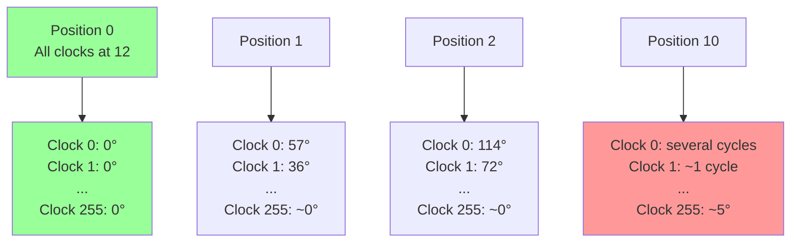
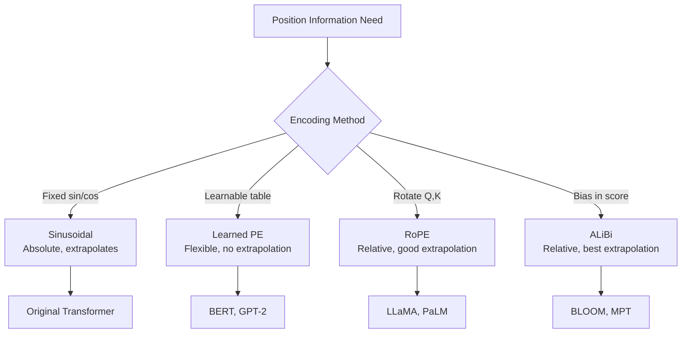

# Positional Encoding Deep Dive — Sin/Cos গণিত পুরোপুরি

আগের chapter এ দেখলাম কীভাবে attention একটা token এর embedding কে contextual বানায়। কিন্তু একটা জিনিস এখনও বাকি — **position তথ্য**। Attention নিজে থেকে word order বোঝে না। এই chapter এ আমরা sinusoidal positional encoding এর প্রতিটা গাণিতিক ধাপ গভীরভাবে দেখবো — কেন sin, কেন cos, কেন 10000, আর কেন এই ফর্মুলা এত সুন্দর কাজ করে।

---

## Why Position Information?

Transformer এর architecture এ কোনো recurrence নেই, কোনো convolution নেই। Self-attention প্রতিটা token কে একসাথে process করে — সব চাই সব এক সাথে। এর সুবিধা হলো parallelism, কিন্তু মূল্য হলো — order এর কোনো ধারণা নেই।

ভাবো একটা দৃষ্টান্ত: তোমাকে একটা sentence দেওয়া হলো যেখানে সব শব্দ একসাথে টেবিলে ছড়ানো। তুমি কোনটা আগে পড়বে, কোনটা পরে — সেটা বলতে পারবে না। ঠিক তেমনই self-attention এর জন্য:

```
  Input A:  [dog, bites, man]   →  Self-Attention  →  Output A
  Input B:  [man, bites, dog]   →  Self-Attention  →  Output B

  Output A আর Output B হবে একই (row order ছাড়া)।
```

অর্থাৎ "dog bites man" আর "man bites dog" attention এর কাছে একই জিনিস। কিন্তু অর্থ একদম উল্টো!

> [!warn] Permutation Invariance
> Self-attention হলো **permutation-invariant**। তুমি input token গুলো যেকোনো order এ সাজালেও output একই আসবে (শুধু rows উল্টেপাল্টে যাবে)। ভাষার জন্য এটা disaster — কারণ ভাষায় order এর অর্থ আছে।

সমাধান: প্রতিটা token এর embedding এর সাথে একটা **position signal** যোগ করা। তাহলে model বুঝবে — "এই শব্দটা বাক্যের ৩ নম্বর position এ আছে।"

---

## সহজ সমাধান গুলো আর তাদের সমস্যা

### Approach 1: Integer position (1, 2, 3, ...)

সবচেয়ে simple — position নম্বর বসিয়ে দাও। কিন্তু সমস্যা:
- সংখ্যা unbounded — বড় sequence এ সংখ্যা অনেক বড় হয়।
- Model বড় সংখ্যা থেকে কিছু শেখে না, training unstable হয়।

### Approach 2: Normalized position (0 থেকে 1)

Position কে 0 থেকে 1 এর মধ্যে normalize করা। সমস্যা:
- একই position নম্বর ভিন্ন sequence length এ ভিন্ন normalized value দেয়।
- "The cat sat" এ "cat" এর normalized position 0.33, কিন্তু "The cat sat on the mat" এ 0.17। একই শব্দ, আলাদা value — model confuse হয়।

### Approach 3: One-hot position

প্রতিটা position এর জন্য একটা one-hot vector। সমস্যা:
- বড় sequence এ vector ও বড় হয়।
- Adjacent position গুলোর মধ্যে কোনো relationship নেই (position 5 আর 6 এর vector একদম orthogonal)।

তাহলে দরকার এমন একটা encoding যেখানে:
1. প্রতিটা position এর জন্য unique encoding থাকবে
2. Adjacent position গুলোর encoding কাছাকাছি থাকবে
3. যেকোনো sequence length এ কাজ করবে (extrapolation)
4. সংখ্যাগুলো bounded থাকবে ($[-1, 1]$)

---

## Original Sinusoidal Encoding

2017 paper "Attention Is All You Need" এ একটা সুন্দর সমাধান দেওয়া হয়েছে। ফর্মুলা:

$$PE(pos, 2i) = \sin\left(\frac{pos}{10000^{2i/d_{model}}}\right)$$

$$PE(pos, 2i+1) = \cos\left(\frac{pos}{10000^{2i/d_{model}}}\right)$$

এখানে:
- $pos$ = position নম্বর (0, 1, 2, ...)
- $i$ = dimension pair index ($i = 0, 1, 2, \dots, d_{model}/2 - 1$)
- $2i$ আর $2i+1$ = dimension index (জোড় আর বিজোড়)
- $d_{model}$ = embedding dimension (যেমন 512)

প্রতিটা position এর জন্য একটা $d_{model}$ দৈর্ঘ্যের vector তৈরি হয়। এই vector এর জোড় index গুলোতে sin, বিজোড় index গুলোতে cos বসে।

> [!important] একটা ভিন্ন কথা
> লক্ষ্য করো — sin আর cos এর ভিতরের term একই: $\frac{pos}{10000^{2i/d_{model}}}$। শুধু বাইরের function আলাদা। এর মানে হলো প্রতিটা (sin, cos) pair একই angle কে represent করে, কিন্তু দুটো ভিন্ন projection এ। এটা খুব গুরুত্বপূর্ণ — পরে দেখবো কেন।

---

## ফর্মুলার প্রতিটা অংশ বোঝা

### `pos` — Position নম্বর

সবচেয়ে simple। বাক্যে প্রথম token হলো $pos = 0$, দ্বিতীয় $pos = 1$, এভাবে চলে।

### `2i` আর `2i+1` — Dimension Index

$d_{model} = 512$ হলে, আমাদের 256 টা dimension pair দরকার ($i = 0$ থেকে $255$ পর্যন্ত)। প্রতিটা pair এ একটা sin আর একটা cos। তাই:
- Pair $i=0$: dimension 0 (sin) আর dimension 1 (cos)
- Pair $i=1$: dimension 2 (sin) আর dimension 3 (cos)
- Pair $i=255$: dimension 510 (sin) আর dimension 511 (cos)

### `10000^(2i/d_model)` — Wavelength নিয়ন্ত্রণ

এটাই সবচেয়ে গুরুত্বপূর্ণ অংশ। এই term প্রতিটা dimension pair এর frequency নির্ধারণ করে।

লক্ষ্য করো — এটাকে আরেকভাবে লেখা যায়:

$$\frac{1}{10000^{2i/d_{model}}} = \omega_i$$

এই $\omega_i$ হলো angular frequency। আমরা জানি $\sin(\omega \cdot pos)$ এর wavelength হয় $\frac{2\pi}{\omega}$।

তাই প্রতিটা pair এর wavelength:

$$\lambda_i = 2\pi \cdot 10000^{2i/d_{model}}$$

---

## কেন 10000?

এবার একটু গভীরভাবে দেখি 10000 এর ভূমিকা।

### Frequency Range বের করা

**সর্বনিম্ন frequency (সবচেয়ে বড় wavelength):**

যখন $i = d_{model}/2 - 1$ (শেষ pair):

$$\omega_{max} = \frac{1}{10000^{(d_{model}-2)/d_{model}}}$$

$d_{model} = 512$ হলে:

$$\omega_{max} = \frac{1}{10000^{510/512}} = \frac{1}{10000^{0.9961}} \approx \frac{1}{9640}$$

$$\lambda_{max} = 2\pi \times 9640 \approx 60572$$

অর্থাৎ সবচেয়ে slow তরঙ্গ ~60000 position পর্যন্ত unique থাকে।

**সর্বোচ্চ frequency (সবচেয়ে ছোট wavelength):**

যখন $i = 0$ (প্রথম pair):

$$\omega_0 = \frac{1}{10000^{0}} = 1$$

$$\lambda_0 = 2\pi \approx 6.28$$

অর্থাৎ সবচেয়ে fast তরঙ্গ প্রতি ~6 position এ একবার cycle complete করে।

```
  Pair i=0 (fastest):    wavelength ≈ 2π ≈ 6.28
       ↓
       প্রতি ~6 position এ sin একটা পূর্ণ cycle করে
       → local position তথ্য (word order) capture করে

  Pair i=255 (slowest):  wavelength ≈ 2π × 9640 ≈ 60572
       ↓
       অনেক বড় range এ ধীরে ধীরে বদলায়
       → global position তথ্য (sentence chunk) capture করে
```

> [!important] 10000 একটা hyperparameter
> Original paper এই value বেছেছে কারণ এটা typical sequence length (≤512) cover করে। যদি 1000 নিতাম, তাহলে সবচেয়ে slow তরঙ্গের wavelength হতো ~6283 — তাও যথেষ্ট। কিন্তু 100 নিলে wavelength হতো ~628 — তখন বড় sequence এ position গুলো repeat করত। 100000 নিলে আবার slow তরঙ্গগুলো খুব বেশি slow — fine-grained position distinction কঠিন। 10000 একটা sweet spot।

### কেন ছোট base খারাপ, কেন বড় base খারাপ?

| Base | Slowest wavelength | সমস্যা |
|------|-------------------|--------|
| 100 | ~628 | বড় sequence এ position overlap |
| 1000 | ~6283 | মোটামুটি কাজ করে, কিন্তু margin কম |
| **10000** | **~60572** | **typical sequence এর জন্য আদর্শ** |
| 100000 | ~605721 | slow তরঙ্গ খুব slow, fine distinction কঠিন |
| 1000000 | ~6M | খুব বেশি slow, বেশিরভাগ dimension প্রায় constant |

---

## কেন Sin আর Cos দুটোই দরকার?

এটা একটা critical প্রশ্ন। শুধু sin দিলেই তো হতো — না?

### শুধু Sin এর সমস্যা

$\sin(\theta)$ function টা symmetric — $\sin(\pi - \theta) = \sin(\theta)$। মানে দুটো ভিন্ন angle একই sin value দিতে পারে।

```
  sin(π/6) = 0.5
  sin(5π/6) = 0.5

  Position A: angle = π/6 → sin = 0.5
  Position B: angle = 5π/6 → sin = 0.5

  দুটো ভিন্ন position, কিন্তু একই sin value! → ambiguous
```

### Sin + Cos Pair এর সমাধান

এখন যদি আমরা একই angle এর cos ও দেখি:

```
  Position A:  angle = π/6   →  sin = 0.5,  cos = 0.866
  Position B:  angle = 5π/6  →  sin = 0.5,  cos = -0.866

  এখন (sin, cos) pair দেখলেই আলাদা করা যায়!
```

গাণিতিকভাবে — একটা (sin, cos) pair হলো একটা 2D point unit circle এর উপর। প্রতিটা angle এর জন্য একটা unique point।

> [!tip] Clock Hand Analogy
> প্রতিটা (sin, cos) pair কে ভাবো একটা **clock hand** হিসেবে।
> - $\sin$ = hand এর vertical position
> - $\cos$ = hand এর horizontal position
> - দুটো মিলে একটা unique angle বোঝায়
>
> একটা clock এ শুধু "hand টা উপরে আছে কি না" (sin মাত্র) জানলে কিছু বোঝা যায় না — কারণ দুটো ভিন্ন time এ hand উপরে থাকতে পারে। কিন্তু "hand টা কোন angle এ আছে" (sin + cos) জানলে exact time বোঝা যায়।

### Geometric Intuition — Multiple Clocks

এখন ভাবো — $d_{model} = 512$, তাই 256 টা (sin, cos) pair। মানে 256 টা clock hand — প্রতিটা আলাদা speed এ ঘুরছে।

```
  Position 0 (সব clock 12 o'clock এ):

  Clock 0 (fastest):   sin=0.00, cos=1.00   →  ●—— (12 o'clock)
  Clock 1:             sin=0.00, cos=1.00   →  ●—— (12 o'clock)
  ...
  Clock 255 (slowest): sin=0.00, cos=1.00   →  ●—— (12 o'clock)

  Position 1 (fast clock একটু ঘুরে, slow clock প্রায় স্থির):

  Clock 0 (fastest):   sin=1.00, cos=0.54   →  ঘুরে ~1 radian
  Clock 1:             sin=0.63, cos=0.78   →  কম ঘুরে
  ...
  Clock 255 (slowest): sin=0.00, cos=1.00   →  প্রায় স্থির
```

Position 1 এ fast clock গুলো অনেক ঘুরে গেছে, slow clock গুলো প্রায় স্থির। এই 256 টা clock hand এর combination ই হলো সেই position এর unique fingerprint।

```
  Position 0:  [1, 0, 1, 0, 1, 0, ...]  (সব cos=1, sin=0)
  Position 1:  [0.54, 1.0, 0.78, 0.63, ...]
  Position 2:  [-0.42, 0.91, 0.41, 0.91, ...]
  ...

  প্রতিটা position এর নিজস্ব unique pattern আছে।
  দুটো ভিন্ন position এর pattern কখনো exact match করবে না।
```



---

## Dimension Analysis — Fourier Decomposition

একটু চমকপ্রদ কথা — এই 256 টা pair কে একটা **Fourier decomposition** হিসেবে ভাবা যায়।

মনে করো আমরা position কে একটা function হিসেবে encode করছি। এই function কে আমরা 256 টা ভিন্ন frequency এর sinusoid এ বিভক্ত করছি।

```
  Dimension pairs 0-10 (high frequency):
    → প্রতি কয়েক position এ বদলায়
    → local structure, word order capture করে

  Dimension pairs 50-150 (medium frequency):
    → প্রতি কয়েক ডজন position এ বদলায়
    → phrase level structure capture করে

  Dimension pairs 200-256 (low frequency):
    → প্রায় স্থির, খুব ধীরে বদলায়
    → global position, sentence chunk capture করে
```

> [!note] Fourier এর সাথে সম্পর্ক
> Fourier transform যেকোনো signal কে ভিন্ন ভিন্ন frequency এর sinusoid এ বিভক্ত করে। Sinusoidal positional encoding ও একই কাজ করছে — position কে ভিন্ন ভিন্ন frequency এর wave এ represent করছে। উচ্চ frequency component গুলো fine position বোঝায়, নিম্ন frequency component গুলো coarse position বোঝায়। এটা কোনো কাকতালীয় ব্যাপার না — sinusoid গুলো এমনভাবে বাছাই করা হয়েছে যেন position তথ্য multi-scale এ encode হয়।

---

## Code: Positional Encoding তৈরি আর Visualize

```python
import numpy as np
import matplotlib.pyplot as plt

d_model = 64
max_len = 100

pe = np.zeros((max_len, d_model))
position = np.arange(0, max_len).reshape(-1, 1)
# div_term computes 1 / 10000^(2i/d_model) in a numerically stable way
div_term = np.exp(np.arange(0, d_model, 2) * (-np.log(10000.0) / d_model))

pe[:, 0::2] = np.sin(position * div_term)
pe[:, 1::2] = np.cos(position * div_term)

# Show specific values
print("Position 0 (first 8 dims):", pe[0][:8])
print("Position 1 (first 8 dims):", pe[1][:8])
print("Position 2 (first 8 dims):", pe[2][:8])

# Why does PE(pos+k) relate to PE(pos)?
# PE(pos+k) = linear function of PE(pos) for each frequency pair!

# Visualize the encoding as a heatmap
plt.figure(figsize=(12, 6))
plt.imshow(pe, aspect='auto', cmap='RdBu')
plt.xlabel('Dimension')
plt.ylabel('Position')
plt.title('Sinusoidal Positional Encoding')
plt.colorbar()
plt.savefig('positional_encoding.png', dpi=100)
plt.show()

# Check uniqueness: how different are adjacent positions?
cos_sim_01 = np.dot(pe[0], pe[1]) / (np.linalg.norm(pe[0]) * np.linalg.norm(pe[1]))
cos_sim_05 = np.dot(pe[0], pe[5]) / (np.linalg.norm(pe[0]) * np.linalg.norm(pe[5]))
cos_sim_0_50 = np.dot(pe[0], pe[50]) / (np.linalg.norm(pe[0]) * np.linalg.norm(pe[50]))
print(f"cos(0, 1):   {cos_sim_01:.4f}  (adjacent, high similarity)")
print(f"cos(0, 5):   {cos_sim_05:.4f}  (close, still similar)")
print(f"cos(0, 50):  {cos_sim_0_50:.4f}  (far, less similar)")
```

Typical output:

```
Position 0 (first 8 dims): [0.         1.         0.         1.         0.         1.         0.         1.        ]
Position 1 (first 8 dims): [0.84147098 0.54030231 0.82102439 0.5709106  0.79861273 0.601789   0.77419037 0.63291185]
Position 2 (first 8 dims): [0.90929743 -0.41614684 0.94517147 -0.32657389 0.97443254 -0.22440793 0.99545644 -0.09522235]
cos(0, 1):   0.9320  (adjacent, high similarity)
cos(0, 5):   0.7121  (close, still similar)
cos(0, 50):  0.0432  (far, less similar)
```

> [!example] ফলাফলের মানে
> Position 0 আর 1 এর cosine similarity 0.93 — খুব high, কারণ তারা adjacent। Position 0 আর 50 এর similarity প্রায় 0 — কারণ তারা অনেক দূরে। এটাই একটা ভালো positional encoding এর বৈশিষ্ট্য — adjacent position কাছাকাছি, দূরের position দূরে।

---

## The Beautiful Property: PE(pos+k) হলো PE(pos) এর Linear Function

এটা সম্ভবত sinusoidal encoding এর সবচেয়ে সুন্দর গাণিতিক property। আসলে এই কারণেই model relative position শিখতে পারে।

### উপপাদ্য (Proof)

ধরো একটা specific frequency pair $i$। এই pair এর জন্য angle:

$$\theta_i = \frac{pos}{10000^{2i/d_{model}}}$$

এখন এই pair এর (sin, cos) value:

$$\begin{pmatrix} \sin(\theta_i) \\ \cos(\theta_i) \end{pmatrix}$$

যদি position হয় $pos + k$, তাহলে নতুন angle:

$$\theta_i' = \frac{pos + k}{10000^{2i/d_{model}}} = \theta_i + \delta_i$$

যেখানে $\delta_i = \frac{k}{10000^{2i/d_{model}}}$।

এখন নতুন (sin, cos):

$$\begin{pmatrix} \sin(\theta_i + \delta_i) \\ \cos(\theta_i + \delta_i) \end{pmatrix}$$

সুপরিচিত trigonometric identity ব্যবহার করি:

$$\sin(\theta + \delta) = \sin\theta \cos\delta + \cos\theta \sin\delta$$

$$\cos(\theta + \delta) = \cos\theta \cos\delta - \sin\theta \sin\delta$$

ম্যাট্রিক্স আকারে:

$$\begin{pmatrix} \sin(\theta_i + \delta_i) \\ \cos(\theta_i + \delta_i) \end{pmatrix} = \begin{pmatrix} \cos\delta_i & \sin\delta_i \\ -\sin\delta_i & \cos\delta_i \end{pmatrix} \begin{pmatrix} \sin\theta_i \\ \cos\theta_i \end{pmatrix}$$

> [!important] মূল ফল
> এই $\begin{pmatrix} \cos\delta_i & \sin\delta_i \\ -\sin\delta_i & \cos\delta_i \end{pmatrix}$ হলো একটা **rotation matrix**! অর্থাৎ position $k$ সামনে যাওয়া মানে হলো প্রতিটা frequency pair এর (sin, cos) vector কে একটা নির্দিষ্ট angle $\delta_i$ এ ঘোরানো। আর এই rotation নির্ভর করে শুধু $k$ এর উপর — $pos$ এর উপর না।

### এর গভীর অর্থ

এর মানে হলো — যদি model শিখে "shift by $k$" অপারেশন কীভাবে করতে হয়, সেটা হলো একটা fixed linear transformation (rotation)। এই transformation $pos$ এর উপর নির্ভর করে না — শুধু $k$ এর উপর নির্ভর করে।

```
  PE(pos + k) = R(k) · PE(pos)

  যেখানে R(k) = block diagonal matrix of rotation matrices
  প্রতিটা block pair i এর জন্য angle δ_i = k / 10000^(2i/d_model) এ ঘোরায়
```

> [!tip] কেন এটা relative position শেখায়?
> Self-attention এ যখন token $A$ (position $p_A$) token $B$ (position $p_B$) কে attend করে, তখন relative distance হলো $k = p_B - p_A$। যেহেতু $PE(p_B) = R(k) \cdot PE(p_A)$, তাই attention এর dot product এ এই rotation এর প্রভাব থাকে। Model এই linear relationship থেকে relative position pattern শিখতে পারে। এটাই কারণ sinusoidal encoding, যদিও absolute position encode করে, relative position ও implicitly অনুমতি দেয়।

### পুরো Block Diagonal Matrix

$d_{model} = 512$ হলে, $\mathbf{R}(k)$ হবে একটা $512 \times 512$ block diagonal matrix:

$$\mathbf{R}(k) = \begin{pmatrix} R_0(k) & & & \\ & R_1(k) & & \\ & & \ddots & \\ & & & R_{255}(k) \end{pmatrix}$$

যেখানে প্রতিটা $R_i(k) = \begin{pmatrix} \cos\delta_i & \sin\delta_i \\ -\sin\delta_i & \cos\delta_i \end{pmatrix}$ আর $\delta_i = \frac{k}{10000^{2i/d_{model}}}$।

---

## একটা ছোট Numerical Example

$d_{model} = 4$ ধরি (2 টা pair)।

```
  Pair 0 (i=0): frequency = 1/10000^0 = 1,     wavelength = 2π ≈ 6.28
  Pair 1 (i=1): frequency = 1/10000^(2/4) = 1/100, wavelength = 200π ≈ 628
```

Position 0 এর PE:

$$PE(0) = (\sin 0, \cos 0, \sin 0, \cos 0) = (0, 1, 0, 1)$$

Position 1 এর PE:

$$PE(1) = (\sin 1, \cos 1, \sin 0.01, \cos 0.01) = (0.841, 0.540, 0.010, 1.000)$$

Position 2 এর PE:

$$PE(2) = (\sin 2, \cos 2, \sin 0.02, \cos 0.02) = (0.909, -0.416, 0.020, 1.000)$$

দেখো — Pair 0 দ্রুত বদলাচ্ছে (0 → 0.841 → 0.909), Pair 1 প্রায় স্থির (0 → 0.010 → 0.020)।

এখন $PE(2)$ কে $PE(1)$ এর linear function হিসেবে দেখা যাক (shift by $k=1$):

Pair 0 এর জন্য $\delta_0 = 1$:

$$\begin{pmatrix} \sin 2 \\ \cos 2 \end{pmatrix} = \begin{pmatrix} \cos 1 & \sin 1 \\ -\sin 1 & \cos 1 \end{pmatrix} \begin{pmatrix} \sin 1 \\ \cos 1 \end{pmatrix}$$

Pair 1 এর জন্য $\delta_1 = 0.01$:

$$\begin{pmatrix} \sin 0.02 \\ \cos 0.02 \end{pmatrix} = \begin{pmatrix} \cos 0.01 & \sin 0.01 \\ -\sin 0.01 & \cos 0.01 \end{pmatrix} \begin{pmatrix} \sin 0.01 \\ \cos 0.01 \end{pmatrix}$$

সত্যি সত্যিই $PE(pos+1)$ হলো $PE(pos)$ এর একটা linear (rotation) transformation!

---

## Alternatives — Modern Position Encoding

দুনিয়া দাঁড়িয়ে নেই। sinusoidal এর পরে আরও উন্নত method বেরিয়েছে।

### Learned Positional Embedding

সবচেয়ে simple alternative — একটা trainable lookup table। প্রতিটা position এর জন্য একটা learnable vector। BERT আর GPT এই approach ব্যবহার করে।

$$PE = \text{Embedding}(pos)$$

```
  Position 0 → [0.23, -0.45, 0.12, ...]  (learnable)
  Position 1 → [0.31, -0.38, 0.05, ...]  (learnable)
  ...
  Position 511 → [0.18, -0.51, 0.29, ...]
```

সুবিধা: model নিজে শেখে কোন position encoding সবচেয়ে ভালো।
অসুবিধা: training এ যে max length দেখেছে (যেমন 512), তার বেশি position এ কাজ করে না। নতুন position এর জন্য কোনো vector নেই।

### RoPE (Rotary Position Embedding)

RoPE (Su et al., 2021) একটু ভিন্ন approach — position তথ্য embedding এ যোগ না করে, সরাসরি Q আর K কে position অনুযায়ী rotate করে।

আইডিয়া: যদি $\mathbf{q}$ আর $\mathbf{k}$ কে তাদের নিজস্ব position অনুযায়ী rotate করি, তাহলে তাদের dot product শুধু relative position এর উপর নির্ভর করে।

গণিত — position $m$ এর জন্য Q কে rotate করা হয়:

$$\mathbf{q}_m' = \mathbf{R}_m \mathbf{q}_m$$

যেখানে $\mathbf{R}_m$ হলো একটা block diagonal rotation matrix (ঠিক sinusoidal এর মতো, কিন্তু position $m$ অনুযায়ী)।

তারপর attention score:

$$\mathbf{q}_m'^\top \mathbf{k}_n' = \mathbf{q}_m^\top \mathbf{R}_m^\top \mathbf{R}_n \mathbf{k}_n = \mathbf{q}_m^\top \mathbf{R}_{n-m} \mathbf{k}_n$$

> [!important] RoPE এর মূল সুবিধা
> লক্ষ্য করো — dot product শুধু $\mathbf{R}_{n-m}$ এর উপর নির্ভর করে, অর্থাৎ relative position $(n-m)$ এর উপর। এটাই RoPE এর সৌন্দর্য — relative position directly attention score এ encode হয়। LLaMA, PaLM, Falcon — এসব modern LLM RoPE ব্যবহার করে।

### ALiBi (Attention with Linear Biases)

ALiBi (Press et al., 2021) একদম simple — কোনো positional encoding নেই। বরং attention score এ relative distance অনুযায়ী একটা negative bias যোগ করা হয়।

$$\text{score}(i, j) = \frac{\mathbf{q}_i^\top \mathbf{k}_j}{\sqrt{d_k}} - m \cdot |i - j|$$

এখানে $m$ হলো একটা fixed slope (head ভেদে আলাদা), $|i-j|$ হলো দুই position এর দূরত্ব।

দূরের token এর দিকে attention কম, কাছের token এর দিকে বেশি।

> [!tip] ALiBi এর সুবিধা
> ALiBi এর সবচেয়ে বড় সুবিধা — training এ যে sequence length দেখেছে (যেমন 1024), তার চেয়ে অনেক বড় sequence (যেমন 2048+) inference এ কাজ করে। কোনো retraining লাগে না। এটাকে বলে **length extrapolation**।

---

## Comparison Table

| বৈশিষ্ট্য | Sinusoidal | Learned | RoPE | ALiBi |
|----------|-----------|---------|------|-------|
| **Parameters** | 0 (fixed) | max_len × d_model | 0 (computed) | 1 slope per head |
| **Position type** | Absolute | Absolute | Relative | Relative |
| **Extrapolation** | হ্যাঁ (theoretically) | না | ভালো | খুব ভালো |
| **Linear shift property** | হ্যাঁ (rotation) | না | হ্যাঁ (by design) | N/A |
| **Where used** | Original Transformer | BERT, GPT-2 | LLaMA, PaLM | BLOOM, MPT |
| **Implementation** | Medium | Simple | Medium | খুব simple |
| **Length generalization** | মোটামুটি | খারাপ | ভালো | সেরা |



---

## পুরো Pipeline এ কোথায় PE যায়

```
  Token IDs:        [101, 1045, 2310, ...]
       ↓
  Word Embedding:   E = [e_0, e_1, e_2, ...]  (each 768-dim)
       ↓
  Positional Encoding: PE = [p_0, p_1, p_2, ...]  (each 768-dim)
       ↓
  Final Input:      X = E + PE  (element-wise addition!)
       ↓
  Self-Attention layer গুলো এই X কে process করে
```

> [!note] কেন addition, concatenation না?
> যদি concatenate করতাম, তাহলে dimension বাড়ত ($d_{model} \to 2 d_{model}$), আর পুরো architecture পরিবর্তন করতে হতো। Addition রাখলে dimension একই থাকে। কিন্তু addition এর একটা ঝুঁকি আছে — word embedding আর positional encoding এর magnitude যদি আলাদা হয়, তাহলে একটা আরেকটাকে dominate করতে পারে। তাই word embedding কে সাধারণত $\sqrt{d_{model}}$ দিয়ে scale করা হয় যাতে PE এর magnitude এর সাথে balance থাকে।

---

## পরিশেষে

এই chapter এ আমরা positional encoding এর পুরো গণিত দেখলাম:

- **কেন দরকার**: attention permutation-invariant, position বোঝে না।
- **ফর্মুলা**: $\sin(pos / 10000^{2i/d_{model}})$ আর $\cos(pos / 10000^{2i/d_{model}})$।
- **কেন 10000**: typical sequence length (≤512) cover করার জন্য একটা sweet spot, wavelength range $2\pi$ থেকে $2\pi \times 10000$ পর্যন্ত।
- **কেন sin + cos**: একা sin symmetric, একা cos symmetric। দুটো মিলে একটা unique 2D point (clock hand) তৈরি করে।
- **Multi-scale**: 256 টা pair 256 টা ভিন্ন frequency — Fourier decomposition এর মতো।
- **Linear property**: $PE(pos+k) = R(k) \cdot PE(pos)$ — rotation matrix, relative position শেখার ভিত্তি।
- **Modern alternatives**: Learned (BERT), RoPE (LLaMA), ALiBi (BLOOM) — প্রতিটা নিজস্ব trade-off সহ।

পরের chapter এ দেখবো এই positional encoding যুক্ত embedding গুলো 12 টা layer পার হওয়ার সময় প্রতিটা layer কী শেখে — surface syntax থেকে deep semantics পর্যন্ত।