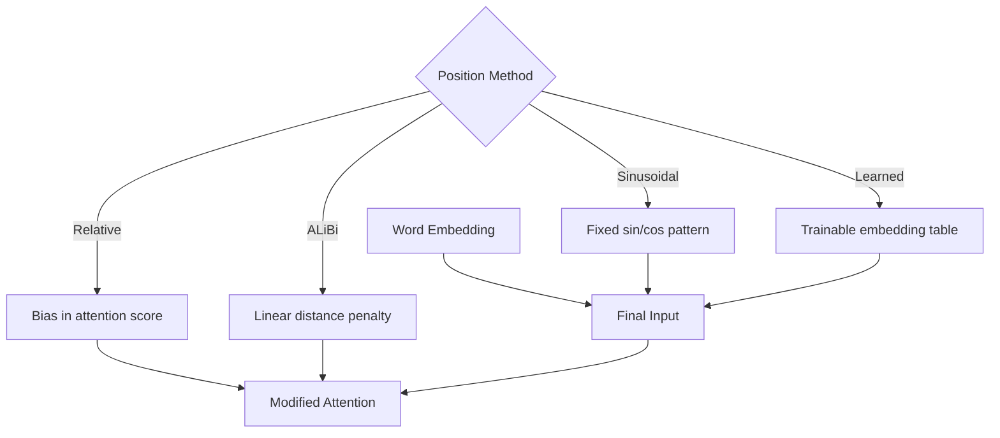

# Positional Encoding — Why Order Matters

In the last chapter, we saw the math of self-attention and multi-head attention. But there's a massive problem we've been avoiding — **self-attention doesn't understand word order**.

This might sound surprising. But it's true. In this chapter, we'll see why this is a problem and how **Positional Encoding** solves it.

## Understanding the Problem First

Think about it — you tell someone "dog bites man." A dog bit a man. Now "man bites dog" — the same three words, but the meaning is completely opposite. A man bit a dog.

```
  "dog bites man"   →  🐕 bites 🧑
  "man bites dog"   →  🧑 bites 🐕

  Same words, same embeddings — just different order. Meaning is completely opposite.
```

But for self-attention, these two sentences are the same thing. Because self-attention only looks at which words are related to which — **it has no concept of position or order**.

> [!warn] Permutation Invariance
> Self-attention is **permutation-invariant** — meaning if you rearrange the input words in any order, the output will be the same (just rows shuffled). Many call this the "bag of words" approach. For language, this is a catastrophe.

```
  Input A:  [dog, bites, man]     →  Self-Attention  →  Output A
  Input B:  [man, bites, dog]     →  Self-Attention  →  Output B

  Output A and Output B will be exactly the same (except row order)!
```

## The Solution: Adding Position Information

So what can we do? We need to add a **position signal** to each word's embedding. Then the model can understand — "this word is at position 3 in the sentence."

```
  word_embedding      +     positional_encoding    =    final_embedding
  ┌──────────┐              ┌──────────┐                ┌──────────┐
  │  word     │       +      │ position │      =         │ word +   │
  │  meaning  │              │  info    │                │ position │
  └──────────┘              └──────────┘                └──────────┘
```

Now the question is — what should this position signal look like? The simple answer is — just put the word's position number (1, 2, 3, ...). But this has problems:

- Position numbers like 1, 2, 3, ..., 100 — these numbers are unbounded. For long sequences, numbers get very large.
- The model can't learn anything useful from these large numbers; instead, they make training unstable.

> [!note] Requirements for Position Encoding
> A good positional encoding must be such that:
> - Each position has a unique encoding
> - Adjacent positions' encodings have a relationship
> - Works for any sequence length (extrapolation)
> - Values are bounded (within [-1, 1])

## Original Sinusoidal Encoding

The 2017 paper "Attention Is All You Need" provides an elegant solution — **sinusoidal positional encoding**. The idea is: use **sine and cosine waves** to add position information.

The two formulas are:

```
  ┌─────────────────────────────────────────────────────────┐
  │                                                         │
  │  PE(pos, 2i)   = sin(pos / 10000^(2i/d_model))         │
  │                                                         │
  │  PE(pos, 2i+1) = cos(pos / 10000^(2i/d_model))         │
  │                                                         │
  └─────────────────────────────────────────────────────────┘

  pos   = position number (0, 1, 2, ...)
  i     = dimension index
  d_model = embedding dimension
```

### Understanding the Formula

For each position, a vector of length d_model is created. The **even indices (2i)** get sin values, **odd indices (2i+1)** get cos values.

Imagine — many sine waves, each with a different frequency. Each dimension represents a wave of a specific frequency.

```
  Dimension 0-1:  Very low frequency (long wave)  ── ~~~~~~~~~~~
  Dimension 2-3:  A bit higher frequency           ── ~~~~~~
  Dimension 4-5:  Even higher frequency             ── ~~~~
  ...
  Dimension d-2, d-1: Very high frequency (short wave) ── ~~

  At each position, a unique combination of all these waves
  is created — like a special "fingerprint."
```

```
  Let's visualize positional encoding (heatmap style):

  Position →   0      1      2      3      4      5      6
            ┌──────┬──────┬──────┬──────┬──────┬──────┬──────┐
  dim 0  │  0.0  │ 0.84 │ 0.91 │ 0.14 │-0.76 │-0.96 │-0.28 │  ← sin (low freq)
  dim 1  │  1.0  │ 0.54 │-0.42 │-0.99 │-0.65 │ 0.28 │ 0.96 │  ← cos (low freq)
  dim 2  │  0.0  │ 0.93 │ 0.75 │-0.52 │-0.99 │-0.30 │ 0.62 │  ← sin (higher freq)
  dim 3  │  1.0  │ 0.36 │-0.66 │-0.85 │ 0.07 │ 0.95 │ 0.78 │  ← cos (higher freq)
  dim 4  │  0.0  │ 0.99 │-0.29 │-0.95 │ 0.38 │ 0.92 │-0.49 │  ← sin (even higher)
  dim 5  │  1.0  │ 0.06 │-0.96 │ 0.31 │ 0.92 │-0.39 │-0.87 │  ← cos (even higher)
            └──────┴──────┴──────┴──────┴──────┴──────┴──────┘

  Lower dimensions have higher frequency → change faster
  Upper dimensions have lower frequency → change slower
```

### Why Sin and Cos?

> [!important] Why Use Sinusoidal?
> There are three big reasons:
>
> 1. **Bounded values**: sin and cos values are always within [-1, 1]. No unbounded numbers.
> 2. **Extrapolation**: Even if a longer sequence appears at test time than what was seen during training, sinusoidal encoding still works.
> 3. **Relative position**: Sin and cos have a beautiful mathematical property — PE(pos+k) can be expressed as a linear function of PE(pos). That means the model can learn relative positions.

```
  Mathematical relationship (relative position):

  sin(pos + k) = sin(pos)·cos(k) + cos(pos)·sin(k)
  cos(pos + k) = cos(pos)·cos(k) - sin(pos)·sin(k)

  Meaning PE(pos+k) is a linear transformation of PE(pos)!
  The model can learn this relationship to understand relative position.
```

## Code: Creating Positional Encoding

The code below creates sinusoidal positional encoding using PyTorch. Notice — there are no learnable parameters here. It's a fixed formula that stays in place before training begins.

```python
import torch
import torch.nn as nn
import math

class SinusoidalPositionalEncoding(nn.Module):
    def __init__(self, d_model=512, max_len=5000):
        super().__init__()

        # Create a zero matrix of shape (max_len, d_model)
        pe = torch.zeros(max_len, d_model)

        # Position: 0, 1, 2, ..., max_len-1
        position = torch.arange(0, max_len, dtype=torch.float).unsqueeze(1)

        # Division term: 10000^(2i/d_model)
        # This determines the frequency
        div_term = torch.exp(
            torch.arange(0, d_model, 2).float() * (-math.log(10000.0) / d_model)
        )

        # Even indices → sin
        pe[:, 0::2] = torch.sin(position * div_term)
        # Odd indices → cos
        pe[:, 1::2] = torch.cos(position * div_term)

        # Add batch dimension
        pe = pe.unsqueeze(0)  # shape: (1, max_len, d_model)

        # Register as buffer — this is not learnable
        self.register_buffer('pe', pe)

    def forward(self, x):
        # x shape: (batch, seq_len, d_model)
        seq_len = x.size(1)
        # Add the first seq_len positions from pe
        x = x + self.pe[:, :seq_len, :]
        return x
```

The key thing in this code is `div_term`. What the formula writes as `1/10000^(2i/d_model)` is expressed using `exp` and `log` for numerical stability — because computing with exp and log reduces floating-point issues compared to computing large powers directly. Even indices get sin, odd indices get cos, exactly as the formula specifies. `register_buffer` keeps pe as state because it won't be updated by gradients.

Let's run it:

```python
pe = SinusoidalPositionalEncoding(d_model=64, max_len=100)
x = torch.randn(2, 10, 64)  # batch=2, seq_len=10

output = pe(x)
print("Output shape:", output.shape)  # torch.Size([2, 10, 64])

# Look at encoding for position 0
print("PE at position 0:", pe.pe[0, 0, :8])  # [0, 1, 0, 1, 0, 1, ...]
```

## How Encoding Is Added

Positional encoding is simply added directly to the word embedding. Not multiplication, addition.

```python
# Let's say we have word embeddings
word_embedding = embedding_layer(input_tokens)  # (batch, seq, d_model)

# Add positional encoding
final_embedding = word_embedding + positional_encoding
```

```
  Why addition, not multiplication?

  word_embedding:     [0.5, -0.3, 0.8, 0.1, ...]
  positional_encoding:[0.0,  1.0, 0.0, 1.0, ...]  (position 0)
                      ──────────────────────────── +
  final_embedding:    [0.5,  0.7, 0.8, 1.1, ...]

  Multiplying would zero out many values for position 0's encoding —
  because sin(0) = 0. But with addition, both word info and position info
  are preserved properly.
```

> [!note] Interesting Point
> When you add two signals together, don't they "mix"? Yes, somewhat. But since word embeddings and positional encodings live in different frequency ranges, the linear projections in multi-head attention can separate the mixed signal back into individual pieces of information.

## Learned Positional Embedding: BERT and GPT's Approach

While the original Transformer paper used sinusoidal encoding, later models like BERT and GPT use **learned positional embedding**.

There's no formula here. There's a simple embedding table — just like word embedding. For each position (0, 1, 2, ..., max_len-1), there's a learnable vector, and during training the model learns for itself what encoding each position should have.

```python
class LearnedPositionalEncoding(nn.Module):
    def __init__(self, d_model=512, max_len=512):
        super().__init__()
        # This is the learnable embedding table
        self.pe = nn.Embedding(max_len, d_model)

    def forward(self, x):
        batch_size, seq_len, _ = x.size()
        # Create position indices: 0, 1, 2, ..., seq_len-1
        positions = torch.arange(seq_len, device=x.device)
        # Embedding lookup and add
        x = x + self.pe(positions).unsqueeze(0)
        return x
```

The key difference in this code is `nn.Embedding` — it's a learnable table. During training, the model itself figures out the best vector for each position. But there's a limit — it won't work for positions beyond max_len because the table doesn't have that many entries.

## Sinusoidal vs Learned: Comparison

| Feature | Sinusoidal Encoding | Learned Embedding |
|---------|--------------------|-------------------|
| **Used by** | Original Transformer (2017) | BERT, GPT, ViT |
| **Parameters** | Zero (fixed formula) | max_len × d_model parameters |
| **Extrapolation** | ✅ Works at any length | ❌ Limited to max_len |
| **Flexibility** | Less — fixed pattern | More — model learns itself |
| **Needs training data** | No | Yes |
| **Performance** | Good | Usually slightly better |
| **Implementation** | A bit complex | Very simple |

> [!important] Practical Experience
> Research shows the performance difference between learned and sinusoidal is not very significant. So BERT/GPT chose learned embedding for simplicity and flexibility.

## Modern Approaches: Relative Positional Encoding and ALiBi

The world doesn't stand still. After sinusoidal and learned, more advanced methods have emerged. Let's briefly look at two.

### Relative Positional Encoding

In the original method, position info is absolute — "this word is at position 5." But often relative position is more important — "this word is 3 positions after that word." Relative Positional Encoding leverages this idea.

The main idea: when computing attention scores, a bias is added based on relative distance.

```
  Absolute:   "Word A is at position 5, Word B is at position 8"
  Relative:   "Word B is +3 positions away from Word A"

  Relative encoding: for distance +3, a specific bias is added to the score.
```

T5 and Transformer-XL use this approach.

### ALiBi (Attention with Linear Biases)

ALiBi is extremely simple but powerful. There's no positional encoding at all. Instead, when computing attention scores, a negative value is subtracted based on relative distance. Distant words get less attention, nearby words get more.

```
  ALiBi attention score:

  score(i, j) = (Q_i · K_j / √d_k)  -  m · |i - j|

  m = a fixed slope (different per head)
  |i - j| = distance between two positions

  For distant words, |i - j| is large → score is lower → less attention.
```

> [!note] ALiBi's Advantage
> ALiBi's biggest advantage is — it works on much longer sequences at inference time than what was seen during training. No retraining needed.



## The Full Pipeline Together

Let's see a complete example where word embedding and positional encoding work together:

```python
import torch
import torch.nn as nn

class TransformerInput(nn.Module):
    def __init__(self, vocab_size=10000, d_model=512, max_len=512):
        super().__init__()
        self.word_embedding = nn.Embedding(vocab_size, d_model)
        self.pos_encoding = SinusoidalPositionalEncoding(d_model, max_len)

    def forward(self, input_ids):
        # input_ids: (batch, seq_len) — integer token ids
        word_emb = self.word_embedding(input_ids)  # (batch, seq, d_model)
        output = self.pos_encoding(word_emb)        # word + position
        return output

# Let's run it
model = TransformerInput(vocab_size=10000, d_model=64, max_len=100)
input_ids = torch.randint(0, 10000, (2, 10))  # two sentences, 10 tokens each

output = model(input_ids)
print("Final input shape:", output.shape)  # torch.Size([2, 10, 64])
```

Two things are happening here — first, each token id is converted to a dense vector (word embedding), then a position signal is added for each position (positional encoding). This combined output goes to the self-attention layer next. This entire process is the Transformer's "input pipeline."

## In Conclusion

Without position information, Transformer is essentially blind — it can recognize words but can't understand where they are. What we learned today:

- Self-attention is **permutation-invariant** — it doesn't understand order.
- **Positional encoding** adds a position signal.
- **Sinusoidal** encoding is the original method — fixed, extrapolatable.
- **Learned embedding** is BERT/GPT's method — flexible but bounded.
- **Relative and ALiBi** are modern approaches — better for long sequences.

In the next chapter, we'll look at the complete Transformer architecture — encoder, decoder, residual connections, layer norm — how the entire model fits together.