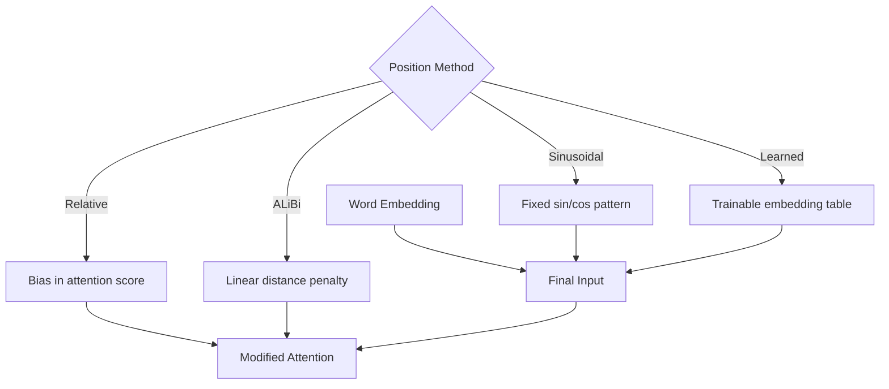

# Positional Encoding — কেন অর্ডার দরকার

গত chapter এ আমরা self-attention এর গণিত আর multi-head দেখলাম। কিন্তু একটা বিশাল সমস্যা আমরা এড়িয়ে গেছি — **self-attention word order বোঝে না**।

এটা শুনে অবাক লাগতে পারে। কিন্তু সত্যি। এই chapter এ দেখবো কেন এটা সমস্যা, আর কীভাবে **Positional Encoding** এই সমস্যা সমাধান করে।

## সমস্যাটা আগে বুঝি

ভাবো — তুমি কাউকে বললে "dog bites man"। একটা কুকুর একটা মানুষকে কামড়েছে। এবার "man bites dog" — একই তিনটা শব্দ, কিন্তু অর্থ একদম উল্টো। একটা মানুষ কুকুরকে কামড়েছে।

```
  "dog bites man"   →  🐕 কামড়ায় 🧑
  "man bites dog"   →  🧑 কামড়ায় 🐕

  একই শব্দ, একই embedding — শুধু order আলাদা। অর্থ একদম উল্টো।
```

কিন্তু self-attention এর জন্য এই দুটো বাক্য একই জিনিস। কারণ self-attention শুধু দেখে কোন শব্দ কোন শব্দের সাথে related — **position বা order এর কোনো ধারণা তার নেই**।

> [!warn] Permutation Invariance
> Self-attention হলো **permutation-invariant** — মানে তুমি input এর শব্দগুলো যেকোনো order এ সাজালেও output একই আসবে (শুধু rows উল্টেপাল্টে যাবে)। এটাকে অনেকে "bag of words" approach বলে। ভাষার জন্য এটা ক্যাটাস্ট্রফি।

```
  Input A:  [dog, bites, man]     →  Self-Attention  →  Output A
  Input B:  [man, bites, dog]     →  Self-Attention  →  Output B

  Output A আর Output B হবে ঠিক একই (row order ছাড়া)!
```

## সমাধান: Position Information যোগ করা

তাহলে কী করা যায়? প্রতিটা শব্দের embedding এর সাথে একটা **position signal** যোগ করে দিতে হবে। তাহলে model বুঝতে পারবে — "এই শব্দটা বাক্যের ৩ নম্বর position এ আছে।"

```
  word_embedding      +     positional_encoding    =    final_embedding
  ┌──────────┐              ┌──────────┐                ┌──────────┐
  │  শব্দের   │       +      │ position │      =         │ শব্দ +    │
  │  অর্থ     │              │ তথ্য     │                │ position │
  └──────────┘              └──────────┘                └──────────┘
```

এখন প্রশ্ন হলো — এই position signal হবে কেমন? সহজ উত্তর হলো — শব্দের position নম্বর বসিয়ে দাও (1, 2, 3, ...)। কিন্তু এতে সমস্যা আছে:

- Position নম্বর যেমন 1, 2, 3, ..., 100 — এই সংখ্যাগুলো unbounded। বড় sequence এ সংখ্যা অনেক বড় হবে।
- Model এই বড় সংখ্যা থেকে কিছু শেখে না, উল্টো training unstable করে দেয়।

> [!note] Position encoding এর শর্ত
> একটা ভালো positional encoding কে হতে হবে এমন যে:
> - প্রতিটা position এর জন্য একটা unique encoding থাকবে
> - দুটো adjacent position এর encoding এর মধ্যে relationship থাকবে
> - যেকোনো sequence length এর জন্য কাজ করবে (extrapolation)
> - সংখ্যাগুলো bounded থাকবে ([-1, 1] এর মধ্যে)

## Original Sinusoidal Encoding

2017 paper "Attention Is All You Need" এ একটা সুন্দর সমাধান দেওয়া হয়েছে — **sinusoidal positional encoding**। আইডিয়াটা হলো: position তথ্য যোগ করার জন্য **sine আর cosine wave** ব্যবহার করা।

ফর্মুলা দুটো হলো:

```
  ┌─────────────────────────────────────────────────────────┐
  │                                                         │
  │  PE(pos, 2i)   = sin(pos / 10000^(2i/d_model))         │
  │                                                         │
  │  PE(pos, 2i+1) = cos(pos / 10000^(2i/d_model))         │
  │                                                         │
  └─────────────────────────────────────────────────────────┘

  pos   = position নম্বর (0, 1, 2, ...)
  i     = dimension index
  d_model = embedding dimension
```

### ফর্মুলা বোঝার উপায়

প্রতিটা position এর জন্য একটা vector তৈরি হয় যার দৈর্ঘ্য d_model। এই vector এর **জোড় index (2i)** গুলোতে sin মান বসে, **বিজোড় index (2i+1)** গুলোতে cos মান বসে।

একটু কল্পনা করো — অনেকগুলো sine wave আছে, প্রতিটার frequency আলাদা। প্রতিটা dimension একটা নির্দিষ্ট frequency এর wave দেখায়।

```
  Dimension 0-1:  খুব low frequency (দীর্ঘ wave) ── ~~~~~~~~~~~
  Dimension 2-3:  একটু বেশি frequency            ── ~~~~~~
  Dimension 4-5:  আরও বেশি frequency              ── ~~~~
  ...
  Dimension d-2, d-1: খুব high frequency (ছোট wave) ── ~~

  প্রতিটা position এ এই সব wave গুলোর একটা unique combination
  তৈরি হয় — যেমন একটা বিশেষ "fingerprint"।
```

```
  Positional encoding কে চোখে দেখা যাক (heatmap style):

  Position →   0      1      2      3      4      5      6
            ┌──────┬──────┬──────┬──────┬──────┬──────┬──────┐
  dim 0  │  0.0  │ 0.84 │ 0.91 │ 0.14 │-0.76 │-0.96 │-0.28 │  ← sin (low freq)
  dim 1  │  1.0  │ 0.54 │-0.42 │-0.99 │-0.65 │ 0.28 │ 0.96 │  ← cos (low freq)
  dim 2  │  0.0  │ 0.93 │ 0.75 │-0.52 │-0.99 │-0.30 │ 0.62 │  ← sin (higher freq)
  dim 3  │  1.0  │ 0.36 │-0.66 │-0.85 │ 0.07 │ 0.95 │ 0.78 │  ← cos (higher freq)
  dim 4  │  0.0  │ 0.99 │-0.29 │-0.95 │ 0.38 │ 0.92 │-0.49 │  ← sin (even higher)
  dim 5  │  1.0  │ 0.06 │-0.96 │ 0.31 │ 0.92 │-0.39 │-0.87 │  ← cos (even higher)
            └──────┴──────┴──────┴──────┴──────┴──────┴──────┘

  নিচের dimension গুলোর frequency বেশি → দ্রুত পরিবর্তন হয়
  উপরের dimension গুলোর frequency কম → ধীরে পরিবর্তন হয়
```

### কেন Sin আর Cos?

> [!important] Sinusoidal কেন ব্যবহার করা হয়?
> তিনটা বড় কারণ আছে:
>
> 1. **Bounded values**: sin আর cos এর মান সবসময় [-1, 1] এর মধ্যে থাকে। কোনো unbounded সংখ্যা নেই।
> 2. **Extrapolation**: training এ যে sequence length দেখেছি তার চেয়ে বড় sequence test time এ আসলেও sinusoidal encoding এখনও কাজ করে।
> 3. **Relative position**: sin আর cos এর একটা সুন্দর গাণিতিক ধর্ম আছে — PE(pos+k) কে PE(pos) এর একটা linear function হিসেবে প্রকাশ করা যায়। অর্থাৎ model relative position শিখতে পারে।

```
  গাণিতিক সম্পর্ক (relative position):

  sin(pos + k) = sin(pos)·cos(k) + cos(pos)·sin(k)
  cos(pos + k) = cos(pos)·cos(k) - sin(pos)·sin(k)

  মানে PE(pos+k) হলো PE(pos) এর একটা linear transformation!
  Model এই relationship শিখে relative position বুঝতে পারে।
```

## Code: Positional Encoding তৈরি করা

নিচের কোডটা PyTorch দিয়ে sinusoidal positional encoding বানায়। খেয়াল করো — এখানে কোনো learnable parameter নেই। এটা একটা নির্দিষ্ট formula, যা training এর আগে থেকেই বসে থাকে।

```python
import torch
import torch.nn as nn
import math

class SinusoidalPositionalEncoding(nn.Module):
    def __init__(self, d_model=512, max_len=5000):
        super().__init__()

        # একটা zero matrix বানাই shape (max_len, d_model)
        pe = torch.zeros(max_len, d_model)

        # position: 0, 1, 2, ..., max_len-1
        position = torch.arange(0, max_len, dtype=torch.float).unsqueeze(1)

        # division term: 10000^(2i/d_model)
        # এটাই frequency নির্ধারণ করে
        div_term = torch.exp(
            torch.arange(0, d_model, 2).float() * (-math.log(10000.0) / d_model)
        )

        # জোড় index → sin
        pe[:, 0::2] = torch.sin(position * div_term)
        # বিজোড় index → cos
        pe[:, 1::2] = torch.cos(position * div_term)

        # batch dimension যোগ করি
        pe = pe.unsqueeze(0)  # shape: (1, max_len, d_model)

        # buffer হিসেবে register করি — এটা learnable না
        self.register_buffer('pe', pe)

    def forward(self, x):
        # x shape: (batch, seq_len, d_model)
        seq_len = x.size(1)
        # pe এর প্রথপ্রথম seq_len গুলো position যোগ করি
        x = x + self.pe[:, :seq_len, :]
        return x
```

উপরের কোডে মূল জিনিসটা হলো `div_term`। আসলে ফর্মুলায় যেটা `1/10000^(2i/d_model)` সেটাকে `exp` আর `log` দিয়ে লেখা হয়েছে numerical stability এর জন্য — কারণ বড় power এর মান compute করার চেয়ে exp আর log দিয়ে করলে ভাসমান বিন্দুর সমস্যা কম হয়। জোড় index গুলোতে sin, বিজোড় index গুলোতে cos বসানো হয়েছে একদম formula অনুযায়ী। `register_buffer` দিয়ে pe কে রাখা হয়েছে কারণ এটা gradient দিয়ে update হবে না, শুধু state হিসেবে থাকবে।

চালাই দেখি:

```python
pe = SinusoidalPositionalEncoding(d_model=64, max_len=100)
x = torch.randn(2, 10, 64)  # batch=2, seq_len=10

output = pe(x)
print("Output shape:", output.shape)  # torch.Size([2, 10, 64])

# position 0 এর encoding দেখি
print("PE at position 0:", pe.pe[0, 0, :8])  # [0, 1, 0, 1, 0, 1, ...]
```

## Encoding কীভাবে যোগ করা হয়

Positional encoding কে শুধু সরাসরি word embedding এর সাথে যোগ করা হয়। গুণ নয়, যোগ।

```python
# ধরি word embedding আাছে
word_embedding = embedding_layer(input_tokens)  # (batch, seq, d_model)

# positional encoding যোগ করি
final_embedding = word_embedding + positional_encoding
```

```
  কেন যোগ, গুণ নয়?

  word_embedding:     [0.5, -0.3, 0.8, 0.1, ...]
  positional_encoding:[0.0,  1.0, 0.0, 1.0, ...]  (position 0)
                      ──────────────────────────── +
  final_embedding:    [0.5,  0.7, 0.8, 1.1, ...]

  গুণ করলে position 0 এর encoding অনেক value কে 0 করে দিতো —
  কারণ sin(0) = 0। কিন্তু যোগ করলে word তথ্য এবং position তথ্য
  দুটোই ঠিকঠাক থাকে।
```

> [!note] আকর্ষণীয় বিষয়
> দুটো signal কে একসাথে যোগ করলে সেগুলো কি "mix" হয়ে যায় না? হ্যাঁ, কিছুটা হয়। কিন্তু যেহেতু word embedding আর positional encoding ভিন্ন frequency তে থাকে, তাই multi-head attention এর linear projection গুলো এই mixed signal থেকে আলাদা আলাদা তথ্য বের করতে পারে।

## Learned Positional Embedding: BERT আর GPT এর পদ্ধতি

Original Transformer paper এ sinusoidal encoding ব্যবহার করা হলেও, পরবর্তী model গুলো যেমন BERT আর GPT **learned positional embedding** ব্যবহার করে।

এখানে কোনো ফর্মুলা নেই। একটা সাধারণ embedding table থাকে — ঠিক যেমন word embedding। প্রতিটা position (0, 1, 2, ..., max_len-1) এর জন্য একটা learnable vector থাকে, আর training এর সময় model নিজেই শিখে নেয় প্রতিটা position এর জন্য কী encoding হবে।

```python
class LearnedPositionalEncoding(nn.Module):
    def __init__(self, d_model=512, max_len=512):
        super().__init__()
        # এটাই learnable embedding table
        self.pe = nn.Embedding(max_len, d_model)

    def forward(self, x):
        batch_size, seq_len, _ = x.size()
        # position index বানাই: 0, 1, 2, ..., seq_len-1
        positions = torch.arange(seq_len, device=x.device)
        # embedding lookup আর যোগ
        x = x + self.pe(positions).unsqueeze(0)
        return x
```

এই কোডে মূল পার্থক্য হলো `nn.Embedding` — এটা একটা learnable table। training চলাকালীন model নিজে নিজে position গুলোর জন্য সবচেয়ে ভালো vector বের করে নেয়। কিন্তু একটা সীমা আছে — max_len এর বেশি position এর জন্য কাজ করবে না কারণ table এ ওতো গুলো entry নেই।

## Sinusoidal vs Learned: Comparison

| বৈশিষ্ট্য | Sinusoidal Encoding | Learned Embedding |
|----------|--------------------|-------------------|
| **কোন model** | Original Transformer (2017) | BERT, GPT, ViT |
| **Parameters** | শূন্য (fixed formula) | max_len × d_model টা parameter |
| **Extrapolation** | ✅ যেকোনো length এ কাজ করে | ❌ max_len পর্যন্ত সীমিত |
| **Flexibility** | কম — fixed pattern | বেশি — model নিজে শেখে |
| **Training data দরকার** | না | হ্যাঁ |
| **Performance** | ভালো | সাধারণত একটু বেশি ভালো |
| **Implementation** | একটু জটিল | খুব simple |

> [!important] বাস্তব অভিজ্ঞতা
> গবেষণায় দেখা গেছে — learned আর sinusoidal এর মধ্যে performance পার্থক্য খুব বেশি না। তাই BERT/GPT শুধু simplicity আর flexibility এর জন্য learned embedding নিয়েছে।

## Modern Approach: Relative Positional Encoding আর ALiBi

দুনিয়া দাঁড়িয়ে নেই। sinusoidal আর learned এর পরে আরও উন্নত method বেরিয়েছে। ছোট করে দুটো দেখি।

### Relative Positional Encoding

Original method এ position তথ্য absolute — "এই শব্দটা position 5 এ আছে।" কিন্তু অনেক সময় relative position বেশি গুরুত্বপূর্ণ — "এই শব্দটা ওই শব্দটার থেকে ৩ পজিশন পরে।" Relative Positional Encoding এই ধারণাকে কাজে লাগায়।

মূল আইডিয়া: attention score বের করার সময় relative distance অনুযায়ী একটা bias যোগ করা হয়।

```
  Absolute:   "শব্দ A position 5 এ, শব্দ B position 8 এ"
  Relative:   "শব্দ B শব্দ A এর থেকে +3 position দূরে"

  Relative encoding: দূরত্ব +3 এর জন্য একটা নির্দিষ্ট bias যোগ হয় score এ।
```

T5 আর Transformer-XL এই approach ব্যবহার করে।

### ALiBi (Attention with Linear Biases)

ALiBi একদম সহজ কিন্তু শক্তিশালী। কোনো positional encoding নেই। বরং attention score বের করার সময় relative distance অনুযায়ী একটা ঋণাত্মক মান বিয়োগ করা হয়। দূরের শব্দের দিকে attention কমানো হয়, কাছের শব্দের দিকে বেশি।

```
  ALiBi attention score:

  score(i, j) = (Q_i · K_j / √d_k)  -  m · |i - j|

  m = একটা fixed slope (head ভেদে আলাদা)
  |i - j| = দুই position এর দূরত্ব

  দূরের শব্দের জন্য |i - j| বড় → score কম → attention কম।
```

> [!note] ALiBi এর সুবিধা
> ALiBi এর সবচেয়ে বড় সুবিধা হলো — training এ যে sequence length দেখেছে তার চেয়ে অনেক বড় sequence inference এ কাজ করে। কোনো retraining লাগে না।



## পুরো Pipeline একসাথে

নিচে একটা সম্পূর্ণ example দেখি যেখানে word embedding আর positional encoding একসাথে কাজ করে:

```python
import torch
import torch.nn as nn

class TransformerInput(nn.Module):
    def __init__(self, vocab_size=10000, d_model=512, max_len=512):
        super().__init__()
        self.word_embedding = nn.Embedding(vocab_size, d_model)
        self.pos_encoding = SinusoidalPositionalEncoding(d_model, max_len)

    def forward(self, input_ids):
        # input_ids: (batch, seq_len) — integer token ids
        word_emb = self.word_embedding(input_ids)  # (batch, seq, d_model)
        output = self.pos_encoding(word_emb)        # word + position
        return output

# চালাই দেখি
model = TransformerInput(vocab_size=10000, d_model=64, max_len=100)
input_ids = torch.randint(0, 10000, (2, 10))  # দুটো sentence, প্রতিটি 10 token

output = model(input_ids)
print("Final input shape:", output.shape)  # torch.Size([2, 10, 64])
```

এখানে দুটো জিনিস ঘটছে — প্রথমে প্রতিটা token id কে একটা dense vector এ রূপান্তর করা হচ্ছে (word embedding), তারপর প্রতিটা position এর জন্য একটা signal যোগ করা হচ্ছে (positional encoding)। এই combined output-ই পরে self-attention layer এ যাবে। এই পুরো প্রক্রিয়াটাই Transformer এর "input pipeline"।

## পরিশেষে

Position তথ্য ছাড়া Transformer আসলে অন্ধ — সে শুধু শব্দ চিনতে পারে, কিন্তু কোন শব্দ কোথায় আছে সেটা বোঝে না। আজকের chapter এ যা শিখলাম:

- Self-attention **permutation-invariant** — order বোঝে না।
- **Positional encoding** দিয়ে position signal যোগ করা হয়।
- **Sinusoidal** encoding হলো original method — fixed, extrapolatable।
- **Learned embedding** হলো BERT/GPT এর method — flexible কিন্তু bounded।
- **Relative আর ALiBi** হলো modern approach — দীর্ঘ sequence এ ভালো।

পরের chapter এ আমরা সম্পূর্ণ Transformer architecture দেখবো — encoder, decoder, residual connection, layer norm — সব মিলিয়ে কীভাবে গোটা model একসাথে বসে।