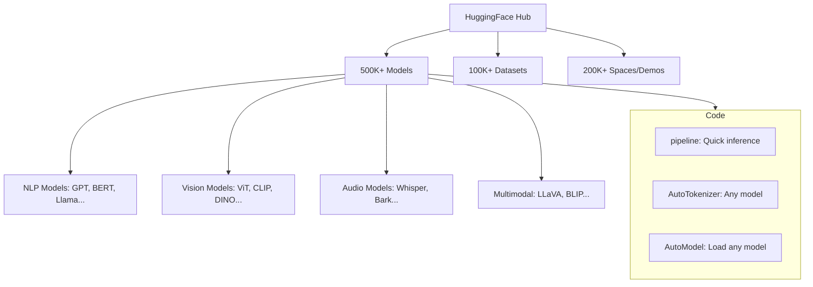
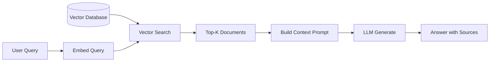

# Practical — HuggingFace, Tokenization, Fine-tuning

After learning so much theory, it's time to get hands-on! In this chapter we'll see — how tokenizers work, how to use models with HuggingFace, how to fine-tune, and how to optimize inference in production.

Think of this chapter as "the manual for using transformers in real life."

---

## Tokenization Deep Dive

Transformers don't understand text — they understand numbers. So text needs to be converted to numbers. That's what a tokenizer does. But it's not as simple as it seems!

### Word-Level Tokenization: The First Problem

The simplest approach — split words by spaces.

```
  "I love transformers" → ["I", "love", "transformers"]

  Each word gets an ID:
  I → 5
  love → 142
  transformers → 9999
```

But there are two problems:

```
  Problem 1: Vocabulary is huge!
  ┌─────────────────────────────┐
  │ English: 500,000+ words     │
  │ Bengali: 100,000+ words     │
  │ Each word = 1 embedding row │
  │ Memory: Impossible!         │
  └─────────────────────────────┘

  Problem 2: OOV (Out of Vocabulary)
  ┌─────────────────────────────┐
  │ Train: "unbelievable" ✓     │
  │ Test:  "unbelievably" ✗ 😱  │
  │ → <UNK> token! means unknown│
  │ → Model understands nothing │
  └─────────────────────────────┘
```

> [!warn] Problems with Word-Level
> Each unique word needs a separate token. "run," "running," "runs," "ran" — four separate tokens! Even though they're all variants of "run." And seeing a new word gives `<UNK>` — the model is blind.

### BPE (Byte Pair Encoding) — Subword Magic

BPE's idea is brilliant — start with characters, then keep merging the most common pair.

```
  Step 0: Split all words into characters

  "low"  → l o w
  "lower" → l o w e r
  "lowest" → l o w e s t
  "newest" → n e w e s t
  "widest" → w i d e s t

  Step 1: Find the most common pair
  Pair count:
    (e, s) → 3 times  ← most common!
    (l, o) → 2 times
    (o, w) → 2 times

  Merge (e, s) → "es"
  Now: low / lower / low est / new est / wid est

  Step 2: Find most common pair again
    (es, t) → 3 times  ← merge!

  → "est"
  Now: low / lower / low est / new est / wid est

  Step 3: Continue...
    (l, o) → 2, merge → "lo"
    (lo, w) → 2, merge → "low"

  Final vocabulary:
  ┌──────────────────────────┐
  │ l o w e r s t            │ ← characters (base)
  │ es  est  lo  low         │ ← merged subwords
  │ er  ne  wi               │
  └──────────────────────────┘

  Tokenize "lowest":
  → "low" + "est" = [low] [est]  ✓ two subwords!
  Tokenize "newest":
  → "new" + "est" = ... wait, depends on merges
```

> [!note] Benefits of BPE
> - No OOV problem — any word can be broken down to characters
> - Common words become one token, rare words become a few subwords
> - Vocabulary size is small (like 30K-50K)
> - GPT-2, GPT-3, GPT-4 all use BPE

The code below shows training a simple BPE tokenizer. You can see the merges happening step by step.

```python
from collections import Counter

def get_pair_counts(vocab):
    """Count adjacent character pairs"""
    pairs = Counter()
    for word, freq in vocab.items():
        symbols = word.split()
        for i in range(len(symbols) - 1):
            pairs[(symbols[i], symbols[i+1])] += freq
    return pairs

def merge_pair(pair, vocab):
    """Merge a specific pair"""
    new_vocab = {}
    for word, freq in vocab.items():
        new_word = word.replace(
            f"{pair[0]} {pair[1]}", f"{pair[0]}{pair[1]}"
        )
        new_vocab[new_word] = freq
    return new_vocab

# Training data: word and frequency
vocab = {
    "l o w </w>": 5,
    "l o w e r </w>": 2,
    "l o w e s t </w>": 2,
    "n e w e s t </w>": 6,
    "w i d e s t </w>": 3,
}

# 5 merge steps
for step in range(5):
    pairs = get_pair_counts(vocab)
    if not pairs:
        break
    best_pair = pairs.most_common(1)[0][0]
    vocab = merge_pair(best_pair, vocab)
    print(f"Step {step+1}: Merged {best_pair}")
    for word, freq in sorted(vocab.items(), key=lambda x: -x[1]):
        print(f"  {word}: {freq}")

# Output:
# Step 1: Merged ('e', 's')
# Step 2: Merged ('es', 't')
# Step 3: Merged ('est', '</w>')
# Step 4: Merged ('l', 'o')
# Step 5: Merged ('lo', 'w')
```

In the code above, `get_pair_counts` counts adjacent character pairs. `merge_pair` merges the most common pair. At each step, the most frequent pair is merged. The output shows — first `e+s=es`, then `es+t=est`, and so on.

### WordPiece (BERT)

WordPiece is like BPE, but the merge criterion is different. BPE merges the most frequent pair, WordPiece merges the most "useful" pair (the one that increases likelihood the most).

| Feature | BPE | WordPiece |
|---------|-----|-----------|
| **Merge criteria** | Most frequent pair | Highest likelihood gain |
| **Tokenization** | Apply merges left to right | Greedy longest match |
| **Used by** | GPT-2/3/4, Llama | BERT, DistilBERT |
| **Vocabulary size** | 30K-100K | 30K |

### SentencePiece — Language Agnostic

SentencePiece's main advantage — it doesn't treat space as a special character. Space is also a character. So it works with space-less languages (Chinese, Japanese, Thai).

```
  Traditional tokenizer: split by spaces
  "I am well" → ["I", "am", "well"]  (space split)

  SentencePiece: space is also a character
  "I am well" → "▁I ▁am ▁well"  (▁ = space marker)
  → can be split into subwords
```

> [!important] Which Tokenizers Do Modern LLMs Use?
> - **GPT-2/3/4**: BPE (tiktoken library)
> - **BERT**: WordPiece
> - **Llama/Mistral**: SentencePiece BPE
> - **T5**: SentencePiece Unigram
> - **Gemma**: SentencePiece

---

## HuggingFace Transformers Library

HuggingFace is the "app store" for transformers — with 500K+ pre-trained models, all free.



### pipeline() — The Easiest Way

The code below does sentiment analysis and text generation in a few lines using HuggingFace pipeline. No model download, no config — everything automatic!

```python
from transformers import pipeline

# Sentiment Analysis — 1 line!
classifier = pipeline("sentiment-analysis")
result = classifier("I absolutely love this!")
print(result)
# [{'label': 'POSITIVE', 'score': 0.9998}]

# Text Generation — with GPT-2
generator = pipeline("text-generation", model="gpt2")
story = generator(
    "Once upon a time in Dhaka,",
    max_length=50,
    num_return_sequences=1
)
print(story[0]["generated_text"])
# "Once upon a time in Dhaka, a young programmer discovered..."

# In Bengali too!
generator_bn = pipeline("text-generation", model="bangla-gpt2")
result_bn = generator_bn("Bangladesh is a beautiful")
print(result_bn[0]["generated_text"])
```

In this code, the `pipeline` function does everything together — model download, tokenizer load, preprocessing, inference, postprocessing. The `sentiment-analysis` pipeline uses a BERT model by default. The `text-generation` pipeline generates text with GPT-2. For any task, just give the task name and model name!

### AutoModel / AutoTokenizer — More Control

```python
from transformers import AutoTokenizer, AutoModelForCausalLM
import torch

# Load any model — Auto class figures out the right class
model_name = "meta-llama/Llama-3.2-1B"
tokenizer = AutoTokenizer.from_pretrained(model_name)
model = AutoModelForCausalLM.from_pretrained(
    model_name,
    torch_dtype=torch.float16,  # less memory
    device_map="auto"           # distribute across all GPUs
)

# Tokenize and generate
prompt = "The future of AI is"
inputs = tokenizer(prompt, return_tensors="pt").to(model.device)
output = model.generate(**inputs, max_new_tokens=50)
print(tokenizer.decode(output[0], skip_special_tokens=True))
```

In this code, `AutoTokenizer` and `AutoModelForCausalLM` automatically choose the correct class for any model. `device_map="auto"` distributes the model across available GPUs. `torch_dtype=torch.float16` halves memory usage.

---

## Fine-tuning Techniques

A pre-trained model isn't perfect for everything. It needs to be adapted for your specific task — this is fine-tuning. But how many kinds of fine-tuning are there?

### 1. Full Fine-Tuning: Update Everything

```
  Pre-trained Model (7B params)
  ┌──────────────────────────┐
  │ ████████████████████████ │  ← update all parameters
  │  learning rate: 2e-5     │
  └──────────────────────────┘

  Problem: Need to update 7B parameters
  → Lots of GPU memory (with optimizer state ~100GB+)
  → Lots of time
  → Lots of money 💸
```

### 2. LoRA (Low-Rank Adaptation): Smart Solution

LoRA's idea — instead of updating the entire weight matrix, add a small rank decomposition.

```
  Original weight: W (d × d) = 4096 × 4096

  Full fine-tuning: W' = W + ΔW  (ΔW is also 4096×4096)

  LoRA: W' = W + A × B
                    ↑     ↑
                  d×r    r×d     r = 8 (tiny!)

  ┌───────────┐   ┌──┐ ┌──┐
  │           │ + │A │×│B │   r=8 only!
  │     W     │   │  │ │  │   Only A, B are trained
  │  (frozen) │   │  │ │  │   W is frozen!
  └───────────┘   └──┘ └──┘

  Params: d×d → 2×d×r
  4096² = 16.7M  →  2×4096×8 = 65K
  Only 0.4% of original! 🎉
```

> [!important] LoRA's Core Idea
> The "intrinsic rank" of weight changes in pre-trained models is low. Meaning you can get nearly the same result with a small rank matrix instead of updating the entire large matrix. In LoRA, only the small A, B matrices are trained, the main W stays frozen. Memory and time are much lower!

### 3. QLoRA: LoRA + Quantization

QLoRA goes one step further — quantize the base model to 4-bit, then train LoRA adapters.

```
  Full Fine-Tuning (7B model):
  ┌────────────────────────────┐
  │ Model: 14 GB (FP16)        │
  │ Optimizer: 28 GB (FP32)    │
  │ Gradient: 14 GB            │
  │ Total: ~56 GB → A100 80GB  │
  └────────────────────────────┘

  QLoRA (7B model):
  ┌────────────────────────────┐
  │ Model: 3.5 GB (4-bit NF4)  │  ← 4x less!
  │ LoRA Adapter: ~50 MB       │
  │ Optimizer (adapter only): ~100 MB │
  │ Total: ~4 GB → Any GPU!    │
  └────────────────────────────┘
```

The code below shows LoRA fine-tuning using the HuggingFace PEFT library. Very little code needed.

```python
from peft import LoraConfig, get_peft_model, TaskType
from transformers import AutoModelForCausalLM, TrainingArguments, Trainer
import torch

# 1. Load base model
model = AutoModelForCausalLM.from_pretrained(
    "meta-llama/Llama-3.2-1B",
    torch_dtype=torch.float16,
    device_map="auto"
)

# 2. Create LoRA configuration
lora_config = LoraConfig(
    task_type=TaskType.CAUSAL_LM,
    r=8,                    # rank (small = fewer params, large = more capacity)
    lora_alpha=32,          # scaling factor
    lora_dropout=0.1,
    target_modules=[        # which layers to apply LoRA to
        "q_proj", "k_proj", "v_proj", "o_proj",  # attention
        "gate_proj", "up_proj", "down_proj"       # FFN
    ]
)

# 3. Create LoRA model
model = get_peft_model(model, lora_config)
model.print_trainable_parameters()
# trainable params: 2,097,152 || all params: 1,236,795,392
#                    ↑ only 0.17% is being trained!

# 4. Training (simplified)
training_args = TrainingArguments(
    output_dir="./lora-output",
    num_train_epochs=3,
    per_device_train_batch_size=4,
    learning_rate=2e-4,
    fp16=True,
    save_steps=500,
)
# trainer = Trainer(model=model, args=training_args, train_dataset=dataset)
# trainer.train()

# 5. Save adapter (only LoRA weights, very small!)
# model.save_pretrained("./my-lora-adapter")
# Only ~8 MB! No need to save the base model.
```

In this code, first the base model is loaded. Then `LoraConfig` sets the LoRA configuration — rank 8, which modules to apply to. The `get_peft_model` function converts the base model to a LoRA model. `print_trainable_parameters` shows only 0.17% of parameters are being trained! When saving, only adapter weights are saved — just ~8 MB.

> [!tip] Benefits of LoRA Adapters
> One base model can have many LoRA adapters! For example, one adapter for Bengali translation, another for code generation. Swapping is easy — just load the adapter. The base model stays exactly the same.

---

## RAG (Retrieval Augmented Generation)

### Problem: LLMs Hallucinate

An LLM's training data is frozen in time. It doesn't know new information. And sometimes it says things that are completely wrong — hallucination.

```
  Without RAG:
  User: "What's the tax rate in the 2025 budget?"
  LLM:  "I don't have 2025 information, but..." 😬
     or
  LLM:  "20% (completely made up!)" 😱

  With RAG:
  User: "What's the tax rate in the 2025 budget?"
       ↓ retrieve
  Docs: "The 2025 budget sets the tax rate at 15%..."
       ↓ provide as context
  LLM:  "According to the 2025 budget, the tax rate is 15%." ✓
       (grounded in actual document!)
```

### RAG Pipeline



The code below shows a simple RAG system. Embedding with sentence-transformers, search with cosine similarity.

```python
from sentence_transformers import SentenceTransformer
import numpy as np

# 1. Documents (in reality these come from a database)
documents = [
    "Python is a high-level programming language.",
    "JavaScript is mainly used for web development.",
    "Rust is known for memory safety.",
    "Go language was created by Google, good at concurrency.",
    "Python is popular in data science and AI.",
]

# 2. Load embedding model
encoder = SentenceTransformer("all-MiniLM-L6-v2")

# 3. Embed all documents
doc_embeddings = encoder.encode(documents)

# 4. User query
query = "Which language is good for AI?"

# 5. Embed query and do similarity search
query_embedding = encoder.encode([query])
similarities = encoder.similarity(query_embedding, doc_embeddings)[0]

# Find top-2 similar documents
top_k = 2
top_indices = similarities.argsort(descending=True)[:top_k]

print("Retrieved documents:")
context = ""
for idx in top_indices:
    doc = documents[idx]
    score = similarities[idx]
    print(f"  [{score:.3f}] {doc}")
    context += doc + "\n"

# 6. Prompt LLM with context
prompt = f"""Context:
{context}

Question: {query}
Answer based on the context above:"""

print("\nFinal prompt for LLM:")
print(prompt)
# The LLM will give a grounded answer with this context!
```

In this code, documents are in a list. `SentenceTransformer` converts all documents and the user query to embeddings. The `similarity` function finds cosine similarity between the query and documents. Top-k similar documents are given to the LLM as context. This makes the LLM's answer grounded — reducing hallucination!

---

## Inference Optimization

After training a model, it needs to be deployed in production. But how do you serve a 70B model? Both memory and speed are critical.

### Quantization

```
  FP32 (32-bit float):
  ┌────────────────────────────┐
  │ ██████████████████████████ │  1× baseline
  │ 70B model = 280 GB          │
  └────────────────────────────┘

  FP16 (16-bit):
  ┌──────────────┐
  │ █████████████│  2× less
  │ 140 GB       │
  └──────────────┘

  INT8 (8-bit):
  ┌───────┐
  │ █████ │  4× less
  │ 70 GB │
  └───────┘

  INT4 (4-bit):
  ┌───┐
  │███│  8× less!
  │35GB│  ← 70B model on consumer GPU!
  └───┘
```

| Format | Bits | 70B Model Size | Quality Loss | Speed |
|--------|------|----------------|-------------|-------|
| FP32 | 32 | 280 GB | Baseline | Slow |
| FP16 | 16 | 140 GB | ~0% | Fast |
| BF16 | 16 | 140 GB | ~0% | Fast |
| INT8 | 8 | 70 GB | Minimal | Faster |
| INT4 | 4 | 35 GB | Small but noticeable | Fastest |

### vLLM — PagedAttention

vLLM's PagedAttention works like OS virtual memory — it divides the KV Cache into pages. This allows many requests to be handled efficiently at the same time.

```
  Traditional KV Cache:
  Request 1: [████████░░░░░░░░]  (pre-allocated, lots of waste)
  Request 2: [████░░░░░░░░░░░░]  (pre-allocated)
  Request 3: [████████████░░░░]
  → Memory waste: a lot!

  vLLM PagedAttention:
  ┌────┬────┬────┬────┬────┬────┐
  │ R1 │ R2 │ R1 │ R3 │ R1 │ R2 │  ← Dynamically allocated!
  └────┴────┴────┴────┴────┴────┘
  → No waste, throughput 2-4x higher!
```

### GGUF — Local Deployment

GGUF (GPT-Generated Unified Format) is llama.cpp's format — LLMs can run on CPU! Works even without a GPU.

```python
# Fast serving with vLLM (GPU)
from vllm import LLM

llm = LLM(model="meta-llama/Llama-3.2-1B", dtype="float16")
outputs = llm.generate(["Explain transformers in simple terms"])
print(outputs[0].outputs[0].text)
```

In this code, an LLM is loaded and generated with `vLLM`. vLLM uses PagedAttention and continuous batching behind the scenes — making it 2-4x faster than traditional HuggingFace inference. vLLM is now the standard for production serving.

---

## Summary: Which Technique for Which Use Case

| Use Case | Recommended Technique |
|----------|----------------------|
| **Quick prototype** | `pipeline()` — 1 line code |
| **Custom task, more control** | AutoModel + AutoTokenizer |
| **Adapt model to your data** | LoRA fine-tuning (PEFT) |
| **Adapt on limited GPU** | QLoRA (4-bit + LoRA) |
| **Grounded answers** | RAG (retrieve + generate) |
| **Fast batch serving** | vLLM |
| **Run on CPU / local** | GGUF + llama.cpp |
| **Reduce memory** | INT8/INT4 quantization |
| **Multilingual tokenization** | SentencePiece |

> [!important] This Chapter's Main Message
> Theory is good, but practical skills make you production ready. Understanding tokenization helps you understand model behavior. Understanding LoRA lets you fine-tune with limited resources. Understanding RAG solves hallucination. Understanding vLLM and quantization makes production deployment possible. These tools are the core toolkit of a modern AI engineer!

> [!tip] Next Steps
> Now you have all the tools. Start a project — like a RAG chatbot, or a fine-tuned model on your own data. Hands-on practice is the best teacher!