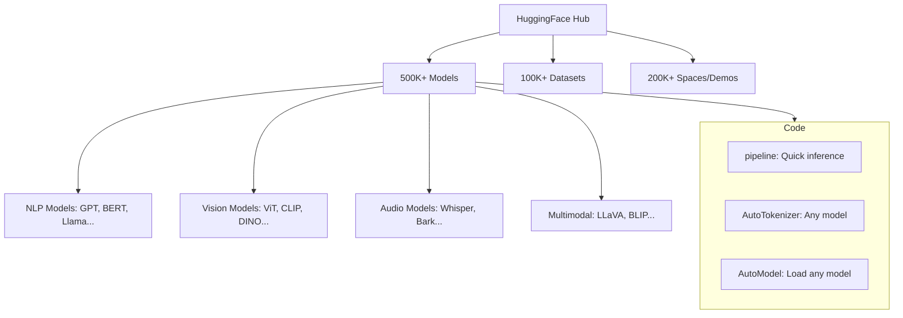
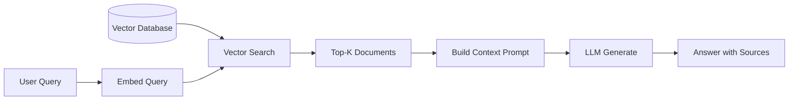

# Practical — HuggingFace, Tokenization, Fine-tuning

এতকু theory শেখার পর এখন সময় হাতে কাম করার! এই chapter এ আমরা দেখবো — tokenizer কীভাবে কাজ করে, HuggingFace দিয়ে কীভাবে model ব্যবহার করতে হয়, কীভাবে fine-tune করতে হয়, আর production এ inference কীভাবে optimize করতে হয়।

ভাবো এই chapter টা "transformer কে real life এ ব্যবহার করার manual"।

---

## Tokenization Deep Dive

Transformer তো text বোঝে না — number বোঝে। তাই text কে number এ রূপান্তর করতে হয়। এই কাজটাই tokenizer করে। কিন্তু এটা এত সহজ না যতটা মনে হয়!

### Word-Level Tokenization: প্রথম সমস্যা

সবচেয়ে simple উপায় — space দিয়ে word ভাগ করো।

```
  "I love transformers" → ["I", "love", "transformers"]

  প্রতিটা word এর জন্য একটা ID:
  I → 5
  love → 142
  transformers → 9999
```

কিন্তু সমস্যা দুটো:

```
  Problem 1: Vocabulary অনেক বড়!
  ┌─────────────────────────────┐
  │ English: 500,000+ words     │
  │ Bengali: 100,000+ words     │
  │ Each word = 1 embedding row │
  │ Memory: অসম্ভব!             │
  └─────────────────────────────┘

  Problem 2: OOV (Out of Vocabulary)
  ┌─────────────────────────────┐
  │ Train: "unbelievable" ✓     │
  │ Test:  "unbelievably" ✗ 😱  │
  │ → <UNK> token! মানে unknown │
  │ → Model কিছুই বোঝে না        │
  └─────────────────────────────┘
```

> [!warn] Word-level এর সমস্যা
> প্রতিটা unique word এর জন্য আলাদা token লাগে। "run", "running", "runs", "ran" — চারটা আলাদা token! অথচ এরা সব "run" এর variant। আর new word দেখলে `<UNK>` — model অন্ধ।

### BPE (Byte Pair Encoding) — Subword Magic

BPE এর আইডিয়া brilliant — character দিয়ে শুরু করো, তারপর বারবার সবচেয়ে common pair কে merge করো।

```
  Step 0: সব word কে character এ ভাগ করো

  "low"  → l o w
  "lower" → l o w e r
  "lowest" → l o w e s t
  "newest" → n e w e s t
  "widest" → w i d e s t

  Step 1: সবচেয়ে common pair খোঁজো
  Pair count:
    (e, s) → 3 times  ← most common!
    (l, o) → 2 times
    (o, w) → 2 times

  Merge (e, s) → "es"
  এখন: low / lower / low est / new est / wid est

  Step 2: আবার most common pair খোঁজো
    (es, t) → 3 times  ← merge!

  → "est"
  এখন: low / lower / low est / new est / wid est

  Step 3: চলতে থাকে...
    (l, o) → 2, merge → "lo"
    (lo, w) → 2, merge → "low"

  Final vocabulary:
  ┌──────────────────────────┐
  │ l o w e r s t            │ ← characters (base)
  │ es  est  lo  low         │ ← merged subwords
  │ er  ne  wi               │
  └──────────────────────────┘

  Tokenize "lowest":
  → "low" + "est" = [low] [est]  ✓ দুটো subword!
  Tokenize "newest":
  → "new" + "est" = ... wait, depends on merges
```

> [!note] BPE এর সুবিধা
> - OOV সমস্যা নেই — যেকোনো word কে character পর্যন্ত ভাঙা যায়
> - Common word গুলো একটা token, rare word গুলো কয়েকটা subword
> - Vocabulary size ছোট (যেমন 30K-50K)
> - GPT-2, GPT-3, GPT-4 সব BPE ব্যবহার করে

নিচের কোডে একটা simple BPE tokenizer train করা দেখানো হলো। ধাপে ধাপে merge হওয়া দেখা যায়।

```python
from collections import Counter

def get_pair_counts(vocab):
    """পাশাপাশি character pair গুলো count করি"""
    pairs = Counter()
    for word, freq in vocab.items():
        symbols = word.split()
        for i in range(len(symbols) - 1):
            pairs[(symbols[i], symbols[i+1])] += freq
    return pairs

def merge_pair(pair, vocab):
    """একটা specific pair কে merge করি"""
    new_vocab = {}
    for word, freq in vocab.items():
        new_word = word.replace(
            f"{pair[0]} {pair[1]}", f"{pair[0]}{pair[1]}"
        )
        new_vocab[new_word] = freq
    return new_vocab

# Training data: word আর frequency
vocab = {
    "l o w </w>": 5,
    "l o w e r </w>": 2,
    "l o w e s t </w>": 2,
    "n e w e s t </w>": 6,
    "w i d e s t </w>": 3,
}

# ৫টা merge step
for step in range(5):
    pairs = get_pair_counts(vocab)
    if not pairs:
        break
    best_pair = pairs.most_common(1)[0][0]
    vocab = merge_pair(best_pair, vocab)
    print(f"Step {step+1}: Merged {best_pair}")
    for word, freq in sorted(vocab.items(), key=lambda x: -x[1]):
        print(f"  {word}: {freq}")

# Output:
# Step 1: Merged ('e', 's')
# Step 2: Merged ('es', 't')
# Step 3: Merged ('est', '</w>')
# Step 4: Merged ('l', 'o')
# Step 5: Merged ('lo', 'w')
```

উপরের কোডে `get_pair_counts` function টা পাশাপাশি character pair গুলো count করে। `merge_pair` function টা সবচেয়ে common pair কে merge করে। প্রতিটা step এ সবচেয়ে frequent pair merge হয়। Output এ দেখা যাচ্ছে — প্রথমে `e+s=es`, তারপর `es+t=est`, এভাবে চলতে থাকে।

### WordPiece (BERT)

WordPiece BPE এর মতোই, কিন্তু merge criteria আলাদা। BPE সবচেয়ে frequent pair merge করে, WordPiece সবচেয়ে "useful" pair merge করে (likelihood বেশি বাড়ায় এমন pair)।

| Feature | BPE | WordPiece |
|---------|-----|-----------|
| **Merge criteria** | Most frequent pair | Highest likelihood gain |
| **Tokenization** | Apply merges left to right | Greedy longest match |
| **Used by** | GPT-2/3/4, Llama | BERT, DistilBERT |
| **Vocabulary size** | 30K-100K | 30K |

### SentencePiece — Language Agnostic

SentencePiece এর মূল সুবিধা — এটা space কে special character হিসেবে চিনিৎসা করে না। Space ও একটা character। ফলে space-less language (Chinese, Japanese, Thai) তেও কাজ করে।

```
  Traditional tokenizer: space দিয়ে word ভাগ
  "আমি ভালো আছি" → ["আমি", "ভালো", "আছি"]  (space ভাগ)

  SentencePiece: space ও character
  "আমি ভালো আছি" → "▁আমি ▁ভালো ▁আছি"  (▁ = space marker)
  → subword গুলোতে ভাগ হতে পারে
```

> [!important] Modern LLM গুলো কোন tokenizer ব্যবহার করে?
> - **GPT-2/3/4**: BPE (tiktoken library)
> - **BERT**: WordPiece
> - **Llama/Mistral**: SentencePiece BPE
> - **T5**: SentencePiece Unigram
> - **Gemma**: SentencePiece

---

## HuggingFace Transformers Library

HuggingFace হলো transformer এর "app store" — যেখানে 500K+ pre-trained model আছে, সব ফ্রি।



### pipeline() — সবচেয়ে সহজ উপায়

নিচের কোডে HuggingFace pipeline দিয়ে কয়েক line এ sentiment analysis আর text generation করা হলো। কোনো model download, কোনো config নেই — সব automatic!

```python
from transformers import pipeline

# Sentiment Analysis — ১ line!
classifier = pipeline("sentiment-analysis")
result = classifier("I absolutely love this!")
print(result)
# [{'label': 'POSITIVE', 'score': 0.9998}]

# Text Generation — GPT-2 দিয়ে
generator = pipeline("text-generation", model="gpt2")
story = generator(
    "Once upon a time in Dhaka,",
    max_length=50,
    num_return_sequences=1
)
print(story[0]["generated_text"])
# "Once upon a time in Dhaka, a young programmer discovered..."

# বাংলা তেও!
generator_bn = pipeline("text-generation", model="bangla-gpt2")
result_bn = generator_bn("বাংলাদেশ একটি সুন্দর")
print(result_bn[0]["generated_text"])
```

এই কোডে `pipeline` function টা সব কাজ একসাথে করে — model download, tokenizer load, preprocessing, inference, postprocessing। `sentiment-analysis` pipeline default এ একটা BERT model ব্যবহার করে। `text-generation` pipeline GPT-2 দিয়ে text generate করে। যেকোনো task এর জন্য শুধু task name আর model name দিলেই হয়!

### AutoModel / AutoTokenizer — বেশি Control

```python
from transformers import AutoTokenizer, AutoModelForCausalLM
import torch

# যেকোনো model load করি — Auto class ঠিক করে কোন class
model_name = "meta-llama/Llama-3.2-1B"
tokenizer = AutoTokenizer.from_pretrained(model_name)
model = AutoModelForCausalLM.from_pretrained(
    model_name,
    torch_dtype=torch.float16,  # memory কম
    device_map="auto"           # সব GPU তে distribute
)

# Tokenize আর generate
prompt = "The future of AI is"
inputs = tokenizer(prompt, return_tensors="pt").to(model.device)
output = model.generate(**inputs, max_new_tokens=50)
print(tokenizer.decode(output[0], skip_special_tokens=True))
```

এই কোডে `AutoTokenizer` আর `AutoModelForCausalLM` যেকোনো model এর জন্য correct class automatically বেছে নেয়। `device_map="auto"` model কে available GPU গুলোতে distribute করে। `torch_dtype=torch.float16` memory অর্ধেক করে।

---

## Fine-tuning Techniques

Pre-trained model সব কাজে পারফেক্ট না। নিজের task এর জন্য adapt করতে হয় — এটাই fine-tuning। কিন্তু কত ধরনের fine-tuning আছে?

### 1. Full Fine-Tuning: সব update করো

```
  Pre-trained Model (7B params)
  ┌──────────────────────────┐
  │ ████████████████████████ │  ← সব parameter update
  │  learning rate: 2e-5     │
  └──────────────────────────┘

  Problem: 7B parameter update করতে হয়
  → অনেক GPU memory (optimizer state সহ ~100GB+)
  → অনেক সময়
  → অনেক টাকা 💸
```

### 2. LoRA (Low-Rank Adaptation): Smart Solution

LoRA এর আইডিয়া — পুরো weight matrix update না করে, একটা ছোট rank decomposition add করো।

```
  Original weight: W (d × d) = 4096 × 4096

  Full fine-tuning: W' = W + ΔW  (ΔW ও 4096×4096)

  LoRA: W' = W + A × B
                    ↑     ↑
                  d×r    r×d     r = 8 (tiny!)

  ┌───────────┐   ┌──┐ ┌──┐
  │           │ + │A │×│B │   r=8 মাত্র!
  │     W     │   │  │ │  │   শুধু A, B train হয়
  │  (frozen) │   │  │ │  │   W frozen!
  └───────────┘   └──┘ └──┘

  Params: d×d → 2×d×r
  4096² = 16.7M  →  2×4096×8 = 65K
  Only 0.4% of original! 🎉
```

> [!important] LoRA এর মূল আইডিয়া
> Pre-trained model এর weight change গুলোর "intrinsic rank" কম। মানে পুরো বড় matrix update না করেও ছোট rank এর matrix দিয়ে প্রায় একই ফল পাওয়া যায়। LoRA তে শুধু ছোট A, B matrix train হয়, মূল W frozen থাকে। Memory ও time অনেক কম!

### 3. QLoRA: LoRA + Quantization

QLoRA এক ধাপ আরও যায় — base model কে 4-bit এ quantize করে, তারপর LoRA adapter train করে।

```
  Full Fine-Tuning (7B model):
  ┌────────────────────────────┐
  │ Model: 14 GB (FP16)        │
  │ Optimizer: 28 GB (FP32)    │
  │ Gradient: 14 GB            │
  │ Total: ~56 GB → A100 80GB  │
  └────────────────────────────┘

  QLoRA (7B model):
  ┌────────────────────────────┐
  │ Model: 3.5 GB (4-bit NF4)  │  ← 4x কম!
  │ LoRA Adapter: ~50 MB       │
  │ Optimizer (adapter only): ~100 MB │
  │ Total: ~4 GB → যেকোনো GPU! │
  └────────────────────────────┘
```

নিচের কোডে HuggingFace PEFT library দিয়ে LoRA fine-tuning করা দেখানো হলো। খুব কম কোডেই হয়ে যায়।

```python
from peft import LoraConfig, get_peft_model, TaskType
from transformers import AutoModelForCausalLM, TrainingArguments, Trainer
import torch

# ১. Base model load করি
model = AutoModelForCausalLM.from_pretrained(
    "meta-llama/Llama-3.2-1B",
    torch_dtype=torch.float16,
    device_map="auto"
)

# ২. LoRA configuration তৈরি করি
lora_config = LoraConfig(
    task_type=TaskType.CAUSAL_LM,
    r=8,                    # rank (ছোট = কম param, বেশি = বেশি capacity)
    lora_alpha=32,          # scaling factor
    lora_dropout=0.1,
    target_modules=[        # কোন layer এ LoRA apply করবে
        "q_proj", "k_proj", "v_proj", "o_proj",  # attention
        "gate_proj", "up_proj", "down_proj"       # FFN
    ]
)

# ৩. LoRA model তৈরি করি
model = get_peft_model(model, lora_config)
model.print_trainable_parameters()
# trainable params: 2,097,152 || all params: 1,236,795,392
#                    ↑ শুধু 0.17% train হচ্ছে!

# ৪. Training (simplified)
training_args = TrainingArguments(
    output_dir="./lora-output",
    num_train_epochs=3,
    per_device_train_batch_size=4,
    learning_rate=2e-4,
    fp16=True,
    save_steps=500,
)
# trainer = Trainer(model=model, args=training_args, train_dataset=dataset)
# trainer.train()

# ৫. Adapter save করি (শুধু LoRA weights, খুব ছোট!)
# model.save_pretrained("./my-lora-adapter")
# শুধু ~8 MB! Base model save করার দরকার নেই।
```

এই কোডে প্রথমে base model load করা হলো। তারপর `LoraConfig` দিয়ে LoRA এর configuration set করা হলো — rank 8, কোন module এ apply করবে সেটা। `get_peft_model` function টা base model কে LoRA model এ রূপান্তর করে। `print_trainable_parameters` দেখায় শুধু 0.17% parameter train হচ্ছে! Save করলে শুধু adapter weights save হয় — মাত্র ~8 MB।

> [!tip] LoRA Adapter এর সুবিধা
> এক base model এর উপর অনেকগুলো LoRA adapter থাকতে পারে! যেমন একটা adapter বাংলা অনুবাদের জন্য, আরেকটা code generation এর জন্য। Swap করা সহজ — শুধু adapter load করলেই হয়। Base model একদম একই থাকে।

---

## RAG (Retrieval Augmented Generation)

### Problem: LLM Hallucinate করে

LLM এর training data সময়ে frozen। নতুন information জানে না। আর মাঝে মাঝে এমন জিনিস বলে যা সম্পূর্ণ ভুল — hallucination।

```
  Without RAG:
  User: "2025 সালের বাজেটে কর কত?"
  LLM:  "আমি 2025 সালের তথ্য জানি না, তবে..." 😬
     অথবা
  LLM:  "২০% (completely made up!)" 😱

  With RAG:
  User: "2025 সালের বাজেটে কর কত?"
       ↓ retrieve
  Docs: "2025 বাজেটে কর ১৫% নির্ধারণ করা হয়েছে..."
       ↓ provide as context
  LLM:  "2025 সালের বাজেট অনুযায়ী কর ১৫%।" ✓
       (grounded in actual document!)
```

### RAG Pipeline



নিচের কোডে একটা simple RAG system দেখানো হলো। sentence-transformers দিয়ে embedding, cosine similarity দিয়ে search।

```python
from sentence_transformers import SentenceTransformer
import numpy as np

# ১. Document গুলো (আসলে এটা database থেকে আসবে)
documents = [
    "Python একটি high-level programming language।",
    "JavaScript মূলত web development এ ব্যবহৃত হয়।",
    "Rust memory safety এর জন্য পরিচিত।",
    "Go language Google এর তৈরি, concurrency তে ভালো।",
    "Python data science আর AI তে জনপ্রিয়।",
]

# ২. Embedding model load করি
encoder = SentenceTransformer("all-MiniLM-L6-v2")

# ৩. সব document কে embed করি
doc_embeddings = encoder.encode(documents)

# ৪. User query
query = "কোন language AI তে ভালো?"

# ৫. Query কে embed করি আর similarity search করি
query_embedding = encoder.encode([query])
similarities = encoder.similarity(query_embedding, doc_embeddings)[0]

# Top-2 similar document বের করি
top_k = 2
top_indices = similarities.argsort(descending=True)[:top_k]

print("Retrieved documents:")
context = ""
for idx in top_indices:
    doc = documents[idx]
    score = similarities[idx]
    print(f"  [{score:.3f}] {doc}")
    context += doc + "\n"

# ৬. LLM কে context সহ prompt করি
prompt = f"""Context:
{context}

Question: {query}
Answer based on the context above:"""

print("\nFinal prompt for LLM:")
print(prompt)
# LLM এই context দেখে grounded answer দেবে!
```

এই কোডে প্রথমে documents গুলো একটা list এ আছে। `SentenceTransformer` দিয়ে সব document আর user query কে embedding এ রূপান্তর করা হয়। `similarity` function দিয়ে query আর document গুলোর মধ্যে cosine similarity বের করা হয়। Top-k similar document গুলো context হিসেবে LLM কে দেওয়া হয়। ফলে LLM এর উত্তর grounded হয় — hallucination কমে!

---

## Inference Optimization

Model train করার পর production এ deploy করতে হয়। কিন্তু 70B model কে কীভাবে serve করবে? Memory আর speed দুটোই জরুরি।

### Quantization

```
  FP32 (32-bit float):
  ┌────────────────────────────┐
  │ ██████████████████████████ │  1× baseline
  │ 70B model = 280 GB          │
  └────────────────────────────┘

  FP16 (16-bit):
  ┌──────────────┐
  │ █████████████│  2× কম
  │ 140 GB       │
  └──────────────┘

  INT8 (8-bit):
  ┌───────┐
  │ █████ │  4× কম
  │ 70 GB │
  └───────┘

  INT4 (4-bit):
  ┌───┐
  │███│  8× কম!
  │35GB│  ← 70B model consumer GPU তে!
  └───┘
```

| Format | Bits | 70B Model Size | Quality Loss | Speed |
|--------|------|----------------|-------------|-------|
| FP32 | 32 | 280 GB | Baseline | Slow |
| FP16 | 16 | 140 GB | ~0% | Fast |
| BF16 | 16 | 140 GB | ~0% | Fast |
| INT8 | 8 | 70 GB | Minimal | Faster |
| INT4 | 4 | 35 GB | Small but noticeable | Fastest |

### vLLM — PagedAttention

vLLM এর PagedAttention OS এর virtual memory এর মতো কাজ করে — KV Cache কে page এ ভাগ করে। ফলে অনেক request একসাথে efficiently handle করা যায়।

```
  Traditional KV Cache:
  Request 1: [████████░░░░░░░░]  (pre-allocated, অনেক waste)
  Request 2: [████░░░░░░░░░░░░]  (pre-allocated)
  Request 3: [████████████░░░░]
  → Memory waste: অনেক!

  vLLM PagedAttention:
  ┌────┬────┬────┬────┬────┬────┐
  │ R1 │ R2 │ R1 │ R3 │ R1 │ R2 │  ← Dynamically allocated!
  └────┴────┴────┴────┴────┴────┘
  → কোনো waste নেই, throughput 2-4x বেশি!
```

### GGUF — Local Deployment

GGUF (GPT-Generated Unified Format) হলো llama.cpp এর format — CPU তেও LLM run করা যায়! GPU না থাকলেও চলে।

```python
# vLLM দিয়ে fast serving (GPU)
from vllm import LLM

llm = LLM(model="meta-llama/Llama-3.2-1B", dtype="float16")
outputs = llm.generate(["Explain transformers in simple terms"])
print(outputs[0].outputs[0].text)
```

এই কোডে `vLLM` দিয়ে একটা LLM load আর generate করা হলো। vLLM পেছনে PagedAttention আর continuous batching ব্যবহার করে — ফলে traditional HuggingFace inference এর তুলনায় 2-4x দ্রুত। Production serving এর জন্য vLLM এখন standard।

---

## Summary: কোন Technique কোন Use Case এর জন্য

| Use Case | Recommended Technique |
|----------|----------------------|
| **Quick prototype** | `pipeline()` — ১ line code |
| **Custom task, more control** | AutoModel + AutoTokenizer |
| **Adapt model to your data** | LoRA fine-tuning (PEFT) |
| **Adapt on limited GPU** | QLoRA (4-bit + LoRA) |
| **Grounded answers** | RAG (retrieve + generate) |
| **Fast batch serving** | vLLM |
| **Run on CPU / local** | GGUF + llama.cpp |
| **Reduce memory** | INT8/INT4 quantization |
| **Multilingual tokenization** | SentencePiece |

> [!important] এই chapter এর মূল বার্তা
> Theory ভালো, কিন্তু practical skill গুলো তোমাকে production ready বানায়। Tokenization বুঝলে model এর behavior বোঝা যায়। LoRA বুঝলে limited resource এ fine-tune করা যায়। RAG বুঝলে hallucination এর সমাধান আসে। vLLM আর quantization বুঝলে production deployment সম্ভব। এই tool গুলো modern AI engineer এর core toolkit!

> [!tip] পরবর্তী ধাপ
> এখন তোমার হাতে সব tool আছে। একটা project শুরু করো — যেমন একটা RAG chatbot, বা একটা fine-tuned model নিজের data তে। Hands-on practice ই সবচেয়ে ভালো শিক্ষা!