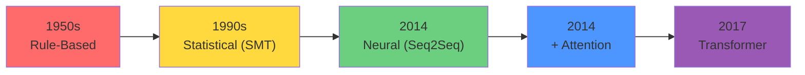
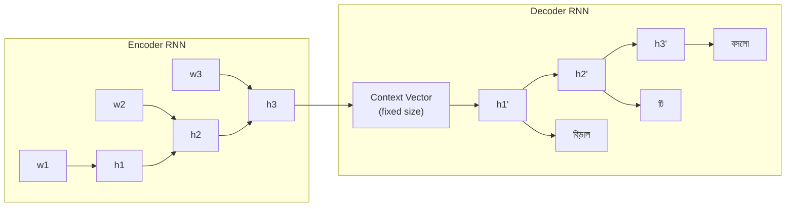
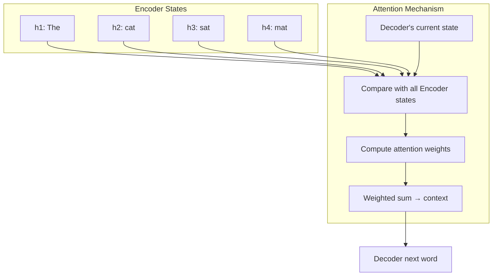
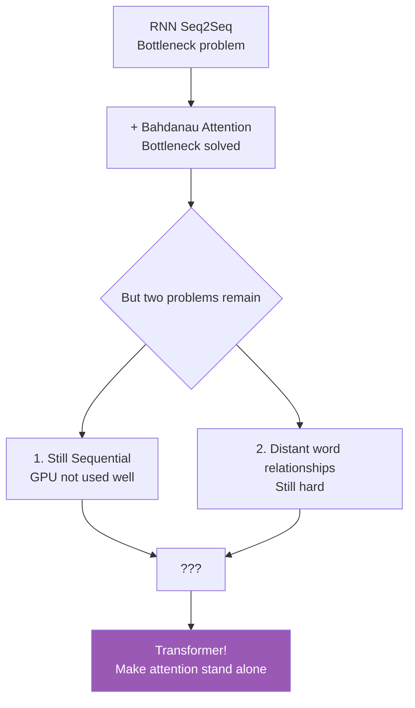

# Pre-Transformer: Seq2Seq and RNN Limitations

In the last chapter, we saw how Transformers brought a revolution. But what was the world like before Transformers? How did people do machine translation — translating from one language to another? And what problem existed that, when researchers tried to solve it, gave birth to the concept of attention?

This chapter is a bit of a history lesson — but not a boring one. Because without understanding this history, the magic of Transformers can't be fully appreciated. Let's begin!

---

## History of Machine Translation

Imagine — you're asked to translate an English sentence into Bengali:

> "The cat sat on the mat" → "বিড়ালটি মাদুরের উপর বসলো"

As a human, you can do this easily. But how do you teach a computer? Finding the answer to this problem required passing through many stages.



### Era 1: Rule-Based (1950s–1980s)

In the early days, people thought — let's give the computer all the rules of language! Grammar rules, dictionaries, all hand-crafted.

```
English: "I eat rice"
Rule: Subject + Verb + Object
→ Bengali: Subject + Object + Verb
→ "আমি ভাত খাই"
```

> [!warn] The Problem
> Language isn't that simple. Idioms, metaphors, context — can't be covered by rules. Imagine translating "It's raining cats and dogs" with rules!

### Era 2: Statistical Machine Translation (1990s–2010s)

Next, people thought — forget rules, learn from data! From large bilingual corpora (like parliamentary proceedings — where both English and Bengali exist), calculate probabilities.

```
P(translation | source) = which translation is most likely?

"the cat" → 70% "বিড়ালটি"
           → 20% "যে বিড়াল"
           → 10% something else
```

IBM Model 1–5, phrase-based translation — these worked great. The first version of Google Translate was like this. But they couldn't understand long-range dependencies well.

### Era 3: Neural Machine Translation (2014+)

Now came neural networks — specifically the **Seq2Seq (Sequence-to-Sequence)** architecture. In 2014, Google and other researchers showed that pairing two RNNs could do translation much better.

---

## Encoder-Decoder Architecture

The core idea of Seq2Seq has two parts — an **Encoder** and a **Decoder**.

```
                    ENCODER                         DECODER
                 (reads English)                  (generates Bengali)

  The  →  cat  →  sat  →  on  →  the  →  mat     [START] → বিড়াল → টি → মাদুর → ...
   ↓      ↓      ↓      ↓      ↓       ↓            ↑                                  ↑
  [h1] → [h2] → [h3] → [h4] → [h5] → [h6] ───► [CONTEXT VECTOR] ──────────────────┘
                                                    │
                                              Just one fixed-size
                                              vector — all meaning
                                              packed here!
```



Here's what happens:
1. **Encoder** reads the entire English sentence one word at a time
2. At the end, all information is packed into a **context vector**
3. **Decoder** generates Bengali words one at a time from that context vector

> [!note] Analogy
> Think about reading a story and then having to tell it to someone. Do you remember the story word for word? No — you remember the main idea. From that main idea, you retell it in your own words. Encoder-Decoder does exactly this.

---

## The Bottleneck Problem — Everything in One Vector!

There's a massive problem here. Notice — the Encoder reads the entire sentence and produces **just one** vector at the end. This vector is fixed size — say 512 dimensions.

But what if the sentence is very long? 50 words? 100 words? All meaning has to be packed into a 512-dim vector!

```
BOTTLENECK PROBLEM:

    A long sentence                   One small vector          Output
  ┌─────────────────────┐            ┌──────────┐            ┌──────────┐
  │ The cat that lived  │            │          │            │ বিড়ালটি  │
  │ in the house which  │════════►   │  this one  │   ═════►   │ যে বাড়ি │
  │ was built last year │ squeeze!   │  vector  │            │ তে থাকে  │
  │ on the hill near    │            │  has all │            │ ...      │
  │ the river has died  │            │  packed! │            │ (half)   │
  └─────────────────────┘            └──────────┘            └──────────┘
        12 words                       512 dim                  lost
                                          │                   info!
                                     can't fit!
```

> [!warn] This Is the Core Problem
> All the details of a long sentence can't be packed into a fixed-size vector. Lots of information is lost. The Decoder produces incomplete or incorrect translations. This is called the **information bottleneck**.

Imagine being told to read a 500-page novel and write a 1-line summary. How much would be left out! That's the Seq2Seq problem.

---

## Vanishing Gradient — Why RNN Forgets

Another problem is **vanishing gradient**. This happens during training.

```
Training signal (gradient) going backward:

  Output
    │ ◄── gradient is strong
    ▼
  [word 10] ◄── still okay
    │
  [word 9]  ◄── a bit smaller
    │
  [word 8]  ◄── even smaller
    │
    ...
    │
  [word 2]  ◄── very small ◄── learns nothing
    │
  [word 1]  ◄── almost zero ◄── complete darkness
```

When the gradient travels backward during backpropagation, it gets slightly smaller at each step. After many steps, it becomes so small that there's no learning signal left for the early words.

As a result, RNN:
- Forgets early words
- Can't understand long-range dependencies in long sentences
- "The **animal** ... (50 words) ... because **it** was tired" — RNN can't figure out what "it" refers to

> [!note] Did LSTM Solve It?
> LSTM reduced this somewhat with gate mechanisms (input gate, forget gate, output gate). But it wasn't a complete solution. Long sequences still had problems.

---

## Bahdanau Attention (2014) — The First Attention!

Now comes 2014 and **Bahdanau et al.** — they came up with a brilliant idea:

> Why should the Decoder only work with a single context vector from the end? It could look at **all** encoder hidden states! Each time it generates a word, it decides — which encoder states are most important right now.

```
TRADITIONAL Seq2Seq:

  Encoder: [h1] → [h2] → [h3] → [h4] → [h5]
                                       │
                            just give the last h5
                                       │
                                       ▼
                                   [CONTEXT]
                                       │
                                  Decoder


BAHDANAU ATTENTION:

  Encoder: [h1]  [h2]  [h3]  [h4]  [h5]
             │     │     │     │     │
             ▼     ▼     ▼     ▼     ▼
          ┌─────────────────────────────┐
          │   Decoder sees all of them!  │
          │   For each word,              │
          │   computes attention weights  │
          └─────────────────────────────┘
             │     │     │     │     │
           0.1   0.6   0.2   0.05  0.05   ← attention weights
             │     │     │     │     │
             ▼     ▼     ▼     ▼     ▼
          weighted combination → Decoder input
```



### How Bahdanau Attention Works

Let's look step by step. Say the Decoder is about to generate the Bengali word "বিড়াল" (cat) right now.

1. The Decoder's current hidden state is the **query** — "what do I want right now?"
2. Each encoder hidden state is a **key** — "what I have to offer"
3. Match the query with each key — get attention scores
4. Softmax the scores — get a probability distribution
5. Take a weighted sum of encoder states — get the context vector
6. The Decoder uses that context to generate the next word

> [!important] This Is the Birth of Attention!
> Notice — the Decoder is no longer stuck with a single context vector. It decides separately for each word — which source words it needs right now. This is the **first form of attention**.

---

## Code Example: Simple Seq2Seq

This code is simplified to explain the concept. Real implementations have many more details.

Below shows how a simple Encoder-Decoder works. Notice — the entire sentence gets squeezed into one context vector.

```python
import torch
import torch.nn as nn

# A simple Encoder using RNN
class Encoder(nn.Module):
    def __init__(self, vocab_size, embed_dim, hidden_dim):
        super().__init__()
        self.embedding = nn.Embedding(vocab_size, embed_dim)
        self.rnn = nn.GRU(embed_dim, hidden_dim, batch_first=True)

    def forward(self, src):
        # src: (batch, seq_len) — word indices
        embedded = self.embedding(src)  # (batch, seq_len, embed_dim)
        outputs, hidden = self.rnn(embedded)
        # Only the last hidden state is the context vector
        return hidden  # (1, batch, hidden_dim) — all meaning is here!

# A simple Decoder
class Decoder(nn.Module):
    def __init__(self, vocab_size, embed_dim, hidden_dim):
        super().__init__()
        self.embedding = nn.Embedding(vocab_size, embed_dim)
        self.rnn = nn.GRU(embed_dim, hidden_dim, batch_first=True)
        self.fc = nn.Linear(hidden_dim, vocab_size)

    def forward(self, input_token, hidden):
        # input_token: (batch, 1) — previous word
        embedded = self.embedding(input_token)
        output, hidden = self.rnn(embedded, hidden)
        # Predict next word from context vector
        prediction = self.fc(output)
        return prediction, hidden

# The full Seq2Seq
encoder = Encoder(vocab_size=10000, embed_dim=256, hidden_dim=512)
decoder = Decoder(vocab_size=10000, embed_dim=256, hidden_dim=512)

src = torch.randint(0, 10000, (1, 10))  # 10-word sentence
context = encoder(src)  # Everything squeezed into one vector!
print(f"Context vector shape: {context.shape}")
# Output: (1, 1, 512) — think about it! 10 words' meaning in 512 dim!
```

What happened in the code:
- `Encoder` reads the entire sentence and gives one `hidden` state at the end — that's the context vector
- `Decoder` generates words one at a time from that context vector
- Notice — 10 words' meaning is packed into a 512-dim vector! That's the bottleneck

> [!warn] This Is the Problem
> For long sentences, this 512-dim vector can't hold all the meaning. Translation quality drops. Attention was needed to solve this.

---

## Comparison: Seq2Seq vs Seq2Seq + Attention

| Feature | Seq2Seq (Plain) | Seq2Seq + Bahdanau Attention |
|---------|----------------|------------------------------|
| **Context** | One fixed vector | Separate for each word |
| **Bottleneck** | Yes — everything squeezed | No — all encoder states visible |
| **Long sentences** | Poor | Much better |
| **Alignment** | Implicit | Explicit attention weights |
| **Interpretability** | Black box | Attention weights are visible |

---

## Problems That Remained

Bahdanau attention solved the bottleneck problem, but two big problems remained:

1. **Still sequential** — Both Encoder and Decoder are RNNs. Words still need to be read one at a time. GPU isn't used well.
2. **Distance problem** — Understanding relationships between distant words requires many RNN steps. Attention helps, but the base architecture is still RNN.



> [!important] This Is Where Transformer Was Born
> In 2017, **Vaswani et al.** said — throw away RNN completely! You can do everything with just attention. "Attention Is All You Need" — that's the name of the paper. Without RNN, using only attention, seeing all words at once — both problems were solved.

---

## Summary

What we learned in this chapter:

1. **Machine translation history** — rule-based → statistical → neural
2. **Seq2Seq** = Encoder RNN + Decoder RNN — reads the sentence and creates a context vector, then translates from it
3. **Bottleneck problem** — all meaning of a long sentence can't fit in a fixed-size vector
4. **Vanishing gradient** — RNN forgets early words
5. **Bahdanau attention (2014)** — let the Decoder see all encoder states, bottleneck solved
6. **But** RNN's sequential nature remained — GPU not used well, training slow
7. In this situation, **Transformer (2017)** came and said — throw away RNN, keep only attention

> [!note] Next Chapter
> Now you know why attention was needed and what problem it solved. In the next chapter, we'll deeply understand the attention mechanism — what are Query, Key, Value, how they work, and why this is the heart of all LLMs. Go to: [Intuition of Attention Mechanism](./attention-intuition.en.md)