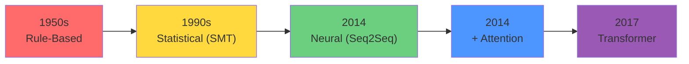
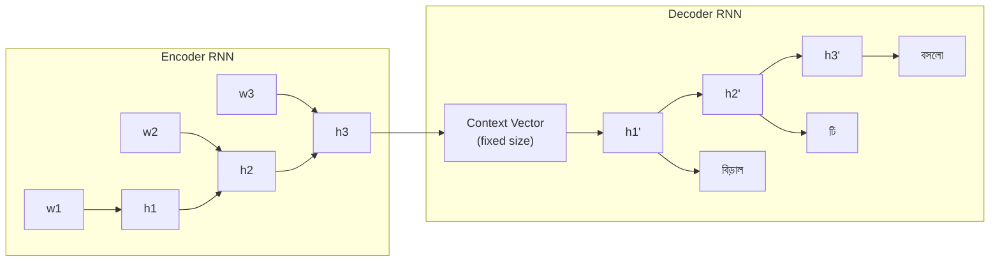
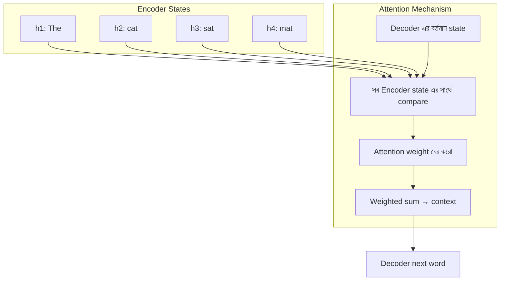
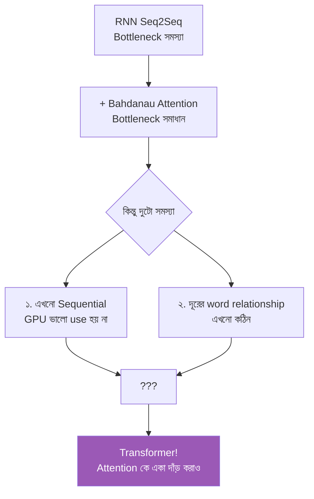

# Pre-Transformer: Seq2Seq ও RNN এর সীমাবদ্ধতা

গত chapter এ আমরা দেখলাম Transformer কীভাবে বিপ্লব এনেছে। কিন্তু Transformer আসার আগে দুনিয়া কেমন ছিলো? মানুষ machine translation — অর্থাৎ এক ভাষা থেকে আরেক ভাষা অনুবাদ — কীভাবে করতো? আর সেখানে কী সমস্যা ছিলো যেটা solve করতে গিয়ে attention এর ধারণা জন্ম নিলো?

এই chapter টা একটু history lesson — কিন্তু বোরিং না। কারণ এই history টা না বুঝলে Transformer এর জাদু পুরোপুরি বোঝা যাবে না। চলো শুরু করি!

---

## Machine Translation এর History

মনে করো — তোমাকে একটা English বাক্য কে বাংলায় অনুবাদ করতে বলা হলো:

> "The cat sat on the mat" → "বিড়ালটি মাদুরের উপর বসলো"

মানুষ হিসেবে তুমি সহজেই করতে পারো। কিন্তু একটা কম্পিউটারকে কীভাবে শেখাবে? এই সমস্যাটার সমাধান খুঁজতে গিয়ে অনেক পর্যায় পার হতে হয়েছে।



### যুগ ১: Rule-Based (1950s–1980s)

প্রথম দিকে মানুষ ভাবলো — ভাষার নিয়ম গুলো কম্পিউটারে দিয়ে দিই! Grammar rule, dictionary, সব হাতে বানিয়ে দিই।

```
English: "I eat rice"
Rule: Subject + Verb + Object
→ Bengali: Subject + Object + Verb
→ "আমি ভাত খাই"
```

> [!warn] সমস্যা
> ভাষা এত simple না। Idiom, metaphor, context — কোনো rule দিয়ে cover করা যায় না। "It's raining cats and dogs" কে rule দিয়ে translate করলে কী হবে ভাবো!

### যুগ ২: Statistical Machine Translation (1990s–2010s)

এরপর মানুষ ভাবলো — নিয়ম না, data থেকে শেখাও! অনেক বড় bilingual corpus (যেমন সংসদের proceeding — যেখানে English আর Bengali দুটোই আছে) থেকে probability বের করো।

```
P(translation | source) = কোন translation টা most likely?

"the cat" → 70% "বিড়ালটি"
           → 20% "যে বিড়াল"
           → 10% অন্য কিছু
```

IBM Model 1–5, Phrase-based translation — এগুলো দারুণ কাজ করতো। Google Translate এর প্রথম ভার্সন এমনই ছিলো। কিন্তু এগুলো long-range dependency বুঝতে পারতো না ভালো।

### যুগ ৩: Neural Machine Translation (2014+)

এবার আসলো neural network — বিশেষ করে **Seq2Seq (Sequence-to-Sequence)** architecture। 2014 সালে Google আর অন্যান্য researcher রা দেখালো — দুটো RNN জোড়া লাগিয়ে translation অনেক ভালো করা যায়।

---

## Encoder-Decoder Architecture

Seq2Seq এর মূল ধারণা হলো দুটো অংশ — একটা **Encoder**, একটা **Decoder**।

```
                    ENCODER                         DECODER
                 (English পড়ে)                    (Bengali বানায়)

  The  →  cat  →  sat  →  on  →  the  →  mat     [START] → বিড়াল → টি → মাদুর → ...
   ↓      ↓      ↓      ↓      ↓       ↓            ↑                                  ↑
  [h1] → [h2] → [h3] → [h4] → [h5] → [h6] ───► [CONTEXT VECTOR] ──────────────────┘
                                                    │
                                              একটাই fixed-size
                                              vector — সব অর্থ
                                              এখানে packed!
```



এখানে যা হয়:
1. **Encoder** পুরো English বাক্য একটা একটা word পড়ে
2. শেষে সব information একটা **context vector** এ packed করে
3. **Decoder** সেই context vector থেকে একটা একটা Bengali word generate করে

> [!note] অ্যানালজি
> ভাবো তুমি একটা গল্প পড়লে, আর কাউকে বলতে হবে গল্পটা। তুমি কি পুরো গল্পটা শব্দে শব্দে মনে রাখো? না — তুমি মূল ভাবটা মনে রাখো। সেই মূল ভাব থেকে তুমি নিজের ভাষায় বলো। Encoder-Decoder ঠিক এমনই করে।

---

## Bottleneck Problem — সবকিছু একটা Vector এ!

এখানে একটা বিশাল সমস্যা আছে। খেয়াল করো — Encoder পুরো বাক্য পড়ে শেষে **একটাই** vector দিয়ে দেয়। এই vector টা fixed size — যেমন ৫১২ dimension।

কিন্তু যদি বাক্যটা অনেক বড় হয়? ৫০ টা word? ১০০ টা word? সব অর্থ একটা ৫১২-dim vector এ packed করতে হবে!

```
BOTTLENECK PROBLEM:

    একটা বড় বাক্য                    একটাই ছোট vector          Output
  ┌─────────────────────┐            ┌──────────┐            ┌──────────┐
  │ The cat that lived  │            │          │            │ বিড়ালটি  │
  │ in the house which  │════════►   │  এই এক  │   ═════►   │ যে বাড়ি │
  │ was built last year │ squeeze!   │  vector  │            │ তে থাকে  │
  │ on the hill near    │            │  এ সব    │            │ ...      │
  │ the river has died  │            │  packed! │            │ (আধা)    │
  └─────────────────────┘            └──────────┘            └──────────┘
        ১২ টা word                     ৫১২ dim                  হারানো
                                          │                   গেছে!
                                     কুলাচ্ছে না!
```

> [!warn] এটাই মূল সমস্যা
> বড় বাক্যের সব detail একটা fixed-size vector এ packed করা যায় না। অনেক information হারিয়ে যায়। Decoder অসম্পূর্ণ বা ভুল translation দেয়। একে **information bottleneck** বলে।

ভাবো — তোমাকে বলা হলো একটা ৫০০ পৃষ্ঠার উপন্যাস পড়ে ১ লাইনে summary লিখতে। কত কিছু বাদ পড়বে! এটাই হলো Seq2Seq এর সমস্যা।

---

## Vanishing Gradient — কেন RNN ভুলে যায়

আরেকটা সমস্যা হলো **vanishing gradient**। এটা training এর সময় ঘটে।

```
Training signal (gradient) পেছন দিকে যাওয়ার সময়:

  Output
    │ ◄── gradient শক্তিশালী
    ▼
  [word 10] ◄── এখনো ভালো
    │
  [word 9]  ◄── একটু ছোট
    │
  [word 8]  ◄── আরও ছোট
    │
    ...
    │
  [word 2]  ◄── খুব ছোট ◄── কিছুই শেখে না
    │
  [word 1]  ◄── প্রায় শূন্য ◄── সম্পূর্ণ অন্ধকার
```

gradient যখন backpropagation এ পেছন দিকে যায়, প্রতিটা step এ একটু একটু করে ছোট হয়। অনেক step পরে এটা এত ছোট হয়ে যায় যে শুরুর word গুলোর জন্য কোনো learning signal থাকে না।

ফলে RNN:
- শুরুর word গুলো ভুলে যায়
- বড় বাক্যে long-range dependency বুঝতে পারে না
- "The **animal** ... (৫০ টা word) ... because **it** was tired" — "it" কে নির্দেশ করছে, RNN বুঝতে পারে না

> [!note] LSTM কি solve করেছিলো?
> LSTM gate মেকানিজম (input gate, forget gate, output gate) দিয়ে এটা কিছুটা কমিয়েছিলো। কিন্তু সম্পূর্ণ সমাধান হয়নি। বড় sequence তে এখনো সমস্যা হতো।

---

## Bahdanau Attention (2014) — প্রথম Attention!

এবার আসলো 2014 সালে **Bahdanau et al.** — তারা একটা চমৎকার আইডিয়া নিয়ে এলো:

> কেন Decoder কে শুধু শেষের একটা context vector দিয়ে কাজ করতে হবে? সে তো পারে **সব** encoder hidden state দেখতে! প্রতিটা word generate করার সময়, সে decide করবে — এই মুহূর্তে কোন encoder state গুলো বেশি important।

```
TRADITIONAL Seq2Seq:

  Encoder: [h1] → [h2] → [h3] → [h4] → [h5]
                                       │
                            শুধু শেষের h5 দিয়ে দাও
                                       │
                                       ▼
                                   [CONTEXT]
                                       │
                                  Decoder


BAHDANAU ATTENTION:

  Encoder: [h1]  [h2]  [h3]  [h4]  [h5]
             │     │     │     │     │
             ▼     ▼     ▼     ▼     ▼
          ┌─────────────────────────────┐
          │   Decoder সব গুলো দেখে!      │
          │   প্রতিটা word এর সময়        │
          │   attention weight বের করে   │
          └─────────────────────────────┘
             │     │     │     │     │
           0.1   0.6   0.2   0.05  0.05   ← attention weights
             │     │     │     │     │
             ▼     ▼     ▼     ▼     ▼
          weighted combination → Decoder input
```



### Bahdanau Attention কীভাবে কাজ করে

চলো step by step দেখি। ধরো Decoder এই মুহূর্তে Bengali এর "বিড়াল" word টা generate করবে।

1. Decoder এর বর্তমান hidden state কে **query** হিসেবে ভাবো — "আমি এখন কী চাই?"
2. প্রতিটা encoder hidden state একটা **key** — "আমার কাছে কী আছে"
3. Query আর প্রতিটা key এর match করো — attention score পাও
4. Score গুলো softmax করো — probability distribution পাও
5. Encoder state গুলোর weighted sum করো — context vector পাও
6. সেই context দিয়ে Decoder next word generate করে

> [!important] এটাই Attention এর জন্ম!
> খেয়াল করো — Decoder এখন আর একটা context vector এ আটকে না। সে প্রতিটা word এর সময় আলাদা করে decide করে — এখন কোন source word গুলো দরকার। এটাই **attention** এর প্রথম রূপ।

---

## Code Example: Seq2Seq এর সহজ রূপ

এই কোডটা concept বোঝানোর জন্য simplified। আসল implementation এ আরও অনেক detail আছে।

নিচে দেখানো হলো কীভাবে একটা simple Encoder-Decoder কাজ করে। খেয়াল রাখো — পুরো বাক্য একটা context vector এ squeeze হয়ে যাচ্ছে।

```python
import torch
import torch.nn as nn

# একটা simple Encoder — RNN দিয়ে
class Encoder(nn.Module):
    def __init__(self, vocab_size, embed_dim, hidden_dim):
        super().__init__()
        self.embedding = nn.Embedding(vocab_size, embed_dim)
        self.rnn = nn.GRU(embed_dim, hidden_dim, batch_first=True)

    def forward(self, src):
        # src: (batch, seq_len) — word index গুলো
        embedded = self.embedding(src)  # (batch, seq_len, embed_dim)
        outputs, hidden = self.rnn(embedded)
        # শুধু শেষের hidden state টাই context vector
        return hidden  # (1, batch, hidden_dim) — সব অর্থ এখানে!

# একটা simple Decoder
class Decoder(nn.Module):
    def __init__(self, vocab_size, embed_dim, hidden_dim):
        super().__init__()
        self.embedding = nn.Embedding(vocab_size, embed_dim)
        self.rnn = nn.GRU(embed_dim, hidden_dim, batch_first=True)
        self.fc = nn.Linear(hidden_dim, vocab_size)

    def forward(self, input_token, hidden):
        # input_token: (batch, 1) — আগের word
        embedded = self.embedding(input_token)
        output, hidden = self.rnn(embedded, hidden)
        # context vector থেকে next word predict
        prediction = self.fc(output)
        return prediction, hidden

# পুরো Seq2Seq
encoder = Encoder(vocab_size=10000, embed_dim=256, hidden_dim=512)
decoder = Decoder(vocab_size=10000, embed_dim=256, hidden_dim=512)

src = torch.randint(0, 10000, (1, 10))  # ১০ টা word এর বাক্য
context = encoder(src)  # সব squeeze হয়ে একটা vector এ!
print(f"Context vector shape: {context.shape}")
# আউটপুট: (1, 1, 512) — ফি মাইল! ১০ টা word এর অর্থ ৫১২ dim এ!
```

উপরের কোডে যা হলো:
- `Encoder` পুরো বাক্য পড়ে শেষে একটাই `hidden` state দেয় — এটাই context vector
- `Decoder` সেই context vector থেকে একটা একটা word generate করে
- খেয়াল করো — ১০ টা word এর অর্থ একটা ৫১২-dim vector এ packed! এটাই bottleneck

> [!warn] এটাই সমস্যা
> বড় বাক্যে এই ৫১২-dim vector সব অর্থ ধারণ করতে পারে না। ফলে translation এর মান খারাপ হয়। এই সমস্যা সমাধানের জন্যই attention এর প্রয়োজন।

---

## তুলনা: Seq2Seq vs Seq2Seq + Attention

| Feature | Seq2Seq (Plain) | Seq2Seq + Bahdanau Attention |
|---------|----------------|------------------------------|
| **Context** | একটাই fixed vector | প্রতিটা word এর সময় আলাদা |
| **Bottleneck** | হ্যাঁ — সব squeezed | না — সব encoder state visible |
| **Long sentence** | খারাপ | অনেক ভালো |
| **Alignment** | implicit | explicit attention weights |
| **Interpretability** | কালো বাক্স | attention weights দেখা যায় |

---

## সমস্যা যা থেকে গেলো

Bahdanau attention bottleneck problem সমাধান করলেও দুটো বড় সমস্যা থেকে গেলো:

1. **Still sequential** — Encoder আর Decoder দুটোই RNN। এখনো একটা একটা word পড়তে হয়। GPU ভালোভাবে use হয় না।
2. **Distance problem** — দূরের word গুলোর মধ্যে relationship বুঝতে গেলে RNN এর অনেক step পার হতে হয়। Attention সাহায্য করলেও, base architecture এখনো RNN।



> [!important] এখানেই Transformer এর জন্ম
> 2017 সালে **Vaswani et al.** বললো — RNN সম্পূর্ণ ফেলে দাও! শুধু attention দিয়েই সব করা যায়। "Attention Is All You Need" — এটাই সেই paper এর নাম। RNN ছাড়াই, শুধু attention দিয়ে, সব word একসাথে দেখে — দুটো সমস্যাই সমাধান হয়ে গেলো।

---

## সারসংক্ষেপ

এই chapter এ আমরা যা শিখলাম:

1. **Machine translation** এর history — rule-based → statistical → neural
2. **Seq2Seq** = Encoder RNN + Decoder RNN — বাক্য পড়ে একটা context vector বানায়, সেটা থেকে translation
3. **Bottleneck problem** — বড় বাক্যের সব অর্থ একটা fixed-size vector এ ধরে রাখা যায় না
4. **Vanishing gradient** — RNN শুরুর word ভুলে যায়
5. **Bahdanau attention (2014)** — Decoder কে সব encoder state দেখতে দিলো, bottleneck সমাধান হলো
6. **কিন্তু** RNN এর sequential nature থেকে গেলো — GPU ভালো use হয় না, training ধীর
7. এই অবস্থায় **Transformer (2017)** এসে বললো — RNN ফেলে দাও, শুধু attention রাখো

> [!note] পরবর্তী Chapter
> এখন তুমি জানো attention কেন দরকার হলো আর কী সমস্যা solve করেছে। পরের chapter এ আমরা attention mechanism টা গভীরভাবে বুঝবো — Query, Key, Value কী, কীভাবে কাজ করে, আর কেন এটাই সব LLM এর হৃদপিণ্ড। যাও: [Attention Mechanism এর ইনটুইশন](./attention-intuition.md)