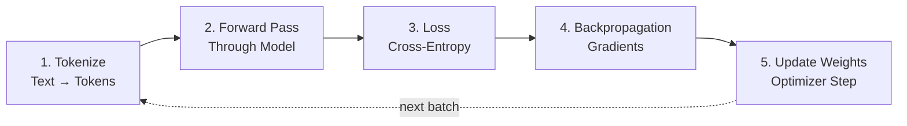
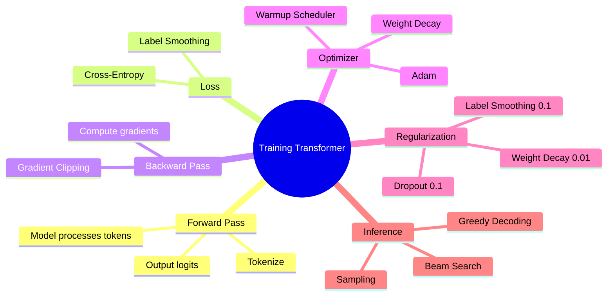

# Training Transformers — Loss, Warmup, Regularization

You might be wondering — how did GPT or BERT get so smart? They aren't born smart. They are taught — just like teaching a child a language. But the process is a bit different. In this chapter we'll go deep — how a transformer trains, how loss is calculated, why learning rate needs warmup, and why regularization is necessary.

Let's get started!

## High-Level: How a Transformer Trains

The process of training a transformer can be broken into 5 steps. Don't worry — I'll explain each one.



Let's open up each step:

| Step | What Happens | Why It's Needed |
|------|--------|-----------|
| **1. Tokenize** | Split text into small tokens | The model doesn't understand text, it understands numbers |
| **2. Forward Pass** | Tokens pass through the model | The model makes a prediction — what the next token could be |
| **3. Loss** | Compare prediction with the correct answer | To measure how wrong the model was |
| **4. Backpropagation** | Calculate gradients | To know which direction to move weights to reduce loss |
| **5. Update Weights** | Optimizer updates the weights | So the same mistake isn't repeated next time |

> [!note] What does one step mean?
> A "step" or "training step" means — take a batch of data, do a forward pass, calculate loss, and update weights. This entire cycle happening once is one step.

## Teacher Forcing — Teaching the Model with Correct Answers

Now think about this. If you tell the model "The cat sat" → predict the next word. If the model wrongly says "The cat dog" — then what happens in the next step? Do you feed the model's wrong prediction as input?

No! During training a wonderful trick is used — called **Teacher Forcing**.

```
┌─────────────────────────────────────────────────────┐
│              Teacher Forcing                         │
│                                                     │
│   Target sentence: "The cat sat on the mat"         │
│                                                     │
│   Step 1: Input  "The"       → Predict "cat"  ✓     │
│   Step 2: Input  "The cat"   → Predict "sat"  ✓     │
│   Step 3: Input  "The cat sat" → Predict "on" ✓     │
│                                                     │
│   ❌ BAD (no teacher forcing):                       │
│   Step 2: Input  "The dog"   → Predict "barked"     │
│   Step 3: Input  "The dog barked" → ... (errors pile up) │
│                                                     │
│   ✅ GOOD (teacher forcing):                         │
│   Always feed GROUND TRUTH, not model's guess        │
└─────────────────────────────────────────────────────┘
```

> [!important] The Core Idea of Teacher Forcing
> During training, no matter what the model predicts, we always feed the **correct token** as input. This way errors don't accumulate. The model learns faster.

But during inference? Teacher forcing can't be used then — because the correct answer isn't known beforehand! So the model's own prediction has to be fed as input for the next step. This is called **exposure bias** — a gap remains between training and inference.

## Cross-Entropy Loss — Measuring the Model's Mistakes

The loss function is what tells the model — "how wrong you were." The most common loss in Transformers is **Cross-Entropy Loss**. Let's understand it simply.

Imagine the model is predicting the next word in a sentence. The vocabulary has 10 words total (keeping it small for simplicity). The model gives a probability for each word:

```
Input: "The cat sat on the"

Model Output (probabilities):
  ┌──────────────┬────────────┐
  │  Word        │ Probability│
  ├──────────────┼────────────┤
  │  "mat"       │   0.45     │  ← correct answer
  │  "floor"     │   0.20     │
  │  "chair"     │   0.15     │
  │  "bed"       │   0.10     │
  │  "moon"      │   0.02     │
  │  ... (others)│   0.08     │
  └──────────────┴────────────┘

Correct answer: "mat" → probability 0.45

Loss = -log(0.45) = 0.80
```

> [!note] Cross-Entropy Simplified
> Cross-entropy loss is simply the **negative logarithm** of the correct word's probability. The higher the probability of the correct word, the lower the loss. If probability is 1.0, loss = 0.

Let's look at the math:

```
Correct word's probability: p
Loss = -log(p)

p = 1.0  →  Loss = -log(1.0)  = 0.00  (perfect!)
p = 0.5  →  Loss = -log(0.5)  = 0.69
p = 0.1  →  Loss = -log(0.1)  = 2.30
p = 0.01 →  Loss = -log(0.01) = 4.61  (bad!)

     Loss
      │
  5.0 │                                    ╱
      │                                  ╱
  3.0 │                               ╱
      │                            ╱
  1.0 │                        ╱
      │                   ╱
  0.0 │─── ─── ─── ─── ╳─────────────────────────
      0   0.2  0.4  0.6  0.8       1.0
                        Probability (p)

  Higher probability → lower loss
```

The code below shows how to calculate cross-entropy loss in PyTorch. `logits` is the model's raw output (before softmax), and `target` is the correct token's index.

```python
import torch
import torch.nn as nn

# logits shape: [batch_size, seq_len, vocab_size]
# target shape: [batch_size, seq_len] — correct token index

loss_fn = nn.CrossEntropyLoss()

# dummy data — simplified: batch=1, seq_len=3, vocab=5
logits = torch.randn(1, 3, 5)    # model output
target = torch.tensor([[0, 2, 4]])  # correct token indices

loss = loss_fn(logits.view(-1, 5), target.view(-1))
print(f"Loss: {loss.item():.4f}")
```

In the code above we used `nn.CrossEntropyLoss()`. It internally does softmax + negative log-likelihood together. So you don't need to do softmax separately — PyTorch handles everything. The lower the loss, the better the model is predicting.

## Learning Rate Schedule — Warmup Then Decay

Now let's get to the most interesting topic. **Learning rate** is the step size — how big a jump the model makes when updating weights. Too high and the model becomes unstable, too low and the model never learns.

Transformers use a very interesting learning rate schedule — **Warmup + Decay**.

### Why Warmup Is Needed

At the beginning the model is completely random. All weights are all over the place. If you give a large learning rate then, the gradients will be very large — the model will suddenly jump to weird places. Just like telling a blind person to sprint — they'll fall.

So at the start the learning rate is kept small — so the model can slowly find its direction. This is **warmup**.

```
   Learning Rate
      │
      │              ╱╲
      │             ╱  ╲
      │            ╱    ╲___
      │           ╱         ╲___
      │          ╱               ╲___
      │         ╱                     ╲___
      │        ╱                           ╲___
      │   ___╱                                  ╲___
      │  ╱                                          ╲___
      ╱── ── ── ── ── ── ── ── ── ── ── ── ── ── ── ── ──
       0      4000                                  steps
          ↑              ↑
        Warmup         Decay
       (linear        (inverse
        increase)     sqrt)
```

### Original Transformer Formula

The formula given in the original "Attention Is All You Need" paper:

```
                  1
lr = d_model^(-0.5) × min(step^(-0.5), step × warmup_steps^(-1.5))
```

Simply put — for the first `warmup_steps` (usually 4000) the learning rate increases linearly, then decreases inversely (inverse square root).

> [!important] Why Does the Transformer Especially Need Warmup?
> The most important component in a Transformer is **Self-Attention**. At the beginning, since the weights are random, the attention layer's gradients are very large and unstable. Without warmup the model diverges — loss goes to infinity. Warmup lets the model "settle" a bit.

The code below creates a custom warmup + decay scheduler using PyTorch. For the first `warmup_steps` it increases linearly, then decreases inversely.

```python
import torch
from torch.optim.lr_scheduler import LambdaLR
import math

def get_warmup_decay_scheduler(optimizer, d_model=512, warmup_steps=4000):
    """Original Transformer learning rate schedule."""
    def lr_lambda(step):
        if step == 0:
            step = 1
        # during warmup, increases linearly
        # then decreases with inverse sqrt
        return (d_model ** (-0.5) *
                min(step ** (-0.5), step * warmup_steps ** (-1.5)))

    return LambdaLR(optimizer, lr_lambda)

# Usage:
optimizer = torch.optim.Adam(model.parameters(), lr=1.0, betas=(0.9, 0.98), eps=1e-9)
scheduler = get_warmup_decay_scheduler(optimizer)
```

This scheduler is paired with the Adam optimizer. Note — the original paper used `1.0` as the base learning rate (because the formula itself scales it). You need to call `scheduler.step()` at every step to update the learning rate.

## Regularization — Preventing the Model from Overfitting

Transformer models are massive. GPT-3 has 175 billion parameters! Such a large model can memorize the training data — this is called **overfitting**. When overfitting happens, the model does well on training data but poorly on new data.

Several techniques are used to solve this problem:

### 1. Dropout

Dropout means — during training, randomly turn off some neurons. So the model doesn't depend on one neuron — it learns through multiple paths.

```
Normal:                  Dropout (rate=0.1):

  ● → ● → ●               ● → ✕ → ●     ← ✕ = dropped
  ↓   ↓   ↓               ↓       ↓
  ● → ● → ●               ● → ● → ✕
  ↓   ↓   ↓               ↓   ↓   ↓
  ● → ● → ●               ✕ → ● → ●

Imagine one person in a team gets sick, the rest keep the work going.
Similarly, dropout forces the model to learn redundant representations.
```

In Transformers, dropout is used in these places:
- **Attention weights** (0.1)
- **Feed-Forward Network** output (0.1)
- **Embedding** (0.1)

### 2. Label Smoothing

When the model becomes too confident — "I'm 100% sure this word is correct!" — that's when problems arise. Because in language, there can be more than one correct answer. Label smoothing keeps the model a bit more humble.

```
Without label smoothing (α=0):
  Target: [1.0, 0.0, 0.0, 0.0]    ← absolutely certain

With label smoothing (α=0.1):
  Target: [0.925, 0.025, 0.025, 0.025]  ← a little uncertainty

  α is taken away from the correct label's probability
  and distributed equally among all other labels.
```

> [!note] Benefits of Label Smoothing
> Label smoothing prevents the model from being overconfident. As a result, validation accuracy increases. The original Transformer paper used `α=0.1` — BLEU score improved by 0.62!

### 3. Weight Decay (L2 Regularization)

To prevent weights from getting too large — the magnitude of the weights is added to the loss. This makes the model prefer smaller weights.

| Technique | What It Does | Typical Value | Where |
|-----------|--------|---------------|--------|
| **Dropout** | Turns off neurons | 0.1 | Attention, FFN, Embedding |
| **Label Smoothing** | Softens the target | 0.1 | Loss calculation |
| **Weight Decay** | Penalizes large weights | 0.01 | Optimizer |
| **Gradient Clipping** | Cuts large gradients | 1.0 | Training loop |

> [!warn] Too Much Regularization
> If dropout is too high (like 0.5) the model underfits — it learns nothing. Larger models need more regularization than smaller ones, but exactly how much — that needs to be figured out through experimentation.

## Beam Search vs Greedy Decoding — During Inference

After training is done, we need to generate text using the model. Now the question is — which token to choose at each step?

### Greedy Decoding

The simplest — pick whichever has the highest probability. But the problem is, this is locally optimal but might not be globally optimal.

```
Greedy:
  Step 1: "The" → "cat" (prob 0.40) ← highest, choose this
  Step 2: "The cat" → "sat" (prob 0.35)

  But it could be:
  "The dog" (prob 0.35) → "barked loudly" (prob 0.80) = overall better
  "The cat" (prob 0.40) → "sat" (prob 0.35) = overall worse
```

### Beam Search

Beam search explores multiple options simultaneously. `beam_width=4` means 4 alternatives run at the same time. Finally, whichever has the highest overall probability is chosen.

```
Beam Search (beam_width=3):

           ┌── "cat"  (0.40) ──┬── "sat"  (0.14) ← best!
  "The" ───┼── "dog"  (0.30) ──┼── "ran"  (0.12)
           └── "bird" (0.20) ──┴── "flew" (0.10)

  The best path is chosen by looking at each path's cumulative probability.
```

| Method | Speed | Quality | When to Use |
|--------|-------|---------|-----------------|
| **Greedy** | ⚡ Fastest | Medium | Real-time chat |
| **Beam Search** | 🐢 Slower | Better | Translation, summarization |
| **Sampling** | 🎲 Variable | Creative | Creative writing |

## Full Training Loop — All Together

Now let's see the entire training loop in code. Here loss, warmup scheduler, gradient clipping — everything is together. The code has been simplified for understanding.

```python
import torch
import torch.nn as nn
from torch.optim import Adam
from torch.optim.lr_scheduler import LambdaLR
import math

# Assume model, dataloader already exist
model = ...  # your Transformer model
dataloader = ...  # training data

# --- Optimizer + Warmup Scheduler ---
optimizer = Adam(model.parameters(), lr=1.0, betas=(0.9, 0.98), eps=1e-9)

def warmup_decay(step, d_model=512, warmup=4000):
    step = max(1, step)
    return (d_model ** (-0.5) *
            min(step ** (-0.5), step * warmup ** (-1.5)))

scheduler = LambdaLR(optimizer, lambda step: warmup_decay(step))

# --- Loss function (with label smoothing) ---
criterion = nn.CrossEntropyLoss(label_smoothing=0.1, ignore_index=-100)

# --- Training Loop ---
num_epochs = 10

for epoch in range(num_epochs):
    model.train()
    total_loss = 0

    for batch_idx, batch in enumerate(dataloader):
        input_ids = batch["input_ids"]   # [batch, seq_len]
        labels = batch["labels"]         # [batch, seq_len]

        # 1. Forward pass
        logits = model(input_ids)         # [batch, seq_len, vocab_size]

        # 2. Calculate loss (shifted for next-token prediction)
        loss = criterion(
            logits[:, :-1, :].reshape(-1, logits.size(-1)),
            labels[:, 1:].reshape(-1)
        )

        # 3. Backward pass
        optimizer.zero_grad()
        loss.backward()

        # 4. Gradient clipping (to prevent gradient explosion)
        torch.nn.utils.clip_grad_norm_(model.parameters(), max_norm=1.0)

        # 5. Weight update
        optimizer.step()
        scheduler.step()

        total_loss += loss.item()

    avg_loss = total_loss / len(dataloader)
    print(f"Epoch {epoch+1}/{num_epochs} | Loss: {avg_loss:.4f}")
```

The code above shows the entire training pipeline. Notice — `logits[:, :-1, :]` and `labels[:, 1:]` are shifted. Because we want to predict from position `t` to position `t+1`. Gradient clipping prevents gradient explosion. And `label_smoothing=0.1` reduces overconfidence.

> [!important] Training Cost
> GPT-3 cost approximately $4.6 million to train. GPT-4's training cost is estimated at **$100 million+**! That's why you should practice with smaller models (like GPT-2 117M).

> [!warn] Common Training Issues
> 1. **Loss = NaN**: Learning rate too high, or gradient explosion. Use gradient clipping.
> 2. **Loss not decreasing**: Learning rate too low, or problem with data.
> 3. **Training loss decreasing but validation loss increasing**: Overfitting! Increase dropout or do data augmentation.

## Summary at a Glance



So that's the entire process of transformer training! Remember the key things — **Teacher Forcing** (giving correct input), **Cross-Entropy Loss** (measuring mistakes), **Warmup** (small steps at start), and **Regularization** (preventing overfitting). If you understand these four things, you've grasped the core idea of transformer training! 🎉