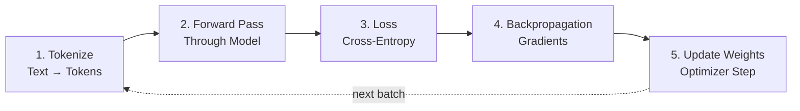
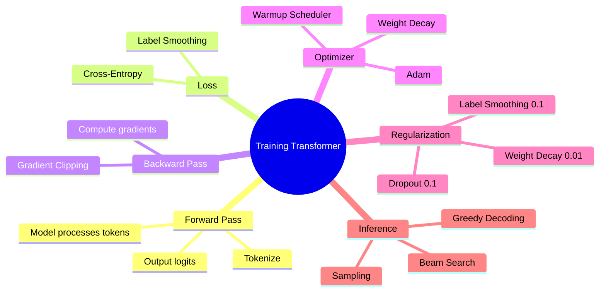

# Training Transformers — Loss, Warmup, Regularization

তুমি হয়তো ভেবেছ — GPT বা BERT এত স্মার্ট কীভাবে হলো? এরা আসলে জন্ম থেকেই স্মার্ট না। এদের শেখানো হয় — ঠিক ছোট বাচ্চাকে ভাষা শেখানোর মতো। কিন্তু process টা একটু আলাদা। এই chapter এ আমরা একদম গভীরে যাবো — transformer কীভাবে train হয়, loss কীভাবে calculate হয়, learning rate কেন warmup করে শুরু করতে হয়, আর regularization কেন দরকার।

চলো শুরু করি!

## High-Level: Transformer কীভাবে Train হয়

একটা transformer কে train করার process মূলত ৫টা step এ ভাগ করা যায়। ভয় পেও না — একটা একটা করে বুঝিয়ে বলছি।



চলো প্রতিটা step একটু খুলে দেখি:

| Step | কী হয় | কেন দরকার |
|------|--------|-----------|
| **1. Tokenize** | টেক্সট কে ছোট ছোট token এ ভাগ করা | মডেল টেক্সট বোঝে না, number বোঝে |
| **2. Forward Pass** | Token গুলো মডেলের ভেতর দিয়ে যায় | মডেল prediction করে — পরের token কী হতে পারে |
| **3. Loss** | Prediction আর সঠিক উত্তর compare করা | মডেল কতটা ভুল করল সেটা measure করতে |
| **4. Backpropagation** | Gradient calculate করা | কোন দিকে weight নাড়লে loss কমবে |
| **5. Update Weights** | Optimizer weight গুলো আপডেট করে | পরের বার একই ভুল না করতে |

> [!note] একটা step মানে কী?
> একটা "step" বা "training step" হলো — একটা batch ডেটা নিয়ে forward pass করা, loss বের করা, আর weight আপডেট করা। এই পুরো চক্র একবার ঘুরলেই এক step।

## Teacher Forcing — মডেলকে সঠিক উত্তর দিয়ে শেখানো

এখন একটা জিনিস ভাবো। তুমি যদি মডেলকে বলো "The cat sat" → পরের word টা predict করো। মডেল যদি ভুল করে "The cat dog" বলে — তাহলে পরের step এ কী হবে? মডেলের ভুল prediction টাকেই কি input হিসেবে দেব?

না! Training এর সময় একটা চমৎকার trick ব্যবহার করা হয় — যাকে **Teacher Forcing** বলে।

```
┌─────────────────────────────────────────────────────┐
│              Teacher Forcing                         │
│                                                     │
│   Target sentence: "The cat sat on the mat"         │
│                                                     │
│   Step 1: Input  "The"       → Predict "cat"  ✓     │
│   Step 2: Input  "The cat"   → Predict "sat"  ✓     │
│   Step 3: Input  "The cat sat" → Predict "on" ✓     │
│                                                     │
│   ❌ BAD (no teacher forcing):                       │
│   Step 2: Input  "The dog"   → Predict "barked"     │
│   Step 3: Input  "The dog barked" → ... (ভুল জমে)    │
│                                                     │
│   ✅ GOOD (teacher forcing):                         │
│   Always feed GROUND TRUTH, not model's guess        │
└─────────────────────────────────────────────────────┘
```

> [!important] Teacher Forcing এর মূল কথা
> Training এর সময় মডেল যা-ই predict করুক, আমরা সবসময় **সঠিক token** টাকেই input হিসেবে দেব। এতে ভুল error আর accumulate হয় না। মডেল দ্রুত শেখে।

কিন্তু inference এর সময়? তখন teacher forcing করা যায় না — কারণ সঠিক উত্তর আগে থেকেই জানা নেই! তখন মডেলের নিজের prediction কেই পরের step এর input হিসেবে দিতে হয়। এটাকে **exposure bias** বলে — training আর inference এর মধ্যে একটা গ্যাপ থেকে যায়।

## Cross-Entropy Loss — মডেলের ভুল মাপা

Loss function হলো সেই জিনিস যেটা মডেলকে বলে দেয় — "তুমি কতটা ভুল করেছো।" Transformer এ সবচেয়ে common loss হলো **Cross-Entropy Loss**। চলো এটাকে সহজ করে বুঝি।

ধরো, মডেল একটা sentence এর পরের word predict করছে। Vocabulary তে মোট ১০টা word আছে (সরল করার জন্য কম ধরছি)। মডেল প্রতিটা word এর জন্য একটা করে probability দেয়:

```
Input: "The cat sat on the"

Model Output (probabilities):
  ┌──────────────┬────────────┐
  │  Word        │ Probability│
  ├──────────────┼────────────┤
  │  "mat"       │   0.45     │  ← সঠিক উত্তর
  │  "floor"     │   0.20     │
  │  "chair"     │   0.15     │
  │  "bed"       │   0.10     │
  │  "moon"      │   0.02     │
  │  ... (others)│   0.08     │
  └──────────────┴────────────┘

সঠিক উত্তর: "mat" → probability 0.45

Loss = -log(0.45) = 0.80
```

> [!note] Cross-Entropy সহজ করে
> Cross-entropy loss হলো শুধু সঠিক word এর probability এর **negative logarithm**। সঠিক word এর probability যত বেশি, loss তত কম। Probability 1.0 হলে loss = 0।

চলো একটু math টা দেখি:

```
সঠিক word এর probability: p
Loss = -log(p)

p = 1.0  →  Loss = -log(1.0)  = 0.00  (perfect!)
p = 0.5  →  Loss = -log(0.5)  = 0.69
p = 0.1  →  Loss = -log(0.1)  = 2.30
p = 0.01 →  Loss = -log(0.01) = 4.61  (খারাপ!)

     Loss
      │
  5.0 │                                    ╱
      │                                  ╱
  3.0 │                               ╱
      │                            ╱
  1.0 │                        ╱
      │                   ╱
  0.0 │─── ─── ─── ─── ╳─────────────────────────
      0   0.2  0.4  0.6  0.8       1.0
                        Probability (p)

  যত বেশি probability → তত কম loss
```

নিচের কোডে PyTorch এ কীভাবে cross-entropy loss calculate করতে হয় সেটা দেখানো হয়েছে। `logits` হলো model এর raw output (softmax এর আগের), আর `target` হলো সঠিক token এর index।

```python
import torch
import torch.nn as nn

# logits shape: [batch_size, seq_len, vocab_size]
# target shape: [batch_size, seq_len] — সঠিক token index

loss_fn = nn.CrossEntropyLoss()

# dummy data — সরল করার জন্য batch=1, seq_len=3, vocab=5
logits = torch.randn(1, 3, 5)    # model output
target = torch.tensor([[0, 2, 4]])  # সঠিক token indices

loss = loss_fn(logits.view(-1, 5), target.view(-1))
print(f"Loss: {loss.item():.4f}")
```

উপরের কোডে আমরা `nn.CrossEntropyLoss()` ব্যবহার করেছি। এটা ভেতরে আসলে softmax + negative log-likelihood একসাথে করে। তাই আলাদা করে softmax করতে হয় না — PyTorch সব handle করে দেয়। Loss যত কম হবে, মডেল তত ভালো predict করছে।

## Learning Rate Schedule — Warmup তারপর Decay

এবার আসি সবচেয়ে interesting topic এ। **Learning rate** হলো সেই step size — কত বড় jump করে weight আপডেট করবে মডেল। খুব বেশি হলে মডেল unstable হয়ে যায়, খুব কম হলে মডেল আর শেখেই না।

Transformer এ একটা খুব interesting learning rate schedule ব্যবহার করা হয় — **Warmup + Decay**।

### কেন Warmup দরকার?

শুরুতে মডেল completely random। সব weight এদিক-ওদিক। তখন যদি তুমি বড় learning rate দাও, gradient গুলো খুব বড় হবে — মডেল হুটহাট করে উল্টাপাল্টা জায়গায় চলে যাবে। ঠিক যেমন অন্ধা মানুষকে জোরে দৌড় দিতে বললে — পড়ে যাবে।

তাই শুরুতে learning rate ছোট রাখা হয় — মডেল যেন আস্তে আস্তে দিক খুঁজে নেয়। এটাই **warmup**।

```
   Learning Rate
      │
      │              ╱╲
      │             ╱  ╲
      │            ╱    ╲___
      │           ╱         ╲___
      │          ╱               ╲___
      │         ╱                     ╲___
      │        ╱                           ╲___
      │   ___╱                                  ╲___
      │  ╱                                          ╲___
      ╱── ── ── ── ── ── ── ── ── ── ── ── ── ── ── ── ──
       0      4000                                  steps
          ↑              ↑
        Warmup         Decay
       (linear        (inverse
        increase)     sqrt)
```

### Original Transformer Formula

মূল "Attention Is All You Need" paper এ যে formula দেওয়া ছিল:

```
                  1
lr = d_model^(-0.5) × min(step^(-0.5), step × warmup_steps^(-1.5))
```

আসলে এটাকে সহজ করে বললে — প্রথথম `warmup_steps` (সাধারণত 4000) পর্যন্ত learning rate linearly বাড়ে, এরপর inversely কমে (inverse square root)।

> [!important] কেন Transformer এ বিশেষ করে Warmup দরকার?
> Transformer এ সবচেয়ে গুরুত্বপূর্ণ component হলো **Self-Attention**। শুরুতে weight গুলো random থাকায় attention layer এর gradient গুলো অনেক বড় আর unstable হয়। Warmup ছাড়া মডেল diverge করে — loss infinity চলে যায়। Warmup দিয়ে মডেলকে একটু "স্থির" হতে দেওয়া হয়।

নিচের কোডে আমরা PyTorch দিয়ে একটা custom warmup + decay scheduler বানাচ্ছি। প্রথম `warmup_steps` পর্যন্ত linear বাড়বে, এরপর inversely কমবে।

```python
import torch
from torch.optim.lr_scheduler import LambdaLR
import math

def get_warmup_decay_scheduler(optimizer, d_model=512, warmup_steps=4000):
    """Original Transformer learning rate schedule."""
    def lr_lambda(step):
        if step == 0:
            step = 1
        # warmup চলাকালীন linear বাড়ে
        # এরপর inverse sqrt তে কমে
        return (d_model ** (-0.5) *
                min(step ** (-0.5), step * warmup_steps ** (-1.5)))

    return LambdaLR(optimizer, lr_lambda)

# ব্যবহার:
optimizer = torch.optim.Adam(model.parameters(), lr=1.0, betas=(0.9, 0.98), eps=1e-9)
scheduler = get_warmup_decay_scheduler(optimizer)
```

এই scheduler টা Adam optimizer এর সাথে pair করা হয়েছে। মনে রাখবে — original paper এ base learning rate হিসেবে `1.0` ব্যবহার করা হয়েছিল (কারণ formula নিজেই scale করে দেয়)। প্রতি step এ `scheduler.step()` call করতে হয় learning rate আপডেট করার জন্য।

## Regularization — মডেলকে Overfit করতে না দেওয়া

Transformer মডেলগুলো বিশাল। GPT-3 এ ১৭৫ billion parameters! এত বড় মডেল training data কে মুখস্থ করে ফেলতে পারে — এটাকে **overfitting** বলে। Overfitting হলে মডেল training data তে ভালো করে কিন্তু নতুন data তে খারাপ করে।

এই problem সolve করার জন্য কয়েকটা technique ব্যবহার করা হয়:

### 1. Dropout

Dropout হলো — training এর সময় কিছু neuron কে র্যান্ডমলি বন্ধ করে দেওয়া। যেন মডেল একটা neuron এর উপর নির্ভর না করে — নানা পথে শিখে।

```
Normal:                  Dropout (rate=0.1):

  ● → ● → ●               ● → ✕ → ●     ← ✕ = dropped
  ↓   ↓   ↓               ↓       ↓
  ● → ● → ●               ● → ● → ✕
  ↓   ↓   ↓               ↓   ↓   ↓
  ● → ● → ●               ✕ → ● → ●

মনে করো দলের একজন মানুষ অসুস্থ হলেও বাকিরা কাজ চালাবে।
ঠিক তেমনি dropout মডেলকে redundant representation শিখতে বাধ্য করে।
```

Transformer এ dropout ব্যবহার হয় এই জায়গাগুলোতে:
- **Attention weights** এ (0.1)
- **Feed-Forward Network** output এ (0.1)
- **Embedding** এ (0.1)

### 2. Label Smoothing

মডেল যখন খুব confident হয়ে যায় — "আমি ১০০% শিওর এই word টাই সঠিক!" — তখন সমস্যা হয়। কারণ ভাষায় অনেক সময় একের বেশি সঠিক উত্তর থাকতে পারে। Label smoothing মডেলকে একটু বেশি humble রাখে।

```
Without label smoothing (α=0):
  Target: [1.0, 0.0, 0.0, 0.0]    ← একদম নিশ্চিত

With label smoothing (α=0.1):
  Target: [0.925, 0.025, 0.025, 0.025]  ← একটু uncertainty

  সঠিক label এর probability থেকে α সরিয়ে
  বাকি সব label এ সমান ভাগ করে দেওয়া হয়।
```

> [!note] Label Smoothing এর সুবিধা
> Label smoothing মডেলকে overconfident হতে দেয় না। ফলে validation accuracy বাড়ে। Original Transformer paper এ `α=0.1` ব্যবহার করা হয়েছিল — BLEU score ০.৬২ বেশি হয়েছিল!

### 3. Weight Decay (L2 Regularization)

Weight গুলো যেন খুব বড় না হয়ে যায় — সেটার জন্য loss এ weight গুলোর magnitude যোগ করা হয়। এতে মডেল ছোট weight পছন্দ করে।

| Technique | কী করে | Typical Value | কোথায় |
|-----------|--------|---------------|--------|
| **Dropout** | Neuron বন্ধ করে | 0.1 | Attention, FFN, Embedding |
| **Label Smoothing** | Target নরম করে | 0.1 | Loss calculation |
| **Weight Decay** | বড় weight শাস্তি দেয় | 0.01 | Optimizer |
| **Gradient Clipping** | বড় gradient কাটে | 1.0 | Training loop |

> [!warn] Regularization অতিরিক্ত হলে
> Dropout খুব বেশি দিলে (যেমন 0.5) মডেল underfit করে — কিছুই শেখে না। বড় মডেল ছোট মডেলের চেয়ে বেশি regularization দরকার, কিন্তু ঠিক কতটা — সেটা experiment করে বের করতে হয়।

## Beam Search vs Greedy Decoding — Inference এর সময়

Training শেষ হওয়ার পর, মডেল দিয়ে text generate করতে হবে। এখন question হলো — প্রতিটা step এ কোন token টা choose করব?

### Greedy Decoding

সবচেয়ে simple — যেটার probability সবচেয়ে বেশি, সেটা নাও। কিন্তু সমস্যা হলো, এটা locally optimal কিন্তু globally নাও হতে পারে।

```
Greedy:
  Step 1: "The" → "cat" (prob 0.40) ← highest, choose this
  Step 2: "The cat" → "sat" (prob 0.35)

  কিন্তু হতে পারে:
  "The dog" (prob 0.35) → "barked loudly" (prob 0.80) = overall better
  "The cat" (prob 0.40) → "sat" (prob 0.35) = overall worse
```

### Beam Search

Beam search একসাথে কয়েকটা option explore করে। `beam_width=4` মানে ৪টা alternative simultaneously চলে। সবশেষে যেটার overall probability সবচেয়ে বেশি, সেটা choose করে।

```
Beam Search (beam_width=3):

           ┌── "cat"  (0.40) ──┬── "sat"  (0.14) ← best!
  "The" ───┼── "dog"  (0.30) ──┼── "ran"  (0.12)
           └── "bird" (0.20) ──┴── "flew" (0.10)

  প্রতিটা path এর cumulative probability দেখে best path বাছা হয়।
```

| Method | Speed | Quality | কখন ব্যবহার করব |
|--------|-------|---------|-----------------|
| **Greedy** | ⚡ Fastest | Medium | Real-time chat |
| **Beam Search** | 🐢 Slower | Better | Translation, summarization |
| **Sampling** | 🎲 Variable | Creative | Creative writing |

## Full Training Loop — সব একসাথে

এবার চলো পুরো training loop টা একটা code এ দেখি। এখানে loss, warmup scheduler, gradient clipping — সব একসাথে আছে। কোডটা বেশ সরল করা হয়েছে বোঝার সুবিধার জন্য।

```python
import torch
import torch.nn as nn
from torch.optim import Adam
from torch.optim.lr_scheduler import LambdaLR
import math

# ধরে নিচ্ছি model, dataloader আগে থেকেই আছে
model = ...  # তোমার Transformer model
dataloader = ...  # training data

# --- Optimizer + Warmup Scheduler ---
optimizer = Adam(model.parameters(), lr=1.0, betas=(0.9, 0.98), eps=1e-9)

def warmup_decay(step, d_model=512, warmup=4000):
    step = max(1, step)
    return (d_model ** (-0.5) *
            min(step ** (-0.5), step * warmup ** (-1.5)))

scheduler = LambdaLR(optimizer, lambda step: warmup_decay(step))

# --- Loss function (label smoothing সহ) ---
criterion = nn.CrossEntropyLoss(label_smoothing=0.1, ignore_index=-100)

# --- Training Loop ---
num_epochs = 10

for epoch in range(num_epochs):
    model.train()
    total_loss = 0

    for batch_idx, batch in enumerate(dataloader):
        input_ids = batch["input_ids"]   # [batch, seq_len]
        labels = batch["labels"]         # [batch, seq_len]

        # 1. Forward pass
        logits = model(input_ids)         # [batch, seq_len, vocab_size]

        # 2. Loss calculate (shift করে next-token prediction)
        loss = criterion(
            logits[:, :-1, :].reshape(-1, logits.size(-1)),
            labels[:, 1:].reshape(-1)
        )

        # 3. Backward pass
        optimizer.zero_grad()
        loss.backward()

        # 4. Gradient clipping (gradient explosion ঠেকাতে)
        torch.nn.utils.clip_grad_norm_(model.parameters(), max_norm=1.0)

        # 5. Weight update
        optimizer.step()
        scheduler.step()

        total_loss += loss.item()

    avg_loss = total_loss / len(dataloader)
    print(f"Epoch {epoch+1}/{num_epochs} | Loss: {avg_loss:.4f}")
```

উপরের কোডে পুরো training pipeline দেখানো হয়েছে। খেয়াল করো — `logits[:, :-1, :]` আর `labels[:, 1:]` shift করা হয়েছে। কারণ আমরা position `t` থেকে position `t+1` predict করতে চাই। Gradient clipping দিয়ে gradient explosion আটকানো হয়েছে। আর `label_smoothing=0.1` দিয়ে overconfidence কমানো হয়েছে।

> [!important] Training Cost
> GPT-3 train করতে আনুমানিক $4.6 million খরচ হয়েছিল। GPT-4 এর training cost আনুমানিক **$100 million+**! এজন্যই ছোট model (যেমন GPT-2 117M) দিয়ে practice করা উচিত।

> [!warn] Common Training Issues
> 1. **Loss = NaN**: Learning rate খুব বেশি, বা gradient explosion। Gradient clipping ব্যবহার করো।
> 2. **Loss নামে না**: Learning rate খুব কম, বা data তে problem আছে।
> 3. **Training loss কম কিন্তু validation loss বাড়ে**: Overfitting! Dropout বাড়াও বা data augmentation করো।

## Summary এক নজরে



তো এটাই transformer training এর পুরো process! মূল জিনিসগুলো মনে রাখো — **Teacher Forcing** (সঠিক input দেওয়া), **Cross-Entropy Loss** (ভুল মাপা), **Warmup** (শুরুতে ছোট step), আর **Regularization** (overfitting আটকানো)। এই চারটা জিনিস বুঝলে তুমি transformer training এর মূল idea ধরে ফেলেছো! 🎉