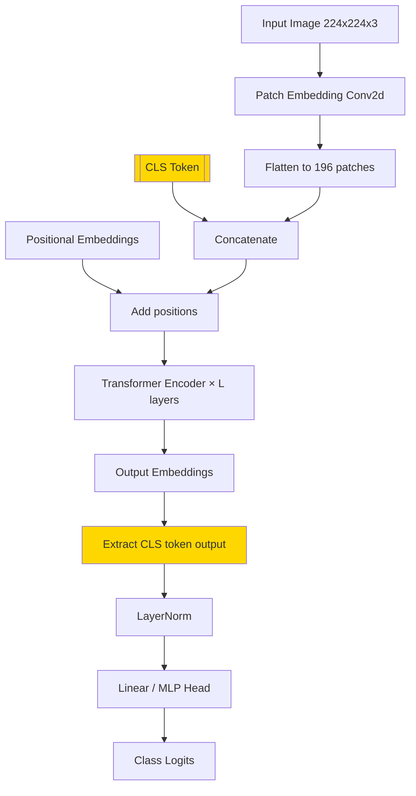
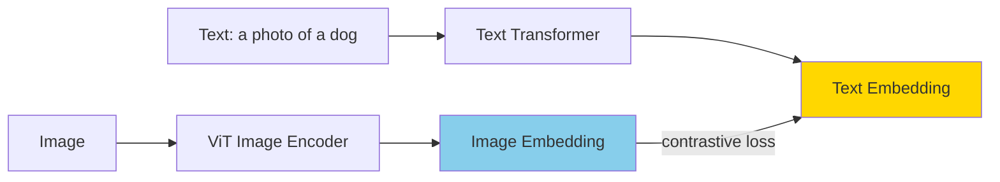

# Vision Transformer (ViT) — Transformer for Understanding Images

Until 2020, CNNs (Convolutional Neural Networks) were king for understanding images. ResNet, VGG, EfficientNet — all CNNs. Then a paper from Google came along and said — "Actually, transformers can understand images too, and with enough data, they beat CNNs!"

In this chapter we'll see how an image can be thought of as a "sentence," and how a transformer understands it.

---

## The Crazy Idea: Think of an Image as a "Sentence"

Think about it — what does a transformer do in NLP? It takes a sentence as a sequence of word tokens, converts each token to an embedding, and then all tokens communicate with each other through self-attention.

ViT's idea is the same — except instead of words, image patches are tokens!

```
  NLP Transformer:
  Sentence: "The cat sat on the mat"
  Tokens:   [The] [cat] [sat] [on] [the] [mat]
  Embed:    [E₁]  [E₂]  [E₃]  [E₄] [E₅]  [E₆]
                ↓ self-attention ↓
            Output embeddings

  Vision Transformer:
  Image:    ┌───────────┐
            │ 224 × 224 │
            └───────────┘
  Patches:  ┌──┬──┬──┬──┐
            │P₁│P₂│P₃│P₄│   (16×16 patches)
            ├──┼──┼──┼──┤
            │P₅│P₆│P₇│P₈│
            └──┴──┴──┴──┘
  Embed:    [E₁] [E₂] [E₃] ... [E₁₉₆]
                ↓ self-attention ↓
            Output embeddings
```

> [!note] The Core Insight
> A patch of an image is like a "word." For example, one patch might have a dog's ear, another might have grass, another might have sky. Through self-attention, they look at each other and understand — "the ear and tail are together, so this is a dog!"

---

## Patch Embedding — Step by Step

### Step 1: Divide the Image into Patches

Let's divide a 224×224 pixel RGB image into 16×16 patches.

```
  Image: 224 × 224 × 3 (height × width × channels)

  ┌─────────────────────────────────────┐
  │  ┌──┬──┬──┬──┬──┬──┬──┬──┬──┬──┐   │
  │  │  │  │  │  │  │  │  │  │  │  │   │
  │  ├──┼──┼──┼──┼──┼──┼──┼──┼──┼──┤   │
  │  │  │  │  │  │  │  │  │  │  │  │   │
  │  ├──┼──┼──┼──┼──┼──┼──┼──┼──┼──┤   │
  │  │  │  │  │  │  │  │  │  │  │  │   │
  │  ├──┼──┼──┼──┼──┼──┼──┼──┼──┼──┤   │
  │  │  │  │  │  │  │  │  │  │  │  │   │
  │  └──┴──┴──┴──┴──┴──┴──┴──┴──┴──┘   │
  │      14 × 14 = 196 patches         │
  └─────────────────────────────────────┘

  Each patch: 16 × 16 × 3 = 768 values
  Total patches: (224/16) × (224/16) = 14 × 14 = 196
```

### Step 2: Flatten and Project Each Patch

Each patch (16×16×3 = 768 values) is flattened and projected through a linear projection to create an embedding vector.

```
  Patch (16×16×3)
       │ flatten
       ▼
  [768 values]
       │ Linear Projection (W_patch)
       ▼
  [D-dim embedding]   e.g., D=768
```

Simply put — this is actually a Conv2D operation! Doing convolution with a `16×16` kernel and `16` stride gives the same result. That's why `nn.Conv2d` is used in implementation.

The code below shows the implementation of patch embedding. The core concept is — use `Conv2d` to split the image into patches and project them.

```python
import torch
import torch.nn as nn

class PatchEmbedding(nn.Module):
    def __init__(self, img_size=224, patch_size=16, in_channels=3, embed_dim=768):
        super().__init__()
        self.num_patches = (img_size // patch_size) ** 2  # 196
        # Conv2d for patch extraction + projection together
        self.proj = nn.Conv2d(
            in_channels, embed_dim,
            kernel_size=patch_size,
            stride=patch_size
        )

    def forward(self, x):
        # x shape: (batch, 3, 224, 224)
        x = self.proj(x)           # → (batch, 768, 14, 14)
        x = x.flatten(2)           # → (batch, 768, 196)
        x = x.transpose(1, 2)      # → (batch, 196, 768)
        return x                   # Now a sequence like NLP!

# Test it
patch_embed = PatchEmbedding()
dummy_image = torch.randn(1, 3, 224, 224)
tokens = patch_embed(dummy_image)
print(f"Patches: {tokens.shape}")  # torch.Size([1, 196, 768])
# 196 patches, each with 768-dim embedding — exactly like BERT!
```

In this code, the `PatchEmbedding` class takes an image and does patch extraction and projection together with `Conv2d`. The output shape is `(batch, 196, 768)` — meaning 196 tokens, each with 768 dimensions. This is exactly like NLP transformer input!

---

## [CLS] Token — For Classification

Like BERT, ViT also prepends a special `[CLS]` token at the beginning of the sequence. This token's job is to collect a summary of the entire image.

```
  Without CLS token:
  [P₁] [P₂] [P₃] ... [P₁₉₆]
   ↑
  Which token to use for classification?

  With CLS token:
  [CLS] [P₁] [P₂] [P₃] ... [P₁₉₆]
    ↑
  This token sees all patches through self-attention
  → collects a "summary" of the entire image
  → goes to the classification head
```

Because of self-attention, the `[CLS]` token aggregates information from every patch. In the final layer, this token's output goes to a linear classifier for the classification result!

---

## Positional Encoding for Patches

The Transformer by itself doesn't understand the order of patches. If the image patches are shuffled, the transformer won't know which patch was where. So positional encoding must be added.

```
  Patch:  [P₁]  [P₂]  [P₃]  ...  [P₁₉₆]
  Pos:    [POS₁] [POS₂] [POS₃] ... [POS₁₉₆]
                ↓ add ↓
  Input:  [P₁+POS₁] [P₂+POS₂] ... [P₁₉₆+POS₁₉₆]
                              ↓
                    Transformer Encoder
```

ViT uses learnable positional embeddings — a trainable vector for each position.

---

## Complete Architecture



The code below shows a simplified but complete ViT implementation. Notice — the architecture is exactly like BERT!

```python
import torch
import torch.nn as nn

class VisionTransformer(nn.Module):
    def __init__(self, img_size=224, patch_size=16, in_channels=3,
                 embed_dim=768, depth=12, num_heads=12, num_classes=1000):
        super().__init__()
        self.num_patches = (img_size // patch_size) ** 2

        # Patch embedding
        self.patch_embed = nn.Conv2d(in_channels, embed_dim,
                                      kernel_size=patch_size, stride=patch_size)

        # CLS token — randomly initialized at start
        self.cls_token = nn.Parameter(torch.zeros(1, 1, embed_dim))

        # Positional embedding — CLS + 196 patches = 197
        self.pos_embed = nn.Parameter(torch.zeros(1, self.num_patches + 1, embed_dim))

        # Transformer encoder (like BERT)
        encoder_layer = nn.TransformerEncoderLayer(
            d_model=embed_dim, nhead=num_heads,
            dim_feedforward=embed_dim * 4,
            dropout=0.1, activation="gelu", batch_first=True
        )
        self.encoder = nn.TransformerEncoder(encoder_layer, num_layers=depth)

        # Classification head
        self.norm = nn.LayerNorm(embed_dim)
        self.head = nn.Linear(embed_dim, num_classes)

    def forward(self, x):
        B = x.shape[0]

        # 1. Patch embedding
        x = self.patch_embed(x)              # (B, 768, 14, 14)
        x = x.flatten(2).transpose(1, 2)     # (B, 196, 768)

        # 2. Prepend CLS token
        cls = self.cls_token.expand(B, -1, -1)  # (B, 1, 768)
        x = torch.cat([cls, x], dim=1)          # (B, 197, 768)

        # 3. Add positional embedding
        x = x + self.pos_embed                   # (B, 197, 768)

        # 4. Transformer encoder
        x = self.encoder(x)                      # (B, 197, 768)

        # 5. Take CLS token's output for classification
        cls_out = x[:, 0]            # (B, 768) — only CLS position
        cls_out = self.norm(cls_out)
        logits = self.head(cls_out)  # (B, num_classes)
        return logits

# Test
vit = VisionTransformer(num_classes=10)
dummy = torch.randn(2, 3, 224, 224)  # batch=2, 2 images
output = vit(dummy)
print(f"Output: {output.shape}")  # torch.Size([2, 10])
```

In this code, the `VisionTransformer` class is a complete ViT. Step by step: divide into patches → add CLS token → add positions → transformer encoder → classification from CLS output. The architecture is exactly like an NLP transformer, only the input processing is different.

---

## ViT vs CNN — Comparison

| Feature | CNN (ResNet, EfficientNet) | ViT |
|---------|---------------------------|-----|
| **Inductive Bias** | locality (kernel sees local area), translation invariance | No inductive bias |
| **Data Requirement** | Works with less data | Needs lots of data |
| **Receptive Field** | Grows slowly as layers increase | Global from the first layer! |
| **Efficiency (small data)** | Good | Poor |
| **Efficiency (big data)** | Good | Even better — beats CNN |
| **Interpretability** | Attention maps hard | Attention maps easy |
| **Flexibility** | Specific to images | General purpose |

> [!important] What Is Inductive Bias?
> Inductive bias is a model's built-in assumption. CNN has a locality assumption — "nearby pixels are related." ViT doesn't have this assumption, the model learns which patches are related itself. With less data CNN does better because its built-in assumption helps. But with lots of data ViT does even better because less assumption = more flexibility.

```
  CNN: More Inductive Bias
  ┌──────────────────────────────────────┐
  │ ████████████░░░░░░░░░░░░░░░░░░░░░░░ │  ← Good from the start
  │ ████████████████░░░░░░░░░░░░░░░░░░░ │     but lower ceiling
  │ ████████████████████░░░░░░░░░░░░░░░ │
  └──────────────────────────────────────┘
       → Good even with less data

  ViT: Less Inductive Bias
  ┌──────────────────────────────────────┐
  │ ███░░░░░░░░░░░░░░░░░░░░░░░░░░░░░░░░ │  ← Poor at start
  │ ████████░░░░░░░░░░░░░░░░░░░░░░░░░░░ │     but much higher ceiling
  │ ████████████████████████████████████ │
  └──────────────────────────────────────┘
       → Beats CNN with lots of data
```

---

## Modern Variants

### DeiT (Data-efficient Image Transformers)

ViT's problem — it needs tons of data. DeiT solves this with strong data augmentation and knowledge distillation. ViT can be trained on just ImageNet (1.3M images).

### Swin Transformer — Hierarchical Architecture

```
  Standard ViT: All patches same size, global attention
  ┌──┬──┬──┬──┐
  │  │  │  │  │  ← all patches at same level
  ├──┼──┼──┼──┤
  │  │  │  │  │
  └──┴──┴──┴──┘

  Swin: Hierarchical, shifted windows
  Stage 1:  ┌──┬──┬──┬──┐    small patches
            └──┴──┴──┴──┘
  Stage 2:  ┌─────┬─────┐    patch merge → bigger
            └─────┴─────┘
  Stage 3:  ┌───────────┐    even bigger
            └───────────┘

  Shifted Window: window shifts at each layer
  → creates cross-window connections
  → local + global information
```

Swin's advantage — hierarchical features (like CNN), and works well for dense prediction tasks (object detection, segmentation).

### DINOv2 — Self-Supervised ViT

A ViT trained without labels. It learns similarities between images. The features are so good that a simple linear probe achieves state-of-the-art on downstream tasks.

### CLIP — Vision + Language

CLIP trains a ViT (image encoder) and a text encoder simultaneously. It brings images and text into the same embedding space. This makes zero-shot classification possible — you can search images with text like "is this a dog?"



---

## Image Classification with HuggingFace

The code below shows image classification with ViT using the HuggingFace transformers library. It's very easy — just a few lines.

```python
from transformers import ViTImageProcessor, ViTForImageClassification
from PIL import Image
import requests

# Download an image
url = "https://huggingface.co/datasets/huggingface/documentation-images/resolve/main/transformers/examples/image.jpg"
image = Image.open(requests.get(url, stream=True).raw)

# Load pre-trained ViT (google/vit-base-patch16-224)
processor = ViTImageProcessor.from_pretrained("google/vit-base-patch16-224")
model = ViTForImageClassification.from_pretrained("google/vit-base-patch16-224")

# Convert image to model input
inputs = processor(images=image, return_tensors="pt")

# Inference!
outputs = model(**inputs)
logits = outputs.logits

# Top-1 prediction
predicted_class = logits.argmax(-1).item()
label = model.config.id2label[predicted_class]
print(f"Prediction: {label}")
# e.g.: "Egyptian cat"
```

In this code, first an image is downloaded. Then `ViTImageProcessor` resizes and normalizes the image for the model. `ViTForImageClassification` loads a pre-trained ViT model. Finally `argmax` finds the class with the highest score. Notice — without any training, it correctly predicts among 1000 ImageNet classes!

> [!tip] Where to Find ViT Models?
> HuggingFace Hub has hundreds of pre-trained ViT models including `google/vit-base-patch16-224`, `google/vit-large-patch16-224`, `microsoft/swin-*`, `facebook/dinov2-*`. Ready models are available for any task.

---

## Impact: ViT Is Now the Backbone of Vision

| Task | Before (CNN Era) | Now (ViT Era) |
|------|-------------|------------|
| **Image Classification** | ResNet, EfficientNet | ViT, Swin, DeiT |
| **Object Detection** | Faster R-CNN + ResNet | DETR + ViT backbone |
| **Segmentation** | U-Net + CNN | Mask2Former + Swin |
| **Image Generation** | GAN | DiT (Diffusion + Transformer) |
| **Multimodal** | — | CLIP, BLIP, LLaVA |
| **Video Understanding** | 3D CNN | ViViT, TimeSformer |

> [!important] The Main Message
> ViT isn't just for image classification — it's now the universal backbone of vision AI. The idea of replacing CNN's "inductive bias" with data is so powerful that the entire vision field is now transformer-based. "An image is worth 16×16 words" — Google's paper title has come true.