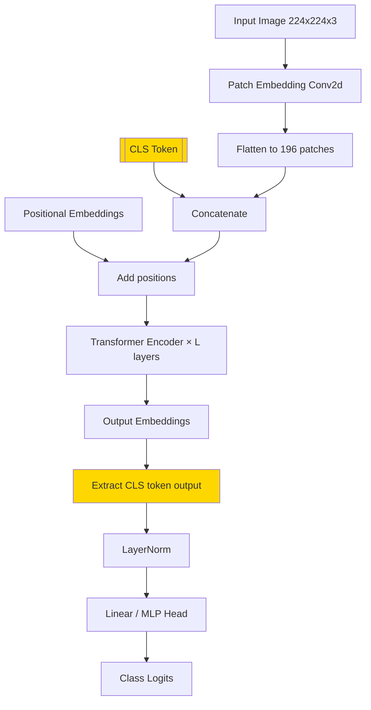
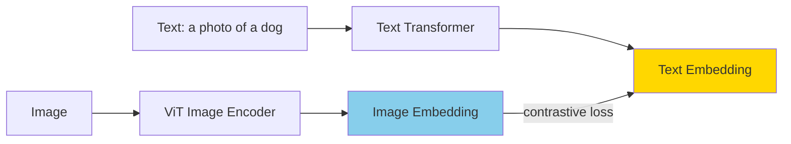

# Vision Transformer (ViT) — ছবি বোঝার Transformer

2020 সাল পর্যন্ত ছবি বোঝার ক্ষেত্রে CNN (Convolutional Neural Network) ছিলো রাজা। ResNet, VGG, EfficientNet — সব CNN। তারপর Google এর একটা পেপার এসে বললো — "আসলে transformer দিয়েও ছবি বোঝা যায়, আর যথেষ্ট data থাকলে CNN কে হারায়!"

এই chapter এ আমরা দেখবো একটা image কে কীভাবে "sentence" এর মতো ভাবা যায়, আর transformer কীভাবে সেটা বোঝে।

---

## The Crazy Idea: ছবি কে "sentence" এর মতো ভাবো

ভাবো — NLP তে transformer কী করে? একটা sentence কে word token গুলোর sequence হিসেবে নেয়, প্রতিটা token কে embedding এ রূপান্তর করে, তারপর self-attention এ সব token একে অপরের সাথে communicate করে।

ViT এর আইডিয়া একই — শুধু word এর বদলে image patch গুলো token!

```
  NLP Transformer:
  Sentence: "The cat sat on the mat"
  Tokens:   [The] [cat] [sat] [on] [the] [mat]
  Embed:    [E₁]  [E₂]  [E₃]  [E₄] [E₅]  [E₆]
                ↓ self-attention ↓
            Output embeddings

  Vision Transformer:
  Image:    ┌───────────┐
            │ 224 × 224 │
            └───────────┘
  Patches:  ┌──┬──┬──┬──┐
            │P₁│P₂│P₃│P₄│   (16×16 patches)
            ├──┼──┼──┼──┤
            │P₅│P₆│P₇│P₈│
            └──┴──┴──┴──┘
  Embed:    [E₁] [E₂] [E₃] ... [E₁₉₆]
                ↓ self-attention ↓
            Output embeddings
```

> [!note] মূল insight
> Image এর একটা patch হলো একটা "word" এর মতো। যেমন একটা patch এ থাকতে পারে কুকুরের কান, আরেকটায় ঘাস, আরেকটায় আকাশ। Self-attention এ এরা একে অপরকে দেখে বোঝে — "কান আর লেজ একসাথে আছে, তাহলে এটা কুকুর!"

---

## Patch Embedding — Step by Step

### Step 1: Image কে patch এ ভাগ করো

একটা 224×224 pixel এর RGB image কে 16×16 patch এ ভাগ করি।

```
  Image: 224 × 224 × 3 (height × width × channels)

  ┌─────────────────────────────────────┐
  │  ┌──┬──┬──┬──┬──┬──┬──┬──┬──┬──┐   │
  │  │  │  │  │  │  │  │  │  │  │  │   │
  │  ├──┼──┼──┼──┼──┼──┼──┼──┼──┼──┤   │
  │  │  │  │  │  │  │  │  │  │  │  │   │
  │  ├──┼──┼──┼──┼──┼──┼──┼──┼──┼──┤   │
  │  │  │  │  │  │  │  │  │  │  │  │   │
  │  ├──┼──┼──┼──┼──┼──┼──┼──┼──┼──┤   │
  │  │  │  │  │  │  │  │  │  │  │  │   │
  │  └──┴──┴──┴──┴──┴──┴──┴──┴──┴──┘   │
  │      14 × 14 = 196 patches         │
  └─────────────────────────────────────┘

  প্রতিটা patch: 16 × 16 × 3 = 768 values
  Total patches: (224/16) × (224/16) = 14 × 14 = 196
```

### Step 2: প্রতিটা patch কে flatten করো আর project করো

প্রতিটা patch (16×16×3 = 768 values) কে flatten করে একটা linear projection দিয়ে embedding vector বানানো হয়।

```
  Patch (16×16×3)
       │ flatten
       ▼
  [768 values]
       │ Linear Projection (W_patch)
       ▼
  [D-dim embedding]   যেমন D=768
```

খুব সহজে বললে — এটা আসলে একটা Conv2D operation! `16×16` kernel, `16` stride দিয়ে convolution করলেই একই ফল আসে। তাই implementation এ `nn.Conv2d` ব্যবহার করা হয়।

নিচের কোডে patch embedding এর implementation দেখানো হলো। মূল কনসেপ্ট হলো — `Conv2d` দিয়ে image কে patch এ ভাগ করে আর project করা।

```python
import torch
import torch.nn as nn

class PatchEmbedding(nn.Module):
    def __init__(self, img_size=224, patch_size=16, in_channels=3, embed_dim=768):
        super().__init__()
        self.num_patches = (img_size // patch_size) ** 2  # 196
        # Conv2d দিয়ে patch extraction + projection একসাথে
        self.proj = nn.Conv2d(
            in_channels, embed_dim,
            kernel_size=patch_size,
            stride=patch_size
        )

    def forward(self, x):
        # x shape: (batch, 3, 224, 224)
        x = self.proj(x)           # → (batch, 768, 14, 14)
        x = x.flatten(2)           # → (batch, 768, 196)
        x = x.transpose(1, 2)      # → (batch, 196, 768)
        return x                   # এখন NLP এর মতো sequence!

# টেস্ট করি
patch_embed = PatchEmbedding()
dummy_image = torch.randn(1, 3, 224, 224)
tokens = patch_embed(dummy_image)
print(f"Patches: {tokens.shape}")  # torch.Size([1, 196, 768])
# ১৯৬টা patch, প্রতিটা 768 dimension এর embedding — exactly like BERT!
```

এই কোডে `PatchEmbedding` class টা একটা image কে নেয় আর `Conv2d` দিয়ে patch extraction আর projection একসাথে করে। Output shape `(batch, 196, 768)` — মানে ১৯৬টা token, প্রতিটা 768 dimension এর। এটা একদম NLP transformer এর input এর মতো!

---

## [CLS] Token — Classification এর জন্য

BERT এর মতো ViT তেও একটা special `[CLS]` token sequence এর শুরুতে prepend করা হয়। এই token এর কাজ — পুরো image এর summary collect করা।

```
  Without CLS token:
  [P₁] [P₂] [P₃] ... [P₁₉₆]
   ↑
  কোন token থেকে classification করবে?

  With CLS token:
  [CLS] [P₁] [P₂] [P₃] ... [P₁₉₆]
    ↑
  এই token self-attention এ সব patch দেখে
  → পুরো image এর "summary" জমা করে
  → classification head এ যায়
```

Self-attention এর কারণে `[CLS]` token প্রতিটা patch এর information aggregate করে। Final layer এ এই token এর output কে একটা linear classifier এ দিলেই classification result!

---

## Positional Encoding for Patches

Transformer নিজে থেকে patch গুলোর order বোঝে না। যদি image এর patch গুলো shuffle করে দেওয়া হয়, transformer বুঝতে পারবে না যে কোন patch কোথায় ছিলো। তাই positional encoding যোগ করতে হয়।

```
  Patch:  [P₁]  [P₂]  [P₃]  ...  [P₁₉₆]
  Pos:    [POS₁] [POS₂] [POS₃] ... [POS₁₉₆]
                ↓ add ↓
  Input:  [P₁+POS₁] [P₂+POS₂] ... [P₁₉₆+POS₁₉₆]
                              ↓
                    Transformer Encoder
```

ViT তে learnable positional embedding ব্যবহার করা হয় — প্রতিটা position এর জন্য একটা trainable vector।

---

## সম্পূর্ণ Architecture



নিচের কোডে একটা simplified কিন্তু complete ViT এর implementation দেখানো হলো। খেয়াল করো — architecture একদম BERT এর মতো!

```python
import torch
import torch.nn as nn

class VisionTransformer(nn.Module):
    def __init__(self, img_size=224, patch_size=16, in_channels=3,
                 embed_dim=768, depth=12, num_heads=12, num_classes=1000):
        super().__init__()
        self.num_patches = (img_size // patch_size) ** 2

        # Patch embedding
        self.patch_embed = nn.Conv2d(in_channels, embed_dim,
                                      kernel_size=patch_size, stride=patch_size)

        # CLS token — শুরুতে randomly initialized
        self.cls_token = nn.Parameter(torch.zeros(1, 1, embed_dim))

        # Positional embedding — CLS + 196 patches = 197
        self.pos_embed = nn.Parameter(torch.zeros(1, self.num_patches + 1, embed_dim))

        # Transformer encoder (BERT এর মতো)
        encoder_layer = nn.TransformerEncoderLayer(
            d_model=embed_dim, nhead=num_heads,
            dim_feedforward=embed_dim * 4,
            dropout=0.1, activation="gelu", batch_first=True
        )
        self.encoder = nn.TransformerEncoder(encoder_layer, num_layers=depth)

        # Classification head
        self.norm = nn.LayerNorm(embed_dim)
        self.head = nn.Linear(embed_dim, num_classes)

    def forward(self, x):
        B = x.shape[0]

        # 1. Patch embedding
        x = self.patch_embed(x)              # (B, 768, 14, 14)
        x = x.flatten(2).transpose(1, 2)     # (B, 196, 768)

        # 2. CLS token prepend
        cls = self.cls_token.expand(B, -1, -1)  # (B, 1, 768)
        x = torch.cat([cls, x], dim=1)          # (B, 197, 768)

        # 3. Positional embedding add
        x = x + self.pos_embed                   # (B, 197, 768)

        # 4. Transformer encoder
        x = self.encoder(x)                      # (B, 197, 768)

        # 5. CLS token এর output নিয়ে classification
        cls_out = x[:, 0]            # (B, 768) — শুধু CLS position
        cls_out = self.norm(cls_out)
        logits = self.head(cls_out)  # (B, num_classes)
        return logits

# টেস্ট
vit = VisionTransformer(num_classes=10)
dummy = torch.randn(2, 3, 224, 224)  # batch=2, 2টা image
output = vit(dummy)
print(f"Output: {output.shape}")  # torch.Size([2, 10])
```

এই কোডে `VisionTransformer` class টা একটা complete ViT। Step by step: patch ভাগ করা → CLS token যোগ → position add → transformer encoder → CLS output থেকে classification। Architecture একদম NLP transformer এর মতো, শুধু input processing আলাদা।

---

## ViT vs CNN — তুলনা

| Feature | CNN (ResNet, EfficientNet) | ViT |
|---------|---------------------------|-----|
| **Inductive Bias** | locality (kernel local area দেখে), translation invariance | কোনো inductive bias নেই |
| **Data Requirement** | কম data তেও কাজ করে | অনেক data লাগে |
| **Receptive Field** | Layer বাড়ালে ধীরে ধীরে বাড়ে | প্রথম layer তেই global! |
| **Efficiency (small data)** | ভালো | খারাপ |
| **Efficiency (big data)** | ভালো | আরও ভালো — CNN কে হারায় |
| **Interpretability** | Attention map কঠিন | Attention map সহজ |
| **Flexibility** | Image এর জন্য specific | General purpose |

> [!important] Inductive Bias কী?
> Inductive bias হলো model এর built-in assumption। CNN তে locality assumption আছে — "কাছের pixel গুলো সম্পর্কিত।" ViT তে এই assumption নেই, model নিজে শিখে কোন patch সম্পর্কিত। কম data তে CNN ভালো কারণ এর built-in assumption সাহায্য করে। কিন্তু প্রচুর data থাকলে ViT আরও ভালো কারে এর assumption কম = flexibility বেশি।

```
  CNN: Inductive Bias বেশি
  ┌──────────────────────────────────────┐
  │ ████████████░░░░░░░░░░░░░░░░░░░░░░░ │  ← শুরু থেকেই ভালো
  │ ████████████████░░░░░░░░░░░░░░░░░░░ │     কিন্তু ceiling কম
  │ ████████████████████░░░░░░░░░░░░░░░ │
  └──────────────────────────────────────┘
       → Data কম হলেও ভালো

  ViT: Inductive Bias কম
  ┌──────────────────────────────────────┐
  │ ███░░░░░░░░░░░░░░░░░░░░░░░░░░░░░░░░ │  ← শুরুতে খারাপ
  │ ████████░░░░░░░░░░░░░░░░░░░░░░░░░░░ │     কিন্তু ceiling অনেক উঁচু
  │ ████████████████████████████████████ │
  └──────────────────────────────────────┘
       → Data প্রচুর হলে CNN কে হারায়
```

---

## Modern Variants

### DeiT (Data-efficient Image Transformers)

ViT এর সমস্যা — প্রচুর data লাগে। DeiT এটা solve করে strong data augmentation আর knowledge distillation দিয়ে। ImageNet (1.3M images) তেই ViT train করা যায়।

### Swin Transformer — Hierarchical Architecture

```
  Standard ViT: সব patch একই size, global attention
  ┌──┬──┬──┬──┐
  │  │  │  │  │  ← সব patch same level
  ├──┼──┼──┼──┤
  │  │  │  │  │
  └──┴──┴──┴──┘

  Swin: Hierarchical, shifted windows
  Stage 1:  ┌──┬──┬──┬──┐    ছোট patch
            └──┴──┴──┴──┘
  Stage 2:  ┌─────┬─────┐    patch merge → বড়
            └─────┴─────┘
  Stage 3:  ┌───────────┐    আরও বড়
            └───────────┘

  Shifted Window: প্রতি layer এ window shift হয়
  → cross-window connection তৈরি হয়
  → local + global information
```

Swin এর সুবিধা — hierarchical feature (CNN এর মতো), আর dense prediction task (object detection, segmentation) এ ভালো কাজ করে।

### DINOv2 — Self-Supervised ViT

Label ছাড়াই train করা ViT। Image গুলোর মধ্যে similarity শেখে। Feature গুলো এত ভালো যে downstream task এ শুধু linear probe দিলেই state-of-the-art।

### CLIP — Vision + Language

CLIP একইসাথে একটা ViT (image encoder) আর একটা text encoder train করে। Image আর text কে একই embedding space এ নিয়ে যায়। ফলে zero-shot classification সম্ভব — "এটা কি কুকুর?" text দিয়ে image search করা যায়!



---

## HuggingFace দিয়ে Image Classification

নিচের কোডে HuggingFace transformers library দিয়ে ViT দিয়ে image classification করা দেখানো হলো। খুবই সহজ — কয়েক line এই হয়ে যায়।

```python
from transformers import ViTImageProcessor, ViTForImageClassification
from PIL import Image
import requests

# একটা ছবি download করি
url = "https://huggingface.co/datasets/huggingface/documentation-images/resolve/main/transformers/examples/image.jpg"
image = Image.open(requests.get(url, stream=True).raw)

# Pre-trained ViT load করি (google/vit-base-patch16-224)
processor = ViTImageProcessor.from_pretrained("google/vit-base-patch16-224")
model = ViTForImageClassification.from_pretrained("google/vit-base-patch16-224")

# Image কে model input এ রূপান্তর করি
inputs = processor(images=image, return_tensors="pt")

# Inference!
outputs = model(**inputs)
logits = outputs.logits

# Top-1 prediction
predicted_class = logits.argmax(-1).item()
label = model.config.id2label[predicted_class]
print(f"Prediction: {label}")
# যেমন: "Egyptian cat"
```

এই কোডে প্রথমে একটা image download করা হলো। তারপর `ViTImageProcessor` image কে resize, normalize করে model এর জন্য ready করে। `ViTForImageClassification` pre-trained ViT model load করে। শেষে `argmax` দিয়ে highest score এর class বের করা হলো। খেয়াল করো — কোনো training ছাড়াই ImageNet এর 1000 class এর মধ্যে সঠিক label predict করে!

> [!tip] ViT Model কোথায় পাবে?
> HuggingFace Hub এ `google/vit-base-patch16-224`, `google/vit-large-patch16-224`, `microsoft/swin-*`, `facebook/dinov2-*` সহ শত শত pre-trained ViT model আছে। যেকোনো task এর জন্য ready model পাওয়া যায়।

---

## Impact: ViT এখন Vision এর Backbone

| Task | আগে (CNN Era) | এখন (ViT Era) |
|------|-------------|------------|
| **Image Classification** | ResNet, EfficientNet | ViT, Swin, DeiT |
| **Object Detection** | Faster R-CNN + ResNet | DETR + ViT backbone |
| **Segmentation** | U-Net + CNN | Mask2Former + Swin |
| **Image Generation** | GAN | DiT (Diffusion + Transformer) |
| **Multimodal** | — | CLIP, BLIP, LLaVA |
| **Video Understanding** | 3D CNN | ViViT, TimeSformer |

> [!important] মূল বার্তা
> ViT শুধু image classification এর জন্য না — এটা এখন vision AI এর universal backbone। CNN এর "inductive bias" কে data দিয়ে replace করার আইডিয়াটা এত শক্তিশালী যে পুরো vision field এখন transformer based। "An image is worth 16×16 words" — Google এর পেপার title টা সত্যি হয়েছে।