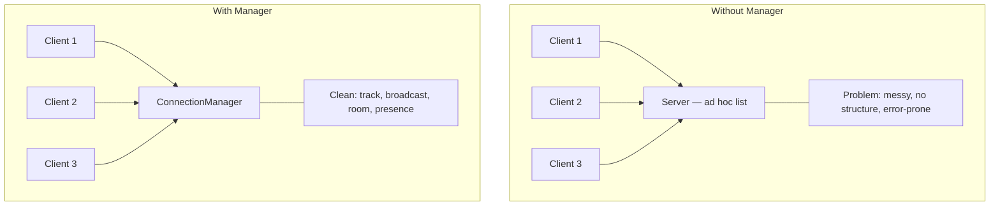
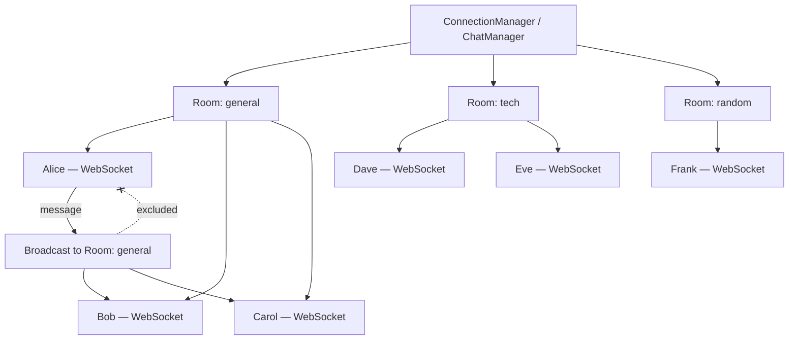

## Connection Manager ও Broadcasting

আগের chapter এ আমরা একটা সহজ chat server বানালাম। কিন্তু সেখানে একটা সমস্যা ছিল — connected client গুলো একটা plain list এ রাখা হয়েছিল, আর broadcast করার সময় for loop চালানো হয়েছিল। ছোট app এ এটা চলবে, কিন্তু real application এ?

Real application এ তোমার দরকার:
- Multiple chat rooms
- User presence (কে online, কে offline)
- Typing indicator ("user is typing...")
- Clean disconnection handling
- Broadcasting to specific groups

এই সব একটা জায়গায় manage করার জন্য দরকার একটা **ConnectionManager**। এই chapter এ আমরা বানাবো একটা production-ready ConnectionManager, যেটা দিয়ে multi-room chat, presence, আর typing indicator — সব handle করা যাবে।

## সমস্যা: Multiple Client কে কীভাবে Track করবে

একটা WebSocket server এ শত শত কিংবা হাজার হাজার client একসাথে connect করতে পারে। প্রতিটা client এর জন্য একটা আলাদা `WebSocket` object থাকে। এই সব object কে track করতে না পারলে:

- কাউকে message পাঠাতে পারবে না
- Broadcast করতে পারবে না
- কে disconnect করেছে সেটা জানবে না
- Room বা group ভিত্তিক messaging করতে পারবে না



সমাধান হলো — একটা class বানানো, যেটা সব WebSocket connection এর জন্য single source of truth হবে। একে **ConnectionManager** বলা হয়।

## ConnectionManager Class — Basic Structure

চলো প্রথমে একটা basic ConnectionManager বানাই, যেটা সব connected client track করবে:

```python
# Basic ConnectionManager
from fastapi import WebSocket

class ConnectionManager:
    def __init__(self):
        # List of all active WebSocket connections
        self.active_connections: list[WebSocket] = []
    
    async def connect(self, websocket: WebSocket):
        """Accept a new connection and add to active list."""
        await websocket.accept()
        self.active_connections.append(websocket)
    
    def disconnect(self, websocket: WebSocket):
        """Remove a connection from active list."""
        if websocket in self.active_connections:
            self.active_connections.remove(websocket)
    
    async def send_personal_message(self, message: str, websocket: WebSocket):
        """Send a message to a specific client."""
        try:
            await websocket.send_text(message)
        except Exception:
            # Connection might be dead — remove it
            self.disconnect(websocket)
    
    async def broadcast(self, message: str):
        """Send a message to ALL connected clients."""
        for connection in self.active_connections[:]:  # Copy list to avoid mutation during iteration
            try:
                await connection.send_text(message)
            except Exception:
                # Dead connection — remove it
                self.disconnect(connection)
```

এই class টা ধাপে ধাপে বুঝে নিই:

- `active_connections` — একটা list যেখানে সব connected `WebSocket` object রাখা হয়। এটাই central storage।
- `connect()` — নতুন client connect করলে তাকে accept করে আর list এ যোগ করে।
- `disconnect()` — client disconnect করলে তাকে list থেকে সরায়।
- `send_personal_message()` — একজন নির্দিষ্ট client কে message পাঠায়। যদি message পাঠাতে সমস্যা হয় (dead connection), তাকে list থেকে সরায়।
- `broadcast()` — সব connected client কে message পাঠায়। এখানে list এর একটা copy (`[:]`) করে iterate করা হয়, যাতে iteration এর সময় list modify করলে সমস্যা না হয়।

> [!tip] broadcast এ সবসময় try/except রাখুন
> broadcast করার সময় always try/except রাখুন — একটা connection dead হলে সব broadcast crash করবে না। যদি একটা client disconnect হয়ে যায় কিন্তু list এ থেকে যায়, তাকে message পাঠানোর সময় error হবে। সেই error এর কারণে পুরো broadcast loop crash করবে — আর বাকি client গুলো message পাবে না। try/except দিলে dead connection skip হয়ে যাবে, আর বাকিরা message পাবে।

## ConnectionManager ব্যবহার করা

এখন এই ConnectionManager টা কীভাবে FastAPI তে ব্যবহার করবে দেখি:

```python
# Using ConnectionManager in FastAPI
from fastapi import FastAPI, WebSocket, WebSocketDisconnect

app = FastAPI()
manager = ConnectionManager()

@app.websocket("/ws/{client_id}")
async def websocket_endpoint(websocket: WebSocket, client_id: str):
    await manager.connect(websocket)
    await manager.send_personal_message(f"Welcome, {client_id}!", websocket)
    
    # Notify everyone about new user
    await manager.broadcast(f"User {client_id} joined the chat")
    
    try:
        while True:
            message = await websocket.receive_text()
            # Broadcast message with client_id
            await manager.broadcast(f"{client_id}: {message}")
    except WebSocketDisconnect:
        manager.disconnect(websocket)
        await manager.broadcast(f"User {client_id} left the chat")
```

এই কোডে `manager` একটা global ConnectionManager instance। প্রতিটা client connect করলে `manager.connect()` করা হয়। Message এলে `manager.broadcast()` দিয়ে সবাইকে পাঠানো হয়। Client disconnect করলে `manager.disconnect()` দিয়ে সরানো হয়, আর বাকিদের notify করা হয়।

## ConnectionManager Methods — Summary Table

নিচের table এ ConnectionManager এর সব method এর summary দেওয়া হলো:

| Method | Purpose | Parameters | Returns |
|--------|---------|------------|---------|
| `connect()` | নতুন connection accept করে আর list এ যোগ করে | `websocket: WebSocket` | None |
| `disconnect()` | Connection list থেকে সরায় | `websocket: WebSocket` | None |
| `send_personal_message()` | নির্দিষ্ট client কে message পাঠায় | `message: str`, `websocket: WebSocket` | None |
| `broadcast()` | সব connected client কে message পাঠায় | `message: str` | None |
| `get_online_count()` | কতজন online আছে সেটা দেয় | None | `int` |

## Chat Rooms — Room-Based Messaging

Basic ConnectionManager এ সব client একটাই list এ থাকে। কিন্তু real chat app এ তো room থাকে — "general", "random", "tech"। একজন user শুধু তার room এর message পাবে, অন্য room এর নয়।

এর জন্য data structure change করতে হবে — `list` এর বদলে `dict[str, list[WebSocket]]` ব্যবহার করতে হবে:

```python
# ConnectionManager with room support
from fastapi import WebSocket
from collections import defaultdict

class RoomConnectionManager:
    def __init__(self):
        # Dictionary: room_id -> list of WebSocket connections
        self.rooms: dict[str, list[WebSocket]] = defaultdict(list)
    
    async def connect(self, websocket: WebSocket, room_id: str):
        """Accept connection and add to a specific room."""
        await websocket.accept()
        self.rooms[room_id].append(websocket)
    
    def disconnect(self, websocket: WebSocket, room_id: str):
        """Remove connection from a specific room."""
        if websocket in self.rooms[room_id]:
            self.rooms[room_id].remove(websocket)
        # Clean up empty rooms
        if not self.rooms[room_id]:
            del self.rooms[room_id]
    
    async def send_personal_message(self, message: str, websocket: WebSocket):
        """Send message to a specific client."""
        try:
            await websocket.send_text(message)
        except Exception:
            pass  # Let disconnect handle cleanup
    
    async def broadcast_to_room(self, message: str, room_id: str):
        """Broadcast message to all clients in a specific room."""
        if room_id not in self.rooms:
            return
        
        for connection in self.rooms[room_id][:]:
            try:
                await connection.send_text(message)
            except Exception:
                self.disconnect(connection, room_id)
    
    async def broadcast_to_all(self, message: str):
        """Broadcast message to ALL rooms (global announcement)."""
        for room_id in list(self.rooms.keys()):
            await self.broadcast_to_room(message, room_id)
    
    def get_room_user_count(self, room_id: str) -> int:
        """Get number of users in a specific room."""
        return len(self.rooms.get(room_id, []))
```

এই class এ কী পরিবর্তন এসেছে দেখি:

- `rooms` — এখন একটা dictionary। Key হলো room_id (string), value হলো সেই room এর WebSocket list। `defaultdict(list)` ব্যবহার করা হয়েছে যাতে নতুন room অটোমেটিক তৈরি হয়।
- `connect()` — এখন একটা `room_id` parameter নেয়। Client কে নির্দিষ্ট room এ যোগ করে।
- `disconnect()` — নির্দিষ্ট room থেকে client সরায়। যদি room খালি হয়ে যায়, সেটা delete করে।
- `broadcast_to_room()` — শুধু একটা নির্দিষ্ট room এর সব client কে message পাঠায়।
- `broadcast_to_all()` — সব room এর সব client কে message পাঠায় (global announcement এর জন্য)।
- `get_room_user_count()` — একটা room এ কতজন আছে সেটা দেয়।

## User Presence — কে Online

Chat app এ "online" status দেখানো খুব common। কে এই মুহূর্তে online আছে, কে নতুন join করেছে, কে leave করেছে — এই সব info দরকার।

এর জন্য ConnectionManager এ user info track করতে হবে — শুধু WebSocket নয়:

```python
# ConnectionManager with user presence
from fastapi import WebSocket
from dataclasses import dataclass, field
from datetime import datetime

@dataclass
class ConnectedUser:
    websocket: WebSocket
    user_id: str
    username: str
    room_id: str
    connected_at: str = field(default_factory=lambda: datetime.now().isoformat())

class PresenceManager:
    def __init__(self):
        # room_id -> list of ConnectedUser
        self.rooms: dict[str, list[ConnectedUser]] = {}
    
    async def connect(self, websocket: WebSocket, user_id: str, username: str, room_id: str):
        await websocket.accept()
        user = ConnectedUser(
            websocket=websocket,
            user_id=user_id,
            username=username,
            room_id=room_id
        )
        if room_id not in self.rooms:
            self.rooms[room_id] = []
        self.rooms[room_id].append(user)
        
        # Notify room about new user
        await self.broadcast_to_room({
            "type": "presence",
            "event": "join",
            "user": username,
            "room": room_id,
            "online_users": self.get_room_users(room_id)
        }, room_id, exclude=websocket)
        
        # Send current online users to the new user
        await websocket.send_json({
            "type": "presence",
            "event": "room_state",
            "room": room_id,
            "online_users": self.get_room_users(room_id)
        })
    
    def disconnect(self, websocket: WebSocket):
        """Remove user from all rooms."""
        for room_id, users in list(self.rooms.items()):
            for user in users[:]:
                if user.websocket == websocket:
                    users.remove(user)
                    # Notify room about user leaving
                    # (async call — need to be handled by caller)
                    break
            if not users:
                del self.rooms[room_id]
    
    def get_room_users(self, room_id: str) -> list[str]:
        """Get list of usernames in a room."""
        return [user.username for user in self.rooms.get(room_id, [])]
    
    async def broadcast_to_room(self, message: dict, room_id: str, exclude: WebSocket = None):
        """Broadcast to a room, optionally excluding a specific connection."""
        if room_id not in self.rooms:
            return
        for user in self.rooms[room_id][:]:
            if exclude and user.websocket == exclude:
                continue
            try:
                await user.websocket.send_json(message)
            except Exception:
                self.rooms[room_id].remove(user)
```

এই class এ বেশ কিছু নতুন জিনিস আছে:

- `ConnectedUser` — একটা dataclass, যেটা WebSocket সহ user এর সব info রাখে (user_id, username, room_id, connected_at)।
- `connect()` — user কে accept করে, ConnectedUser object বানায়, room এ যোগ করে। তারপর বাকিদের notify করে যে নতুন user join করেছে, আর নতুন user কে বর্তমান online user list পাঠায়।
- `disconnect()` — user কে সব room থেকে সরায়। যদি room খালি হয়, delete করে।
- `broadcast_to_room()` — room এ broadcast করে। `exclude` parameter দিয়ে একটা connection skip করা যায় (যেমন join notification পাঠানোর সময় নতুন user কে exclude করা)।

## Typing Indicator — "User is Typing..."

Chat app এ "user is typing..." indicator একটা জরুরি feature। কেউ typing করছে এটা বাকিদের দেখাতে হয়। এটা implement করা সহজ — একটা specific message type দিয়ে।

```python
# Typing indicator handling
async def handle_typing(manager: PresenceManager, websocket: WebSocket, 
                        room_id: str, username: str, is_typing: bool):
    """Broadcast typing status to room."""
    await manager.broadcast_to_room({
        "type": "typing",
        "user": username,
        "is_typing": is_typing,
        "room": room_id
    }, room_id, exclude=websocket)
```

এই function টা typing status broadcast করে। যখন কেউ typing শুরু করে, `is_typing: true` পাঠায়। যখন থামে, `is_typing: false` পাঠায়। `exclude=websocket` দেওয়া আছে — কারণ typing করা user নিজে তো নিজের typing notification দেখবে না।

Client side এ এটা এভাবে handle করা হয়:

```javascript
// Client-side typing indicator
const socket = new WebSocket("ws://localhost:8000/ws/chat/general?user=alice");

let typingTimeout = null;

// When user types in input
messageInput.addEventListener("input", () => {
    // Send "typing" event
    socket.send(JSON.stringify({
        type: "typing",
        is_typing: true
    }));
    
    // Clear previous timeout
    clearTimeout(typingTimeout);
    
    // After 2 seconds of no typing, send "stopped typing"
    typingTimeout = setTimeout(() => {
        socket.send(JSON.stringify({
            type: "typing",
            is_typing: false
        }));
    }, 2000);
});

// Listen for typing events from others
socket.addEventListener("message", (event) => {
    const data = JSON.parse(event.data);
    
    if (data.type === "typing") {
        if (data.is_typing) {
            typingIndicator.textContent = `${data.user} is typing...`;
        } else {
            typingIndicator.textContent = "";
        }
    }
});
```

এই কোডে client যখন input এ type করে, সাথে সাথে `typing: true` message পাঠায়। আর ২ সেকেন্ড কিছু type না করলে `typing: false` পাঠায়। অন্যদের typing message এলে পর্দায় "user is typing..." দেখায়।

## Full Example: Multi-Room Chat with Presence ও Typing

এবার সব একসাথে মিলিয়ে একটা সম্পূর্ণ multi-room chat server বানাই — room, presence, typing, সব সহ:

```python
# multi_room_chat.py — Complete multi-room chat server
from fastapi import FastAPI, WebSocket, WebSocketDisconnect
from dataclasses import dataclass, field
from datetime import datetime
import json

app = FastAPI()

@dataclass
class ConnectedUser:
    websocket: WebSocket
    user_id: str
    username: str
    room_id: str
    connected_at: str = field(default_factory=lambda: datetime.now().isoformat())

class ChatManager:
    def __init__(self):
        self.rooms: dict[str, list[ConnectedUser]] = {}
    
    async def connect(self, websocket: WebSocket, user_id: str, username: str, room_id: str):
        await websocket.accept()
        user = ConnectedUser(
            websocket=websocket,
            user_id=user_id,
            username=username,
            room_id=room_id
        )
        if room_id not in self.rooms:
            self.rooms[room_id] = []
        self.rooms[room_id].append(user)
        
        # Notify room about new user
        await self.broadcast_to_room({
            "type": "presence",
            "event": "join",
            "user": username,
            "room": room_id,
            "online_users": self.get_room_users(room_id),
            "timestamp": datetime.now().isoformat()
        }, room_id, exclude=websocket)
        
        # Send current room state to new user
        await websocket.send_json({
            "type": "presence",
            "event": "room_state",
            "room": room_id,
            "online_users": self.get_room_users(room_id),
            "timestamp": datetime.now().isoformat()
        })
    
    def disconnect(self, websocket: WebSocket) -> str:
        """Remove user, return their room_id and username for notification."""
        for room_id, users in list(self.rooms.items()):
            for user in users[:]:
                if user.websocket == websocket:
                    username = user.username
                    users.remove(user)
                    if not users:
                        del self.rooms[room_id]
                    return room_id, username
        return None, None
    
    def get_room_users(self, room_id: str) -> list[str]:
        return [user.username for user in self.rooms.get(room_id, [])]
    
    async def broadcast_to_room(self, message: dict, room_id: str, exclude: WebSocket = None):
        if room_id not in self.rooms:
            return
        for user in self.rooms[room_id][:]:
            if exclude and user.websocket == exclude:
                continue
            try:
                await user.websocket.send_json(message)
            except Exception:
                self.rooms[room_id].remove(user)

manager = ChatManager()

@app.websocket("/ws/chat/{room_id}")
async def chat_endpoint(websocket: WebSocket, room_id: str):
    # Get user info from query params
    user_id = websocket.query_params.get("user_id", "unknown")
    username = websocket.query_params.get("username", f"User{user_id}")
    
    await manager.connect(websocket, user_id, username, room_id)
    
    try:
        while True:
            data = await websocket.receive_json()
            msg_type = data.get("type")
            
            if msg_type == "chat":
                # Chat message — broadcast to room
                await manager.broadcast_to_room({
                    "type": "chat",
                    "user": username,
                    "message": data.get("message", ""),
                    "room": room_id,
                    "timestamp": datetime.now().isoformat()
                }, room_id)
                
            elif msg_type == "typing":
                # Typing indicator — broadcast to room (excluding sender)
                await manager.broadcast_to_room({
                    "type": "typing",
                    "user": username,
                    "is_typing": data.get("is_typing", False),
                    "room": room_id
                }, room_id, exclude=websocket)
                
            else:
                await websocket.send_json({
                    "type": "error",
                    "message": f"Unknown message type: {msg_type}"
                })
                
    except WebSocketDisconnect:
        room, name = manager.disconnect(websocket)
        if room and name:
            # Notify room about user leaving
            await manager.broadcast_to_room({
                "type": "presence",
                "event": "leave",
                "user": name,
                "room": room,
                "online_users": manager.get_room_users(room),
                "timestamp": datetime.now().isoformat()
            }, room)
    except json.JSONDecodeError:
        await websocket.send_json({
            "type": "error",
            "message": "Invalid JSON format"
        })
    except Exception as e:
        print(f"Unexpected error: {e}")
        room, name = manager.disconnect(websocket)
        if room and name:
            await manager.broadcast_to_room({
                "type": "presence",
                "event": "leave",
                "user": name,
                "room": room,
                "online_users": manager.get_room_users(room),
                "timestamp": datetime.now().isoformat()
            }, room)
```

এই পুরো server টা একটু বিস্তারিত ভাবে বুঝে নিই:

**Connection flow:**
1. Client `ws://localhost:8000/ws/chat/general?user_id=1&username=alice` এ connect করে।
2. `manager.connect()` — user কে accept করে, room "general" এ যোগ করে।
3. বাকি room member দের "alice joined" notification যায়।
4. নতুন user কে room এর বর্তমান online user list পাঠানো হয়।

**Message flow:**
1. Client `{"type": "chat", "message": "Hello!"}` পাঠায়।
2. Server সব room member কে message broadcast করে।
3. Typing indicator — `{"type": "typing", "is_typing": true}` পাঠালে বাকিরা "alice is typing..." দেখে।

**Disconnection flow:**
1. Client disconnect করলে `WebSocketDisconnect` exception আসে।
2. `manager.disconnect()` — user কে room থেকে সরায়, room_id আর username return করে।
3. বাকি room member দের "alice left" notification যায়।
4. Updated online user list ও পাঠানো হয়।



এই diagram এ ConnectionManager এর structure দেখানো হয়েছে। Manager এর under এ একাধিক room, প্রতিটা room এ একাধিক user। যখন Alice message পাঠায়, সেটা শুধু "general" room এর বাকি user দের যায় — Alice নিজে বাদে।

## Handling Disconnections Gracefully

Disconnection handle করা হলো WebSocket এর সবচেয়ে গুরুত্বপূর্ণ অংশ। কারণ connection যেকোনো সময়, যেকোনো কারণে বন্ধ হতে পারে। চলো দেখি কীভাবে এটা robust ভাবে handle করা যায়:

```python
# Graceful disconnection handling pattern
from fastapi import WebSocket, WebSocketDisconnect
import logging

logger = logging.getLogger(__name__)

async def safe_send(websocket: WebSocket, message: dict) -> bool:
    """Send message safely. Returns True if successful, False if connection dead."""
    try:
        await websocket.send_json(message)
        return True
    except Exception as e:
        logger.warning(f"Failed to send message: {e}")
        return False

async def safe_disconnect(manager: ChatManager, websocket: WebSocket):
    """Safely disconnect and clean up, handling all edge cases."""
    try:
        room_id, username = manager.disconnect(websocket)
        if room_id and username:
            # Notify remaining users
            await manager.broadcast_to_room({
                "type": "presence",
                "event": "leave",
                "user": username,
                "room": room_id,
                "online_users": manager.get_room_users(room_id),
                "timestamp": datetime.now().isoformat()
            }, room_id)
    except Exception as e:
        logger.error(f"Error during disconnect cleanup: {e}")
    
    # Try to close the WebSocket if still open
    try:
        await websocket.close()
    except Exception:
        pass  # Already closed
```

এই কোডে দুটো utility function বানানো হয়েছে। `safe_send()` — এটা message পাঠানোর চেষ্টা করে। সফল হলে True, ব্যর্থ হলে False return করে। কোনো exception ছাড়ে না। `safe_disconnect()` — এটা user কে safely remove করে, বাকিদের notify করে, আর WebSocket close করার চেষ্টা করে। যদি কোনো step এ error আসে, সেটাও catch করা হয়।

> [!important] Dead connection clean up করো
> যখন broadcast করার সময় কোনো connection এ error আসে, সেটা dead। সেটা list থেকে immediately remove করো। নাহলে প্রতিবার broadcast এ সেই dead connection এ try করবে — অপ্রয়োজনীয় overhead। আর সবচেয়ে খারাপ পরিস্থিতি — dead connection এর কারণে পুরো broadcast loop একটা unhandled exception এ crash করতে পারে।

## ConnectionManager এর Best Practices

শেষে কিছু best practices দেখি:

### ১. সবসময় try/except দিয়ে send করো

```python
# Good — safe send
try:
    await websocket.send_json(message)
except Exception:
    manager.disconnect(websocket)

# Bad — will crash on dead connection
await websocket.send_json(message)
```

### ২. Broadcast এ list copy করে iterate করো

```python
# Good — iterate over a copy
for connection in self.active_connections[:]:
    ...

# Bad — mutating list during iteration causes bugs
for connection in self.active_connections:
    ...
```

### ৩. User info আলাদা রাখো

শুধু WebSocket list না রেখে, ConnectedUser dataclass ব্যবহার করো — যাতে user এর নাম, ID, room সব একসাথে থাকে।

### ৪. Empty room clean up করো

Room এ কেউ না থাকলে সেটা dictionary থেকে delete করে দাও — মেমরি বাঁচবে।

### ৫. Logging রাখো

প্রতিটা connect, disconnect, error এর জন্য log রাখো — production এ debug করার সময় কাজে লাগবে।

## Summary

এই chapter এ আমরা শিখলাম:

- **ConnectionManager** — একটা class যেটা সব WebSocket connection track করে
- Basic structure: `active_connections: list[WebSocket]` আর `connect()`, `disconnect()`, `send_personal_message()`, `broadcast()` method
- **Chat rooms** — `dict[str, list[WebSocket]]` দিয়ে room-based messaging
- **User presence** — `ConnectedUser` dataclass দিয়ে user info track করা, join/leave notification
- **Typing indicator** — `{"type": "typing", "is_typing": true/false}` message দিয়ে "user is typing..." feature
- **Graceful disconnection** — try/except দিয়ে dead connection handle করা, clean up করা
- সম্পূর্ণ **multi-room chat server** — room, presence, typing, error handling সব সহ
- Best practices: safe send, list copy, user dataclass, empty room cleanup, logging

এই series এর চারটা chapter শেষ! এখন তুমি WebSocket এর theory, protocol, FastAPI implementation, আর multi-client management — সব জানো। Real-world chat app, live dashboard, বা real-time notification system — যেকোনো কিছু বানানোর জন্য প্রস্তুত!