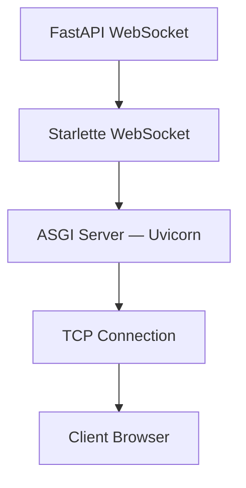
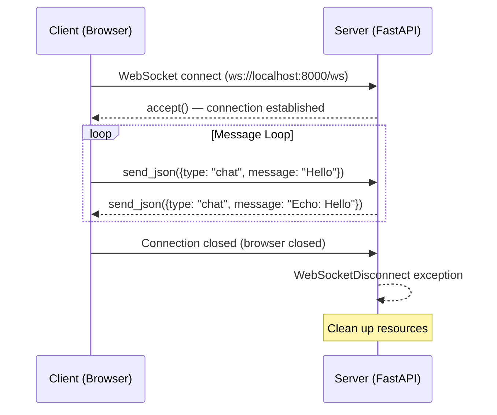

## FastAPI তে WebSocket

আগের দুই chapter এ আমরা দেখলাম WebSocket কী, আর এর protocol কীভাবে কাজ করে। কিন্তু theory শেষ — এখন সময় হয়েছে হাত গোটানোর। চলো দেখি FastAPI দিয়ে কীভাবে real-time WebSocket server বানানো যায়।

FastAPI তে WebSocket support বিল্ট-ইন আছে — কোনো অতিরিক্ত library লাগে না। এটা Starlette এর WebSocket implementation এর উপর তৈরি, তাই দ্রুত, reliable, আর production-ready। এই chapter এ আমরা একটা থেকে শুরু করে একটা পূর্ণ chat server পর্যন্ত বানাবো।

## FastAPI WebSocket — Starlette এর উপর তৈরি

FastAPI নিজে সব কিছু বানায় না। এর WebSocket feature টা আসলে **Starlette** থেকে আসে। Starlette হলো একটা lightweight ASGI framework, যেটার উপর FastAPI built। Starlette এ WebSocket handling, routing, middleware সব কিছু দেয়। FastAPI শুধু সেটার উপর একটা সহজ interface বসায়।



> [!note] Starlette ও সরাসরি ব্যবহার করতে পারেন
> FastAPI-র WebSocket Starlette-এর উপর তৈরি, তাই pure Starlette ও ব্যবহার করতে পারেন। কিন্তু FastAPI দিয়ে কাজ করলে তোমাকে আরও অনেক কিছু পাবে — auto validation, dependency injection, OpenAPI docs (যদিও WebSocket docs স্বয়ংক্রিয়ভাবে তৈরি হয় না)। তাই সাধারণত FastAPI ই ব্যবহার করা ভালো।

## Basic WebSocket Endpoint

চলো প্রথমে একটা সহজ WebSocket endpoint বানাই। এটা একটা সহজ echo server হবে — client যা পাঠাবে, server সেটাই ফিরিয়ে দেবে।

নিচের কোডটা দেখো — এটা একটা basic WebSocket echo server:

```python
# Basic WebSocket echo server in FastAPI
from fastapi import FastAPI, WebSocket, WebSocketDisconnect

app = FastAPI()

@app.websocket("/ws")
async def websocket_endpoint(websocket: WebSocket):
    await websocket.accept()
    try:
        while True:
            message = await websocket.receive_text()
            await websocket.send_text(f"Echo: {message}")
    except WebSocketDisconnect:
        print("Client disconnected")
```

এই কোডে কী হচ্ছে একটু বুঝে নিই:

- `@app.websocket("/ws")` — এটা একটা WebSocket route তৈরি করে, ঠিক `@app.get()` বা `@app.post()` এর মতোই
- `websocket: WebSocket` — FastAPI এই object টা automatically inject করে। এটার মাধ্যমেই তুমি connection টা control করবে
- `await websocket.accept()` — handshake সম্পন্ন করে, connection টা accept করে। এটা না করলে connection টা pending এ থাকবে
- `while True` — একটা infinite loop। Connection টা open থাকা পর্যন্ত message receive করতে থাকবে
- `await websocket.receive_text()` — client এর থেকে text message receive করে। এটা blocking — যতক্ষণ না message আসে, অপেক্ষা করে
- `await websocket.send_text()` — client কে text message পাঠায়
- `WebSocketDisconnect` — client disconnect করলে এই exception আসে। এটা catch করে clean up করতে হয়

## WebSocket Object এর Methods

`WebSocket` object টার কিছু important method আছে। চলো সেগুলো দেখি:

| Method | Description |
|--------|-------------|
| `await websocket.accept()` | Handshake সম্পন্ন করে, connection accept করে |
| `await websocket.send_text(data)` | Text message পাঠায় (string) |
| `await websocket.send_bytes(data)` | Binary message পাঠায় (bytes) |
| `await websocket.send_json(data)` | JSON message পাঠায় (dict/list কে auto JSON encode করে) |
| `await websocket.receive_text()` | Text message receive করে (string return করে) |
| `await websocket.receive_bytes()` | Binary message receive করে (bytes return করে) |
| `await websocket.receive_json()` | JSON message receive করে (parsed dict/list return করে) |
| `await websocket.close(code, reason)` | Connection বন্ধ করে (close code আর reason সহ) |
| `websocket.client_state` | Connection এর বর্তমান state (CONNECTING, CONNECTED, DISCONNECTED) |
| `websocket.query_params` | URL query parameter গুলো access করার জন্য |
| `websocket.headers` | Handshake এর headers গুলো access করার জন্য |

> [!tip] send_json ব্যবহার করো
> Real application এ সবসময় `send_json` আর `receive_json` ব্যবহার করো। কারণ structured data পাঠাতে JSON সবচেয়ে ভালো। এতে message type, content, metadata — সব একসাথে পাঠানো যায়। Plain text দিয়ে শুধু সহজ echo server চলবে, real app এ কাজ চলবে না।

## WebSocketDisconnect — Exception Handling

WebSocket এ সবচেয়ে গুরুত্বপূর্ণ জিনিস হলো **disconnection handling**। Client যেকোনো সময় disconnect করতে পারে — browser close, network issue, বা manually। যখন client disconnect করে, `receive_text()` বা `receive_json()` method গুলো `WebSocketDisconnect` exception throw করে।

এই exception টা catch না করলে server crash করবে। তাই সবসময় try/except ব্যবহার করতে হবে:

```python
# Proper disconnection handling
from fastapi import FastAPI, WebSocket, WebSocketDisconnect

app = FastAPI()

@app.websocket("/ws")
async def websocket_endpoint(websocket: WebSocket):
    await websocket.accept()
    try:
        while True:
            message = await websocket.receive_text()
            await websocket.send_text(f"Echo: {message}")
    except WebSocketDisconnect:
        # Client disconnected — clean up resources here
        print("Client disconnected gracefully")
        # No need to call websocket.close() — already disconnected
    except Exception as e:
        # Any other unexpected error
        print(f"Unexpected error: {e}")
        try:
            await websocket.close(code=1011, reason="Internal server error")
        except RuntimeError:
            # Connection already closed
            pass
```

এই কোডে দুটো exception handle করা হয়েছে। `WebSocketDisconnect` — এটা normal disconnection, clean up করে শেষ। আর `Exception` — এটা যেকোনো unexpected error ধরে, আর server error close code (1011) দিয়ে connection টা gracefully close করার চেষ্টা করে। যদি connection টা আগেই বন্ধ হয়ে থাকে, তাহলে `close()` method runtime error throw করতে পারে — সেটাও catch করা হয়েছে।

## JSON Message Protocol

Real application এ তুমি শুধু plain text পাঠাবে না। তোমার একটা structured message protocol দরকার। JSON এর মাধ্যমে তুমি message type, content, sender info — সব একসাথে পাঠাতে পারবে।

চলো দেখি কীভাবে একটা JSON-based message protocol বানানো যায়:

```python
# JSON-based WebSocket message protocol
from fastapi import FastAPI, WebSocket, WebSocketDisconnect
import json

app = FastAPI()

@app.websocket("/ws")
async def websocket_endpoint(websocket: WebSocket):
    await websocket.accept()
    try:
        while True:
            # Receive JSON message
            data = await websocket.receive_json()
            
            # Determine message type
            msg_type = data.get("type")
            
            if msg_type == "chat":
                # Chat message
                response = {
                    "type": "chat",
                    "user": data.get("user", "anonymous"),
                    "message": data.get("message", ""),
                    "timestamp": "2026-07-07T12:00:00Z"
                }
                await websocket.send_json(response)
                
            elif msg_type == "typing":
                # Typing indicator
                response = {
                    "type": "typing",
                    "user": data.get("user", "anonymous"),
                    "is_typing": data.get("is_typing", False)
                }
                await websocket.send_json(response)
                
            elif msg_type == "presence":
                # Presence check
                response = {
                    "type": "presence",
                    "online": True,
                    "user": data.get("user", "anonymous")
                }
                await websocket.send_json(response)
                
            else:
                # Unknown message type
                await websocket.send_json({
                    "type": "error",
                    "message": f"Unknown message type: {msg_type}"
                })
                
    except WebSocketDisconnect:
        print("Client disconnected")
    except json.JSONDecodeError:
        await websocket.send_json({
            "type": "error",
            "message": "Invalid JSON format"
        })
```

এই কোডে একটা JSON protocol বানানো হয়েছে। প্রতিটা message এ একটা `type` field থাকে — `chat`, `typing`, `presence`, বা `error`। Server message type দেখে সিদ্ধান্ত নেয় কী করতে হবে। যদি unknown type আসে, error message ফেরত দেয়। যদি ভাঙা JSON আসে, `JSONDecodeError` catch করে error পাঠায়।

## Message Flow Diagram

নিচের diagram এ পুরো flow টা দেখানো হলো — client থেকে connect থেকে শুরু করে disconnect পর্যন্ত:



এই diagram এ দেখা যাচ্ছে — client প্রথমে connect করে, server accept করে। তারপর একটা loop চলে — client message পাঠায়, server response দেয়। শেষে client disconnect করলে server exception catch করে আর clean up করে।

## Full Example: Echo Server

এবার একটা সম্পূর্ণ working echo server বানাই — server আর client দুটো সহ:

```python
# echo_server.py — Complete echo server
from fastapi import FastAPI, WebSocket, WebSocketDisconnect
from uvicorn import run

app = FastAPI()

@app.websocket("/ws/echo")
async def echo_endpoint(websocket: WebSocket):
    await websocket.accept()
    try:
        while True:
            message = await websocket.receive_text()
            # Echo the message back
            await websocket.send_text(f"You said: {message}")
    except WebSocketDisconnect:
        print("Client disconnected from echo endpoint")

@app.get("/")
async def root():
    return {"message": "WebSocket server is running. Connect to /ws/echo"}

if __name__ == "__main__":
    run(app, host="0.0.0.0", port=8000)
```

এই server কোডটা একটা সম্পূর্ণ echo server। `/ws/echo` endpoint এ client connect করলে server accept করে। Client যা পাঠায়, server "You said: " prefix করে ফিরিয়ে দেয়। Client disconnect করলে সাফল্যের সাথে handle করে।

এবার client side দেখি — browser এর JavaScript দিয়ে:

```html
<!-- echo_client.html — Browser client for echo server -->
<!DOCTYPE html>
<html>
<head>
    <title>WebSocket Echo Client</title>
</head>
<body>
    <h2>WebSocket Echo</h2>
    <input type="text" id="messageInput" placeholder="Type a message..." />
    <button onclick="sendMessage()">Send</button>
    <div id="messages"></div>

    <script>
        const socket = new WebSocket("ws://localhost:8000/ws/echo");

        socket.addEventListener("open", () => {
            console.log("Connected to echo server");
            document.getElementById("messages").innerHTML += "<p>Connected!</p>";
        });

        socket.addEventListener("message", (event) => {
            document.getElementById("messages").innerHTML += `<p>Server: ${event.data}</p>`;
        });

        socket.addEventListener("close", (event) => {
            console.log("Disconnected. Code:", event.code);
            document.getElementById("messages").innerHTML += "<p>Disconnected</p>";
        });

        function sendMessage() {
            const input = document.getElementById("messageInput");
            const message = input.value;
            if (message && socket.readyState === WebSocket.OPEN) {
                socket.send(message);
                document.getElementById("messages").innerHTML += `<p>You: ${message}</p>`;
                input.value = "";
            }
        }

        // Send on Enter key
        document.getElementById("messageInput").addEventListener("keypress", (e) => {
            if (e.key === "Enter") sendMessage();
        });
    </script>
</body>
</html>
```

এই HTML page টা একটা সহজ echo client। একটা input box আছে, একটা send button আছে। User message type করে send করলে সেটা server কে পাঠানো হয়। Server থেকে response আসলে সেটা পর্দায় দেখানো হয়। Enter key চাপলেও message send হয়।

## Full Example: Simple Chat Server

Echo server তো ভালো, কিন্তু real application এ তোমার আরও feature দরকার। চলো একটা সহজ chat server বানাই — multiple client support সহ, JSON message protocol সহ:

```python
# chat_server.py — Simple chat server with JSON protocol
from fastapi import FastAPI, WebSocket, WebSocketDisconnect
from datetime import datetime

app = FastAPI()

# Store all connected clients
connected_clients: list[WebSocket] = []

@app.websocket("/ws/chat")
async def chat_endpoint(websocket: WebSocket):
    await websocket.accept()
    connected_clients.append(websocket)
    
    # Notify everyone about new connection
    join_message = {
        "type": "system",
        "message": "A new user joined the chat",
        "timestamp": datetime.now().isoformat(),
        "online_count": len(connected_clients)
    }
    for client in connected_clients:
        if client != websocket:
            try:
                await client.send_json(join_message)
            except Exception:
                pass  # Ignore dead connections
    
    try:
        while True:
            data = await websocket.receive_json()
            
            # Build chat message
            chat_message = {
                "type": "chat",
                "user": data.get("user", "anonymous"),
                "message": data.get("message", ""),
                "timestamp": datetime.now().isoformat()
            }
            
            # Broadcast to all connected clients
            for client in connected_clients:
                try:
                    await client.send_json(chat_message)
                except Exception:
                    pass  # Skip dead connections
                    
    except WebSocketDisconnect:
        # Remove client from list
        if websocket in connected_clients:
            connected_clients.remove(websocket)
        
        # Notify everyone about disconnection
        leave_message = {
            "type": "system",
            "message": "A user left the chat",
            "timestamp": datetime.now().isoformat(),
            "online_count": len(connected_clients)
        }
        for client in connected_clients:
            try:
                await client.send_json(leave_message)
            except Exception:
                pass
```

এই chat server এ কী হচ্ছে তা ধাপে ধাপে বুঝে নিই:

1. `connected_clients` — একটা list যেখানে সব connected WebSocket রাখা হয়। যখন নতুন client connect করে, তাকে এই list এ যোগ করা হয়।
2. Join notification — নতুন client connect করলে বাকি সব client কে notify করা হয়। কতজন online আছে সেটাও পাঠানো হয়।
3. Message loop — client থেকে JSON message আসলে, সেটা সব client কে broadcast করা হয়।
4. Broadcast — `for` loop দিয়ে প্রতিটা client কে message পাঠানো হয়। যদি কোনো client dead হয়ে থাকে, `try/except` দিয়ে skip করা হয়।
5. Leave notification — client disconnect করলে তাকে list থেকে সরানো হয়, আর বাকিদের notify করা হয়।

এবার এই server এর জন্য JavaScript client দেখি:

```javascript
// chat_client.js — Client for the chat server
const socket = new WebSocket("ws://localhost:8000/ws/chat");
const username = "User" + Math.floor(Math.random() * 1000);

socket.addEventListener("open", () => {
    console.log("Connected as", username);
});

socket.addEventListener("message", (event) => {
    const data = JSON.parse(event.data);
    
    if (data.type === "chat") {
        console.log(`[${data.timestamp}] ${data.user}: ${data.message}`);
    } else if (data.type === "system") {
        console.log(`[SYSTEM] ${data.message} (${data.online_count} online)`);
    }
});

// Function to send a chat message
function sendChatMessage(text) {
    if (socket.readyState === WebSocket.OPEN) {
        socket.send(JSON.stringify({
            type: "chat",
            user: username,
            message: text
        }));
    }
}

// Example usage
sendChatMessage("Hello everyone!");
```

এই JavaScript client এ একটা random username তৈরি করা হয়। Server থেকে message আসলে JSON parse করা হয়। `type` দেখে সিদ্ধান্ত নেওয়া হয় — যদি `chat` হয় তাহলে message দেখানো হয়, আর যদি `system` হয় তাহলে system notification দেখানো হয়। `sendChatMessage` function দিয়ে chat message পাঠানো যায়।

## Error Handling ও Connection Cleanup

Real production এ error handling খুব গুরুত্বপূর্ণ। একটা dead connection কে সঠিকভাবে handle না করলে পুরো server এ সমস্যা হতে পারে। চলো দেখি কীভাবে robust error handling করা যায়:

```python
# Robust error handling for WebSocket
from fastapi import FastAPI, WebSocket, WebSocketDisconnect
import logging

app = FastAPI()
logger = logging.getLogger(__name__)

@app.websocket("/ws/robust")
async def robust_endpoint(websocket: WebSocket):
    await websocket.accept()
    client_id = id(websocket)  # Unique identifier for logging
    logger.info(f"Client {client_id} connected")
    
    try:
        while True:
            try:
                data = await websocket.receive_json()
                
                # Process message
                response = {
                    "type": "ack",
                    "received": data,
                    "timestamp": "2026-07-07T12:00:00Z"
                }
                await websocket.send_json(response)
                
            except ValueError as e:
                # Invalid JSON
                logger.warning(f"Client {client_id} sent invalid data: {e}")
                await websocket.send_json({
                    "type": "error",
                    "message": "Invalid JSON format"
                })
                
    except WebSocketDisconnect:
        logger.info(f"Client {client_id} disconnected normally")
    except Exception as e:
        logger.error(f"Unexpected error with client {client_id}: {e}")
        try:
            await websocket.close(code=1011, reason="Internal error")
        except Exception:
            pass  # Already closed
    finally:
        # Always clean up
        logger.info(f"Cleaning up client {client_id}")
```

এই কোডে তিন স্তরের error handling আছে। ভেতরের `try/except` — এটা একটা single message process করার সময় error ধরে (যেমন invalid JSON)। বাইরের `try/except` — এটা connection level error ধরে (disconnect বা unexpected error)। আর `finally` block — এটা সব অবস্থায়ই run হয়, clean up এর জন্য।

> [!important] Always clean up
> WebSocket disconnect হলে সব resource clean করতে হবে। যেমন — connection list থেকে remove করা, user কে offline মার্ক করা, বাকিদের notify করা। নাহলে dead connection list এ থেকে যাবে, আর broadcast করার সময় error হবে।

## WebSocket এ Query Parameter আর Path Parameter

WebSocket endpoint এ ও তুমি query parameter আর path parameter নিতে পারবে — ঠিক HTTP endpoint এর মতোই:

```python
# WebSocket with path and query parameters
from fastapi import FastAPI, WebSocket, WebSocketDisconnect

app = FastAPI()

@app.websocket("/ws/room/{room_id}")
async def room_endpoint(websocket: WebSocket, room_id: str):
    # Query parameter: ws://localhost:8000/ws/room/general?user=alice
    user = websocket.query_params.get("user", "anonymous")
    
    await websocket.accept()
    try:
        await websocket.send_json({
            "type": "system",
            "message": f"Welcome {user} to room {room_id}!"
        })
        
        while True:
            data = await websocket.receive_json()
            await websocket.send_json({
                "type": "chat",
                "room": room_id,
                "user": user,
                "message": data.get("message", "")
            })
    except WebSocketDisconnect:
        print(f"User {user} left room {room_id}")
```

এই কোডে দুটো parameter নেওয়া হয়েছে — `room_id` path parameter থেকে, আর `user` query parameter থেকে। Client URL হবে এমন: `ws://localhost:8000/ws/room/general?user=alice`। এভাবে তুমি room-based chat বা user identification করতে পারবে।

## Running the Server

Server টা run করতে হবে uvicorn দিয়ে। Terminal এ নিচের command দাও:

```bash
# Install dependencies
pip install fastapi uvicorn

# Run the server
uvicorn chat_server:app --reload --host 0.0.0.0 --port 8000

# Output:
# INFO:     Uvicorn running on http://0.0.0.0:8000
# INFO:     Started reloader process
# INFO:     Started server process
# INFO:     Waiting for application startup.
# INFO:     Application startup complete.
```

Server চালু হলে, browser এ HTML file টা খোলো বা JavaScript console থেকে connect করো। Server চলছে কিনা দেখতে `http://localhost:8000/` এ যাও।

> [!tip] --reload flag development এ সুবিধাজনক
> `--reload` flag দিলে server কোড পরিবর্তন করলে অটোমেটিক restart হয়। কিন্তু production এ এটা বন্ধ রাখবে — কারণ এটা performance এ প্রভাব ফেলে। Production এ শুধু `uvicorn chat_server:app --host 0.0.0.0 --port 8000` লিখবে।

## Summary

এই chapter এ আমরা শিখলাম:

- FastAPI তে WebSocket support **Starlette** এর উপর তৈরি — বিল্ট-ইন, কোনো library লাগে না
- Basic endpoint: `@app.websocket("/ws")` decorator আর `WebSocket` object
- `WebSocket` এর methods: `accept()`, `send_text()`, `send_json()`, `receive_text()`, `receive_json()`, `close()`
- `WebSocketDisconnect` exception দিয়ে disconnection handle করা
- JSON message protocol — `type` field দিয়ে বিভিন্ন message type (chat, typing, presence)
- Error handling আর connection cleanup — try/except আর finally block
- Path parameter আর query parameter WebSocket এ ও কাজ করে
- সম্পূর্ণ echo server আর chat server example

পরের chapter এ আমরা দেখবো কীভাবে multiple connection manage করতে হয় — ConnectionManager class, broadcasting, chat rooms, আর typing indicator। চলো এগিয়ে যাই!