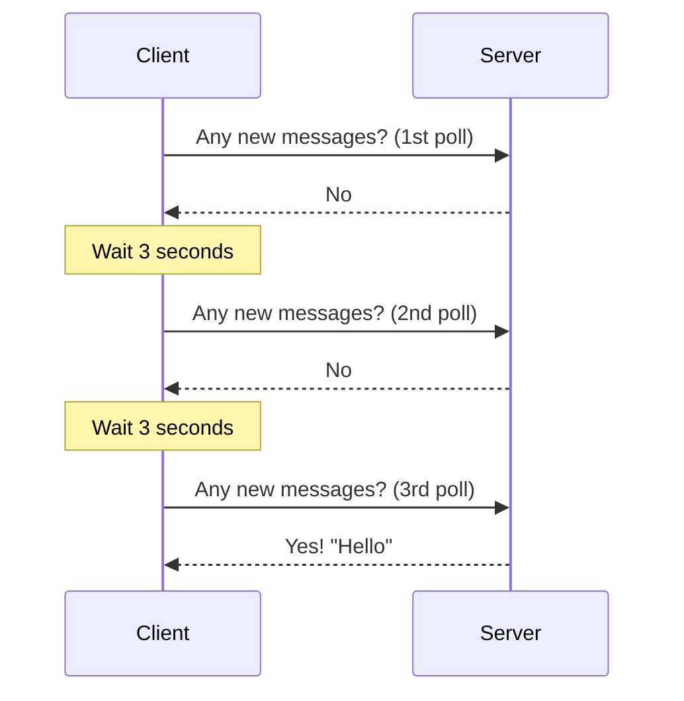
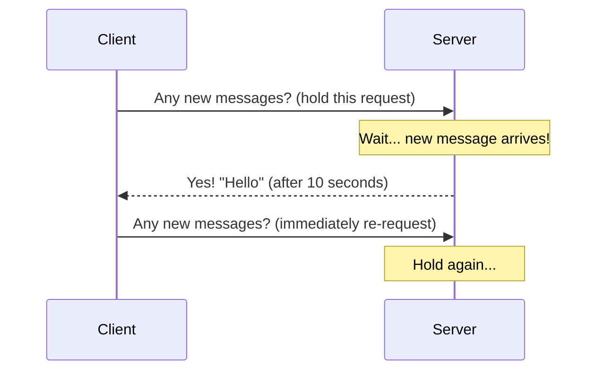
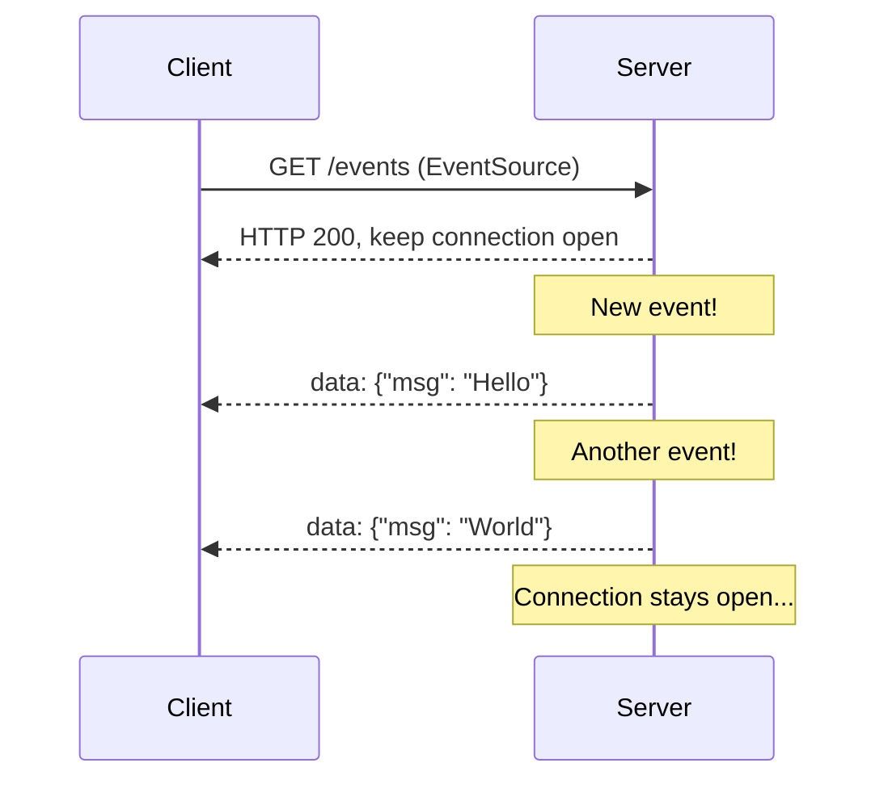
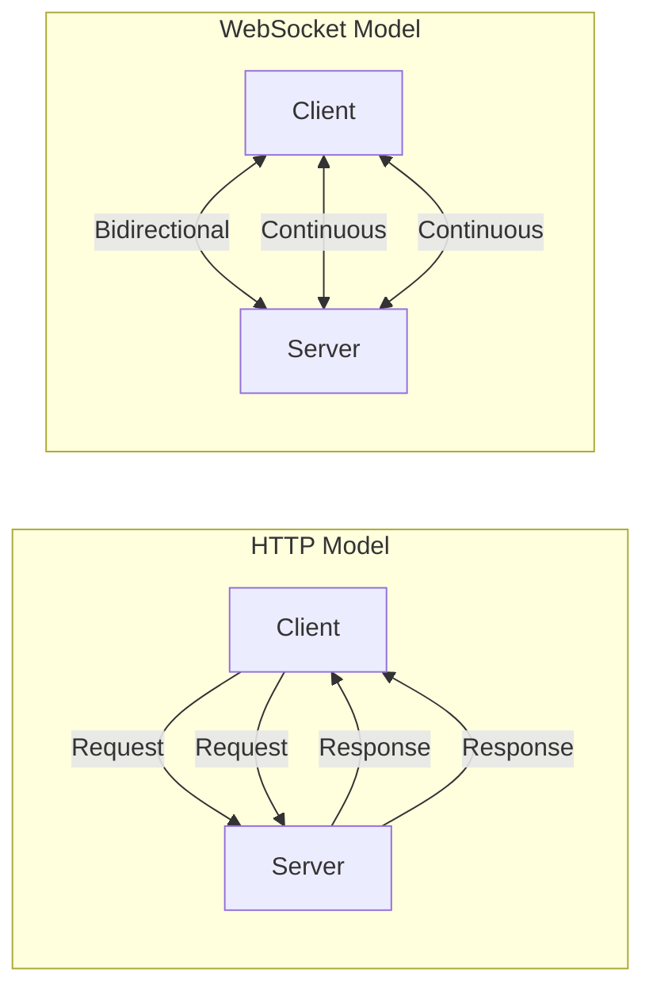
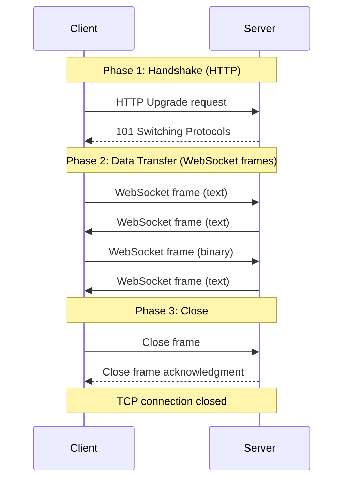
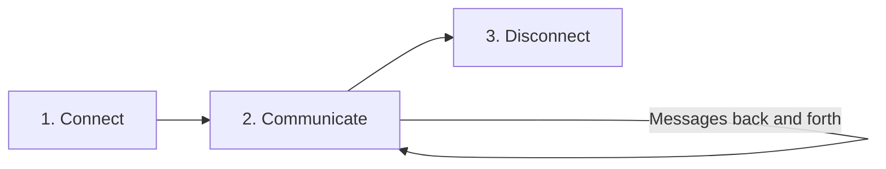
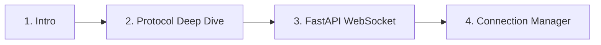

## WebSocket কী ও কেন দরকার

তুমি হয়তো Facebook এ মেসেজ পাঠাও, আর সাথে সাথেই ওই পাশে আরেকজন মেসেজ পাঠালে — তোমার screen এ সেটা instantly চলে আসে। কিংবা stock market এ দাম প্রতি সেকেন্ডে বাড়ে কমে, আর সেটা ব্রাউজারে real-time এ দেখা যায়। এই সব "live" behavior কীভাবে কাজ করে? সাধারণ HTTP দিয়ে কি এটা সম্ভব?

এই chapter এ আমরা দেখবো — HTTP দিয়ে real-time communication এর সমস্যা কী, WebSocket কীভাবে সেটা সমাধান করে, আর কখন তোমার WebSocket দরকার আর কখন দরকার নেই।

## HTTP দিয়ে Real-Time এর সমস্যা

HTTP মূলত **request-response** model এ কাজ করে। মানে — client request পাঠায়, server response দেয়, আর সংযোগ বন্ধ হয়ে যায়। এই model সাধারণ webpage, API, file download এর জন্য দারুণ। কিন্তু real-time এর জন্য? একদমই উপযুক্ত না।

চলো দেখি কেন।

### Polling — বারবার request পাঠানো

ধরো তোমার একটা chat app আছে। User কখন মেসেজ পাঠাবে তোমার server জানে না। তাই client কয়েক সেকেন্ড পর পর server কে জিজ্ঞেস করে — "কোনো নতুন মেসেজ আছে?"। যদি না থাকে, server "না" বলে। কিছুক্ষণ পর আবার একই প্রশ্ন। একেই **polling** বলে।



Polling এর সমস্যা স্পষ্ট:

- **অপ্রয়োজনীয় request** — বেশিরভাগ request এ "no new message" response আসে, অর্থাৎ bandwidth আর server resource নষ্ট
- **Latency** — যদি polling interval ৩ সেকেন্ড হয়, একটা মেসেজ আসার পর সেটা দেখতে পেতে সর্বোচ্চ ৩ সেকেন্ড লাগতে পারে
- **Server load** — হাজার হাজার user যদি প্রতি ৩ সেকেন্ডে request পাঠায়, server এর উপর চাপ প্রচুর

### Long Polling — একটু উন্নত পদ্ধতি

Polling এর সমস্যা কিছুটা কমানোর জন্য আসল **long polling**। এখানে client request পাঠায়, কিন্তু server response সাথে সাথে দেয় না। একটু অপেক্ষা করে — যতক্ষণ না কোনো নতুন data আছে বা timeout হয়।



Long polling এ যেহেতু server নতুন data পাওয়া পর্যন্ত request ধরে রাখে, latency কমে। কিন্তু সমস্যা থেকে যায়:

- প্রতিটা message এর জন্য আলাদা HTTP connection তৈরি করতে হয় — overhead বেশি
- HTTP header বারবার পাঠাতে হয়
- Server এ সব connection ধরে রাখতে হয় — resource intensive

### SSE (Server-Sent Events) — একমুখী real-time

SSE হলো একটা বিশেষ mechanism যেখানে server থেকে client এ data push করা যায়। এটা HTTP এর উপরেই কাজ করে, কিন্তু connection টা খোলা থাকে।



SSE তে শুধু server থেকে client এ data যেতে পারে। Client থেকে server এ কোনো data পাঠাতে হলে আলাদা HTTP request করতে হবে। SSE simple, কিন্তু এটা **unidirectional** — একমুখী।

> [!tip] SSE ও একটা ভালো অপশন
> যদি তোমার শুধু server থেকে client এ data পাঠাতে হয় (যেমন live notification, news feed), SSE (Server-Sent Events) ও একটা অপশন। WebSocket এর চেয়ে simple, আর HTTP এর উপরেই চলে। কিন্তু যদি দুই দিকেই data যেতে আসতে হয়, WebSocket ই best।

### HTTP real-time এর সীমাবদ্ধতা

HTTP এই তিনটি method ই real-time এর জন্য এক বা অন্য কারণে কম পড়ে:

| Method | Direction | Latency | Overhead | Complexity |
|--------|-----------|---------|----------|------------|
| Polling | Client → Server (only) | High (interval dependent) | High (repeated requests) | Low |
| Long Polling | Client → Server (only) | Medium | Medium (headers repeated) | Medium |
| SSE | Server → Client (only) | Low | Low | Low |
| WebSocket | **Both directions** | **Very Low** | **Very Low** (one connection) | Medium |

## WebSocket: Full-Duplex, Persistent Connection

এখন আসল সমাধান — **WebSocket**। WebSocket হলো একটা communication protocol যেটা একটা **single TCP connection** এর উপর চলে, আর সেই connection টা persistent — মানে খোলা থাকে যতক্ষণ না client বা server তা বন্ধ করে।

WebSocket এর সবচেয়ে বড় সুবিধা — এটা **full-duplex**। মানে একই সময়ে client থেকে server এ data যেতে পারে, আর server থেকে client এ data আসতে পারে। কোনো request-response cycle নেই। যে পাঠাতে চায়, পাঠায়।



উপরের diagram এ পার্থক্য স্পষ্ট। HTTP তে প্রতিটা data exchange এর জন্য নতুন request-response cycle দরকার। WebSocket এ একবার connection স্থাপিত হলে, দুই দিকেই data একটানা flow করতে পারে।

### WebSocket কীভাবে কাজ করে

WebSocket এর কাজ দুটো phase এ হয়:

1. **Handshake** — প্রথমে একটা HTTP request পাঠানো হয়, যেটাতে `Upgrade: websocket` header থাকে। Server agree করলে connection টা HTTP থেকে WebSocket এ পরিবর্তিত হয়।
2. **Data Transfer** — এরপর একই TCP connection এর উপর দুই দিকে data আদান-প্রদান হয়, WebSocket frame format এ।



### HTTP vs WebSocket — মূল পার্থক্য

চলো এবার দুটোর মধ্যে একটা detail comparison দেখি:

| বিষয় | HTTP | WebSocket |
|-------|------|-----------|
| Communication | Request-response | Full-duplex, bidirectional |
| Connection | Short-lived (per request) | Persistent (long-lived) |
| Direction | One-way (client initiates) | Both ways (either can initiate) |
| Protocol | HTTP/1.1 or HTTP/2 | WebSocket over TCP |
| Overhead per message | High (headers each time) | Low (2-10 byte frame header) |
| Use case | CRUD, page load, API | Real-time, chat, live updates |
| URL scheme | `http://` / `https://` | `ws://` / `wss://` |
| Port | 80 / 443 | 80 / 443 (same) |

> [!note] WebSocket আর HTTP একই port ব্যবহার করে
> WebSocket আসলে HTTP থেকেই upgrade হয়, তাই এটা port 80 (ws://) বা port 443 (wss://) ব্যবহার করে। অর্থাৎ firewall বা proxy এর কারণে কোনো সমস্যা হয় না — WebSocket traffic ও HTTP এর মতোই যায়।

## WebSocket এর Use Cases

WebSocket তো ভালো, কিন্তু কোথায় কোথায় ব্যবহার করবে? চলো কিছু real-world use case দেখি:

### ১. Chat Applications

WhatsApp, Facebook Messenger, Slack, Discord — সবাই WebSocket ব্যবহার করে। কারণ chat এ দরকার — এক দিকে মেসেজ যাওয়া, আরেক দিকে typing indicator, presence (online/offline), message delivery status — সব কিছু real-time এ।

### ২. Live Notifications

Facebook notification, GitHub activity feed, email arrival alert — এসবের জন্য server থেকে client কে instantly push করতে হয়। WebSocket এই কাজটা দারুণ করে।

### ৩. Collaborative Editing

Google Docs, Figma, Notion — এখানে একই document এ কয়েকজন একসাথে কাজ করে। একজন কিছু type করলে বাকিরা instantly দেখতে পায়। এই ধরনের real-time collaboration এর জন্য WebSocket প্রায় mandatory।

### ৪. Multiplayer Gaming

Real-time multiplayer game যেমন chess, বা browser-based action game গুলোতে — প্রতিটা player এর move instantly অন্যদের কাছে পৌঁছাতে হয়। WebSocket এই low-latency communication এর জন্য আদর্শ।

### ৫. Live Dashboards

Server monitoring dashboard, IoT sensor data display, analytics dashboard — এসবে প্রতি সেকেন্ডে data update হয়। WebSocket দিয়ে server থেকে dashboard এ data একটানা push করা যায়।

### ৬. Stock Tickers / Crypto Prices

Stock market বা crypto exchange এ দাম প্রতি সেকেন্ডে বদলায়। Binance, Coinbase, Robinhood — সবাই WebSocket দিয়ে real-time price update দেয়।

```python
# Example: a simple WebSocket use case — live stock price
# This is what a stock ticker WebSocket might look like (conceptual)

# Server pushes prices every second
# Client receives them instantly, no polling needed
#
# WebSocket message format:
# {"symbol": "AAPL", "price": 178.32, "change": +1.2}
# {"symbol": "GOOGL", "price": 142.56, "change": -0.5}
```

এই example এ দেখা গেল — stock price data server থেকে ক্রমাগত push হচ্ছে। Client কে বারবার request পাঠাতে হচ্ছে না। এটাই WebSocket এর শক্তি।

## WebSocket Lifecycle

প্রতিটা WebSocket connection এর একটা lifecycle থাকে — তিনটি stage এ:



### Stage 1: Connect (Handshake)

Client প্রথমে একটা HTTP request পাঠায় `Upgrade: websocket` header সহ। Server এই request টা accept করে `101 Switching Protocols` response দেয়। এরপর থেকে connection টা WebSocket হয়ে যায়।

### Stage 2: Communicate (Data Transfer)

Connection স্থাপিত হওয়ার পর দুই দিকেই data পাঠানো যায়। প্রতিটা message একটা WebSocket frame হিসেবে যায়। এই stage টাই সবচেয়ে দীর্ঘ — যতক্ষণ connection টা জীবিত থাকে।

### Stage 3: Disconnect (Close)

যেকোনো একপক্ষ চাইলে connection বন্ধ করতে পারে। এর জন্য একটা close frame পাঠানো হয়, আর অন্যপক্ষ acknowledge করে। তারপর TCP connection টা cleanly close হয়।

> [!important] Abnormal disconnection
> সব সময় connection টা cleanly close হবে এমন কোনো গ্যারান্টি নেই। যদি network এ সমস্যা হয় বা server crash করে, connection টা হঠাৎ বন্ধ হয়ে যেতে পারে — কোনো close frame ছাড়াই। একে **abnormal closure** বলে, আর এর code হলো 1006। সেই জন্য client আর server উভয়েরই reconnection logic থাকা দরকার।

## Browser Support ও JavaScript WebSocket API

ভালো খবর হলো — WebSocket সব modern browser এ built-in ভাবে supported। Internet Explorer এর পুরোনো version ছাড়া সব জায়গায় চলে। আলাদা কোনো library install করার দরকার নেই।

JavaScript এ `WebSocket` নামের একটা built-in class আছে, যেটা দিয়ে সহজে WebSocket connection তৈরি করা যায়।

নিচের কোডটা দেখো — এটা একটা basic WebSocket client, যেটা server এর সাথে connect হয়, message পাঠায়, message receive করে, আর disconnect হয়:

```javascript
// Basic WebSocket client in JavaScript
const socket = new WebSocket("ws://localhost:8000/ws");

// Connection opened
socket.addEventListener("open", (event) => {
    console.log("Connected to server!");
    socket.send("Hello Server!");
});

// Message received
socket.addEventListener("message", (event) => {
    console.log("Message from server:", event.data);
});

// Connection closed
socket.addEventListener("close", (event) => {
    console.log("Connection closed. Code:", event.code, "Reason:", event.reason);
});

// Error occurred
socket.addEventListener("error", (event) => {
    console.error("WebSocket error:", event);
});

// Sending a message
function sendMessage(text) {
    if (socket.readyState === WebSocket.OPEN) {
        socket.send(text);
    } else {
        console.log("Socket is not open. readyState:", socket.readyState);
    }
}
```

এই কোডে চারটা event listener যোগ করা হয়েছে — `open` (connection স্থাপিত), `message` (data এসেছে), `close` (connection বন্ধ), `error` (কোনো সমস্যা)। `socket.send()` দিয়ে server কে message পাঠানো হয়। `readyState` check করা গুরুত্বপূর্ণ — কারণ connection খোলা না থাকলে `send()` error দেবে।

JavaScript এর WebSocket API খুবই simple — মাত্র কয়েক লাইনে একটা real-time client তৈরি করা যায়। কোনো third-party library লাগে না।

## কখন WebSocket ব্যবহার করবে না

WebSocket যে সব জায়গায় দরকার, সেটা তো বুঝলে। কিন্তু কখন এটা ব্যবহার করা উচিত নয়? চলো সেটাও দেখি:

### ১. Simple CRUD API

যদি তোমার API শুধু data create, read, update, delete করে — WebSocket দরকার নেই। REST API ই যথেষ্ট। যেমন একটা blog এর post list, user profile update, file upload — এসবের জন্য HTTP request-response ই best।

### ২. Request-Response Pattern

যদি তোমার pattern সবসময় এমন হয় — client একটা request পাঠাবে, server একটা response দেবে — তাহলে HTTP ই সঠিক। WebSocket এর full-duplex capability এখানে কোনো কাজে লাগবে না।

### ৩. Occasional Updates

যদি server থেকে data update খুব কম আসে (যেমন প্রতি ঘণ্টায় একবার), তাহলে simple polling ই যথেষ্ট। WebSocket connection টা open রাখার চেয়ে মাঝে মাঝে request পাঠানো বেশি efficient।

### ৪. Firewall/Proxy Restrictions

কিছু corporate firewall বা proxy WebSocket কে block করে দেয়। সেসব ক্ষেত্রে HTTP-based fallback (polling বা SSE) রাখতে হতে পারে।

> [!warn] WebSocket সব জায়গায় মানেই ভালো নয়
> WebSocket একটা tool, সব সমস্যার সমাধান নয়। যদি তোমার application এ real-time bidirectional communication দরকার হয় — তবেই WebSocket ব্যবহার করো। অন্যথায় HTTP বা SSE দিয়েই কাজ চালিয়ে যাও। Over-engineering করা বোকামি।

## Comparison Table: Polling vs Long Polling vs SSE vs WebSocket

এবার একটা summary table দেখি — চারটা real-time approach এর মধ্যে পার্থক্য:

| বিষয় | HTTP Polling | Long Polling | SSE | WebSocket |
|-------|-------------|-------------|-----|-----------|
| Direction | Client → Server | Client → Server | Server → Client | Both (full-duplex) |
| Connection | New per request | Held open, re-requested | Persistent (HTTP) | Persistent (upgraded) |
| Protocol | HTTP | HTTP | HTTP | WebSocket |
| Latency | High (interval) | Medium | Low | Very Low |
| Overhead | High | Medium | Low | Very Low |
| Binary support | No | No | No (text only) | Yes |
| Auto-reconnect | No (manual) | No (manual) | Yes (built-in) | No (manual) |
| Browser API | fetch/XHR | fetch/XHR | EventSource | WebSocket |
| Best for | Simple, infrequent | Legacy real-time | Server push only | Bidirectional real-time |
| Complexity | Low | Medium | Low | Medium |

এই table টা দেখে তুমি বুঝতে পারবে — কোন পরিস্থিতিতে কোন approach সবচেয়ে ভালো। যদি দুই দিকে data exchange দরকার হয়, WebSocket ই একমাত্র সঠিক পছন্দ।

## এই Series এ তুমি যা শিখবে

এই WebSocket documentation series এ আমরা step by step শিখবো:

1. **Intro** (এই chapter) — WebSocket কী, কেন দরকার, HTTP থেকে পার্থক্য
2. **Protocol Deep Dive** — WebSocket protocol এর frame format, handshake, opcode, close code
3. **FastAPI WebSocket** — FastAPI তে WebSocket endpoint তৈরি করা, message handling
4. **Connection Manager** — Multiple client manage করা, broadcasting, chat rooms, presence



প্রতিটা chapter এ real-world example থাকবে, code থাকবে, আর ব্যাখ্যা থাকবে — যাতে তুমি শুধু পড়ে না, বুঝে শিখো।

## Summary

এই chapter এ আমরা শিখলাম:

- **HTTP** real-time এর জন্য উপযুক্ত না — polling, long polling, SSE সবার কিছু না কিছু limitation আছে
- **WebSocket** হলো full-duplex, persistent connection — single TCP এর উপর চলে
- HTTP হলো **request-response**, WebSocket হলো **bidirectional** — দুই দিকেই data যেতে আসতে পারে
- Use case: chat, live notification, collaborative editing, gaming, dashboard, stock ticker
- WebSocket lifecycle: **connect → communicate → disconnect**
- সব modern browser এ `WebSocket` API built-in আছে
- WebSocket সব জায়গায় দরকার নয় — simple CRUD এর জন্য HTTP ই best

পরের chapter এ আমরা WebSocket protocol এর ভেতরে ঢুকবো — frame format, opcode, handshake, close code সব দেখবো। চলো শুরু করি!