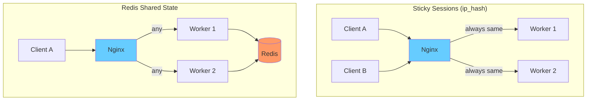
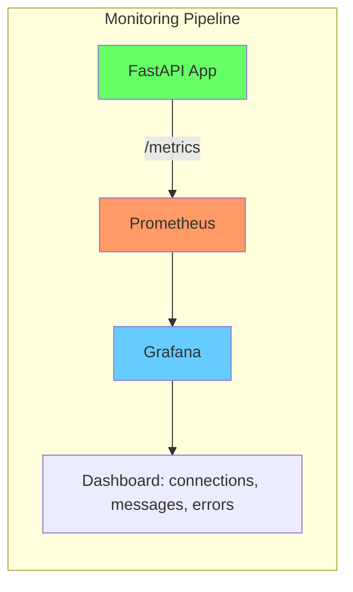
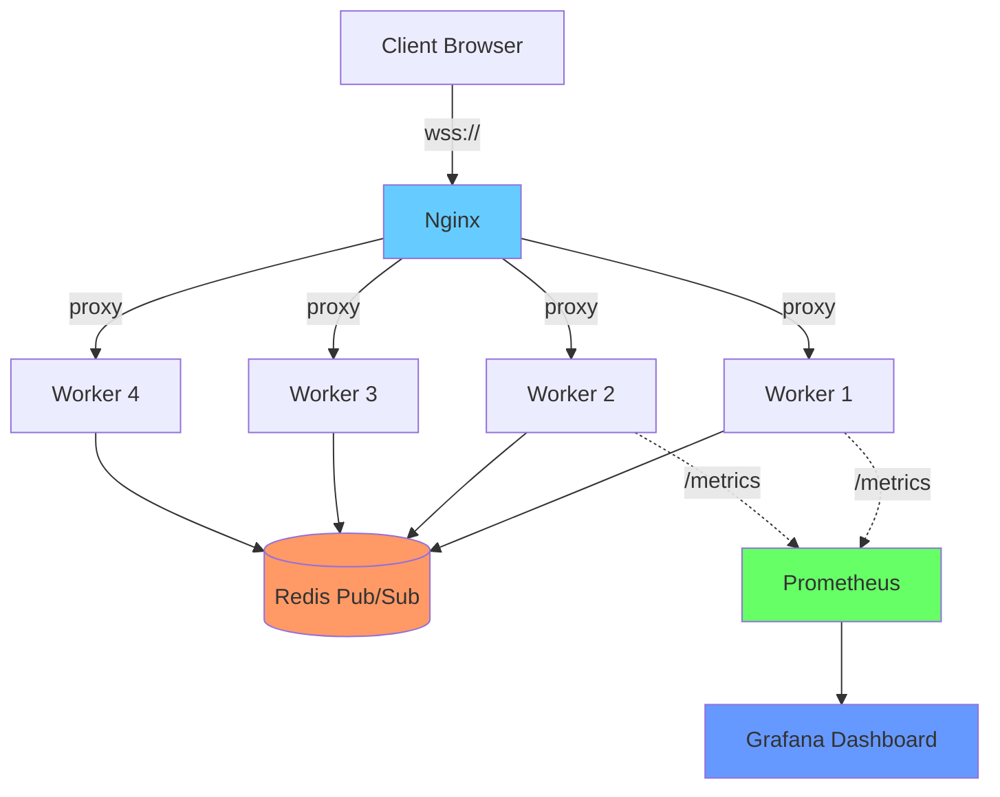

## Production Deployment

এতক্ষণ পর্যন্ত আমরা development এ WebSocket চালালাম — `uvicorn main:app --reload` দিয়ে, localhost এ। কিন্তু production এ এটা এত সহজ না। সেখানে Nginx লাগবে reverse proxy হিসেবে, Docker লাগবে containerization এর জন্য, আর অনেকগুলো বিষয় খেয়াল রাখতে হবে — timeout, reconnection, monitoring, security, graceful shutdown।

এই chapter এ আমরা একটা complete production setup দেখবো — Nginx config, Docker Compose, client-side reconnection, monitoring, সব মিলিয়ে।

## Nginx Reverse Proxy for WebSocket

Production এ সাধারণত WebSocket server সরাসরি internet এ expose করা হয় না। সামনে একটা reverse proxy থাকে — সাধারণত Nginx। Nginx SSL termination, load balancing, rate limiting — এই সব handle করে।

কিন্তু Nginx কে বলতে হবে যে এটা WebSocket connection, সাধারণ HTTP না। এর জন্য দুটো header সেট করতে হয়:

```nginx
# Nginx WebSocket proxy configuration
server {
    listen 80;
    server_name myapp.com;

    location /ws {
        # Proxy to FastAPI WebSocket server
        proxy_pass http://backend:8000;
        
        # Required headers for WebSocket
        proxy_set_header Upgrade $http_upgrade;
        proxy_set_header Connection "upgrade";
        
        # Pass client info to backend
        proxy_set_header Host $host;
        proxy_set_header X-Real-IP $remote_addr;
        proxy_set_header X-Forwarded-For $proxy_add_x_forwarded_for;
        proxy_set_header X-Forwarded-Proto $scheme;
    }
}
```

এই config এ দুটো line খুব important — `proxy_set_header Upgrade $http_upgrade` আর `proxy_set_header Connection "upgrade"`। এই দুটো header ছাড়া Nginx WebSocket upgrade request কে সাধারণ HTTP মনে করে আর connection upgrade করে না। `Upgrade` header এ `websocket` value আসে, আর `Connection` header এ `upgrade` — এই দুটো মিলে Nginx বোঝে যে এটা WebSocket।

> [!tip] WebSocket-এ `proxy_read_timeout` default 60s, production-এ 86400 (24h) set করুন যাতে Nginx idle connection cut না করে
> Nginx এর `proxy_read_timeout` default ৬০ সেকেন্ড। WebSocket connection idle থাকলে (কেউ কিছু না পাঠালে), Nginx ৬০ সেকেন্ড পর connection cut করে দেয়। এটা production এ বড় সমস্যা — একটা chat connection idle হতেই পারে। তাই `proxy_read_timeout 86400` (২৪ ঘন্টা) set করো, যাতে idle connection বেঁচে থাকে।

পূর্ণ Nginx config, timeout আর buffer সহ:

```nginx
# Full Nginx config with WebSocket optimizations
worker_processes auto;

events {
    worker_connections 10240;
}

http {
    # Upstream definition — multiple workers
    upstream websocket_backend {
        # ip_hash for sticky sessions (optional, see below)
        ip_hash;
        server backend:8000;
        # If multiple backend instances:
        # server backend2:8000;
        # server backend3:8000;
    }
    
    server {
        listen 80;
        server_name myapp.com;
        
        # Redirect HTTP to HTTPS
        return 301 https://$host$request_uri;
    }
    
    server {
        listen 443 ssl http2;
        server_name myapp.com;
        
        # SSL certificates
        ssl_certificate /etc/nginx/ssl/cert.pem;
        ssl_certificate_key /etc/nginx/ssl/key.pem;
        
        # WebSocket endpoint
        location /ws {
            proxy_pass http://websocket_backend;
            
            # WebSocket upgrade headers
            proxy_set_header Upgrade $http_upgrade;
            proxy_set_header Connection "upgrade";
            
            # Pass client information
            proxy_set_header Host $host;
            proxy_set_header X-Real-IP $remote_addr;
            proxy_set_header X-Forwarded-For $proxy_add_x_forwarded_for;
            proxy_set_header X-Forwarded-Proto $scheme;
            
            # Timeout settings — keep connections alive
            proxy_read_timeout 86400s;  # 24 hours
            proxy_send_timeout 86400s;  # 24 hours
            
            # Buffer settings
            proxy_buffering off;  # Disable buffering for real-time
            proxy_buffer_size 4k;
            client_max_body_size 1m;
        }
        
        # Regular HTTP API
        location /api {
            proxy_pass http://websocket_backend;
            proxy_set_header Host $host;
            proxy_set_header X-Real-IP $remote_addr;
        }
        
        # Static files
        location / {
            root /usr/share/nginx/html;
            try_files $uri $uri/ /index.html;
        }
    }
}
```

এই config এ বেশ কিছু optimization আছে। `proxy_read_timeout` আর `proxy_send_timeout` ২৪ ঘন্টা করে দেওয়া হয়েছে, যাতে idle connection cut না হয়। `proxy_buffering off` করা হয়েছে, কারণ real-time data এ আমরা চাই না Nginx message buffer করে রাখুক — যত দ্রুত সম্ভব forward করুক। `ip_hash` দিয়ে sticky session enable করা হয়েছে।

## Sticky Sessions vs Load Balancing

WebSocket এ একটা জটিলতা আছে। HTTP request যেকোনো backend এ যেতে পারে — stateless। কিন্তু WebSocket connection একবার একটা backend এ connect হলে, সেটা সেই backend এই থাকতে হবে। কারণ connection state সেই backend এ আছে।

দুটো approach আছে:



**Sticky session** — Nginx একই client কে সবসময় একই backend এ পাঠায় (IP address ভিত্তিক)। সহজ, কিন্তু একটা backend down হলে তার সব connection lost।

**Redis shared state** — যেকোনো backend এ connection যেতে পারে, সব backend Redis এর মাধ্যমে state share করে। একটা backend down হলেও user অন্য backend এ reconnect করতে পারে। বেশি robust, কিন্তু বেশি জটিল।

## Docker Compose: FastAPI + Redis + Nginx

এবার পুরো production stack টা Docker Compose এ সাজাই:

```yaml
# docker-compose.yml — production WebSocket stack
version: "3.9"

services:
  # FastAPI WebSocket backend
  backend:
    build: ./backend
    expose:
      - "8000"
    environment:
      - REDIS_URL=redis://redis:6379
      - WORKER_COUNT=4
    depends_on:
      - redis
    restart: unless-stopped
    healthcheck:
      test: ["CMD", "curl", "-f", "http://localhost:8000/health"]
      interval: 30s
      timeout: 5s
      retries: 3
  
  # Redis for pub/sub and presence
  redis:
    image: redis:7-alpine
    expose:
      - "6379"
    volumes:
      - redis-data:/data
    command: redis-server --maxmemory 256mb --maxmemory-policy allkeys-lru
    restart: unless-stopped
  
  # Nginx reverse proxy
  nginx:
    image: nginx:alpine
    ports:
      - "80:80"
      - "443:443"
    volumes:
      - ./nginx/nginx.conf:/etc/nginx/nginx.conf:ro
      - ./nginx/ssl:/etc/nginx/ssl:ro
      - ./frontend/dist:/usr/share/nginx/html:ro
    depends_on:
      - backend
    restart: unless-stopped

volumes:
  redis-data:
```

এই compose file এ তিনটা service আছে। `backend` হলো FastAPI app, ৪টা worker সহ। `redis` হলো Redis server, pub/sub আর presence এর জন্য। `nginx` হলো reverse proxy, যেটা SSL termination আর load balancing করে। প্রতিটা service এ `restart: unless-stopped` দেওয়া হয়েছে, যাতে crash করলে automatic restart হয়।

backend এর Dockerfile:

```dockerfile
# backend/Dockerfile
FROM python:3.12-slim

WORKDIR /app

# Install dependencies
COPY requirements.txt .
RUN pip install --no-cache-dir -r requirements.txt

# Copy application code
COPY . .

# Expose port
EXPOSE 8000

# Run with multiple workers
CMD ["uvicorn", "main:app", "--host", "0.0.0.0", "--port", "8000", "--workers", "4"]
```

এই Dockerfile টা simple — Python 3.12 slim image, requirements install, code copy, আর uvicorn দিয়ে ৪টা worker এ চালানো। `--workers 4` দিয়ে ৪টা process চলবে, যারা Redis এর মাধ্যমে communicate করবে।

## Heartbeat Implementation

WebSocket connection একটা সমস্যা আছে — মাঝে মাঝে connection "silent" ভাবে dead হয়ে যায়। TCP connection টা আছে, কিন্তু আসলে data যাচ্ছে না। একে "half-open connection" বলে। এড়াতে হলে heartbeat দরকার — server নিয়মিত ping পাঠাবে, client এ pong দিয়ে উত্তর দেবে।

```python
# Server-side heartbeat with ping/pong
import asyncio
from fastapi import FastAPI, WebSocket

app = FastAPI()
HEARTBEAT_INTERVAL = 30  # seconds
HEARTBEAT_TIMEOUT = 10   # seconds to wait for pong

@app.websocket("/ws")
async def websocket_endpoint(websocket: WebSocket):
    await websocket.accept()
    
    # Track last pong time
    last_pong = asyncio.get_event_loop().time()
    
    async def heartbeat():
        """Send ping every 30 seconds."""
        nonlocal last_pong
        while True:
            await asyncio.sleep(HEARTBEAT_INTERVAL)
            try:
                await websocket.send_json({"type": "ping", "timestamp": last_pong})
                # Wait for pong
                current = asyncio.get_event_loop().time()
                if current - last_pong > HEARTBEAT_INTERVAL + HEARTBEAT_TIMEOUT:
                    # No pong received — close connection
                    await websocket.close(code=4408, reason="Heartbeat timeout")
                    return
            except Exception:
                return
    
    # Start heartbeat task
    hb_task = asyncio.create_task(heartbeat())
    
    try:
        while True:
            data = await websocket.receive_json()
            if data.get("type") == "pong":
                # Client responded — update last pong time
                last_pong = asyncio.get_event_loop().time()
            else:
                # Normal message — echo back
                await websocket.send_json({"echo": data})
    except Exception:
        pass
    finally:
        hb_task.cancel()
```

এখানে server প্রতি ৩০ সেকেন্ডে `ping` message পাঠায়। Client কে সেই ping এর উত্তরে `pong` পাঠাতে হবে। যদি ৪০ সেকেন্ড (৩০ + ১০) পর্যন্ত কোনো pong না আসে, server connection বন্ধ করে দেয়। এভাবে half-open connection detect করা যায়।

client পাশের pong response:

```javascript
// Client-side heartbeat response
ws.onmessage = (event) => {
    const data = JSON.parse(event.data);
    
    if (data.type === "ping") {
        // Respond to ping immediately
        ws.send(JSON.stringify({ type: "pong" }));
        return;
    }
    
    // Handle normal messages
    console.log("Received:", data);
};
```

client শুধু ping এর উত্তরে pong পাঠায়। এটাই heartbeat protocol।

## Client-Side Reconnection

Network কখনো reliable না। Connection পড়ে যাবে — server restart, network glitch, Nginx reload। এই সব ক্ষেত্রে client কে automatically reconnect করতে হবে। কিন্তু সাথে সাথে reconnect করলে server আবার overload হতে পারে। তাই **exponential backoff** ব্যবহার করতে হয়।

```javascript
// Client-side reconnection with exponential backoff
class ReconnectingWebSocket {
    constructor(url, options = {}) {
        this.url = url;
        this.maxRetries = options.maxRetries || Infinity;
        this.maxDelay = options.maxDelay || 30000;  // 30 seconds max
        this.initialDelay = options.initialDelay || 1000;  // 1 second start
        
        this.ws = null;
        this.retryCount = 0;
        this.reconnectTimer = null;
        this.messageQueue = [];  // Buffer messages during disconnection
        this.state = "disconnected";  // connecting, connected, disconnecting, disconnected
        
        // Event callbacks
        this.onopen = null;
        this.onmessage = null;
        this.onclose = null;
        this.onerror = null;
        this.onstatechange = null;
        
        this.connect();
    }
    
    connect() {
        this.setState("connecting");
        this.ws = new WebSocket(this.url);
        
        this.ws.onopen = () => {
            this.setState("connected");
            this.retryCount = 0;  // Reset retry counter
            
            // Send any queued messages
            while (this.messageQueue.length > 0) {
                const msg = this.messageQueue.shift();
                this.ws.send(msg);
            }
            
            if (this.onopen) this.onopen();
        };
        
        this.ws.onmessage = (event) => {
            if (this.onmessage) this.onmessage(event);
        };
        
        this.ws.onclose = (event) => {
            this.setState("disconnected");
            
            if (this.onclose) this.onclose(event);
            
            // Attempt reconnection unless intentional close
            if (this.state !== "disconnecting" && this.retryCount < this.maxRetries) {
                this.scheduleReconnect();
            }
        };
        
        this.ws.onerror = (error) => {
            if (this.onerror) this.onerror(error);
        };
    }
    
    scheduleReconnect() {
        this.retryCount++;
        // Exponential backoff: delay = min(initial * 2^retries, max)
        const delay = Math.min(
            this.initialDelay * Math.pow(2, this.retryCount - 1),
            this.maxDelay
        );
        
        // Add jitter (random offset) to avoid thundering herd
        const jitter = Math.random() * 1000;
        const totalDelay = delay + jitter;
        
        console.log(`Reconnecting in ${totalDelay.toFixed(0)}ms (attempt ${this.retryCount})`);
        
        this.reconnectTimer = setTimeout(() => {
            this.connect();
        }, totalDelay);
    }
    
    send(message) {
        if (this.state === "connected" && this.ws.readyState === WebSocket.OPEN) {
            this.ws.send(message);
        } else {
            // Queue message for when connection is restored
            this.messageQueue.push(message);
            console.log("Message queued — connection not ready");
        }
    }
    
    close() {
        this.setState("disconnecting");
        clearTimeout(this.reconnectTimer);
        if (this.ws) {
            this.ws.close();
        }
    }
    
    setState(newState) {
        this.state = newState;
        if (this.onstatechange) this.onstatechange(newState);
    }
}

// Usage
const ws = new ReconnectingWebSocket("ws://localhost:8000/ws", {
    maxRetries: 10,
    maxDelay: 30000,
});

ws.onstatechange = (state) => {
    console.log(`Connection state: ${state}`);
    // Update UI based on state
    // "connecting" → show "Reconnecting..."
    // "connected" → show "Online"
    // "disconnected" → show "Offline"
};

ws.onmessage = (event) => {
    const data = JSON.parse(event.data);
    console.log("Message:", data);
};
```

এই class টা একটু বিস্তারিত, তাই ধাপে ধাপে দেখি। `connect()` method একটা নতুন WebSocket তৈরি করে আর state "connecting" এ যায়। যখন connection সফল হয়, state "connected" হয় আর queued message গুলো পাঠানো হয়। যখন connection পড়ে যায়, `scheduleReconnect()` call হয়, যেটা exponential backoff দিয়ে পরের attempt schedule করে।

backoff formula টা খেয়াল করো — `delay = min(1000 * 2^attempts, 30000)`। প্রথম attempt এ ১ সেকেন্ড, দ্বিতীয়তে ২ সেকেন্ড, তৃতীয়তে ৪ সেকেন্ড, এভাবে দ্বিগুণ হতে থাকে, সর্বোচ্চ ৩০ সেকেন্ড। সাথে একটু random jitter যোগ করা হয়, যাতে সব client একসাথে reconnect করার "thundering herd" সমস্যা না হয়।

> [!note] Connection state management
> এই class এ চারটা state আছে: `connecting`, `connected`, `disconnecting`, `disconnected`। এই state গুলো UI তে দেখানো যায় — "Connecting...", "Online", "Disconnecting...", "Offline"। এটা user experience এর জন্য গুরুত্বপূর্ণ — user জানে কী হচ্ছে।

## Message Queue During Disconnection

উপরের class এ একটা জিনিস আছে — `messageQueue`। যখন connection নেই, তখনও user message পাঠাতে চাইতে পারে। সেগুলো queue তে রাখা হয়, আর connection ফিরে এলে পাঠানো হয়। এটা important — নাহলে disconnect এর সময় পাঠানো message হারিয়ে যায়।

```javascript
// Example: message buffering during disconnection
const sendButton = document.getElementById("send");
const input = document.getElementById("message-input");

sendButton.addEventListener("click", () => {
    const text = input.value;
    const message = JSON.stringify({ type: "message", text: text });
    
    ws.send(message);  // Automatically queues if disconnected
    input.value = "";
    
    // Show feedback
    if (ws.state !== "connected") {
        showToast("Message will be sent when connection restores");
    }
});
```

এখানে user message টাইপ করে send চাপলে — connection থাকুক বা না থাকুক, message queue তে যায়। Connection না থাকলে একটা toast notification দেখায় যে message পাঠানো হবে যখন connection ফিরে আসবে।

## Monitoring WebSocket Connections

Production এ জানা দরকার — কতগুলো active connection আছে, কত message পাঠানো হচ্ছে, কোনো error হচ্ছে কি না। এর জন্য Prometheus metrics use করা হয়।

```python
# Prometheus metrics for WebSocket monitoring
from prometheus_client import Counter, Gauge, make_asgi_app
from fastapi import FastAPI

app = FastAPI()

# Metrics definitions
active_connections = Gauge(
    "websocket_active_connections",
    "Number of active WebSocket connections"
)

messages_sent = Counter(
    "websocket_messages_sent_total",
    "Total messages sent to clients",
    ["type"]  # broadcast, direct, etc.
)

messages_received = Counter(
    "websocket_messages_received_total",
    "Total messages received from clients",
    ["type"]
)

connection_errors = Counter(
    "websocket_connection_errors_total",
    "Total WebSocket connection errors",
    ["error_type"]
)

# Mount Prometheus metrics endpoint
app.mount("/metrics", make_asgi_app())

# Usage in ConnectionManager
class MonitoredConnectionManager:
    def __init__(self):
        self.active_connections: list[WebSocket] = []
    
    async def connect(self, websocket: WebSocket):
        await websocket.accept()
        self.active_connections.append(websocket)
        # Update gauge
        active_connections.set(len(self.active_connections))
    
    def disconnect(self, websocket: WebSocket):
        if websocket in self.active_connections:
            self.active_connections.remove(websocket)
        active_connections.set(len(self.active_connections))
    
    async def broadcast(self, message: str):
        for connection in self.active_connections[:]:
            try:
                await connection.send_text(message)
                messages_sent.labels(type="broadcast").inc()
            except Exception as e:
                connection_errors.labels(error_type="send_failed").inc()
                self.disconnect(connection)
```

এখানে চারটা metric আছে। `active_connections` হলো Gauge — current value দেখায় (যেমন এই মুহূর্তে ৫০০টা connection)। `messages_sent` আর `messages_received` হলো Counter — মোট কতগুলো message গেছে বা এসেছে। `connection_errors` ও Counter — কত error হয়েছে তার গোনারি।

এই metrics গুলো `/metrics` endpoint এ expose করা হয়, যেটা Prometheus scrape করে। তারপর Grafana তে dashboard বানিয়ে visualize করা যায়।



## Logging WebSocket Events

Monitoring ছাড়াও detail logging দরকার — debugging এর জন্য। কোন user কখন connect করলো, কখন disconnect করলো, কোন message fail করলো — এই সব।

```python
# Structured logging for WebSocket events
import logging
import json
from datetime import datetime

# Configure logger
logger = logging.getLogger("websocket")
logger.setLevel(logging.INFO)

handler = logging.StreamHandler()
handler.setFormatter(logging.Formatter(
    '%(asctime)s - %(name)s - %(levelname)s - %(message)s'
))
logger.addHandler(handler)

class LoggingConnectionManager:
    def __init__(self):
        self.active_connections: dict[WebSocket, str] = {}  # ws → user_id
    
    async def connect(self, websocket: WebSocket, user_id: str):
        await websocket.accept()
        self.active_connections[websocket] = user_id
        logger.info(json.dumps({
            "event": "connect",
            "user_id": user_id,
            "total_connections": len(self.active_connections),
            "timestamp": datetime.utcnow().isoformat(),
        }))
    
    def disconnect(self, websocket: WebSocket):
        user_id = self.active_connections.pop(websocket, "unknown")
        logger.info(json.dumps({
            "event": "disconnect",
            "user_id": user_id,
            "remaining_connections": len(self.active_connections),
            "timestamp": datetime.utcnow().isoformat(),
        }))
    
    async def send_message(self, websocket: WebSocket, message: str):
        try:
            await websocket.send_text(message)
            logger.debug(json.dumps({
                "event": "message_sent",
                "user_id": self.active_connections.get(websocket, "unknown"),
                "size": len(message),
            }))
        except Exception as e:
            logger.error(json.dumps({
                "event": "send_error",
                "error": str(e),
                "user_id": self.active_connections.get(websocket, "unknown"),
            }))
            self.disconnect(websocket)
```

এখানে প্রতিটা event — connect, disconnect, message_sent, send_error — সব structured JSON log এ লেখা হয়। JSON format ব্যবহার করার কারণ হলো — পরে ELK (Elasticsearch, Logstash, Kibana) বা Loki তে search করা সহজ হয়।

## Graceful Shutdown

Server restart বা deploy করার সময় — হঠাৎ connection গুলো cut করে দিলে user বিরক্ত হবে। তাই graceful shutdown দরকার — server প্রথমে সব client কে জানাবে যে বন্ধ হচ্ছে, তারপর কিছু সময় দেবে, তারপর connection বন্ধ করবে।

```python
# Graceful shutdown handler
import asyncio
import signal
from fastapi import FastAPI

app = FastAPI()
SHUTDOWN_TIMEOUT = 30  # seconds to wait before force-closing

class GracefulShutdownManager:
    def __init__(self):
        self.active_connections: list[WebSocket] = []
        self.shutting_down = False
    
    async def notify_shutdown(self):
        """Notify all clients about impending shutdown."""
        self.shutting_down = True
        for ws in self.active_connections[:]:
            try:
                await ws.send_json({
                    "type": "server_shutdown",
                    "message": "Server is shutting down for maintenance",
                    "reconnect_after": 30,  # seconds
                })
            except Exception:
                pass
        
        # Wait for clients to disconnect gracefully
        await asyncio.sleep(SHUTDOWN_TIMEOUT)
        
        # Force close remaining connections
        for ws in self.active_connections[:]:
            try:
                await ws.close(code=4001, reason="Server shutdown")
            except Exception:
                pass

shutdown_manager = GracefulShutdownManager()

@app.on_event("shutdown")
async def graceful_shutdown():
    await shutdown_manager.notify_shutdown()

# Handle OS signals
async def handle_signal(signum, frame):
    print(f"Received signal {signum}, shutting down...")
    # FastAPI shutdown event will handle cleanup

signal.signal(signal.SIGTERM, handle_signal)
signal.signal(signal.SIGINT, handle_signal)
```

এখানে যখন server shutdown হয়, প্রথমে সব client কে একটা `server_shutdown` message পাঠানো হয়। Client জানবে যে ৩০ সেকেন্ড পর server বন্ধ হবে, তাই সে নিজে কাজ সেরে নিতে পারবে। এরপর ৩০ সেকেন্ড অপেক্ষা করে যে যে connection এখনও আছে তাদের force close করা হয়।

## Security: Rate Limiting ও Payload Size

Production এ security একটা বড় বিষয়। কেউ যেন প্রতি সেকেন্ডে ১০০০টা message পাঠিয়ে server overload না করে, বা ১০ MB এর message পাঠিয়ে memory নষ্ট না করে — সেটা আটকাতে হবে।

```python
# Security: rate limiting and payload size check
import time
from collections import defaultdict

class SecureConnectionManager:
    def __init__(self):
        self.active_connections: dict[WebSocket, str] = {}
        # Rate limiting: user_id → list of timestamps
        self.message_timestamps: dict[str, list[float]] = defaultdict(list)
        
        # Security settings
        self.MAX_MESSAGES_PER_MINUTE = 60
        self.MAX_PAYLOAD_SIZE = 1024 * 10  # 10 KB
        self.ALLOWED_ORIGINS = {"https://myapp.com"}
    
    async def connect(self, websocket: WebSocket, user_id: str):
        # Origin check
        origin = websocket.headers.get("origin")
        if origin not in self.ALLOWED_ORIGINS:
            await websocket.close(code=4403, reason="Origin not allowed")
            return False
        
        await websocket.accept()
        self.active_connections[websocket] = user_id
        return True
    
    async def receive_message(self, websocket: WebSocket) -> dict | None:
        """Receive and validate a message."""
        user_id = self.active_connections.get(websocket)
        if not user_id:
            return None
        
        # Receive raw data
        raw = await websocket.receive_text()
        
        # Check payload size
        if len(raw) > self.MAX_PAYLOAD_SIZE:
            await websocket.send_json({
                "type": "error",
                "message": "Payload too large",
            })
            return None
        
        # Rate limiting
        now = time.time()
        timestamps = self.message_timestamps[user_id]
        
        # Remove timestamps older than 1 minute
        self.message_timestamps[user_id] = [
            t for t in timestamps if now - t < 60
        ]
        
        # Check rate limit
        if len(self.message_timestamps[user_id]) >= self.MAX_MESSAGES_PER_MINUTE:
            await websocket.send_json({
                "type": "error",
                "message": "Rate limit exceeded. Please slow down.",
            })
            await websocket.close(code=4429, reason="Too many requests")
            return None
        
        # Record this message timestamp
        self.message_timestamps[user_id].append(now)
        
        # Parse and return
        import json
        return json.loads(raw)
```

এখানে তিনটা security measure আছে। **Origin check** — শুধু allowed origin থেকে connection accept করা হয়। **Payload size check** — ১০ KB এর বেশি message reject করা হয়। **Rate limiting** — এক user প্রতি মিনিটে ৬০টার বেশি message পাঠাতে পারবে না। এই তিনটা মিলে basic security প্রদান করে।

## Complete Production Architecture

এবার পুরো production architecture এক নজরে দেখি:



Client থেকে request আসে Nginx এ, সেটা চারটা worker এর যেকোনো একটাতে পাঠায়। সব worker Redis এর সাথে connected, তাই message সবার কাছে যায়। প্রতিটা worker এর `/metrics` endpoint থেকে Prometheus data scrape করে, আর Grafana তে dashboard দেখা যায়।

## Production Deployment Checklist

| বিষয় | Status | বিস্তারিত |
|------|--------|----------|
| Nginx reverse proxy | ☐ | WebSocket upgrade headers, timeout 86400s |
| SSL/TLS (wss://) | ☐ | Let's Encrypt বা paid certificate |
| Multiple workers | ☐ | `--workers 4` বা তার বেশি |
| Redis Pub/Sub | ☐ | Multi-worker message sync |
| Origin whitelist | ☐ | শুধু allowed domain accept |
| Authentication | ☐ | JWT বা session-based |
| Rate limiting | ☐ | Per-user message limit |
| Max payload size | ☐ | 10 KB বা প্রয়োজন অনুযায়ী |
| Heartbeat/ping-pong | ☐ | 30s interval, timeout detection |
| Client reconnection | ☐ | Exponential backoff, message queue |
| Graceful shutdown | ☐ | Notify clients, wait, force close |
| Prometheus monitoring | ☐ | active_connections, messages, errors |
| Structured logging | ☐ | JSON format, ELK/Loki integration |
| Docker Compose | ☐ | backend + redis + nginx |
| Health check endpoint | ☐ | `/health` for Docker/k8s |
| Connection state UI | ☐ | connecting, connected, disconnected |
| Redis persistence | ☐ | `--appendonly yes` for durability |

> [!example] সব মিলিয়ে
> একটা production WebSocket deployment হলো — Nginx সামনে (SSL + timeout), পেছনে ৪টা FastAPI worker, সব connected Redis এ, client এ automatic reconnection, server এ heartbeat + rate limiting, আর Prometheus দিয়ে monitoring। এই সব মিলিয়ে একটা robust real-time system তৈরি হয় যেটা হাজার হাজার concurrent connection handle করতে পারে।

## সারসংক্ষেপ

এই chapter এ আমরা দেখলাম — production এ WebSocket deploy করতে গেলে Nginx এ WebSocket upgrade headers আর দীর্ঘ timeout দরকার। Multiple worker এর জন্য Redis Pub/Sub দিয়ে message sync করতে হয়। Client পাশে exponential backoff দিয়ে reconnection আর message queue দিয়ে buffering দরকার। Server পাশে heartbeat, rate limiting, payload size check, origin whitelist — এই সব security measure। Monitoring এর জন্য Prometheus metrics, debugging এর জন্য structured logging। আর graceful shutdown দিয়ে user কে বিরক্ত না করে server update করা যায়। এই সব মিলিয়ে একটা production-ready WebSocket deployment তৈরি হয়।