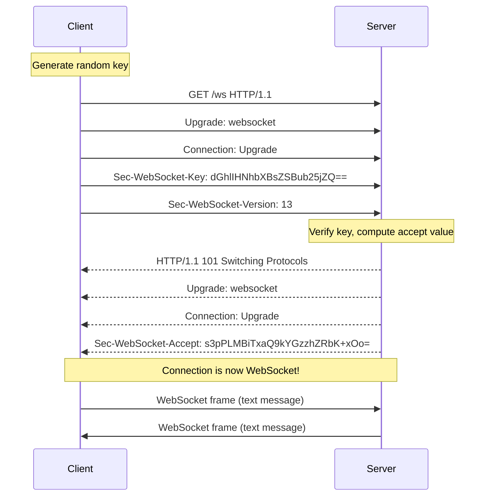
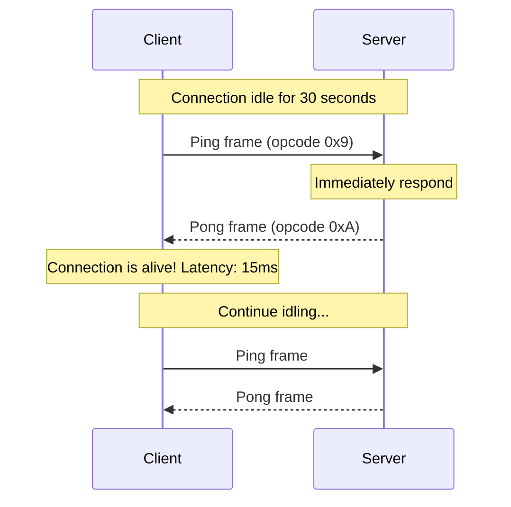
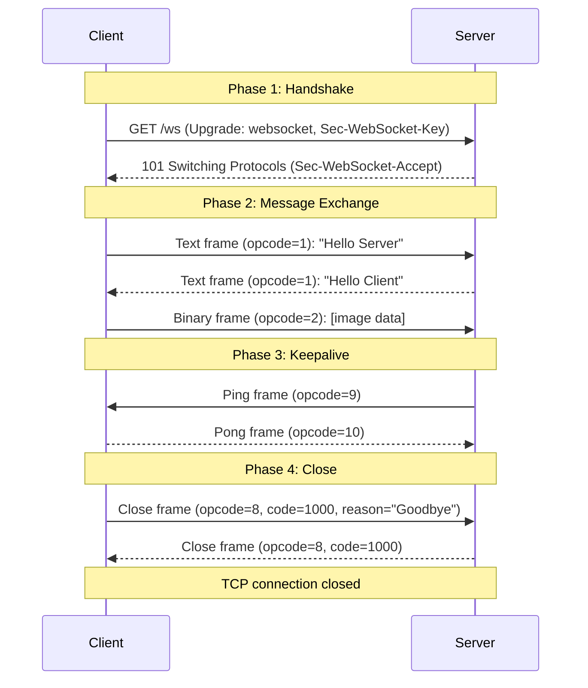

## WebSocket Protocol গভীরে

আগের chapter এ আমরা দেখলাম WebSocket কী আর কেন দরকার। কিন্তু এটা ভেতরে ভেতরে কীভাবে কাজ করে? একটা HTTP connection কীভাবে WebSocket হয়ে যায়? Frame কী, opcode কী, close code কেন গুরুত্বপূর্ণ?

এই chapter এ আমরা WebSocket protocol এর ভেতরে ঢুকবো — URL scheme, handshake process, frame format, opcode, ping/pong, close code, আর subprotocol। এই জিনিসগুলো জানলে তুমি debug করতে পারবে, আর নিজের WebSocket server ঠিকমতো implement করতে পারবে।

## WebSocket URL Scheme

WebSocket এর URL দুই রকম হয়:

- `ws://` — এটা plain WebSocket, encrypted নয় (HTTP এর `http://` এর মতো)
- `wss://` — এটা WebSocket over TLS, encrypted (HTTP এর `https://` এর মতো)

```javascript
// Insecure WebSocket (development only)
const socket = new WebSocket("ws://localhost:8000/ws");

// Secure WebSocket (production — always use wss://)
const secureSocket = new WebSocket("wss://api.example.com/ws");
```

উপরের কোডে দুটা URL দেখানো হয়েছে। প্রথমটা `ws://` — শুধু local development এ ব্যবহার করো। দ্বিতীয়টা `wss://` — production এ সবসময় এটাই ব্যবহার করবে। `wss://` এ data encrypted থাকে, তাই কেউ intercept করলেও data পড়তে পারবে না।

> [!warn] Production এ সবসময় wss:// ব্যবহার করো
> Production এ কখনো `ws://` ব্যবহার করো না। যদি তোমার website HTTPS এ চলে, browser `ws://` WebSocket কে block করে দেবে — কারণ এটা **mixed content** হিসেবে ধরা হয়। সবসময় `wss://` ব্যবহার করো।

## The Handshake — HTTP থেকে WebSocket এ Upgrade

WebSocket connection সবসময় একটা HTTP request দিয়ে শুরু হয়। Client একটা special HTTP request পাঠায়, যেটাতে বলে — "আমি HTTP থেকে WebSocket এ upgrade করতে চাই"। একে **WebSocket handshake** বলে।

### Client এর Handshake Request

Client যে HTTP request টা পাঠায়, তাতে কিছু special header থাকে:

```http
GET /ws HTTP/1.1
Host: localhost:8000
Upgrade: websocket
Connection: Upgrade
Sec-WebSocket-Key: dGhlIHNhbXBsZSBub25jZQ==
Sec-WebSocket-Version: 13
Origin: http://localhost:3000
```

এই request টা দেখো। এটা একটা normal HTTP GET request, কিন্তু কিছু extra header সহ:

- `Upgrade: websocket` — server কে বলছে যে connection টা WebSocket এ upgrade করতে হবে
- `Connection: Upgrade` — এটা বলছে যে connection টা upgrade করতে হবে
- `Sec-WebSocket-Key` — একটা random base64-encoded value, যেটা server কে response এ echo back করতে হয় (modified আকারে)
- `Sec-WebSocket-Version: 13` — WebSocket protocol version (বর্তমান version 13)
- `Origin` — কোন page থেকে request টা এসেছে (security এর জন্য)

### Server এর Handshake Response

Server যদি WebSocket upgrade টা accept করে, তাহলে নিচের response টা পাঠায়:

```http
HTTP/1.1 101 Switching Protocols
Upgrade: websocket
Connection: Upgrade
Sec-WebSocket-Accept: s3pPLMBiTxaQ9kYGzzhZRbK+xOo=
```

এই response এ সবচেয়ে গুরুত্বপূর্ণ হলো `101 Switching Protocols` status code। এটা বলছে — "ঠিক আছে, আমি HTTP থেকে WebSocket এ switch করছি"।

`Sec-WebSocket-Accept` header টা হলো client এর `Sec-WebSocket-Key` এর একটা modified version। Server এই key টার সাথে একটা magic string (`258EAFA5-E914-47DA-95CA-C5AB0DC85B11`) যোগ করে, SHA-1 hash করে, আর base64 encode করে। এটা নিশ্চিত করে যে server টা সত্যিই WebSocket বোঝে, নিছক কোনো HTTP server নয়।



এই sequence diagram এ পুরো handshake process টা দেখানো হয়েছে। Handshake সফল হওয়ার পর থেকে আর HTTP নেই — শুধু WebSocket frame আদান-প্রদান হয়।

> [!note] Handshake সবসময় HTTP দিয়ে শুরু
> WebSocket connection সবসময় একটা HTTP request দিয়ে শুরু হয়। এর কারণ হলো — এভাবে WebSocket টা existing HTTP infrastructure (proxy, firewall, load balancer) এর সাথে compatible থাকে। যেহেতু handshake টা HTTP, সব প্রথম request HTTP হিসেবে দেখা যায়, আর তারপর upgrade হয়।

## WebSocket Frame Format

Handshake সফল হওয়ার পর, সব data WebSocket frame হিসেবে যায়। প্রতিটা frame এর একটা specific format আছে। চলো সেটা দেখি।

### Frame Structure

একটা WebSocket frame এর structure নিচে দেওয়া হলো:

```
 0                   1                   2                   3
 0 1 2 3 4 5 6 7 8 9 0 1 2 3 4 5 6 7 8 9 0 1 2 3 4 5 6 7 8 9 0 1
+-+-+-+-+-------+-+-------------+-------------------------------+
|F|R|R|R| opcode|M| Payload len |    Extended payload length    |
|I|S|S|S|  (4)  |A|     (7)     |             (16/64)           |
|N|V|V|V|       |S|             |   (if payload len==126/127)   |
| |1|2|3|       |K|             |                               |
+-+-+-+-+-------+-+-------------+ - - - - - - - - - - - - - - - +
|     Extended payload length continued, if payload len == 127  |
+ - - - - - - - - - - - - - - - +-------------------------------+
|                               |Masking-key, if MASK set to 1  |
+-------------------------------+-------------------------------+
| Masking-key (continued)       |          Payload Data         |
+-------------------------------- - - - - - - - - - - - - - - - +
:                     Payload Data continued ...                :
+ - - - - - - - - - - - - - - - - - - - - - - - - - - - - - - - +
|                     Payload Data continued ...                |
+---------------------------------------------------------------+
```

এই frame layout টা একটু জটিল দেখালেও, আসলে সহজ। চলো প্রতিটা field বুঝি:

| Field | Bits | Description |
|-------|------|-------------|
| FIN | 1 bit | 1 = এটা সম্পূর্ণ message এর শেষ frame। Fragmentation থাকলে শেষ frame এ FIN=1 |
| RSV1, RSV2, RSV3 | 3 bits | Reserved — সাধারণত 0। Extension এর জন্য reserved |
| Opcode | 4 bits | Frame এর type — text, binary, close, ping, pong |
| MASK | 1 bit | 1 = payload masked আছে। Client থেকে server এ সব frame masked হয় |
| Payload length | 7 bits | 0-125 = সরাসরি length। 126 = পরের 2 bytes এ length। 127 = পরের 8 bytes এ length |
| Masking key | 32 bits | MASK=1 হলে থাকে। Payload decode করার জন্য দরকার |
| Payload data | variable | আসল data |

### Opcode — Frame এর Type

Opcode হলো 4-bit value, যেটা frame এর type নির্দেশ করে:

| Opcode | Name | Description |
|--------|------|-------------|
| 0x0 | Continuation | Fragmented message এর পরের অংশ |
| 0x1 | Text | UTF-8 text data |
| 0x2 | Binary | Binary data (image, file, etc.) |
| 0x8 | Close | Connection বন্ধ করার frame |
| 0x9 | Ping | Keepalive / latency check |
| 0xA | Pong | Ping এর উত্তর |

```python
# Opcode values in Python (for understanding frame structure)
# These are the standard WebSocket opcodes

OPCODE_CONTINUATION = 0x0  # 0 — continuation of fragmented message
OPCODE_TEXT = 0x1           # 1 — UTF-8 text message
OPCODE_BINARY = 0x2         # 2 — binary data
OPCODE_CLOSE = 0x8          # 8 — close frame
OPCODE_PING = 0x9           # 9 — ping frame
OPCODE_PONG = 0xA           # 10 — pong frame

# Example: building a simple text frame header (simplified)
def build_text_frame(message: str) -> bytes:
    payload = message.encode("utf-8")
    # FIN=1, opcode=1 (text), MASK=0 (server to client)
    first_byte = 0x81  # 10000001 in binary
    length = len(payload)
    if length < 126:
        header = bytes([first_byte, length])
    elif length < 65536:
        header = bytes([first_byte, 126]) + length.to_bytes(2, "big")
    else:
        header = bytes([first_byte, 127]) + length.to_bytes(8, "big")
    return header + payload
```

এই কোডে WebSocket frame এর structure টা বোঝানো হয়েছে। `first_byte` এ `FIN=1` (message সম্পূর্ণ) আর `opcode=1` (text) set করা হয়েছে। Payload length এর উপর ভিত্তি করে header এর size বদলায় — ১২৫ পর্যন্ত সরাসরি, ১২৬ থেকে ৬৫৫৩৫ পর্যন্ত ২ bytes, তার বেশি হলে ৮ bytes।

### Masking — Client Frame সবসময় Masked

Client থেকে server এ যাওয়া সব frame **masked** হয়। মানে — payload data টা একটা random 4-byte masking key দিয়ে XOR করা থাকে। এটা security এর জন্য — যাতে proxy বা middleware ভুল করে data টা cache না করে ফেলে।

```python
# Masking and unmasking payload data
import os

def mask_payload(payload: bytes, mask_key: bytes) -> bytes:
    masked = bytearray()
    for i, byte in enumerate(payload):
        masked.append(byte ^ mask_key[i % 4])
    return bytes(masked)

# Client sends masked payload
mask_key = os.urandom(4)  # random 4-byte key
original_data = b"Hello Server!"
masked_data = mask_payload(original_data, mask_key)

# Server unmasks payload
unmasked_data = mask_payload(masked_data, mask_key)
print(unmasked_data)  # Output: b'Hello Server!'
```

এই কোডে masking আর unmasking দেখানো হয়েছে। মজার ব্যাপার হলো — mask আর unmask একই operation (XOR)। একই key দিয়ে দুইবার XOR করলে original data ফিরে আসে। Server থেকে client এ যাওয়া frame গুলো masked হয় না।

## Ping ও Pong — Keepalive

WebSocket connection টা অনেকক্ষণ open থাকতে পারে। কিন্তু কিছু proxy বা load balancer idle connection বন্ধ করে দেয়। এড়াতে **ping** আর **pong** frame ব্যবহার করা হয়।

একপক্ষ ping পাঠায়, অন্যপক্ষ সাথে সাথে pong দিয়ে উত্তর দেয়। এটা দুটো কাজে লাগে:

1. **Keepalive** — connection টা active আছে কিনা নিশ্চিত করা
2. **Latency check** — ping পাঠিয়ে response আসতে কত সময় লাগে সেটা মাপা



সাধারণত server প্রতি ৩০ বা ৬০ সেকেন্ডে একবার ping পাঠায়। যদি pong না আসে, server ধরে নেয় connection টা dead, আর close করে দেয়।

> [!tip] Ping/Pong automatically handled
> বেশিরভাগ WebSocket library (যেমন browser এর `WebSocket` API, Starlette) ping/pong অটোমেটিক handle করে। তোমাকে manually ping/pong পাঠাতে হয় না। কিন্তু যদি নিজের WebSocket server implement করো, তখন ping/pong handle করতে হবে।

## Close Codes — Connection বন্ধ হওয়ার কারণ

WebSocket connection বন্ধ হওয়ার সময় একটা **close frame** পাঠানো হয়, আর তাতে একটা **close code** থাকে। এই code টা বলে যে connection টা কেন বন্ধ হলো।

| Code | Name | Description |
|------|------|-------------|
| 1000 | Normal Closure | স্বাভাবিক ভাবে বন্ধ হয়েছে — কোনো সমস্যা নেই |
| 1001 | Going Away | Server বা client বন্ধ হচ্ছে (যেমন page close, server shutdown) |
| 1002 | Protocol Error | Protocol এ কোনো ভুল হয়েছে |
| 1003 | Unsupported Data | অসমর্থিত data type (যেমন text-only endpoint এ binary এসেছে) |
| 1005 | No Status Received | Close frame এ কোনো code ছিল না |
| 1006 | Abnormal Closure | Connection হঠাৎ বন্ধ হয়েছে — কোনো close frame ছাড়াই |
| 1007 | Invalid Frame Payload Data | Frame এর data invalid (যেমন ভাঙা UTF-8) |
| 1008 | Policy Violation | Policy violation (যেমন message limit exceeded) |
| 1009 | Message Too Big | Message টা খুব বড় |
| 1010 | Mandatory Extension | Client এর দরকারি extension পাওয়া যায়নি |
| 1011 | Internal Server Error | Server এ কোনো সমস্যা হয়েছে |
| 1015 | TLS Handshake Failure | TLS handshake ব্যর্থ |
| 4000-4999 | Custom | Application-specific custom codes |

> [!important] Close code 1006 — Abnormal Closure
> Close code 1006 হলো সবচেয়ে tricky। এটা তখন হয় যখন connection টা **abnormally** বন্ধ হয় — মানে কোনো close frame ছাড়াই হঠাৎ বন্ধ হয়ে যায়। এর কারণ হতে পারে: network failure, server crash, firewall block, বা timeout। Browser এই code টা automatically set করে। তুমি কখনো manually 1006 পাঠাতে পারবে না — এটা শুধু browser/server এর জন্য reserved। যদি তোমার app এ 1006 আসে, মানে connection টা unexpectedly বন্ধ হয়েছে — তখন reconnection logic চালাতে হবে।

### Close Frame Format

Close frame এ শুধু code ই নয়, একটা reason text ও থাকতে পারে:

```python
# Close frame structure (conceptual)
# Opcode: 0x8 (close)
# Payload: first 2 bytes = close code (big-endian), rest = reason (UTF-8)

import struct

def build_close_frame(code: int, reason: str = "") -> bytes:
    opcode = 0x8  # close frame opcode
    first_byte = 0x88  # FIN=1, opcode=8
    reason_bytes = reason.encode("utf-8")
    payload = struct.pack(">H", code) + reason_bytes
    length = len(payload)
    if length < 126:
        header = bytes([first_byte, length])
    else:
        header = bytes([first_byte, 126]) + length.to_bytes(2, "big")
    return header + payload

# Example: normal close with reason
close_frame = build_close_frame(1000, "Goodbye!")
print(close_frame)
# The first two payload bytes would be: 0x03 0xE8 (= 1000 in big-endian)
# Followed by: b'Goodbye!'
```

এই কোডে একটা close frame কীভাবে তৈরি করতে হয় সেটা দেখানো হয়েছে। Close frame এর payload এর প্রথম ২ byte হলো close code (big-endian format এ), আর বাকিটা reason text। `0x03E8` হলো 1000 এর hex value।

## Subprotocols — Sec-WebSocket-Protocol

কখনো কখনো তোমার WebSocket এ একটা specific protocol দরকার হতে পারে — যেমন STOMP (chat protocol), MQTT (IoT protocol), বা তোমার নিজের custom protocol। এই জন্য **subprotocol** concept আছে।

Handshake এর সময় client `Sec-WebSocket-Protocol` header এ তার পছন্দের protocol list পাঠায়:

```http
GET /ws HTTP/1.1
Host: localhost:8000
Upgrade: websocket
Connection: Upgrade
Sec-WebSocket-Key: dGhlIHNhbXBsZSBub25jZQ==
Sec-WebSocket-Version: 13
Sec-WebSocket-Protocol: chat, superchat
```

Server এর মধ্যে থেকে একটা বেছে নিয়ে response এ পাঠায়:

```http
HTTP/1.1 101 Switching Protocols
Upgrade: websocket
Connection: Upgrade
Sec-WebSocket-Accept: s3pPLMBiTxaQ9kYGzzhZRbK+xOo=
Sec-WebSocket-Protocol: chat
```

যদি server কোনো subprotocol support না করে, সে এই header টা পাঠায় না — আর তখন connection টা default protocol এ চলে।

```javascript
// Client side: request a subprotocol
const socket = new WebSocket("ws://localhost:8000/ws", ["chat", "superchat"]);

// Check which protocol was selected
socket.addEventListener("open", (event) => {
    console.log("Selected protocol:", socket.protocol);
    // Output: "chat" (if server selected chat)
});
```

এই কোডে client দুটো subprotocol এর জন্য request পাঠিয়েছে — `chat` আর `superchat`। Server যেটা support করবে, সেটা `socket.protocol` এ পাওয়া যাবে। যদি server কোনোটাই না মানে, `socket.protocol` খালি থাকবে।

## Message Size Limits ও Fragmentation

WebSocket এ message এর size এর কোনো hard limit নেই — কিন্তু practical limitation আছে।

### Payload Length Encoding

Frame এর payload length তিন ভাবে encode করা যায়:

| Payload Length | Encoding | Header Size |
|---------------|----------|-------------|
| 0–125 bytes | 7-bit length field | 2 bytes |
| 126–65535 bytes | 126 + 2-byte extended length | 4 bytes |
| 65536+ bytes | 127 + 8-byte extended length | 10 bytes |

```python
# Understanding payload length encoding
# 7-bit:   0-125        -> direct
# 7+16-bit: 126 + next 2 bytes -> 126 to 65535
# 7+64-bit: 127 + next 8 bytes -> 65536 to 2^63-1

# Examples:
# Payload of 50 bytes:   header = [0x81, 50]
# Payload of 200 bytes:  header = [0x81, 126, 0x00, 0xC8]
# Payload of 100000 bytes: header = [0x81, 127, 0x00, 0x00, 0x00, 0x00, 0x00, 0x01, 0x86, 0xA0]
```

এই encoding টা দেখে বোঝা যায় — ছোট message এ header খুব ছোট (২ byte), কিন্তু বড় message এ header একটু বড় (১০ byte)। তবে data এর তুলনায় header সবসময়ই ছোট।

### Fragmentation

বড় message গুলো একাধিক frame এ ভাগ করা যায় — একে **fragmentation** বলে। প্রথম frame এ `FIN=0` (message শেষ হয়নি), opcode হয় text বা binary। পরের frame গুলোতে `FIN=0`, opcode হয় `0x0` (continuation)। শেষ frame এ `FIN=1`।

```
Fragmented message (3 frames):
Frame 1: FIN=0, opcode=1 (text),    payload="Hello "
Frame 2: FIN=0, opcode=0 (contin.), payload="World"
Frame 3: FIN=1, opcode=0 (contin.), payload="!"
Complete message: "Hello World!"
```

Fragmentation এর সুবিধা — server বা client message টা পুরো মেমরিতে load না করেই পাঠাতে পারে। বড় file streaming এর জন্য কাজে লাগে।

> [!warn] Message size limit set করো
> Server এ অবশ্যই message size limit set করবে। নাহলে কেউ একটা বিশাল message (যেমন 1GB) পাঠিয়ে server এর memory ফুলিয়ে দিতে পারে — এটা একটা DoS attack vector। সাধারণত 1MB–16MB limit যথেষ্ট।

## Full Handshake + Message Exchange Sequence

এবার পুরো WebSocket session টা একটা sequence diagram এ দেখি — handshake থেকে close পর্যন্ত:



এই diagram এ পুরো WebSocket lifecycle টা এক নজরে দেখা যাচ্ছে — handshake, text/binary message exchange, ping/pong keepalive, আর close handshake।

## Summary

এই chapter এ আমরা শিখলাম:

- WebSocket URL scheme: `ws://` (insecure) আর `wss://` (TLS encrypted)
- **Handshake** — HTTP `Upgrade` request আর `101 Switching Protocols` response, যেখানে `Sec-WebSocket-Key` আর `Sec-WebSocket-Accept` exchange হয়
- **Frame format** — FIN, opcode, mask, payload length, masking key, payload data
- **Opcode** — text (1), binary (2), close (8), ping (9), pong (10), continuation (0)
- **Masking** — client থেকে server এ সব frame masked (XOR with random key)
- **Ping/Pong** — keepalive আর latency check এর জন্য
- **Close codes** — 1000 (normal), 1001 (going away), 1006 (abnormal), 1011 (server error), 4000-4999 (custom)
- **Subprotocols** — `Sec-WebSocket-Protocol` header দিয়ে specific protocol negotiate করা
- **Fragmentation** — বড় message কে একাধিক frame এ ভাগ করা

পরের chapter এ আমরা FastAPI তে WebSocket endpoint তৈরি করবো — real code দিয়ে, real example সহ। চলো এগিয়ে যাই!