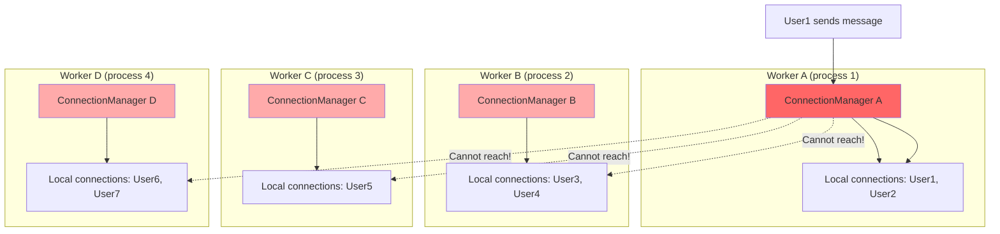
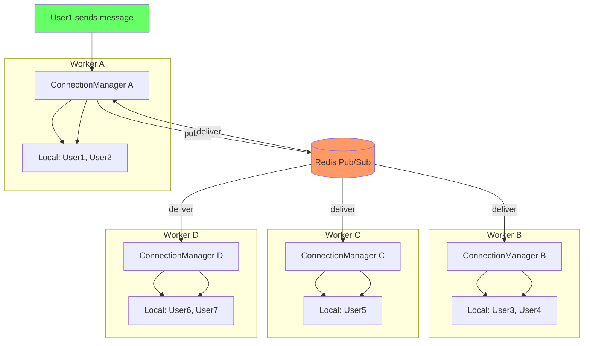
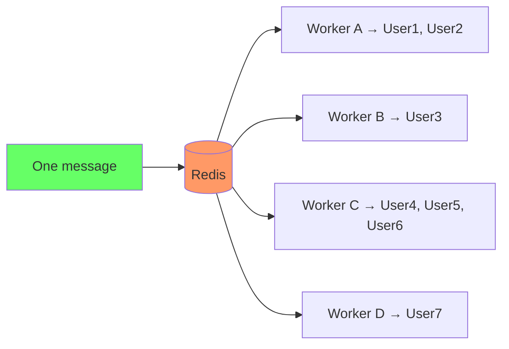

## Scaling — Redis Pub/Sub

আগের chapter গুলোতে আমরা একটা সুন্দর WebSocket server বানালাম — ConnectionManager আছে, broadcasting আছে, authentication আছে। কিন্তু একটা জিনিস ধরো নাই — সব কিছু একটাই process এ চলছে।

যতক্ষণ তোমার user সংখ্যা কয়েক শত, কোনো সমস্যা নেই। কিন্তু যখন user সংখ্যা হাজার হাজার হবে — একটা process সব handle করতে পারবে না। তখন তোমার multiple worker দরকার। আর সেখানেই সব পট পেরে যায়।

এই chapter এ আমরা দেখবো — একাধিক worker দিয়ে WebSocket কীভাবে scale করতে হয়, আর কীভাবে Redis Pub/Sub সব worker গুলোর মধ্যে bridge হয়।

## সমস্যা: Single-Process ConnectionManager

আমাদের আগের ConnectionManager টা দেখো:

```python
# Single-process ConnectionManager — works fine with one worker
class ConnectionManager:
    def __init__(self):
        self.active_connections: list[WebSocket] = []
    
    async def connect(self, websocket: WebSocket):
        await websocket.accept()
        self.active_connections.append(websocket)
    
    async def broadcast(self, message: str):
        for connection in self.active_connections:
            await connection.send_text(message)
```

একটা process এ চললে এটা দারুণ কাজ করে। কিন্তু যখন তুমি `uvicorn --workers 4` দিয়ে ৪টা process চালাবে — প্রতিটা process এ একটা করে আলাদা `ConnectionManager` instance থাকবে, আর প্রতিটার নিজস্ব `active_connections` list থাকবে।



মানে কী? যদি User1 Worker A তে connect করে আর User3 Worker B তে — User1 এর message Worker B তে যাবেই না। কারণ Worker A এর ConnectionManager Worker B এর connection গুলো সম্পর্কে কিছুই জানে না। প্রতিটা process এর memory আলাদা, তারা একে অপরের connection list share করে না।

এটা একটা বিশাল সমস্যা। User1 যদি "Hello everyone!" পাঠায়, সেটা User3, User4, User5 কে যাবেই না — কারণ তারা অন্য worker এ আছে। Broadcast broken!

## সমাধান: Redis Pub/Sub

সমাধান হলো — সব worker এর মধ্যে একটা central message broker দরকার। আর সেটার জন্য সবচেয়ে popular tool হলো **Redis**।

Redis এর **Pub/Sub** feature দিয়ে সব worker একটা channel subscribe করে থাকে। যেকোনো worker এ কোনো message এলে — সে সেটা Redis এ publish করে। Redis সেটা সব subscriber (অর্থাৎ সব worker) কে deliver করে। তারপর প্রতিটা worker তার local connection গুলোতে broadcast করে।



এই architecture এ Redis হলো central hub। প্রতিটা worker দুই ভূমিকা পালন করে — publisher (যখন তার local connection এ কেউ message পাঠায়) আর subscriber (যখন Redis থেকে message আসে)। এভাবে একটা message সব worker এ পৌঁছায়, আর সব worker তাদের local connection গুলোতে broadcast করে।

## Redis Setup

শুরু করতে হলে প্রথমে Redis install করতে হবে। Python এর জন্য `redis` package use করবো, আর async এর জন্য `redis.asyncio`:

```bash
# Install redis Python package
pip install redis

# Or with async support (same package, different import)
# redis.asyncio is included in the redis package
```

Redis server নিজে চালাতে হবে। Docker দিয়ে সহজেই চালানো যায়:

```bash
# Run Redis server with Docker
docker run -d --name redis -p 6379:6379 redis:7-alpine
```

এই কমান্ড দিলে Redis ৭ এর alpine image দিয়ে একটা container চলবে, port 6379 তে। এটাই development এর জন্য যথেষ্ট।

## Redis Pub/Sub — Publisher ও Subscriber

Redis Pub/Sub এ দুটো role থাকে — publisher আর subscriber। Publisher একটা channel এ message publish করে, subscriber সেই channel এর message receive করে। চলো দেখি কীভাবে কাজ করে।

```python
# Basic Redis Pub/Sub publisher
import redis.asyncio as redis
import json
import asyncio

async def publish_message():
    # Connect to Redis
    redis_client = redis.from_url("redis://localhost:6379")
    
    # Publish a message to a channel
    message = {"user": "alice", "text": "Hello everyone!"}
    await redis_client.publish("chat_channel", json.dumps(message))
    
    # Close connection
    await redis_client.close()

asyncio.run(publish_message())
```

এখানে `redis.from_url` দিয়ে Redis এর সাথে connection তৈরি করা হয়েছে। `publish` method দিয়ে `chat_channel` নামের একটা channel এ JSON message পাঠানো হয়েছে। যে সব client সেই channel subscribe করে আছে, তারা সবাই এই message পাবে।

```python
# Basic Redis Pub/Sub subscriber
import redis.asyncio as redis
import json
import asyncio

async def subscribe_to_channel():
    # Connect to Redis
    redis_client = redis.from_url("redis://localhost:6379")
    
    # Create a pubsub object
    pubsub = redis_client.pubsub()
    
    # Subscribe to a channel
    await pubsub.subscribe("chat_channel")
    
    # Listen for messages
    async for message in pubsub.listen():
        if message["type"] == "message":
            data = json.loads(message["data"])
            print(f"Received: {data['user']} said {data['text']}")

asyncio.run(subscribe_to_channel())
```

subscriber পাশে একটু বেশি কাজ আছে। প্রথমে `pubsub()` method দিয়ে একটা PubSub object তৈরি করতে হয়। তারপর `subscribe()` দিয়ে এক বা একাধিক channel subscribe করতে হয়। তারপর `listen()` দিয়ে একটা async iterator পাওয়া যায় — যেটা চলতে থাকে আর যত message আসে তত deliver করে।

এখানে একটা জিনিস খেয়াল করো — subscriber একটা long-running task। এটা চলতেই থাকে, message আসলে একটা একটা করে deliver করে। তাই এটা সাধারণত একটা background task হিসেবে চালানো হয়।

## Multi-Worker ConnectionManager with Redis

এবার এই দুটো concept মিলিয়ে একটা Redis-backed ConnectionManager বানাই, যেটা multiple worker এ কাজ করবে:

```python
# Redis-backed ConnectionManager for multi-worker scaling
import redis.asyncio as redis
from fastapi import FastAPI, WebSocket, WebSocketDisconnect
import json
import asyncio

class RedisConnectionManager:
    def __init__(self):
        # Local connections — only this worker's connections
        self.active_connections: list[WebSocket] = []
        # Redis client for publishing
        self.redis: redis.Redis = None
        # PubSub for subscribing
        self.pubsub = None
    
    async def startup(self):
        """Initialize Redis connection and start listening."""
        self.redis = redis.from_url("redis://localhost:6379")
        self.pubsub = self.redis.pubsub()
        await self.pubsub.subscribe("chat_channel")
        # Start background listener task
        asyncio.create_task(self._listen_redis())
    
    async def shutdown(self):
        """Clean up Redis connection."""
        if self.pubsub:
            await self.pubsub.unsubscribe("chat_channel")
            await self.pubsub.close()
        if self.redis:
            await self.redis.close()
    
    async def connect(self, websocket: WebSocket):
        """Accept a new WebSocket connection."""
        await websocket.accept()
        self.active_connections.append(websocket)
    
    def disconnect(self, websocket: WebSocket):
        """Remove a connection from local list."""
        if websocket in self.active_connections:
            self.active_connections.remove(websocket)
    
    async def broadcast(self, message: str):
        """Publish message to Redis — all workers will receive it."""
        await self.redis.publish("chat_channel", message)
    
    async def _listen_redis(self):
        """Background task: listen for Redis messages and broadcast locally."""
        async for message in self.pubsub.listen():
            if message["type"] == "message":
                data = message["data"]
                if isinstance(data, bytes):
                    data = data.decode("utf-8")
                # Broadcast to all LOCAL connections
                for connection in self.active_connections[:]:
                    try:
                        await connection.send_text(data)
                    except Exception:
                        self.disconnect(connection)

manager = RedisConnectionManager()
app = FastAPI()

@app.on_event("startup")
async def startup_event():
    await manager.startup()

@app.on_event("shutdown")
async def shutdown_event():
    await manager.shutdown()

@app.websocket("/ws")
async def websocket_endpoint(websocket: WebSocket):
    await manager.connect(websocket)
    try:
        while True:
            data = await websocket.receive_text()
            # Broadcast through Redis — reaches ALL workers
            await manager.broadcast(data)
    except WebSocketDisconnect:
        manager.disconnect(websocket)
```

এই class টা একটু গভীরভাবে দেখি। `active_connections` list এ শুধু এই worker এর local connection গুলো থাকে। `broadcast()` method সরাসরি local connection গুলোতে message পাঠায় না — সে শুধু Redis এ publish করে। তারপর `_listen_redis()` background task টা Redis থেকে message receive করে আর local connection গুলোতে পাঠায়।

এখানে একটা জিনিস খেয়াল করো — যে worker message publish করেছে, সেও সেই message receive করবে (কারণ সেও subscriber)। তার নিজের local connection গুলোও message পাবে। এটা normal — Redis Pub/Sub সব subscriber কে deliver করে, publisher সহ।

> [!important] Redis Pub/Sub fire-and-forget — যদি message delivery guarantee লাগে, Redis Streams ব্যবহার করুন
> Redis Pub/Sub এ একটা সীমাবদ্ধতা আছে — যদি কোনো subscriber offline থাকে বা connection বন্ধ থাকে, message হারিয়ে যায়। Pub/Sub কোনো message store করে না। যদি তোমার দরকার হয় যে কোনো message কখনো lose হবে না, তাহলে Redis Streams use করো। Streams message persist করে, আর subscriber পরে এসেও missed message পড়তে পারে।

## Presence Detection Across Workers

শুধু message broadcast করা তো হলো। কিন্তু real chat app এ আরও কিছু দরকার — কে online, কে offline, সেটা জানা। একে **presence** বলে।

Single worker এ ছিল সহজ — `active_connections` list দেখলেই বোঝা যায়। কিন্তু multi-worker এ? Worker A এর user list Worker B জানবে কীভাবে?

সমাধান — Redis SET ব্যবহার করে online user গুলোর একটা central list রাখা।

```python
# Presence detection with Redis SET
class PresenceManager:
    def __init__(self, redis_client: redis.Redis):
        self.redis = redis_client
        self.online_key = "online_users"
    
    async def user_connected(self, user_id: str):
        """Add user to online set when they connect."""
        await self.redis.sadd(self.online_key, user_id)
    
    async def user_disconnected(self, user_id: str):
        """Remove user from online set when they disconnect."""
        await self.redis.srem(self.online_key, user_id)
    
    async def get_online_users(self) -> list[str]:
        """Get list of all online users across all workers."""
        users = await self.redis.smembers(self.online_key)
        return [u.decode("utf-8") if isinstance(u, bytes) else u for u in users]
    
    async def is_online(self, user_id: str) -> bool:
        """Check if a specific user is online."""
        return await self.redis.sismember(self.online_key, user_id)
```

এখানে Redis SET ব্যবহার করা হয়েছে। SET এর সুবিধা হলো — duplicate automatically বাদ পড়ে। একই user যদি একাধিক worker এ connect করে (যেমন phone আর laptop দুটো দিয়ে), সে SET এ একবারই থাকবে। `smembers` দিয়ে সব online user দেখা যায়, আর `sismember` দিয়ে নির্দিষ্ট user online কি না চেক করা যায়।

## Room Management Across Workers

অনেক chat app এ room বা channel থাকে — যেমন Slack এ আলাদা channel। Single worker এ room manage করা সহজ ছিল — একটা dict এ `room_name -> connections` map রাখলেই হতো। কিন্তু multi-worker এ?

Redis Hash দিয়ে এটা করা যায়। প্রতিটা room এর জন্য একটা hash key, যেখানে user_id → worker_id mapping থাকবে।

```python
# Room management across workers with Redis Hash
class RoomManager:
    def __init__(self, redis_client: redis.Redis):
        self.redis = redis_client
    
    async def join_room(self, room_id: str, user_id: str, worker_id: str):
        """Add a user to a room."""
        key = f"room:{room_id}"
        await self.redis.hset(key, user_id, worker_id)
    
    async def leave_room(self, room_id: str, user_id: str):
        """Remove a user from a room."""
        key = f"room:{room_id}"
        await self.redis.hdel(key, user_id)
    
    async def get_room_members(self, room_id: str) -> list[str]:
        """Get all user IDs in a room."""
        key = f"room:{room_id}"
        members = await self.redis.hkeys(key)
        return [m.decode("utf-8") if isinstance(m, bytes) else m for m in members]
    
    async def get_user_rooms(self, user_id: str) -> list[str]:
        """Find all rooms a user is in (requires tracking)."""
        key = f"user_rooms:{user_id}"
        rooms = await self.redis.smembers(key)
        return [r.decode("utf-8") if isinstance(r, bytes) else r for r in rooms]
    
    async def broadcast_to_room(self, room_id: str, message: str):
        """Publish message to a room-specific channel."""
        await self.redis.publish(f"room:{room_id}", message)
```

এখানে প্রতিটা room এর জন্য একটা hash key আছে — `room:<room_id>`। সেই hash এ user_id দিয়ে worker_id store করা হয়। আর room-specific message পাঠাতে একটা আলাদা channel use করা হয় — `room:<room_id>`। প্রতিটা worker তার joined room গুলোর channel subscribe করে থাকে।

## Fan-Out Pattern

অনেক সময় এমন দরকার — একটা message অনেকগুলো recipient কে যেতে হবে, আর সেই recipient গুলো বিভিন্ন worker এ আছে। এখানে কোনো room নেই, শুধু একটা list আছে। এখানে fan-out pattern ব্যবহার করা হয়।



মানে একটা message Redis এ যাচ্ছে, আর Redis সেটা সব worker কে দিচ্ছে। প্রতিটা worker নিজের local connection এ check করে — এই message এর target user গুলো আমার কাছে আছে কি না। যারা আছে তাদের পাঠায়।

```python
# Fan-out: send to specific users across workers
async def send_to_users(self, user_ids: list[str], message: dict):
    """Send a message to specific users, regardless of which worker they're on."""
    payload = json.dumps({
        "target_users": user_ids,
        "message": message,
    })
    # All workers receive this — each delivers to their local matching users
    await self.redis.publish("direct_messages", payload)

async def _listen_redis(self):
    """Background task handling both broadcast and direct messages."""
    await self.pubsub.subscribe("chat_channel", "direct_messages")
    
    async for message in self.pubsub.listen():
        if message["type"] != "message":
            continue
        
        channel = message["channel"]
        if isinstance(channel, bytes):
            channel = channel.decode("utf-8")
        
        data = message["data"]
        if isinstance(data, bytes):
            data = data.decode("utf-8")
        
        if channel == "direct_messages":
            # Fan-out: only deliver to target users
            payload = json.loads(data)
            target_users = set(payload["target_users"])
            msg = payload["message"]
            
            for ws, uid in self.local_user_map.items():
                if uid in target_users:
                    try:
                        await ws.send_text(json.dumps(msg))
                    except Exception:
                        self.disconnect(ws)
        else:
            # Broadcast: deliver to all local connections
            for connection in self.active_connections[:]:
                try:
                    await connection.send_text(data)
                except Exception:
                    self.disconnect(connection)
```

এখানে দুটো channel subscribe করা হয়েছে — `chat_channel` (broadcast এর জন্য) আর `direct_messages` (fan-out এর জন্য)। Direct message এলে সেটা target user list এর সাথে match করে শুধু ওই user গুলোকে পাঠানো হয়। এটাই fan-out pattern — একটা message, অনেক recipient, বিভিন্ন worker এ।

## Connection Cleanup on Worker Crash

একটা সমস্যা — যদি কোনো worker crash করে? তাহলে তার connected user গুলোর presence Redis এ থেকে যাবে, কিন্তু আসলে তারা disconnect হয়ে গেছে। একে "stale presence" বলে।

সমাধান হলো — TTL (Time-To-Live) ভিত্তিক presence। প্রতিটা user এর presence এর একটা expiry থাকে, আর worker নিয়মিত সেটা renew করে। Worker crash করলে renewal বন্ধ হয়ে যায়, আর TTL expire হয়ে presence সয়ংক্রিয়ভাবে মুছে যায়।

```python
# TTL-based presence with heartbeats
class TTLPresenceManager:
    def __init__(self, redis_client: redis.Redis):
        self.redis = redis_client
        self.heartbeat_interval = 30  # seconds
        self.presence_ttl = 90  # seconds — 3x heartbeat for safety
    
    async def mark_online(self, user_id: str, worker_id: str):
        """Mark user as online with TTL."""
        key = f"presence:{user_id}"
        # Set with expiry
        await self.redis.setex(key, self.presence_ttl, worker_id)
    
    async def heartbeat(self, user_id: str, worker_id: str):
        """Renew presence TTL — called periodically."""
        key = f"presence:{user_id}"
        await self.redis.setex(key, self.presence_ttl, worker_id)
    
    async def mark_offline(self, user_id: str):
        """Explicitly mark user as offline."""
        key = f"presence:{user_id}"
        await self.redis.delete(key)
    
    async def get_online_users(self) -> dict[str, str]:
        """Get all online users and their worker IDs."""
        # Use SCAN to find all presence keys
        online = {}
        async for key in self.redis.scan_iter(match="presence:*"):
            key_str = key.decode("utf-8") if isinstance(key, bytes) else key
            user_id = key_str.replace("presence:", "")
            worker = await self.redis.get(key)
            if worker:
                worker_str = worker.decode("utf-8") if isinstance(worker, bytes) else worker
                online[user_id] = worker_str
        return online
    
    async def start_heartbeat(self, user_id: str, worker_id: str):
        """Start background heartbeat task for a user."""
        async def beat():
            while True:
                await asyncio.sleep(self.heartbeat_interval)
                await self.heartbeat(user_id, worker_id)
        
        return asyncio.create_task(beat())
```

এখানে প্রতিটা user এর presence একটা key হিসেবে store হয়, যার ৯০ সেকেন্ড TTL। Worker প্রতি ৩০ সেকেন্ডে `heartbeat()` call করে TTL renew করে। Worker crash করলে heartbeat বন্ধ হয়ে যায়, আর ৯০ সেকেন্ড পর key সয়ংক্রিয়ভাবে expire হয়ে যায়। এভাবে stale presence সমস্যা সমাধান হয়।

## Real Example: Complete Multi-Worker Chat

এবার সব মিলিয়ে একটা complete multi-worker chat server দেখি — Redis pub/sub, presence, room management, সব একসাথে:

```python
# Complete multi-worker chat server with Redis
import redis.asyncio as redis
from fastapi import FastAPI, WebSocket, WebSocketDisconnect
import json
import asyncio
import uuid

class DistributedChatServer:
    def __init__(self, redis_url: str = "redis://localhost:6379"):
        self.redis_url = redis_url
        self.redis: redis.Redis = None
        self.pubsub = None
        self.worker_id = str(uuid.uuid4())[:8]
        # Local connection → user_id mapping
        self.connection_user: dict[WebSocket, str] = {}
    
    async def startup(self):
        self.redis = redis.from_url(self.redis_url)
        self.pubsub = self.redis.pubsub()
        await self.pubsub.subscribe("chat:broadcast", "chat:direct")
        asyncio.create_task(self._listen_redis())
        print(f"Worker {self.worker_id} started")
    
    async def shutdown(self):
        await self.pubsub.unsubscribe("chat:broadcast", "chat:direct")
        await self.pubsub.close()
        await self.redis.close()
    
    async def connect(self, websocket: WebSocket, user_id: str):
        await websocket.accept()
        self.connection_user[websocket] = user_id
        # Mark presence
        await self.redis.setex(f"presence:{user_id}", 90, self.worker_id)
    
    def disconnect(self, websocket: WebSocket):
        self.connection_user.pop(websocket, None)
    
    async def broadcast(self, message: dict):
        """Broadcast to all users across all workers."""
        await self.redis.publish("chat:broadcast", json.dumps(message))
    
    async def send_to_user(self, target_user_id: str, message: dict):
        """Send to a specific user across any worker."""
        payload = json.dumps({"target": target_user_id, "message": message})
        await self.redis.publish("chat:direct", payload)
    
    async def _listen_redis(self):
        async for item in self.pubsub.listen():
            if item["type"] != "message":
                continue
            
            channel = item["channel"]
            if isinstance(channel, bytes):
                channel = channel.decode()
            data = item["data"]
            if isinstance(data, bytes):
                data = data.decode()
            
            if channel == "chat:broadcast":
                for ws in list(self.connection_user.keys()):
                    try:
                        await ws.send_text(data)
                    except Exception:
                        self.disconnect(ws)
            
            elif channel == "chat:direct":
                payload = json.loads(data)
                target = payload["target"]
                for ws, uid in list(self.connection_user.items()):
                    if uid == target:
                        try:
                            await ws.send_text(json.dumps(payload["message"]))
                        except Exception:
                            self.disconnect(ws)

server = DistributedChatServer()
app = FastAPI()

@app.on_event("startup")
async def startup_event():
    await server.startup()

@app.on_event("shutdown")
async def shutdown_event():
    await server.shutdown()

@app.websocket("/ws/{user_id}")
async def websocket_endpoint(websocket: WebSocket, user_id: str):
    await server.connect(websocket, user_id)
    
    # Start presence heartbeat
    async def heartbeat():
        while True:
            await asyncio.sleep(30)
            await server.redis.setex(f"presence:{user_id}", 90, server.worker_id)
    
    hb_task = asyncio.create_task(heartbeat())
    
    try:
        while True:
            data = await websocket.receive_text()
            message = json.loads(data)
            message["from"] = user_id
            await server.broadcast(message)
    except WebSocketDisconnect:
        server.disconnect(websocket)
        await server.redis.delete(f"presence:{user_id}")
    finally:
        hb_task.cancel()
```

এই পুরো server টা দেখো — একটা worker যখন চলে, তখন সে Redis এর সাথে connect করে, দুটো channel subscribe করে, আর একটা background listener task চালায়। প্রতিটা WebSocket connection এর জন্য presence set করে আর heartbeat চালায়। Message এলে Redis এ publish করে, আর Redis থেকে এলে local connection গুলোতে deliver করে।

এখন তুমি চাইলে ৪টা worker দিয়ে এই server চালাতে পারো:

```bash
# Run with 4 workers — all share Redis
uvicorn main:app --workers 4 --host 0.0.0.0 --port 8000
```

৪টা worker চলবে, প্রতিটা নিজের নিজের connection handle করবে, কিন্তু Redis এর কারণে সব worker এর মধ্যে message আদান-প্রদান হবে। যেকোনো user যেকোনো worker এ connect করতে পারে, message সবাই পাবে।

## পারফরম্যান্স বিবেচনা

৫০,০০০+ concurrent connection handle করতে গেলে কিছু বিষয় খেয়াল রাখতে হবে:

- **Connection limit** — Linux এ default `ulimit -n` ১০২৪, এটা বাড়াতে হবে (যেমন ৬৫৫৩৫)
- **Redis pipeline** — অনেকগুলো publish একসাথে করলে pipeline use করলে দ্রুত হয়
- **Channel per room** — প্রতিটা room এর জন্য আলাদা channel, তাহলে অপ্রয়োজনীয় message filter করা লাগে না
- **Connection per worker** — এক worker এ ১০-১৫K connection পর্যন্ত ঠিক আছে, এর বেশি হলে আরও worker দরকার

## Pub/Sub vs Streams vs Kafka — কোনটা কখন?

Redis Pub/Sub ছাড়াও আরও option আছে। এক নজরে তুলনা:

| বিষয় | Redis Pub/Sub | Redis Streams | Kafka |
|------|------|------|------|
| Message persistence | না | হ্যাঁ | হ্যাঁ |
| Delivery guarantee | Fire-and-forget | At-least-once | At-least-once |
| Subscriber offline | Message lost | পরে পড়তে পারে | পরে পড়তে পারে |
| Latency | খুব কম (~1ms) | কম (~2ms) | মাঝারি (~5ms) |
| Throughput | উচ্চ | উচ্চ | খুব উচ্চ |
| Complexity | সহজ | মাঝারি | জটিল |
| Setup | সহজ | সহজ (same Redis) | আলাদা cluster |
| Best for | Real-time chat, live updates | Task queue, event log | High-throughput, event streaming |

> [!tip] কোনটা use করবে?
> - **Pub/Sub** — যদি message loss acceptable হয় (যেমন chat — একটা message না গেলেও চলবে)
> - **Streams** — যদি delivery guarantee লাগে কিন্তু Kafka এর complexity না চাও
> - **Kafka** — যদি অনেক বড় scale দরকার (millions of messages/sec) আর event streaming দরকার

## সারসংক্ষেপ

এই chapter এ দেখলাম — single process ConnectionManager multiple worker এ কাজ করে না, কারণ প্রতিটা process এর memory আলাদা। সমাধান হলো Redis Pub/Sub — সব worker একটা channel subscribe করে, আর message publish করলে সব পায়। Presence detection এর জন্য Redis SET বা TTL key, room management এর জন্য Redis Hash, আর fan-out এর জন্য targeted channel। Worker crash এ stale presence এড়াতে TTL + heartbeat pattern। Delivery guarantee দরকার হলে Streams বা Kafka বিবেচনা করতে হবে।